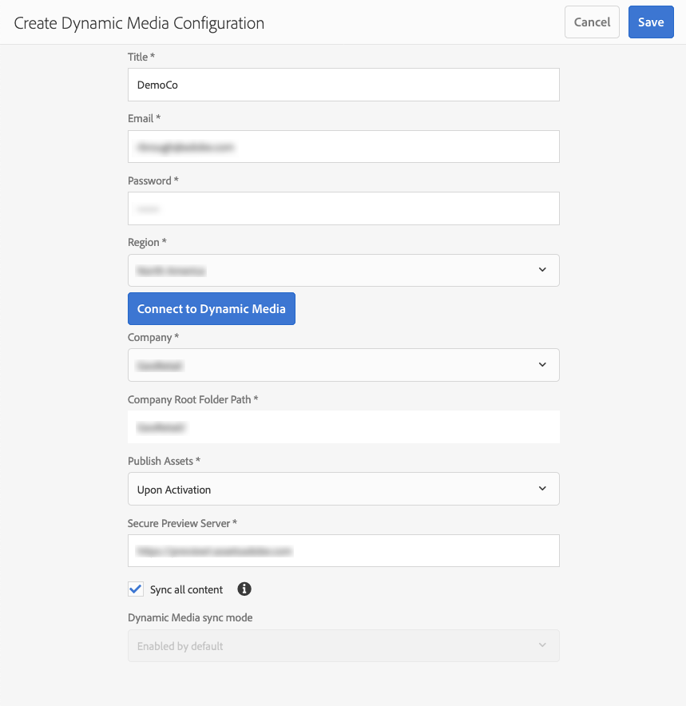
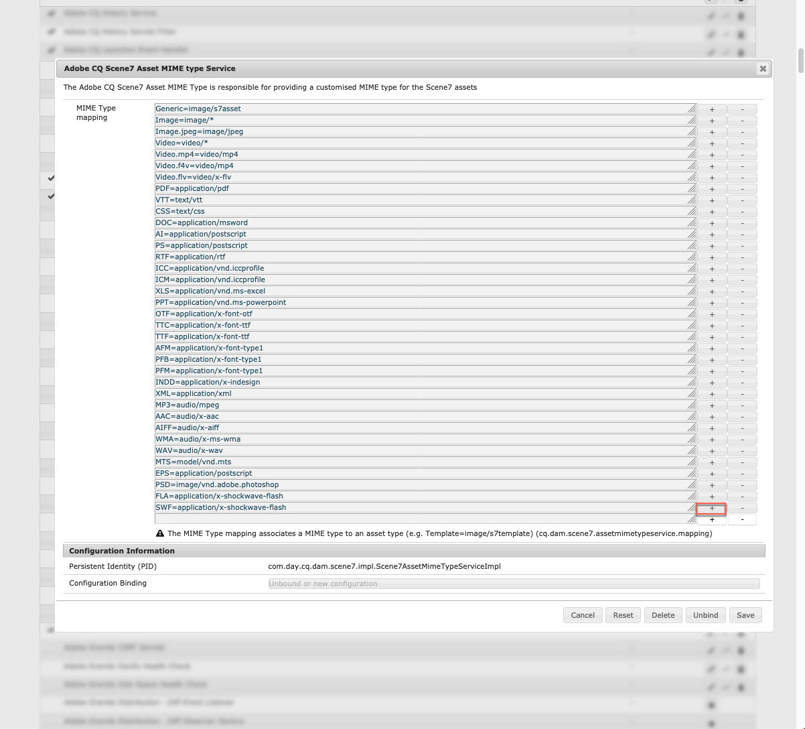
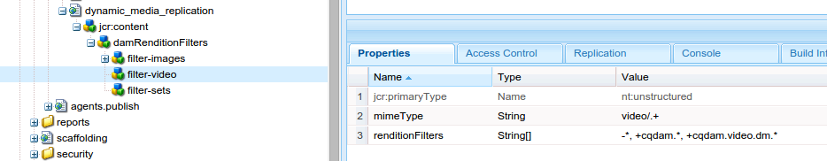
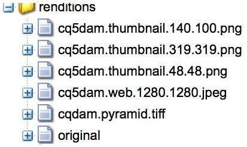

# Configuración de Dynamic Media, modo Scene7{#configuring-dynamic-media-scene-mode}

Si utiliza la configuración de Adobe Experience Manager para diferentes entornos, como desarrollo, ensayo y producción, configure los servicios de nube de Dynamic Media para cada uno de esos entornos.

## Diagrama de arquitectura de Dynamic Media: modo Scene7 {#architecture-diagram-of-dynamic-media-scene-mode}

El diagrama de arquitectura siguiente describe cómo funciona el modo Dynamic Media - Scene7.

Con la nueva arquitectura, Experience Manager es responsable de los recursos de origen principales y sincroniza con Dynamic Media para el procesamiento y la publicación de recursos:

1. Cuando el recurso de origen principal se carga en Experience Manager, se replica en Dynamic Media. En este punto, Dynamic Media gestiona todo el procesamiento de recursos y la generación de representaciones, como la codificación de vídeo y las variantes dinámicas de una imagen.
(En el modo Dynamic Media - Scene7, el tamaño predeterminado del archivo de carga es de 2 GB o menos. Para habilitar la carga de archivos de 2 GB y hasta 15 GB, consulte [&#x200B; (opcional) Configuración de Dynamic Media: modo Scene7 para cargar recursos de más de 2 GB](#optional-config-dms7-assets-larger-than-2gb).)
1. Una vez generadas las representaciones, Experience Manager puede acceder y previsualizar de forma segura las representaciones remotas de Dynamic Media (no se envían binarios de vuelta a la instancia de Experience Manager).
1. Una vez que el contenido está listo para publicarse y aprobarse, el servicio Dynamic Media déclencheur el envío del contenido a los servidores de entrega y el almacenamiento en caché del contenido en la CDN (red de distribución de contenido).


>[!IMPORTANT]
>
>La siguiente lista de funciones requiere que utilice la CDN predeterminada que se incluye con Adobe Experience Manager - Dynamic Media. Estas funciones no admiten ninguna otra CDN personalizada.
>
>* [Imágenes inteligentes](/help/assets/imaging-faq.md)
>* [Invalidación de caché](/help/assets/invalidate-cdn-cache-dynamic-media.md)
>* [Protección de vínculos interactivos](/help/assets/hotlink-protection.md)
>* [Envío de contenido HTTP/2](/help/assets/http2.md)
>* Redireccionamiento de URL en el nivel de CDN
>* Akamai ChinaCDN (para una entrega óptima en China)

## Habilitar Dynamic Media en el modo Scene7 {#enabling-dynamic-media-in-scene-mode}

[Dynamic Media](https://business.adobe.com/es/products/experience-manager/assets/dynamic-media.html) está deshabilitado de forma predeterminada. Para aprovechar las ventajas de las funciones de Dynamic Media, debe habilitarlo.

>[!WARNING]
>
>Dynamic Media: el modo Scene7 es solo para la *instancia de autor de Experience Manager*. Como tal, debe configurar `runmode=dynamicmedia_scene7` en la instancia de autor de Experience Manager, *no* en la instancia de publicación de Experience Manager.

Para habilitar Dynamic Media, inicie Experience Manager con el modo de ejecución `dynamicmedia_scene7` desde la línea de comandos introduciendo lo siguiente en una ventana de terminal (por ejemplo, el puerto utilizado es 4502):

```shell {.line-numbers}
java -Xms4096m -Xmx4096m -Doak.queryLimitInMemory=500000 -Doak.queryLimitReads=500000 -jar cq-quickstart-6.5.0.jar -gui -r author,dynamicmedia_scene7 -p 4502
```

## (Opcional) Migre los ajustes preestablecidos y las configuraciones de Dynamic Media de la versión 6.3 a la versión 6.5 sin tiempo de inactividad {#optional-migrating-dynamic-media-presets-and-configurations-from-to-zero-downtime}

La actualización de Experience Manager Dynamic Media de 6.3 a 6.4 o 6.5 ahora incluye la capacidad de realizar implementaciones sin tiempo de inactividad. Para migrar todos los ajustes preestablecidos y configuraciones de `/etc` a `/conf` en CRXDE Lite, asegúrese de ejecutar el siguiente comando curl.

>[!NOTE]
>
>Si ejecuta la instancia de Experience Manager en modo de compatibilidad (es decir, tiene la compatibilidad empaquetada instalada), no necesita ejecutar estos comandos.

Para todas las actualizaciones, ya sea con o sin el paquete de compatibilidad, puede copiar los ajustes preestablecidos predeterminados del visualizador incorporado originalmente con Dynamic Media ejecutando el siguiente comando Linux® curl:

`curl -u admin:admin -X POST https://<server_address>:<server_port>/libs/settings/dam/dm/presets/viewer.pushviewerpresets.json`

Para migrar cualquier ajuste preestablecido y configuración de visor personalizado que haya creado de `/etc` a `/conf`, ejecute el siguiente comando Linux® curl:

`curl -u admin:admin -X POST https://<server_address>:<server_port>/libs/settings/dam/dm/presets.migratedmcontent.json`

## Instalación del paquete de funciones 18912 para la migración masiva de recursos {#installing-feature-pack-for-bulk-asset-migration}

La instalación del paquete de funciones 18912 es *opcional*.

El paquete de funciones 18912 permite realizar ingestas masivas de recursos mediante FTP, o migrar recursos desde Dynamic Media (modo híbrido) o Dynamic Media Classic a Dynamic Media (modo Scene7) en Experience Manager. Está disponible en [Adobe Professional Services](https://business.adobe.com/es/customers/consulting-services/main.html).

Consulte [Instalar paquete de funciones 18912 para la migración masiva de recursos](/help/assets/bulk-ingest-migrate.md) para obtener más información.

## Crear una configuración de Dynamic Media en Cloud Services {#configuring-dynamic-media-cloud-services}

<!--
**Before you configure Dynamic Media** - After you receive your provisioning email with Dynamic Media credentials, you must open the [Dynamic Media Classic desktop application](https://experienceleague.adobe.com/docs/dynamic-media-classic/using/getting-started/signing-out.html?lang=es#getting-started), then sign in to your account to change your password. The password provided in the provisioning email is system-generated and intended to be a temporary password only. It is important that you update the password so that Dynamic Media Cloud Service is set up with the correct credentials.

   

**To create a Dynamic Media Configuration in Cloud Services:**
-->

1. En el modo Autor de Experience Manager, seleccione el logotipo de Experience Manager para acceder a la consola de navegación global, seleccione el icono Herramientas y, a continuación, vaya a **[!UICONTROL Cloud Services]** > **[!UICONTROL Configuración de Dynamic Media]**.
1. En la página Explorador de configuración de Dynamic Media, en el panel izquierdo, seleccione **[!UICONTROL global]** (no seleccione el icono de carpeta a la izquierda de **[!UICONTROL global]**), luego seleccione **[!UICONTROL Crear]**.
1. En la página **[!UICONTROL Crear configuración de Dynamic Media]**, escriba un título, la dirección de correo electrónico y contraseña de la cuenta de Dynamic Media y, a continuación, seleccione su región. Adobe proporciona esta información en el correo electrónico de aprovisionamiento. Póngase en contacto con Asistencia al cliente de Adobe si no recibió el correo electrónico.

   Seleccione **[!UICONTROL Conectarse a Dynamic Media]**.

1. En el cuadro de diálogo **[!UICONTROL Cambiar contraseña]**, en el campo **[!UICONTROL Nueva contraseña]**, escriba una nueva contraseña que contenga de 8 a 25 caracteres. La contraseña debe contener al menos una de las siguientes opciones:

   * Letra mayúscula
   * Letra minúscula
   * Número
   * Carácter especial: `# $ & . - _ : { }`

   El campo **[!UICONTROL Contraseña actual]** se ha rellenado previamente de forma intencionada y se ha ocultado de la interacción.

   Si es necesario, puede revisar la ortografía de una contraseña que haya escrito o vuelto a escribir seleccionando el icono ojo de contraseña para revelar la contraseña. Vuelva a seleccionar el icono para ocultar la contraseña.

1. En el campo **[!UICONTROL Repetir contraseña]**, vuelva a escribir la nueva contraseña y, a continuación, seleccione **[!UICONTROL Listo]**.

   La nueva contraseña se guarda al seleccionar **[!UICONTROL Guardar]** en la esquina superior derecha de la página **[!UICONTROL Crear configuración de Dynamic Media]**.

   Si seleccionó **[!UICONTROL Cancelar]** en el cuadro de diálogo **[!UICONTROL Cambiar contraseña]**, debe escribir una nueva contraseña cuando guarde la configuración de Dynamic Media recién creada.

   Vea también [Cambiar la contraseña a Dynamic Media](#change-dm-password).

1. Cuando la conexión se realice correctamente, configure lo siguiente. Los encabezados con asterisco (*) son obligatorios:

   * **[!UICONTROL Compañía]**: nombre de la cuenta de Dynamic Media.
     >[!IMPORTANT]
     >
     >Solo se admite una configuración de Dynamic Media en Cloud Services en una instancia de Experience Manager; no agregue más de una configuración. Adobe no admite ni recomienda varias configuraciones de Dynamic Media en una instancia de Experience Manager _o_.

     <!-- CQDOC-19579 and CQDOC-19612 -->

     Consulte también [Configurar la cuenta de alias de empresa de Dynamic Media](/help/assets/dm-alias-account.md).

   * **[!UICONTROL Ruta de la carpeta raíz de la compañía]**

   * **[!UICONTROL Publicación de Assets]**. Puede elegir entre las tres opciones siguientes:
      * **[!UICONTROL Inmediatamente]** significa que cuando se cargan recursos, el sistema los ingiere y proporciona la dirección URL/incrustación al instante. No es necesaria la intervención del usuario para publicar los recursos.
      * **[!UICONTROL Tras la activación]** significa que primero debe publicar explícitamente el recurso antes de que se proporcione un vínculo URL/incrustado.<br><!-- CQDOC-17478, Added March 9, 2021-->A partir de Experience Manager 6.5.8, la instancia de publicación de Experience Manager refleja valores precisos de metadatos de Dynamic Media, como `dam:scene7Domain` y `dam:scene7FileStatus` solo en el modo de publicación **[!UICONTROL Tras la activación]**. Vaya al Administrador de configuración de Sling. Busque la configuración de `Scene7ActivationJobConsumer Component` o cree una nueva). Seleccione la casilla de verificación **[!UICONTROL Replicar metadatos después de la publicación de Dynamic Media]** y, a continuación, seleccione **[!UICONTROL Guardar]**.

        

      * **[!UICONTROL Publicación selectiva]** Esta opción le permite controlar qué carpetas se publican en Dynamic Media. Permite utilizar funciones como Recorte inteligente o representaciones dinámicas, o determinar qué carpetas se publican exclusivamente en Experience Manager para su previsualización. Esos mismos recursos son *no* publicados en Dynamic Media para su publicación en el dominio público.<br>Puede establecer esta opción aquí en la **[!UICONTROL Configuración de nube de Dynamic Media]** o, si lo prefiere, puede elegir establecer esta opción en el nivel de carpeta, en las **[!UICONTROL Propiedades]** de una carpeta.<br>Consulte [Trabajo con publicación selectiva en Dynamic Media](/help/assets/selective-publishing.md).<br>Si cambia esta configuración más adelante o la cambia más adelante en el nivel de carpeta, esos cambios solo afectarán a los nuevos recursos que cargue a partir de ese momento. El estado de publicación de los recursos existentes en la carpeta se mantendrá tal cual hasta que los cambie manualmente desde **[!UICONTROL Publicación rápida]** o el cuadro de diálogo **[!UICONTROL Administrar publicación]**.

   * **[!UICONTROL Servidor de vista previa segura]**: le permite especificar la ruta de la URL a su servidor de vista previa de representaciones seguras. Es decir, una vez generadas las representaciones, Experience Manager puede acceder de forma segura a las representaciones remotas de Dynamic Media y previsualizarlas (no se envían binarios de vuelta a la instancia de Experience Manager).
A menos que tenga una disposición especial para utilizar el servidor de su propia compañía o un servidor especial, Adobe recomienda dejar esta configuración como se especifica.

   * **[!UICONTROL Sincronizar todo el contenido]** - <!-- NEW OPTION, CQDOC-15371, Added March 4, 2020-->Seleccionado de forma predeterminada. Anule la selección de esta opción si desea incluir o excluir recursos de forma selectiva de la sincronización con Dynamic Media. Al anular la selección de esta opción, puede elegir entre los dos modos de sincronización de Dynamic Media siguientes:

   * **[!UICONTROL Modo de sincronización de Dynamic Media]**
      * **[!UICONTROL Habilitada de forma predeterminada]**: la configuración se aplica a todas las carpetas de forma predeterminada a menos que marque una carpeta específicamente para su exclusión. <!-- you can then deselect the folders that you do not want the configuration applied to.-->
      * **[!UICONTROL Deshabilitado de forma predeterminada]**: la configuración no se aplicará a ninguna carpeta hasta que marque explícitamente una carpeta seleccionada para sincronizar con Dynamic Media.
Para marcar una carpeta seleccionada para sincronizar con Dynamic Media, seleccione una carpeta de recursos y, en la barra de herramientas, seleccione **[!UICONTROL Propiedades]**. En la ficha **[!UICONTROL Detalles]**, en la lista desplegable **[!UICONTROL Modo de sincronización de Dynamic Media]**, elija una de las tres opciones siguientes. Cuando haya terminado, seleccione **[!UICONTROL Guardar]**. *Recuerde: estas tres opciones no están disponibles si ha seleccionado **[!UICONTROL Sincronizar todo el contenido]**&#x200B;anteriormente.* Vea también [Trabajar con publicación selectiva a nivel de carpeta en Dynamic Media](/help/assets/selective-publishing.md).
         * **[!UICONTROL Heredado]**: no hay ningún valor de sincronización explícito en la carpeta; en su lugar, la carpeta hereda el valor de sincronización de una de sus carpetas antecesoras o del modo predeterminado en la configuración de la nube. Estado detallado de los programas heredados mediante información sobre herramientas.
         * **[!UICONTROL Habilitar para subcarpetas]**: incluya todo en este subárbol para sincronizar con Dynamic Media. La configuración específica de la carpeta anula el modo predeterminado en la configuración de la nube.
         * **[!UICONTROL Deshabilitado para subcarpetas]** - Excluye todo en este subárbol de la sincronización con Dynamic Media.

   >[!NOTE]
   >
   >No se admite el control de versiones en Dynamic Media: modo Scene7. Además, la activación retrasada solo se aplica si **[!UICONTROL Publicar recursos]** en la página Editar configuración de Dynamic Media está configurada en **[!UICONTROL Al activarse]** y, a continuación, solo hasta la primera vez que se activa el recurso.
   >
   >Una vez activado un recurso, las actualizaciones se publican inmediatamente en la entrega de S7.

1. Seleccione **[!UICONTROL Guardar]**.
1. Para obtener una vista previa segura del contenido de Dynamic Media antes de publicarlo, Experience Manager Author utiliza la validación basada en tokens y, por lo tanto, Experience Manager Author obtiene una vista previa del contenido de Dynamic Media de forma predeterminada. Sin embargo, puede &quot;lista de permitidos&quot; más direcciones IP para proporcionar a los usuarios acceso a la vista previa del contenido de forma segura. Para configurar esta acción en Experience Manager, consulte [Configuración del programa de instalación de publicación de Dynamic Media para el servidor de imágenes: ficha Seguridad](/help/assets/dm-publish-settings.md#security-tab).

Si desea personalizar aún más la configuración, como habilitar los permisos ACL (Access Control List), puede completar opcionalmente cualquiera de las tareas en [&#x200B; (Opcional) Configurar la configuración avanzada en Dynamic Media - Modo Scene7](#optional-configuring-advanced-settings-in-dynamic-media-scene-mode).

<!--
1. To securely preview Dynamic Media content before it gets published, Experience Manager uses token-based validation and hence Experience Manager Author previews Dynamic Media content by default. However, you can *allowlist* more IPs to provide users access to securely preview content. To set up this action in Experience Manager, see [Configure Dynamic Media Publish Setup for Image Server - Security tab](/help/assets/dm-publish-settings.md#security-tab).     * In Experience Manager Author mode, select the Experience Manager logo to access the global navigation console.
    * In the left rail, select the **[!UICONTROL Tools]** icon, then go to **[!UICONTROL Assets]** > **[!UICONTROL Dynamic Media Publish Setup]**.
    * On the Dynamic Media Image Server page, in the **[!UICONTROL Publish Context]** drop-down list, select **[!UICONTROL Test Image Serving]**.
    * Select the **[!UICONTROL Security]** tab.
    * For the **[!UICONTROL Client address]**, select **[!UICONTROL Add]**.
    * Enter the IP address of the Experience Manager Author instance (not Dispatcher IP).
    * In the upper-right corner of the page, select **[!UICONTROL Save]**.
-->

Ya ha terminado la configuración básica; está listo para usar el modo Dynamic Media - Scene7.

### Cambiar la contraseña a Dynamic Media {#change-dm-password}

La caducidad de la contraseña en Dynamic Media se establece en 100 años a partir de la fecha actual del sistema.

La contraseña debe contener al menos una de las siguientes opciones:

* Letra mayúscula
* Letra minúscula
* Número
* Carácter especial: `# $ & . - _ : { }`

Si es necesario, puede revisar la ortografía de una contraseña que haya escrito o vuelto a escribir seleccionando el icono ojo de contraseña para revelar la contraseña. Vuelva a seleccionar el icono para ocultar la contraseña.

La contraseña modificada se guarda al seleccionar **[!UICONTROL Guardar]** en la esquina superior derecha de la página **[!UICONTROL Editar configuración de Dynamic Media]**.

**Para cambiar la contraseña a Dynamic Media:**

1. En el modo Autor de Experience Manager, seleccione el logotipo de Experience Manager para acceder a la consola de navegación global.
1. A la izquierda de la consola, selecciona el icono Herramientas y luego ve a **[!UICONTROL Cloud Services] > [!UICONTROL Configuración de Dynamic Media]**.
1. En la página Explorador de configuración de Dynamic Media, en el panel izquierdo, seleccione **[!UICONTROL global]**. No seleccione el icono de carpeta a la izquierda de **[!UICONTROL global]**. A continuación, seleccione **[!UICONTROL Editar]**.
1. En la página **[!UICONTROL Editar configuración de Dynamic Media]**, directamente debajo del campo **[!UICONTROL Contraseña]**, seleccione **[!UICONTROL Cambiar contraseña]**.
1. En el cuadro de diálogo **[!UICONTROL Cambiar contraseña]**, haga lo siguiente:

   * En el campo **[!UICONTROL Nueva contraseña]**, escriba una nueva contraseña.

     El campo **[!UICONTROL Contraseña actual]** se ha rellenado previamente de forma intencionada y se ha ocultado de la interacción.

   * En el campo **[!UICONTROL Repetir contraseña]**, vuelva a escribir la nueva contraseña y, a continuación, seleccione **[!UICONTROL Listo]**.

1. En la esquina superior derecha de la página **[!UICONTROL Editar configuración de Dynamic Media]**, seleccione **[!UICONTROL Guardar]** y, a continuación, seleccione **[!UICONTROL Aceptar]**.

## (Opcional) Configuración avanzada en Dynamic Media, modo Scene7 {#optional-configuring-advanced-settings-in-dynamic-media-scene-mode}

Si desea personalizar aún más la configuración del modo Dynamic Media - Scene7 o optimizar su rendimiento, puede completar una o más de las siguientes *tareas opcionales*:

* [(Opcional) Habilite los permisos de ACL en Dynamic Media, modo Scene7](#optional-enable-acl)

* [(Opcional) Configuración de Dynamic Media: modo Scene7 para la carga de recursos de más de 2 GB](#optional-config-dms7-assets-larger-than-2gb)

* [(Opcional) Configuración de Dynamic Media: configuración del modo Scene7](#optional-setup-and-configuration-of-dynamic-media-scene7-mode-settings)

* [(Opcional) Ajuste el rendimiento de Dynamic Media: modo Scene7](#optional-tuning-the-performance-of-dynamic-media-scene-mode)

* [(Opcional) Filtrar recursos para la replicación](#optional-filtering-assets-for-replication)

### (Opcional) Habilite los permisos de la Lista de control de acceso en Dynamic Media, modo Scene7 {#optional-enable-acl}

Cuando se ejecuta el modo Dynamic Media - Scene7 en AEM, actualmente reenvía `/is/image` solicitudes al servicio de imágenes de previsualización segura sin comprobar los permisos de ACL (Lista de control de acceso) en PlatformServerServlet. Sin embargo, puede *habilitar* permisos ACL. Al hacerlo, reenvía las `/is/image` solicitudes autorizadas. Si un usuario no tiene autorización para acceder al recurso, se muestra el error 403 - Prohibido.

**Para habilitar permisos ACL en Dynamic Media - modo Scene7:**

1. En Experience Manager, vaya a **[!UICONTROL Herramientas]** > **[!UICONTROL Operaciones]** > **[!UICONTROL Consola web]**.

   

1. Se abre una nueva pestaña del explorador en la página **[!UICONTROL Configuración de la consola web de Adobe Experience Manager]**.

   

1. En la página, desplácese hasta el nombre *Adobe CQ Scene7 PlatformServer*.

1. A la derecha del nombre, seleccione el icono de lápiz (**[!UICONTROL Editar los valores de configuración]**).

1. En la página **com.adobe.cq.dam.s7imaging.impl.ps.PlatformServerServlet.name**, active la casilla de las dos opciones de configuración siguientes:

   * `com.adobe.cq.dam.s7imaging.impl.ps.PlatformServerServlet.cache.enable.name`: cuando está habilitada, esta configuración almacena en caché los resultados de los permisos durante 120 segundos (dos minutos) (predeterminado) para guardar.
   * `com.adobe.cq.dam.s7imaging.impl.ps.PlatformServerServlet.validate.userAccess.name`: cuando está habilitada, esta configuración valida el acceso de un usuario mientras previsualiza los recursos mediante el servidor de imágenes de Dynamic Media.

   

1. Cerca de la esquina inferior derecha de la página, seleccione **[!UICONTROL Guardar]**.

### (Opcional) Configuración de Dynamic Media: modo Scene7 para la carga de recursos de más de 2 GB {#optional-config-dms7-assets-larger-than-2gb}

En el modo Dynamic Media - Scene7, el tamaño predeterminado del archivo de carga de recursos es de 2 GB o menos. Sin embargo, si lo desea, puede configurar la carga de recursos de más de 2 GB y hasta 15 GB.

Si tiene intención de utilizar esta función, tenga en cuenta los siguientes requisitos previos y puntos:

* Debe estar ejecutando Experience Manager 6.5 LTS en modo Dynamic Media - Scene7.
* Esta característica de carga de gran tamaño solo es compatible con los clientes de [*Managed Services*](https://business.adobe.com/es/products/experience-manager/managed-services.html).
* Asegúrese de que la instancia de Experience Manager esté configurada con el almacenamiento del blob de Amazon S3 o Microsoft® Azure.

  >[!NOTE]
  >
  >Configure el almacenamiento del blob de Azure con una clave de acceso y una clave secreta, ya que esta función de carga de gran tamaño no es compatible con AzureSas en la configuración del almacenamiento del blob.

* La descarga de [Acceso binario directo](https://jackrabbit.apache.org/oak/docs/features/direct-binary-access.html) de Oak está habilitada (no se requiere la carga de *Acceso binario directo* de Oak).

  Para habilitar la descarga de acceso binario directo, establezca la propiedad `presignedHttpDownloadURIExpirySeconds > 0` en la configuración del almacén de datos. El valor debe ser lo suficientemente largo como para descargar binarios más grandes y posiblemente volver a intentarlo.

* Los Assets de más de 15 GB no se cargan. (El límite de tamaño se establece en el paso 8 a continuación).
* Cuando el flujo de trabajo de **[!UICONTROL Reprocesamiento de Dynamic Media]** recursos se activa en una carpeta, vuelve a procesar cualquier recurso grande que ya esté sincronizado con la empresa de Dynamic Media. Sin embargo, si hay recursos grandes que aún no se han sincronizado en la carpeta, no se cargarán. Por lo tanto, para sincronizar recursos grandes existentes en Dynamic Media, puede ejecutar el flujo de trabajo **[!UICONTROL Reprocesamiento de Dynamic Media]** en recursos individuales.

**Para configurar Dynamic Media - Modo Scene7 para cargar recursos de más de 2 GB:**

1. En Experience Manager, seleccione el logotipo de Experience Manager para acceder a la consola de navegación global y, a continuación, vaya a **[!UICONTROL Herramientas]** > **[!UICONTROL General]** > **[!UICONTROL CRXDE Lite]**.

1. En la ventana de CRXDE Lite, realice una de las acciones siguientes:

   * En el carril izquierdo, vaya a la siguiente ruta:

     `/libs/dam/gui/content/assets/jcr:content/actions/secondary/create/items/fileupload`

   * Copie y pegue la ruta de acceso anterior en el campo Ruta de acceso de CRXDE Lite debajo de la barra de herramientas y, a continuación, presione `Enter`.

1. En el carril izquierdo, haga clic con el botón derecho en `fileupload` y, a continuación, en el menú emergente, seleccione **[!UICONTROL Nodo de superposición]**.

   

1. En el cuadro de diálogo Nodo de superposición, active la casilla de verificación **[!UICONTROL Coincidir tipos de nodo]** para habilitar (activar) la opción y, a continuación, seleccione **[!UICONTROL Aceptar]**.

   

1. En la ventana CRXDE Lite, realice una de las siguientes acciones:

   * En el carril izquierdo, vaya a la siguiente ruta del nodo de superposición:

     `/apps/dam/gui/content/assets/jcr:content/actions/secondary/create/items/fileupload`

   * Copie y pegue la ruta de acceso anterior en el campo Ruta de acceso de CRXDE Lite debajo de la barra de herramientas y, a continuación, presione `Enter`.

1. En la ficha **[!UICONTROL Propiedades]**, en la columna **[!UICONTROL Nombre]**, busque `sizeLimit`.
1. A la derecha del nombre `sizeLimit`, en la columna **[!UICONTROL Valor]**, haga doble clic en el campo de valor.
1. Introduzca el valor apropiado en bytes para poder aumentar el límite de tamaño al tamaño máximo de carga deseado. Por ejemplo, para aumentar el límite de tamaño del recurso de carga a 10 GB, escriba `10737418240` en el campo de valor.
Puede introducir un valor de hasta 15 GB (`2013265920` bytes). En este caso, los recursos cargados que tengan más de 15 GB no se cargan.

   

1. Cerca de la esquina superior izquierda de la ventana de CRXDE Lite, seleccione **[!UICONTROL Guardar todo]**.

   *Ahora establezca el tiempo de espera para el controlador de trabajos de proceso externo de Adobe Granite Workflow haciendo lo siguiente:*

1. En Experience Manager, seleccione el logotipo de Experience Manager para acceder a la consola de navegación global.
1. Realice una de las siguientes acciones:

   * Vaya a la siguiente ruta de URL:

     `localhost:4502/system/console/configMgr/com.adobe.granite.workflow.core.job.ExternalProcessJobHandler`

   * Copie y pegue la ruta de acceso anterior en el campo URL del explorador. Asegúrese de reemplazar `localhost:4502` por su propia instancia de Experience Manager.

1. En el cuadro de diálogo **[!UICONTROL Controlador de trabajos de proceso externo de flujo de trabajo de Adobe Granite]**, en el campo **[!UICONTROL Tiempo de espera máximo]**, establezca el valor en `18000` segundos (cinco horas). El valor predeterminado es de 10800 segundos (tres horas).

   

1. En la esquina inferior derecha del cuadro de diálogo, seleccione **[!UICONTROL Guardar]**.

   *Ahora establezca el tiempo de espera para el paso del proceso de carga binaria directa de Scene7 haciendo lo siguiente:*

1. En Experience Manager, seleccione el logotipo de Experience Manager para acceder a la consola de navegación global.
1. Navegue hasta **[!UICONTROL Herramientas]** > **[!UICONTROL Flujo de trabajo]** > **[!UICONTROL Modelos]**.
1. En la página Modelos de flujo de trabajo, seleccione **[!UICONTROL Vídeo de codificación multimedia dinámico]**.
1. En la barra de herramientas, seleccione **[!UICONTROL Editar]**.
1. En la página de flujo de trabajo, haga doble clic en el paso de proceso **[!UICONTROL Carga binaria directa de Scene7]**.
1. En el cuadro de diálogo **[!UICONTROL Propiedades del paso]**, en la ficha **[!UICONTROL Común]**, en el encabezado **[!UICONTROL Configuración avanzada]**, en el campo **[!UICONTROL Tiempo de espera]**, escriba un valor de `18000` segundos (cinco horas). El valor predeterminado es `3600` segundos (una hora).
1. Seleccione **[!UICONTROL Aceptar]**.
1. Seleccione **[!UICONTROL Sincronizar]**.
1. Repita los pasos 14-21 para el modelo de flujo de trabajo **[!UICONTROL DAM Update Asset]** y el modelo de flujo de trabajo **[!UICONTROL Dynamic Media Reprocess]**.

### (Opcional) Configuración de Dynamic Media: configuración del modo Scene7 {#optional-setup-and-configuration-of-dynamic-media-scene7-mode-settings}

<!-- When you are in run mode `dynamicmedia_scene7`, use the Dynamic Media Classic user interface to change your Dynamic Media settings. -->

* [Configuración del programa de instalación de publicación de Dynamic Media para el servidor de imágenes](/help/assets/dm-publish-settings.md)
* [Configuración general de Dynamic Media](/help/assets/dm-general-settings.md)
* [Configurar la administración de color](#configuring-color-management)
* [Editar tipos MIME para formatos compatibles](#editing-mime-types-for-supported-formats)
* [Adición de tipos MIME para formatos no compatibles](#adding-mime-types-for-unsupported-formats)
* [Cree ajustes preestablecidos de conjunto por lotes para generar automáticamente conjuntos de imágenes y conjuntos de giros](#creating-batch-set-presets-to-auto-generate-image-sets-and-spin-sets) (hecho en la interfaz de usuario de Dynamic Media Classic)

#### Configuración del programa de instalación de publicación de Dynamic Media para el servidor de imágenes {#publishing-setup-for-image-server}

La página Configuración de publicación de Dynamic Media establece la configuración predeterminada que determina cómo se envían los recursos desde los servidores de Dynamic Media de Adobe a los sitios web o las aplicaciones.

Consulte [Configurar la instalación de publicación de Dynamic Media para el servidor de imágenes](/help/assets/dm-publish-settings.md).

#### Configuración general de Dynamic Media {#configuring-application-general-settings}

Configure la URL de Dynamic Media **[!UICONTROL Nombre del servidor de publicación]** y la URL de **[!UICONTROL Nombre del servidor de origen]**. También puede especificar la configuración de **[!UICONTROL Cargar a la aplicación]** y **[!UICONTROL Opciones de carga predeterminadas]**, todo en función de su caso de uso particular.

Consulte [Configuración de Dynamic Media, Configuración general](/help/assets/dm-general-settings.md).

#### Configurar la administración de color {#configuring-color-management}

La administración de color de Dynamic Media le permite corregir el color de los recursos. Con la corrección de color, los recursos ingeridos conservan su espacio de color (RGB, CMYK, gris) y su perfil de color incrustado. Cuando se solicita una representación dinámica, el color de la imagen se corrige en el espacio de color de destino mediante la salida CMYK, RGB o Gris.

Consulte [Configurar ajustes preestablecidos de imagen](/help/assets/managing-image-presets.md).

>[!NOTE]
>
>De manera predeterminada, el sistema muestra 15 representaciones al seleccionar **[!UICONTROL Representaciones]** y 15 ajustes preestablecidos de visualizador al seleccionar **[!UICONTROL Visualizadores]** en la vista de detalles del recurso. Puede aumentar este límite. Vea [Aumentar el número de ajustes preestablecidos de imagen que se muestran](/help/assets/managing-image-presets.md#increasing-or-decreasing-the-number-of-image-presets-that-display) o [Aumentar el número de ajustes preestablecidos de visor que se muestran](/help/assets/managing-viewer-presets.md#increasing-the-number-of-viewer-presets-that-display).

#### Editar tipos MIME para formatos compatibles {#editing-mime-types-for-supported-formats}

Puede definir qué tipos de recursos procesa Dynamic Media y personalizar los parámetros avanzados de procesamiento de recursos. Por ejemplo, puede especificar parámetros de procesamiento de recursos para hacer lo siguiente:

* Convertir un Adobe PDF en un recurso de catálogo electrónico.
* Convierta un documento de Adobe Photoshop (.PSD) en un recurso de plantilla de banner para personalización.
* Rasterizar un archivo Adobe Illustrator (.AI) o un archivo PostScript® encapsulado de Adobe Photoshop (.EPS).
* [Los perfiles de vídeo](/help/assets/video-profiles.md) y [perfiles de imágenes](/help/assets/image-profiles.md) se pueden usar para definir el procesamiento de vídeos e imágenes, respectivamente.

Ver [Cargando Assets](/help/assets/manage-assets.md#uploading-assets).

**Para editar tipos MIME para formatos compatibles:**

1. En Experience Manager, seleccione el logotipo de Experience Manager para acceder a la consola de navegación global y, a continuación, vaya a **[!UICONTROL Herramientas]** > **[!UICONTROL General]** > **[!UICONTROL CRXDE Lite]**.
1. En el carril izquierdo, vaya a lo siguiente:

   `/conf/global/settings/cloudconfigs/dmscene7/jcr:content/mimeTypes`

   

1. En la carpeta mimeTypes, seleccione un tipo mime.
1. En el lado derecho de la página de CRXDE Lite, en la parte inferior:

   * Haga doble clic en el campo **[!UICONTROL enabled]**. De forma predeterminada, todos los tipos MIME de recursos están habilitados (establecidos en **[!UICONTROL true]**), lo que significa que los recursos se sincronizan con Dynamic Media para su procesamiento. Si desea excluir este tipo de MIME de recurso para que no se procese, cambie este ajuste a **[!UICONTROL false]**.

   * Seleccione **[!UICONTROL jobParam]** para abrir su campo de texto asociado. Consulte [Tipos MIME admitidos](/help/assets/assets-formats.md#supported-mime-types) para obtener una lista de los valores de parámetros de procesamiento permitidos que puede utilizar para un tipo MIME determinado.

1. Realice una de las siguientes acciones:

   * Repita los pasos del 3 al 4 para editar más tipos MIME.
   * En la barra de menús de la página CRXDE Lite, seleccione **[!UICONTROL Guardar todo]**.

1. En la esquina superior izquierda de la página, selecciona **[!UICONTROL CRXDE Lite]** para regresar a Experience Manager.

#### Adición de tipos MIME para formatos no compatibles {#adding-mime-types-for-unsupported-formats}

Puede agregar tipos MIME personalizados para formatos no compatibles en Experience Manager Assets. Asegúrese de que Experience Manager no elimine ningún nodo nuevo que agregue a CRXDE Lite moviendo el tipo MIME antes de `image_`. Además, asegúrese de que su valor habilitado esté establecido en **[!UICONTROL false]**.

**Para agregar tipos MIME para formatos no admitidos:**

1. En Experience Manager, vaya a **[!UICONTROL Herramientas]** > **[!UICONTROL Operaciones]** > **[!UICONTROL Consola web]**.

   

1. Se abre una nueva pestaña del explorador en la página **[!UICONTROL Configuración de la consola web de Adobe Experience Manager]**.

   

1. En la página, desplácese hacia abajo hasta el nombre *Servicio MIME de tipo de recurso de Adobe CQ Scene7* como se muestra en la siguiente captura de pantalla. A la derecha del nombre, seleccione **[!UICONTROL Editar los valores de configuración]** (icono de lápiz).

   

1. En la página **Servicio MIME de tipo de recurso de Adobe CQ Scene7**, seleccione cualquier icono de signo más &lt;+>. La ubicación en la tabla donde se selecciona el signo más para agregar el nuevo tipo de mime es trivial.

   

1. Escriba `DWG=image/vnd.dwg` en el campo de texto vacío que acaba de agregar.

   El ejemplo `DWG=image/vnd.dwg` es solo para fines de demostración. El tipo MIME que agregue aquí puede ser cualquier otro formato no compatible.

   

1. En la esquina inferior derecha de la página, seleccione **[!UICONTROL Guardar]**.

   En este punto, puede cerrar la pestaña del explorador que tiene abierta la página Configuración de la consola web de Adobe Experience Manager.

1. Vuelva a la pestaña del explorador que tenga la consola de Experience Manager abierta.
1. En Experience Manager, vaya a **[!UICONTROL Herramientas]** > **[!UICONTROL General]** > **[!UICONTROL CRXDE Lite]**.

   

1. En el carril izquierdo, vaya a lo siguiente:

   `conf/global/settings/cloudconfigs/dmscene7/jcr:content/mimeTypes`

1. Arrastre el tipo MIME `image_vnd.dwg` y suéltelo directamente sobre `image_` en el árbol, tal como se ve en la siguiente captura de pantalla.

   

1. Con el tipo MIME `image_vnd.dwg` aún seleccionado, en la ficha **[!UICONTROL Propiedades]**, en la fila **[!UICONTROL habilitada]**, bajo el encabezado de columna **[!UICONTROL Value]**, seleccione dos veces el valor para abrir la lista desplegable **[!UICONTROL Value]**.
1. Escriba `false` en el campo (o seleccione **[!UICONTROL false]** de la lista desplegable).

   

1. Cerca de la esquina superior izquierda de la página CRXDE Lite, seleccione **[!UICONTROL Guardar todo]**.

#### Cree ajustes preestablecidos de conjunto por lotes para generar automáticamente conjuntos de imágenes y conjuntos de giros {#creating-batch-set-presets-to-auto-generate-image-sets-and-spin-sets}

Utilice ajustes preestablecidos de conjunto por lotes para automatizar la creación de conjuntos de imágenes o conjuntos de giros mientras los recursos se cargan en Dynamic Media.

En primer lugar, defina la convención de nombres para la forma en que los recursos se agrupan en un conjunto. A continuación, cree un ajuste preestablecido de conjunto por lotes que sea un conjunto de instrucciones independientes con un nombre único. Debe definir cómo construir el conjunto utilizando imágenes que coincidan con las convenciones de nomenclatura definidas en la fórmula de ajuste preestablecido.

Al cargar archivos, Dynamic Media crea automáticamente un conjunto con todos los archivos que coinciden con la convención de nombres definida en los ajustes preestablecidos activos.

##### Configuración de nombres predeterminados

Cree una convención de nombres predeterminada que se utilice en cualquier fórmula de ajuste preestablecido de lotes. Es probable que la convención de nombres predeterminada seleccionada en la definición del ajuste preestablecido del conjunto de lotes sea todo lo que su empresa necesita para generar conjuntos por lotes. Se crea un ajuste preestablecido de conjunto de lotes para utilizar la convención de nombres predeterminada que defina. Puede crear tantos ajustes preestablecidos de conjunto de lotes con convenciones de nomenclatura alternativas y personalizadas como sean necesarias para un conjunto de contenido concreto en los casos en que haya una excepción a la nomenclatura predeterminada definida por la empresa.

Aunque no es necesario configurar una convención de nombres predeterminada para utilizar la funcionalidad preestablecida de conjuntos de lotes, la práctica recomendada recomienda utilizar la convención de nombres predeterminada. Permite definir tantos elementos de la convención de nombres como desee agrupar en un conjunto para agilizar la creación de conjuntos de lotes.

Como alternativa, puede usar **[!UICONTROL Ver código]** sin campos de formulario disponibles. En esta vista, puede crear las definiciones de convención de nombres completamente utilizando expresiones regulares.

Hay dos elementos disponibles para la definición, Coincidencia y Nombre base. Estos campos permiten definir todos los elementos de una convención de nombres e identificar la parte de la convención utilizada para asignar un nombre al conjunto en el que están contenidos. La convención de nombres individual de una compañía suele utilizar una o más líneas de definición para cada uno de estos elementos. Puede utilizar tantas líneas para la definición única y agruparlas en elementos distintos, como para la imagen principal, el elemento Color, el elemento de vista alternativo y el elemento Muestra.

**Para configurar el nombre predeterminado:**

1. Abra la [aplicación de escritorio de Dynamic Media Classic](https://experienceleague.adobe.com/docs/dynamic-media-classic/using/getting-started/signing-out.html?lang=es#getting-started) y luego inicie sesión en su cuenta.

   Adobe proporcionó sus credenciales y los detalles de inicio de sesión en el momento del aprovisionamiento. Si no dispone de esta información, póngase en contacto con Asistencia al cliente de Adobe.

1. En la barra de navegación cerca de la parte superior de la página, vaya a **[!UICONTROL Configuración]** > **[!UICONTROL Configuración de aplicación]** > **[!UICONTROL Ajustes preestablecidos de conjunto de lotes]** > **[!UICONTROL Nombres predeterminados]**.
1. Seleccione **[!UICONTROL Ver formulario]** o **[!UICONTROL Ver código]** para especificar cómo desea ver e introducir información sobre cada elemento.

   Puede seleccionar la casilla de verificación **[!UICONTROL Ver código]** para ver la creación del valor de expresión regular junto con las selecciones del formulario. Puede introducir o modificar estos valores para ayudar a definir los elementos de la convención de nombres, si la vista del formulario lo limita por cualquier motivo. Si los valores no se pueden analizar en la vista del formulario, los campos del formulario quedan inactivos.

   >[!NOTE]
   >
   >Los campos de formulario desactivados no realizan ninguna validación de que las expresiones regulares sean correctas. Verá los resultados de la expresión regular que está creando para cada elemento después de la línea Result. La expresión regular completa se puede ver en la parte inferior de la página.

1. Expanda cada elemento según sea necesario e introduzca las convenciones de nomenclatura que desee utilizar.
1. Si es necesario, realice una de las acciones siguientes:

   * Seleccione **[!UICONTROL Add]** para agregar otra convención de nomenclatura para un elemento.
   * Seleccione **[!UICONTROL Quitar]** para eliminar una convención de nomenclatura para un elemento.

1. Realice una de las siguientes acciones:

   * Seleccione **[!UICONTROL Guardar como]** y escriba un nombre para el ajuste preestablecido.
   * Seleccione **[!UICONTROL Guardar]** si está editando un ajuste preestablecido existente.

##### Crear un ajuste preestablecido de conjunto de lotes

Dynamic Media utiliza ajustes preestablecidos de conjunto por lotes para organizar los recursos en conjuntos de imágenes (imágenes alternativas, opciones de color, giros 360) para su visualización en los visualizadores. Los ajustes preestablecidos del conjunto de lotes se ejecutan automáticamente junto con los procesos de carga de recursos en Dynamic Media.

Puede crear, editar y administrar los ajustes preestablecidos del conjunto de lotes. Existen dos formas de definiciones de ajustes preestablecidos de conjuntos de lotes: una para una convención de nombres predeterminada que puede configurar y otra para convenciones de nombres personalizadas que crea sobre la marcha.

Puede utilizar el método del campo de formulario para definir un ajuste preestablecido de conjunto de lotes o el método del código, que permite utilizar expresiones regulares. Al igual que en Nombres predeterminados, puede elegir Ver código al mismo tiempo que define en la Vista de formulario y utilizar expresiones regulares para crear sus definiciones. Como alternativa, puede desactivar cualquiera de las vistas para utilizar una o la otra exclusivamente.

**Para crear un conjunto preestablecido de lotes:**

1. Abra la [aplicación de escritorio de Dynamic Media Classic](https://experienceleague.adobe.com/docs/dynamic-media-classic/using/getting-started/signing-out.html?lang=es#getting-started) y luego inicie sesión en su cuenta.

   Adobe proporcionó sus credenciales y los detalles de inicio de sesión en el momento del aprovisionamiento. Si no dispone de esta información, póngase en contacto con Asistencia al cliente de Adobe.

1. En la barra de navegación cerca de la parte superior de la página, vaya a **[!UICONTROL Configuración]** > **[!UICONTROL Configuración de aplicación]** > **[!UICONTROL Ajustes preestablecidos de conjunto de lotes]** > **[!UICONTROL Ajuste preestablecido de conjunto de lotes]**.

   **[!UICONTROL Ver formulario]**, tal como se establece en la esquina superior derecha de la página Detalles, es la vista predeterminada.

1. En el panel Lista de ajustes preestablecidos, seleccione **[!UICONTROL Agregar]** para activar los campos de definición en el panel Detalles en el lado derecho de la pantalla.
1. En el panel Detalles, en el campo Nombre del ajuste preestablecido, escriba un nombre para el ajuste preestablecido.
1. En el menú desplegable Tipo de conjunto de lotes, seleccione un tipo de ajuste preestablecido.
1. Realice una de las siguientes acciones:

   * Si está utilizando una convención de nombres predeterminada que configuró anteriormente en **[!UICONTROL Configuración de aplicación]** > **[!UICONTROL Ajustes preestablecidos de conjuntos de lotes]** > **[!UICONTROL Nombres predeterminados]**, expanda **[!UICONTROL Convenciones de nombres de recursos]** y, a continuación, en la lista desplegable Nombres de archivos, seleccione **[!UICONTROL Predeterminado]**.

   * Para definir una nueva convención de nombres al configurar el ajuste preestablecido, expanda **[!UICONTROL Convenciones de nombres de recursos]** y, a continuación, en la lista desplegable Nombres de archivos, seleccione **[!UICONTROL Personalizado]**.

1. En Orden de secuencia, defina el orden en el que se muestran las imágenes después de que el conjunto se agrupe en Dynamic Media.

   De forma predeterminada, los recursos se solicitan alfanuméricamente. Sin embargo, puede utilizar una lista de expresiones regulares separadas por comas para definir el orden.

1. Para la convención de creación y nomenclatura de conjuntos, especifique el sufijo o prefijo del nombre base definido en la convención de nomenclatura de activos. Además, defina dónde se crea el conjunto dentro de la estructura de carpetas de Dynamic Media.

   Si define una gran cantidad de conjuntos, manténgalos separados de las carpetas que contienen los propios recursos. Por ejemplo, cree una carpeta de conjuntos de imágenes y coloque aquí los conjuntos generados.

1. En el panel Detalles, seleccione **[!UICONTROL Guardar]**.
1. Seleccione **[!UICONTROL Activo]** junto al nuevo nombre del ajuste preestablecido.

   La activación del ajuste preestablecido garantiza que, al cargar recursos en Dynamic Media, se aplique el ajuste preestablecido del conjunto de lotes para generar el conjunto.

##### Creación de un ajuste preestablecido de conjunto de lotes para la generación automática de un conjunto de giros 2D

Puede utilizar el tipo de conjunto de lotes **[!UICONTROL Conjunto de giros con varios ejes]** para crear una fórmula que automatice la generación de conjuntos de giros 2D. La agrupación de imágenes utiliza expresiones regulares de fila y columna para que los recursos de imagen se alineen correctamente en la ubicación correspondiente de la matriz multidimensional. No hay un número mínimo o máximo de filas o columnas que se deban tener en un conjunto de giros con varios ejes.

Por ejemplo, suponga que desea crear un conjunto de giros con varios ejes denominado `spin-2dspin`. Tiene un conjunto de imágenes de conjuntos de giros que contienen tres filas, con 12 imágenes por fila. Las imágenes se denominan de la siguiente manera:

```xml {.line-numbers}
spin-01-01
 spin-01-02
 …
 spin-01-12
 spin-02-01
 …
 spin-03-12
```

Con esta información, la fórmula Tipo de conjunto de lotes se puede crear de la siguiente manera:


La agrupación de la parte del nombre de recurso compartido del conjunto de giros se agrega al campo **[!UICONTROL Coincidencia]** (como resaltado). La parte variable del nombre del recurso que contiene la fila y la columna se agrega a los campos **[!UICONTROL Fila]** y **[!UICONTROL Columna]**, respectivamente.

Cuando se carga y publica el conjunto de giros, se activa el nombre de la fórmula de conjunto de giros 2D que aparece en **[!UICONTROL Ajustes preestablecidos de conjunto de lotes]** en el cuadro de diálogo **[!UICONTROL Opciones de carga de trabajo]**.

**Para crear un conjunto preestablecido de lotes para la generación automática de un conjunto de giros 2D:**

1. Abra la [aplicación de escritorio de Dynamic Media Classic](https://experienceleague.adobe.com/docs/dynamic-media-classic/using/getting-started/signing-out.html?lang=es#getting-started) y luego inicie sesión en su cuenta.

   Adobe proporcionó sus credenciales y los detalles de inicio de sesión en el momento del aprovisionamiento. Si no dispone de esta información, póngase en contacto con Asistencia al cliente de Adobe.

1. En la barra de navegación cerca de la parte superior de la página, vaya a **[!UICONTROL Configuración]** > **[!UICONTROL Configuración de aplicación]** > **[!UICONTROL Ajustes preestablecidos de conjunto de lotes]** > **[!UICONTROL Ajuste preestablecido de conjunto de lotes]**.

   **[!UICONTROL Ver formulario]**, tal como se establece en la esquina superior derecha de la página Detalles, es la vista predeterminada.

1. En el panel Lista de ajustes preestablecidos, seleccione **[!UICONTROL Agregar]** para activar los campos de definición en el panel Detalles en el lado derecho de la pantalla.
1. En el panel Detalles, en el campo Nombre del ajuste preestablecido, escriba un nombre para el ajuste preestablecido.
1. En el menú desplegable Tipo de conjunto de lotes, seleccione **[!UICONTROL Conjunto de recursos]**.
1. En la lista desplegable Subtipo, seleccione **[!UICONTROL Conjunto de giros con varios ejes]**.
1. Expanda **[!UICONTROL Convenciones de nombres de recursos]** y, a continuación, en la lista desplegable Nombres de archivos, seleccione **[!UICONTROL Personalizado]**.
1. Utilice los atributos **[!UICONTROL Coincidencia]** y, opcionalmente, **[!UICONTROL Nombre base]** para establecer una expresión regular para la asignación de nombres a los recursos de imagen que conforman la agrupación.

   Por ejemplo, la expresión regular Match literal puede tener el aspecto siguiente:

   `(w+)-w+-w+`

1. Expanda **[!UICONTROL Posición de columna de fila]** y, a continuación, defina el formato de nombre para la posición del recurso de imagen dentro de la matriz de conjuntos de giros 2D.

   Utilice el paréntesis para incluir la posición de la fila o columna en el nombre del archivo.

   Por ejemplo, para la expresión regular de fila, puede tener el siguiente aspecto:

   `\w+-R([0-9]+)-\w+`

   o

   `\w+-(\d+)-\w+`

   Para la expresión regular de columna, puede tener el siguiente aspecto:

   `\w+-\w+-C([0-9]+)`

   o

   `\w+-\w+-C(\d+)`

   Las muestras anteriores son solo para fines de demostración. Puede crear su expresión regular como desee para adaptarla a sus necesidades.

   >[!NOTE]
   >
   >Si la combinación de expresiones regulares de fila y columna no puede determinar la posición del recurso dentro de la matriz de conjuntos de giros multidimensionales, el recurso no se agregará al conjunto. También se registra un error.

1. Para la convención de creación y nomenclatura de conjuntos, especifique el sufijo o prefijo del nombre base definido en la convención de nomenclatura de activos.

   Además, defina dónde se crea el conjunto de giros dentro de la estructura de carpetas de Dynamic Media Classic.

   Si define una gran cantidad de conjuntos, manténgalos separados de las carpetas que contienen los propios recursos. Por ejemplo, cree una carpeta de conjuntos de giros para colocar aquí los conjuntos generados.

1. En el panel Detalles, seleccione **[!UICONTROL Guardar]**.
1. Seleccione **[!UICONTROL Activo]** junto al nuevo nombre del ajuste preestablecido.

   La activación del ajuste preestablecido garantiza que, al cargar recursos en Dynamic Media, se aplique el ajuste preestablecido del conjunto de lotes para generar el conjunto.

### (Opcional) Ajuste el rendimiento de Dynamic Media: modo Scene7 {#optional-tuning-the-performance-of-dynamic-media-scene-mode}

Para que el modo Dynamic Media - Scene7 se ejecute sin problemas, Adobe recomienda las siguientes sugerencias de ajuste preciso del rendimiento y la escalabilidad de la sincronización:

* Actualizando los parámetros de trabajo predefinidos para el procesamiento de diferentes formatos de archivo.
* Actualizando los hilos de trabajo de cola predefinidos de Granite workflow (recursos de vídeo).
* Actualización de los hilos de trabajo de cola predefinidos de Granite transient workflow (imágenes y recursos que no son de vídeo).
* Actualización del número máximo de conexiones de carga al servidor de Dynamic Media Classic.

#### Actualizar los parámetros de trabajo predefinidos para procesar diferentes formatos de archivo

Puede ajustar los parámetros de trabajo para un procesamiento más rápido al cargar archivos. Por ejemplo, si carga archivos PSD pero no desea procesarlos como plantillas, puede establecer la extracción de capas en false (desactivado). En tal caso, el parámetro de trabajo ajustado aparece de la siguiente manera: `process=None&createTemplate=false`.

Si no desea activar la creación de plantillas, utilice los siguientes parámetros: `process=MaintainLayers&layerNaming=AppendName&createTemplate=true`.

<!-- THIS PARAGRAPH WAS REPLACED WITH THE TWO PARAGRAPHS DIRECTLY ABOVE BASED ON CQDOC-17657 You can tune job parameters for faster processing when you upload files. For example, if you are uploading PSD files, but do not want to process them as templates, you can set layer extraction to false (off). In such case, the tuned job parameter would appear as `process=None&createTemplate=false`. -->

Adobe recomienda utilizar los siguientes parámetros de trabajo &quot;optimizados&quot; para archivos de PDF, PostScript® y PSD:

<!-- OLD PDF JOB PARAMETERS `pdfprocess=Rasterize&resolution=150&colorspace=Auto&pdfbrochure=false&keywords=false&links=false` -->

<!-- OLD POSTSCRIPT JOB PARAMETERS `psprocess=Rasterize&psresolution=150&pscolorspace=Auto&psalpha=false&psextractsearchwords=false&aiprocess=Rasterize&airesolution=150&aicolorspace=Auto&aialpha=false` -->

| Tipo de archivo | Parámetros de trabajo recomendados |
| ---| ---|
| PDF | `pdfprocess=Thumbnail&resolution=150&colorspace=Auto&pdfbrochure=false&keywords=false&links=false` |
| PostScript® | `psprocess=Rasterize&psresolution=150&pscolorspace=Auto&psalpha=false&psextractsearchwords=false&aiprocess=Thumbnail&airesolution=150&aicolorspace=Auto&aialpha=false` |
| PSD | `process=None&layerNaming=AppendName&anchor=Center&createTemplate=false&extractText=false&extendLayers=false` |

<!-- CQDOC-17657 for PSD entry in table above -->

Para actualizar cualquiera de estos parámetros, siga los pasos de [Habilitar la compatibilidad con parámetros de trabajo de carga de Assets/Dynamic Media Classic basados en tipos MIME](/help/sites-administering/scene7.md#enabling-mime-type-based-assets-scene-upload-job-parameter-support).

#### Actualizar la cola de flujo de trabajo transitorio de Granite {#updating-the-granite-transient-workflow-queue}

La cola de flujo de trabajo de Granite Transit se usa para el flujo de trabajo **[!UICONTROL DAM Update Asset]**. En Dynamic Media, se utiliza para la ingesta y el procesamiento de imágenes.

**Para actualizar la cola de flujo de trabajo transitorio de Granite:**

1. Vaya a [https://localhost:4502/system/console/configMgr](https://localhost:4502/system/console/configMgr) y busque **Cola: Cola de flujo de trabajo transitorio de Granite**.

   >[!NOTE]
   >
   >Es necesario realizar una búsqueda de texto en lugar de una dirección URL directa porque el PID de OSGi se genera dinámicamente.

1. En el campo **[!UICONTROL Máximo de trabajos paralelos]**, cambie el número al valor deseado.

   Puede aumentar **[!UICONTROL Máximo de trabajos paralelos]** para admitir adecuadamente una carga pesada de archivos en Dynamic Media. El valor exacto depende de la capacidad del hardware. En determinadas situaciones (es decir, una migración inicial o una carga masiva única), puede utilizar un valor elevado. Sin embargo, tenga en cuenta que el uso de un valor grande (como dos veces el número de núcleos) puede tener efectos negativos en otras actividades simultáneas. Como tal, pruebe y ajuste el valor en función de su caso de uso particular.

<!--
By default, the maximum number of parallel jobs depends on the number of available CPU cores. For example, on a 4-core server, it assigns 2 worker threads. (A value between 0.0&ndash;1.0 is ratio based, or any numbers greater than 1 will assign the number of worker threads.)

   Adobe recommends that 32 **[!UICONTROL Maximum Parallel Jobs]** be configured to adequately support heavy upload of files to Dynamic Media Classic (Scene7).
-->


1. Seleccione **[!UICONTROL Guardar]**.

#### Actualizar la cola de flujo de trabajo de Granite {#updating-the-granite-workflow-queue}

La cola de flujo de trabajo de Granite se utiliza para flujos de trabajo no transitorios. En Dynamic Media, se usa para procesar vídeo con el flujo de trabajo **[!UICONTROL Dynamic Media Encode Video]**.

**Para actualizar la cola de flujo de trabajo de Granite:**

1. Vaya a `https://<server>/system/console/configMgr` y busque **Cola: Cola de flujo de trabajo de Granite**.

   >[!NOTE]
   >
   >Es necesario realizar una búsqueda de texto en lugar de una dirección URL directa porque el PID de OSGi se genera dinámicamente.

1. En el campo **[!UICONTROL Máximo de trabajos paralelos]**, cambie el número al valor deseado.

   Puede aumentar el número máximo de trabajos paralelos para admitir correctamente una carga pesada de archivos en Dynamic Media. El valor exacto depende de la capacidad del hardware. En determinadas situaciones (es decir, una migración inicial o una carga masiva única), puede utilizar un valor elevado. Sin embargo, tenga en cuenta que el uso de un valor grande (como dos veces el número de núcleos) puede tener efectos negativos en otras actividades simultáneas. Como tal, pruebe y ajuste el valor en función de su caso de uso particular.

   

1. Seleccione **[!UICONTROL Guardar]**.

#### Actualizar la conexión de carga de Dynamic Media Classic {#updating-the-scene-upload-connection}

La configuración de conexión de carga de Scene7 sincroniza los recursos de Experience Manager con los servidores de Dynamic Media Classic.

**Para actualizar la conexión de carga de Dynamic Media Classic:**

1. Navegue hasta `https://<server>/system/console/configMgr/com.day.cq.dam.scene7.impl.Scene7UploadServiceImpl`
1. En el campo **[!UICONTROL Número de conexiones]** o en el campo **[!UICONTROL Tiempo de espera del trabajo activo]**, cambie el número como desee.

   El valor **[!UICONTROL Número de conexiones]** controla el número máximo de conexiones HTTP permitidas para la carga de Experience Manager a Dynamic Media; normalmente, el valor predefinido de diez conexiones es suficiente.

   La configuración **[!UICONTROL Tiempo de espera del trabajo activo]** determina el tiempo de espera para que los recursos de Dynamic Media cargados se publiquen en el servidor de entrega. Este valor es de 2100 segundos (35 minutos) de forma predeterminada.

   Para la mayoría de los casos de uso, el ajuste 2100 es suficiente.

   

1. Seleccione **[!UICONTROL Guardar]**.

### (Opcional) Filtrar recursos para la replicación {#optional-filtering-assets-for-replication}

En implementaciones que no son de Dynamic Media, se replican *todos los* recursos (tanto imágenes como vídeo) del entorno de creación de Experience Manager en el nodo Publicación de Experience Manager. Este flujo de trabajo es necesario porque los servidores de publicación de Experience Manager también proporcionan los recursos.

Sin embargo, en implementaciones de Dynamic Media, como los recursos se entregan mediante Cloud Service, no es necesario replicar esos mismos recursos en nodos de publicación de Experience Manager. Este flujo de trabajo de &quot;publicación híbrida&quot; evita costes de almacenamiento adicionales y tiempos de procesamiento más largos para replicar recursos. Otros contenidos, como las páginas del sitio, se siguen usando desde los nodos de publicación de Experience Manager.

Los filtros proporcionan una forma de *excluir* recursos de replicarse en el nodo de publicación de Experience Manager.

#### Usar filtros de recursos predeterminados para la replicación {#using-default-asset-filters-for-replication}

Si utiliza Dynamic Media para imágenes, vídeo o ambos, puede utilizar los filtros predeterminados que proporciona Adobe tal cual. Los siguientes filtros están activos de forma predeterminada:

|   | Filter | Tipo de mime | Representaciones |
| --- | --- | --- | --- |
| Entrega de imágenes de Dynamic Media | filter-image<br>filter-sets | Comienza con **image/**<br> Contiene **applications/** y termina con **set**. | Las &quot;imágenes de filtro&quot; predeterminadas (se aplica a recursos de imágenes únicas, incluidas imágenes interactivas) y &quot;conjuntos de filtros&quot; (se aplica a conjuntos de giros, conjuntos de imágenes, conjuntos de medios mixtos y conjuntos de carrusel) harán lo siguiente:<br>· Excluir de la replicación la imagen original y las representaciones de imágenes estáticas. |
| Entrega de vídeo de Dynamic Media | filter-video | Comienza con **video/** | El &quot;filtro de vídeo&quot; predeterminado será:<br>· Excluir de la replicación el vídeo original y las representaciones de miniaturas estáticas. |

>[!NOTE]
>
>Los filtros se aplican a los tipos MIME y no pueden ser específicos de la ruta.

#### Personalizar filtros de recursos para la replicación {#customizing-asset-filters-for-replication}

1. En Experience Manager, seleccione el logotipo de Experience Manager para acceder a la consola de navegación global y vaya a **[!UICONTROL Herramientas]** > **[!UICONTROL General]** > **[!UICONTROL CRXDE Lite]**.
1. En el árbol de carpetas izquierdo, navegue hasta `/etc/replication/agents.author/publish/jcr:content/damRenditionFilters` para revisar los filtros.

   

1. Para definir el tipo MIME para el filtro, puede localizar el tipo MIME de la siguiente manera:

   En el carril izquierdo, expanda `content > dam > <locate_your_asset> > jcr:content > metadata` y luego, en la tabla, busque `dc:format`.

   El siguiente gráfico es un ejemplo de la ruta de un recurso a `dc:format`.

   

   Observe que `dc:format` del recurso `Fiji Red.jpg` es `image/jpeg`.

   Para que este filtro se aplique a todas las imágenes, independientemente de su formato, establezca el valor en `image/*` donde `*` es una expresión regular que se aplica a todas las imágenes de cualquier formato.

   Para que el filtro se aplique solamente a imágenes del tipo JPEG, escriba un valor de `image/jpeg`.

1. Defina qué representaciones desea incluir o excluir de la replicación.

   Los caracteres que puede utilizar para filtrar la replicación son los siguientes:

   | Carácter que utilizar | Cómo filtra los recursos para la replicación |
   | --- | --- |
   | * | Carácter comodín |
   | + | Incluye recursos para la replicación |
   | - | Excluye recursos de la replicación |

   Navegue hasta `content/dam/<locate your asset>/jcr:content/renditions`.

   El siguiente gráfico es un ejemplo de las representaciones de un recurso.

   

   Si solo desea replicar el original, debe ingresar `+original`.
