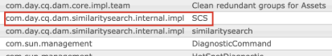
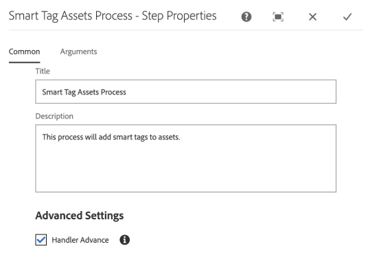

# Preparar [!DNL Assets] para el etiquetado inteligente {#configure-asset-tagging-using-the-smart-content-service}

Antes de empezar a etiquetar recursos usando Smart Content Services, integre [!DNL Experience Manager Assets] con Adobe Developer Console para usar el servicio inteligente de [!DNL Adobe Sensei]. Una vez configurado, entrene el servicio con algunas imágenes y una etiqueta.
Antes de usar el servicio de contenido inteligente, asegúrese de lo siguiente:

* [Integrar con Adobe Developer Console](#integrate-adobe-io).
* [Entrenar el servicio de contenido inteligente](#training-the-smart-content-service).
* Instale el [[!DNL Experience Manager] Service Pack](https://experienceleague.adobe.com/docs/experience-manager-release-information/aem-release-updates/aem-releases-updates.html?lang=es) más reciente.

>[!IMPORTANT]
>
>Consulte [preparar Assets para el etiquetado inteligente](https://experienceleague.adobe.com/es/docs/experience-manager-65/content/assets/administer/config-smart-tagging) para la configuración de etiquetas inteligentes en AEM 6.5.

**Nuevos usuarios**

Smart Content Services ya no está disponible para los nuevos usuarios locales de [!DNL Experience Manager Assets].

**Usuarios existentes**

Los usuarios locales existentes, que ya tienen esta capacidad habilitada, pueden seguir utilizando Smart Content Services.

## Integración con Adobe Developer Console {#integrate-adobe-io}

Al integrarse con Adobe Developer Console, el servidor [!DNL Experience Manager] autentica las credenciales del servicio con la puerta de enlace de Adobe Developer Console antes de reenviar la solicitud al servicio de contenido inteligente. Para integrarse, necesita una cuenta de Adobe ID que tenga privilegios de administrador para la organización y la licencia de Smart Content Service comprada y habilitada para su organización.

Para configurar el servicio de contenido inteligente, siga estos pasos de nivel superior:

1. Cree una integración en [Adobe Developer Console](#create-adobe-io-integration).

1. Cree [la configuración de la cuenta técnica de IMS](#create-ims-account-config) mediante la clave de API y otras credenciales de Adobe Developer Console.

1. [Configurar el servicio de contenido inteligente](#configure-smart-content-service).

1. [Compruebe la configuración](#validate-the-configuration).

### Creación de la integración con Adobe Developer Console {#create-adobe-io-integration}

Para usar las API del servicio de contenido inteligente, cree una integración en Adobe Developer Console para obtener [!UICONTROL clave de API] (generada en el campo [!UICONTROL ID de cliente] de la integración de Adobe Developer Console), [!UICONTROL ID de organización] y [!UICONTROL SECRETO DE CLIENTE] para la [!UICONTROL configuración del servicio de etiquetado inteligente de Assets] de la configuración en la nube en [!DNL Experience Manager].

1. Acceda a [https://developer.adobe.com](https://developer.adobe.com/) en un explorador. Seleccione la cuenta adecuada y compruebe que la función de organización asociada sea **administrador** del sistema.

1. Cree un proyecto con el nombre que desee. Haga clic en **[!UICONTROL Añadir API]**.

1. En la página **[!UICONTROL Añadir una API]** , seleccione **[!UICONTROL Experience Cloud]** y **[!UICONTROL Contenido inteligente]**. Haga clic en **[!UICONTROL Siguiente]**. 

1. Seleccione **[!UICONTROL OAuth Server-to-Server]**. Haga clic en **[!UICONTROL Siguiente]**.
Para obtener más información sobre cómo realizar esta configuración, consulte la documentación de Developer Console, según sus necesidades:

   * Información general:
      * [Autenticación de servidor a servidor](https://developer.adobe.com/developer-console/docs/guides/authentication/ServerToServerAuthentication/)

   * Creación de una nueva credencial de OAuth:
      * [Guía de implementación de credenciales de servidor a servidor de OAuth](https://developer.adobe.com/developer-console/docs/guides/authentication/ServerToServerAuthentication/implementation)

   * Migración de una credencial JWT existente a una credencial de OAuth:
      * [Migración de una credencial de cuenta de servicio (JWT) a una credencial de servidor a servidor de OAuth](https://developer.adobe.com/developer-console/docs/guides/authentication/ServerToServerAuthentication/migration)

1. En la página **[!UICONTROL Seleccionar perfiles de producto]**, seleccione **[!UICONTROL Servicios de contenido inteligente]**. Haga clic en **[!UICONTROL Guardar API configurada]**.

   La página muestra más información sobre la configuración. Mantenga esta página abierta para copiar y agregar estos valores en [!UICONTROL Configuración del servicio de etiquetado inteligente de Assets] de la configuración de la nube en [!DNL Experience Manager] para configurar las etiquetas inteligentes.

   

### Crear la configuración de cuenta técnica de IMS {#create-ims-account-config}

Debe crear la configuración de cuenta técnica de IMS siguiendo los pasos a continuación:

1. En la [!DNL Experience Manager] interfaz de usuario, acceda a **[!UICONTROL Herramientas]** > **[!UICONTROL Seguridad]** > **[!UICONTROL Configuraciones de IMS de Adobe]**.

1. Haga clic en **[!UICONTROL Crear]**.

1. En el cuadro de diálogo Configuración de cuenta técnica de IMS, utilice los siguientes valores:

   

   | Campo | Descripción |
   | -------- | ---------------------------- |
   | Solución en la nube | Elija **[!UICONTROL Etiquetas inteligentes]** en la lista desplegable. |
   | Título | Añada el título de la cuenta de IMS que configura. |
   | Servidor de autorización | Agregar `https://ims-na1.adobelogin.com` |
   | ID del cliente | Se proporcionará a través de [Adobe Developer console](https://developer.adobe.com/console/). |
   | Secreto de cliente | Se proporcionará a través de [Adobe Developer console](https://developer.adobe.com/console/). |
   | Ámbito | Se proporcionará a través de [Adobe Developer console](https://developer.adobe.com/console/). |
   | ID de organización | Se proporcionará a través de [Adobe Developer console](https://developer.adobe.com/console/). |

1. Seleccione la configuración que ha creado y haga clic en **[!UICONTROL Comprobar estado]**.

1. Confirme el cuadro de diálogo Comprobar estado y haga clic en Cerrar cuando la configuración esté en buen estado.

### Crear una nueva configuración {#configure-smart-content-service}

Para configurar la integración, use los valores de los campos [!UICONTROL ID. DE CUENTA TÉCNICA], [!UICONTROL ID. DE ORGANIZACIÓN], [!UICONTROL SECRETO DE CLIENTE] e [!UICONTROL ID. DE CLIENTE] de la integración de Adobe Developer Console. La creación de una configuración de nube de etiquetas inteligentes permite la autenticación de solicitudes de API desde la implementación de [!DNL Experience Manager].

1. En [!DNL Experience Manager], vaya a **[!UICONTROL Herramientas]** > **[!UICONTROL Cloud Service]** > **[!UICONTROL Etiqueta inteligente]** para abrir las [!UICONTROL Configuraciones de etiquetas inteligentes].

1. Haga clic en **[!UICONTROL Crear]** para crear una nueva configuración. De lo contrario, haga clic en **[!UICONTROL Propiedades]** para actualizar la configuración existente.

1. Rellene los campos siguientes:

   

   | Campo | Descripción |
   | -------- | ---------------------------- |
   | Título | Añada el título de la cuenta de IMS que configura. |
   | Configuración de Adobe IMS asociada | Elija la configuración en la lista desplegable. |
   | URL del servicio | `https://smartcontent.adobe.io/<region where your Experience Manager author instance is hosted>`. Por ejemplo, `https://smartcontent.adobe.io/apac`. Puede especificar `na`, `emea` o `apac` como las regiones en las que está alojada la instancia de autor de Experience Manager. |

   >[!NOTE]
   >
   >Si el servicio administrado de Experience Manager se aprovisiona antes del 1 de septiembre de 2022, utilice la siguiente URL de servicio:
   >`https://mc.adobe.io/marketingcloud/smartcontent`

1. Haga clic en **[!UICONTROL Guardar y cerrar]**.

### Validar la configuración {#validate-the-configuration}

Una vez completada la configuración, puede utilizar un MBean de JMX para validar la configuración. Para validar, siga estos pasos.

1. Obtenga acceso a su servidor [!DNL Experience Manager] en `https://[aem_server]:[port]`.

1. Vaya a **[!UICONTROL Herramientas]** > **[!UICONTROL Operaciones]** > **[!UICONTROL Consola web]** para abrir la consola OSGi. Haga clic en **[!UICONTROL Principal] > [!UICONTROL JMX]**.

<!--
1. Click `com.day.cq.dam.similaritysearch.internal.impl`. It opens **[!UICONTROL SimilaritySearch Miscellaneous Tasks]**.-->

1. Haga clic en `com.day.cq.dam.similaritysearch.internal.impl (SCS)`.

   

1. Haga clic en `validateConfigs()`. En el diálogo **[!UICONTROL Validar configuraciones]**, haga clic en **[!UICONTROL Invocar]**.

Los resultados de validación se muestran en el mismo cuadro de diálogo.

### Habilitar el etiquetado inteligente en el flujo de trabajo [!UICONTROL Recurso de actualización DAM] (opcional) {#enable-smart-tagging-in-the-update-asset-workflow-optional}

1. En [!DNL Experience Manager], vaya a **[!UICONTROL Herramientas]** > **[!UICONTROL Flujo de trabajo]** > **[!UICONTROL Modelos]**.

1. En la página **[!UICONTROL Modelos de flujo de trabajo]**, seleccione el modelo de flujo de trabajo de **[!UICONTROL recursos de actualización de DAM]**.

1. Haga clic en **[!UICONTROL Editar]** en la barra de herramientas.

1. Expanda el panel lateral para mostrar los pasos. Arrastre el paso **[!UICONTROL Recurso de etiqueta inteligente]** que está disponible en la sección Flujo de trabajo de DAM y colóquelo después del paso **[!UICONTROL Miniaturas del proceso]**.

   

1. Abra las propiedades del paso para modificar los detalles. En **[!UICONTROL Configuración avanzada]**, compruebe que la opción **[!UICONTROL Avance del controlador]** está seleccionada.

   

1. En la pestaña **[!UICONTROL Argumentos]**, seleccione **[!UICONTROL Omitir errores]** si desea que el flujo de trabajo se complete aunque falle el paso de etiquetado automático.

   Además, para etiquetar recursos cuando se carguen, independientemente de si el etiquetado inteligente está habilitado en las carpetas, seleccione **[!UICONTROL Omitir indicador de etiqueta inteligente]**.

   

1. Haga clic en hecho  para cerrar el paso del proceso.

1. Haga clic en **[!UICONTROL Sincronizar]** para guardar el flujo de trabajo.

## Formación del servicio de contenido inteligente {#training-the-smart-content-service}

Para que el servicio de contenido inteligente reconozca su taxonomía empresarial, ejecútela en un conjunto de recursos que ya incluyan etiquetas relevantes para su negocio. Para etiquetar de forma eficaz las imágenes de marca, el servicio de contenido inteligente requiere que las imágenes de formación se ajusten a determinadas directrices. Después de la formación, el servicio puede aplicar la misma taxonomía a un conjunto similar de recursos.

Puede entrenar el servicio varias veces para mejorar su capacidad de aplicar etiquetas relevantes. Después de cada ciclo de formación, ejecute un flujo de trabajo de etiquetado y compruebe si los recursos están etiquetados correctamente.

Puede entrenar el Servicio de contenido inteligente periódicamente o según sea necesario.

>[!NOTE]
>
>El flujo de trabajo de formación se ejecuta únicamente en carpetas.

### Directrices para la formación {#guidelines-for-training}

Para obtener los mejores resultados, las imágenes del conjunto de formación se ajustan a las siguientes directrices:

**Cantidad y tamaño:** Mínimo de 30 imágenes por etiqueta. Mínimo de 500 píxeles en el lado más largo.

**Coherencia**: las imágenes utilizadas para una etiqueta específica son visualmente similares.

Por ejemplo, no es aconsejable etiquetar todas estas imágenes como `my-party` (para aprendizaje) porque no son visualmente similares.

**Cobertura**: Use suficiente variedad en las imágenes del curso de formación. La idea es ofrecer algunos ejemplos, pero razonablemente diversos, para que Experience Manager aprenda a centrarse en lo correcto. Si aplica la misma etiqueta a imágenes visualmente distintas, incluya al menos cinco ejemplos de cada tipo.

Por ejemplo, para la etiqueta *model-down-pose*, incluya más imágenes de aprendizaje similares a la imagen resaltada a continuación para que el servicio identifique las imágenes similares con mayor precisión durante el etiquetado.

**Distracción/obstrucción**: El servicio se entrena mejor con las imágenes que tienen menos distracción (fondos destacados, acompañamientos no relacionados, como objetos/personas con el asunto principal).

Por ejemplo, para la etiqueta *casual-shoe*, la segunda imagen no es una buena candidata para entrenamiento.

**Complejidad:** Si una imagen cumple los requisitos para más de una etiqueta, agregue todas las etiquetas aplicables antes de incluir la imagen para formación. Por ejemplo, para etiquetas, como `raincoat` y `model-side-view`, agregue ambas etiquetas en el recurso que cumple los requisitos antes de incluirlo para formación.

>[!NOTE]
>
>La capacidad del servicio de contenido inteligente para aprender sobre sus etiquetas y aplicarlas a otras imágenes depende de la calidad de las imágenes que utilice para la formación. Para obtener los mejores resultados, Adobe recomienda utilizar imágenes visualmente similares para entrenar el servicio para cada etiqueta.

### Formación periódica {#periodic-training}

Puede habilitar el Servicio de contenido inteligente para que se imparta formación periódicamente sobre los recursos y las etiquetas asociadas dentro de una carpeta. Abra la página [!UICONTROL Propiedades] de la carpeta de recursos, seleccione **[!UICONTROL Habilitar etiquetas inteligentes]** en la pestaña **[!UICONTROL Detalles]** y guarde los cambios.

Una vez seleccionada esta opción para una carpeta, [!DNL Experience Manager] ejecuta un flujo de trabajo de formación automáticamente para entrenar el servicio de contenido inteligente en los recursos de la carpeta y sus etiquetas. De forma predeterminada, el flujo de trabajo de formación se ejecuta semanalmente a las 12:30 los sábados.

### Formación a la carta {#on-demand-training}

Puede entrenar el servicio de contenido inteligente siempre que sea necesario desde la consola Flujo de trabajo.

1. En la interfaz de [!DNL Experience Manager], vaya a **[!UICONTROL Herramientas]** > **[!UICONTROL Flujo de trabajo]** > **[!UICONTROL Modelos]**.
1. En la página **[!UICONTROL Modelos de flujo de trabajo]**, seleccione el flujo de trabajo **[!UICONTROL Formación sobre etiquetas inteligentes]** y, a continuación, haga clic en **[!UICONTROL Iniciar flujo de trabajo]** en la barra de herramientas.
1. En el cuadro de diálogo **[!UICONTROL Ejecutar flujo de trabajo]**, vaya a la carpeta de carga útil que incluye los recursos etiquetados para entrenar el servicio.
1. Especifique un título para el flujo de trabajo y añada un comentario. A continuación, haga clic en **[!UICONTROL Ejecutar]**. Los recursos y las etiquetas se envían para su formación.

   

>[!NOTE]
>
>Una vez que los recursos de una carpeta se procesan para formación, solo los modificados se procesan en ciclos de formación posteriores.

### Ver informes de formación {#viewing-training-reports}

Para comprobar si el servicio de contenido inteligente ha recibido formación sobre las etiquetas del conjunto de recursos de formación, consulte el informe de flujo de trabajo de formación desde la consola Informes.

1. En la interfaz de [!DNL Experience Manager], vaya a **[!UICONTROL Herramientas]** > **[!UICONTROL Assets]** > **[!UICONTROL Informes]**.
1. En la página **[!UICONTROL Informes de recursos]**, haga clic en **[!UICONTROL Crear]**.
1. Seleccione el informe **[!UICONTROL Formación sobre etiquetas inteligentes]** y, a continuación, haga clic en **[!UICONTROL Siguiente]** en la barra de herramientas.
1. Especifique un título y una descripción para el informe. En **[!UICONTROL Programar informe]**, deje seleccionada la opción **[!UICONTROL Ahora]**. Si desea programar el informe para más adelante, seleccione **[!UICONTROL Más adelante]** e indique una fecha y una hora. A continuación, haga clic en **[!UICONTROL Crear]** en la barra de herramientas.
1. En la página **[!UICONTROL Informes de recursos]**, seleccione el informe que ha generado. Para ver el informe, haz clic en **[!UICONTROL Ver]** en la barra de herramientas.
1. Revise los detalles del informe.

   El informe muestra el estado de la formación de las etiquetas que ha entrenado. El color verde de la columna **[!UICONTROL Estado de formación]** indica que el servicio de contenido inteligente ha recibido formación para la etiqueta. El color amarillo indica que el servicio no está completamente entrenado para una etiqueta en particular. En este caso, agregue más imágenes con la etiqueta en concreto y ejecute el flujo de trabajo de formación para que el servicio se imparta completamente en la etiqueta.

   Si no ve las etiquetas en este informe, ejecute de nuevo el flujo de trabajo de formación para estas etiquetas.

1. Para descargar el informe, selecciónelo en la lista y haga clic en **[!UICONTROL Descargar]** en la barra de herramientas. El informe se descarga como una hoja de cálculo de Microsoft Excel.

## Limitaciones {#limitations}

* Las etiquetas inteligentes mejoradas se basan en modelos de aprendizaje de imágenes y sus etiquetas. Estos modelos no siempre son perfectos para identificar etiquetas. La versión actual del servicio de contenido inteligente tiene las siguientes limitaciones:

   * Incapacidad para reconocer diferencias sutiles en las imágenes. Por ejemplo, camisetas ajustadas delgadas versus regulares.
   * Incapacidad para identificar etiquetas en función de patrones o partes diminutos de una imagen. Por ejemplo, logotipos en camisetas.
   * El etiquetado es compatible con las configuraciones regionales que admiten [!DNL Experience Manager].

* Para buscar recursos con etiquetas inteligentes (regulares o mejoradas), use el Omnisearch [!DNL Assets] (búsqueda de texto completo). No hay ningún predicado de búsqueda independiente para las etiquetas inteligentes.

>[!MORELIKETHIS]
>
>* [Información general y cómo entrenar etiquetas inteligentes](enhanced-smart-tags.md)
>* [Solución de problemas de etiquetas inteligentes para credenciales de OAuth](config-oauth.md)
>* [Tutorial de vídeo sobre etiquetas inteligentes](https://experienceleague.adobe.com/docs/experience-manager-learn/assets/metadata/image-smart-tags.html?lang=es)
