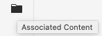
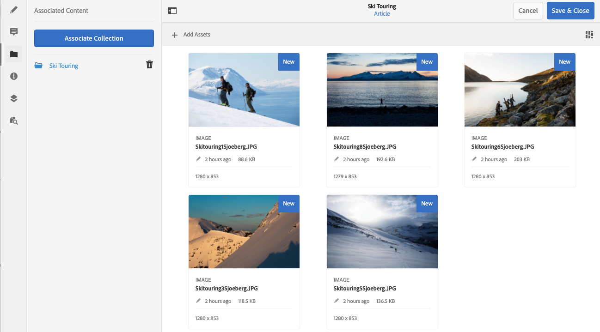

# Contenido asociado{#associated-content}

La función de contenido asociado de AEM proporciona la conexión para que los recursos se puedan utilizar (opcionalmente) con el fragmento cuando se añada a una página de contenido. Esto proporciona flexibilidad para la entrega de contenido sin encabezado al [proporcionar una amplia gama de recursos a los que tener acceso al usar el fragmento de contenido en una página,](/help/sites-authoring/content-fragments.md#using-associated-content) al tiempo que ayuda a reducir el tiempo necesario para buscar el recurso adecuado. Cualquier contenido asociado se puede configurar con el editor de fragmentos de contenido.

## Adición de contenido asociado {#adding-associated-content}

>[!NOTE]
>
>Hay varios métodos para agregar [recursos visuales (p. ej., imágenes)](/help/assets/content-fragments/content-fragments.md#fragments-with-visual-assets) al fragmento y/o página.

Para realizar la asociación, primero debe [agregar los recursos multimedia a una colección](/help/assets/manage-collections.md). Una vez hecho esto, puede hacer lo siguiente:

1. Abrir el fragmento y seleccionar **Contenido asociado** en el panel lateral.

   

1. Dependiendo de si alguna colección ya se ha asociado o no, seleccione:

   * **Asociar contenido**: esta será la primera colección asociada
   * **Asociar colección** - colecciones asociadas que ya están configuradas

1. Seleccione la colección requerida.

   Si lo desea, puede agregar el fragmento a la colección seleccionada; esto ayuda al seguimiento.

   

1. Confirmar (con **Seleccionar**). La colección se enumerará como asociada.

   

## Edición de contenido asociado {#editing-associated-content}

Una vez asociada una colección, puede hacer lo siguiente:

* **Quitar** la asociación.
* **Agregar recursos** a una colección.
* Seleccione un recurso para realizar más acciones.
* Editar el recurso.
