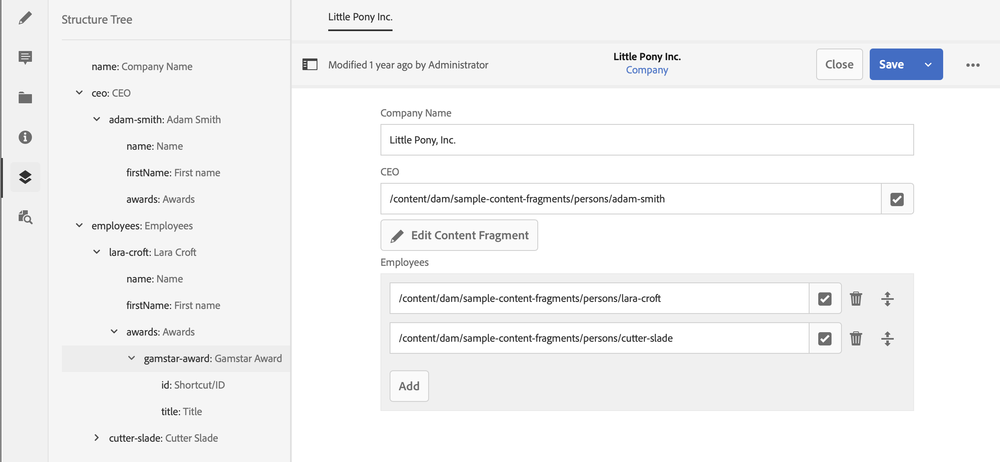

# Árbol de estructura de fragmento de contenido {#content-fragment-structure-tree}

Utilice la funcionalidad Árbol de estructura del Editor de fragmentos de contenido en AEM para comprender mejor el contenido sin encabezado.

En el Editor de fragmentos de contenido puede seleccionar el icono Árbol de estructura:

Esto abre una representación de la estructura del fragmento en el panel izquierdo. Con esta opción puede navegar hasta los fragmentos a los que se hace referencia y acceder a ellos. Al seleccionar una referencia, se abre ese fragmento para editarlo.

>[!NOTE]
>
>Con las rutas de exploración del panel principal, puede volver al punto de inicio.

