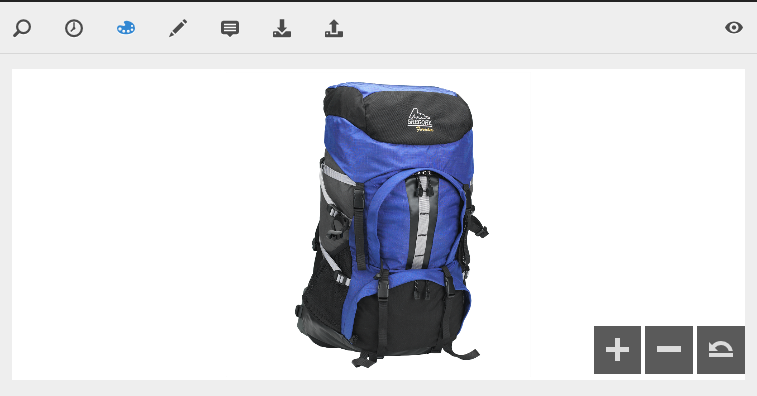

# Uso de Dynamic Media {#working-with-dynamic-media}

[Dynamic Media](https://business.adobe.com/es/products/experience-manager/assets/dynamic-media.html) ayuda a ofrecer recursos de marketing y comercialización visual enriquecidos bajo demanda, escalados automáticamente para el consumo en sitios web, móviles y sociales. Al utilizar un conjunto de recursos de origen primarios, el software genera y ofrece varias variaciones de contenido enriquecido en tiempo real a través de su red global, escalable y optimizada para el rendimiento.

El software ofrece experiencias de visualización interactivas, como zoom, giro de 360 grados y vídeo. Incorpora de forma exclusiva los flujos de trabajo de la solución Adobe Experience Manager digital asset management (Assets) para simplificar y optimizar el proceso de administración de campañas digitales.

<!--
>ARTICLE IS MISSING. GIVES 404 [!NOTE]
>
>A Community article is available on [Working with Adobe Experience Manager and Dynamic Media](https://helpx.adobe.com/experience-manager/using/aem_dynamic_media.html).
-->

## Qué puede hacer con el software {#what-you-can-do-with-dynamic-media}

El software permite administrar los recursos antes de publicarlos. [Trabajar con recursos digitales](manage-assets.md) explica en detalle cómo usar recursos en general. Los temas generales incluyen cargar, descargar, editar y publicar recursos; ver y editar propiedades y buscar recursos.

Las funciones solo de Dynamic Media incluyen lo siguiente:

* [Banner de carrusel](carousel-banners.md)
* [Conjuntos de imágenes](image-sets.md)
* [Imágenes interactivas](interactive-images.md)
* [Vídeos interactivos](interactive-videos.md)
* [Conjuntos de medios mixtos](mixed-media-sets.md)
* [Imágenes panorámicas](panoramic-images.md)

* [Conjuntos de giros](spin-sets.md)
* [Vídeo](video.md)
* [Entrega de recursos de Dynamic Media](delivering-dynamic-media-assets.md)
* [Administración de recursos](managing-assets.md)
* [Creación de ventanas emergentes personalizadas con Quickview](custom-pop-ups.md)

Consulte también [Configuración de Dynamic Media](administering-dynamic-media.md).

>[!NOTE]
>
>Para comprender las diferencias entre el uso de Dynamic Media y la integración de Dynamic Media Classic con Adobe Experience Manager, consulte [Integración de Dynamic Media Classic frente a Dynamic Media](/help/sites-administering/scene7.md#aem-scene-integration-versus-dynamic-media).

## Dynamic Media habilitado frente a Dynamic Media deshabilitado {#dynamic-media-on-versus-dynamic-media-off}

Puede comprobar si el software está activado (activado) por las siguientes características:

* Las representaciones dinámicas están disponibles al descargar o previsualizar recursos.
* Hay disponibles conjuntos de imágenes, conjuntos de giros y conjuntos de medios mixtos.
* Se crean representaciones PTIFF.

Al seleccionar un recurso de imagen, la vista del recurso es diferente con el software [habilitado](config-dynamic.md#enabling-dynamic-media). Utiliza los visores HTML5 bajo demanda.

### Representaciones dinámicas {#dynamic-renditions}

Las representaciones dinámicas, como los ajustes preestablecidos de imagen y visor (en **[!UICONTROL Dynamic]**), están disponibles cuando el software está habilitado.

### Conjuntos de imágenes, conjuntos de giros y conjuntos de medios mixtos {#image-sets-spins-sets-mixed-media-sets}

Los conjuntos de imágenes, los conjuntos de giros y los conjuntos de medios mixtos están disponibles si el software está habilitado.

### Representaciones PTIFF {#ptiff-renditions}

Los recursos habilitados para Dynamic Media incluyen `pyramid.tiffs`.

### Cambio de vistas de recursos {#asset-views-change}

Con el software habilitado, puede acercar y alejar haciendo clic en los botones `+` y `-`. También puede hacer clic en para ampliar una zona concreta. Revertir le lleva a la versión original y puede hacer que la imagen de pantalla completa haciendo clic en las flechas diagonales. Con el software habilitado, tiene este aspecto:

Con el software desactivado, puede acercar y alejar y volver al tamaño original:

