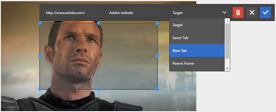

# Añadir mapas de imagen {#adding-image-maps}

Los mapas de imágenes permiten agregar una o más áreas hipervinculadas que funcionan como otros hipervínculos.

1. Realice una de las siguientes acciones para abrir **[!UICONTROL Editor de imágenes locales]**:

   * Con Acciones rápidas, haga clic en **[!UICONTROL Editar]** que aparece en un recurso en la vista **[!UICONTROL Tarjeta]**. En la vista Lista, seleccione el recurso y haga clic en la opción **[!UICONTROL Editar]** de la barra de herramientas.

     >[!NOTE]
     >
     >Acciones rápidas no está disponible en la vista **[!UICONTROL Lista]**.

   * En la vista **[!UICONTROL Tarjeta]** o **[!UICONTROL Lista]**, seleccione el recurso y haga clic en **[!UICONTROL Editar]** en la barra de herramientas.
   * Haga clic en **[!UICONTROL Editar]** en la página de recursos.

1. Para insertar un mapa de imagen, haga clic en **[!UICONTROL Iniciar mapa]**  en la barra de herramientas.
1. Seleccione la forma del mapa de imagen. La zona activa de la forma seleccionada se coloca en la imagen.

   

1. Haga clic en el punto interactivo e introduzca la dirección URL y el texto Alt. En la lista **[!UICONTROL Destino]**, especifique dónde desea que se muestre el mapa de imagen; por ejemplo, la misma ficha, una ficha nueva o un iFrame. Por ejemplo, escriba `https://www.adobe.com` como dirección URL, `Adobe website` como texto alternativo y especifique **[!UICONTROL Nueva ficha]** de la lista **[!UICONTROL Destino]** para que el mapa de imagen se abra en una nueva ficha.

   

1. Haga clic en **[!UICONTROL Confirmar]** y, a continuación, haga clic en **[!UICONTROL Finalizar]**  en la barra de herramientas para guardar los cambios.

   Para eliminar el mapa de imagen, haz clic en el punto interactivo y haz clic en **[!UICONTROL Eliminar]** .

1. Para ver el mapa de imagen, vaya a la página de detalles del recurso y pase el cursor sobre la imagen.

   

   Si la opción Dynamic Media está habilitada, vaya al Editor de recursos y haga clic en **[!UICONTROL Mapa]** para ver todos los mapas de imágenes aplicados.
