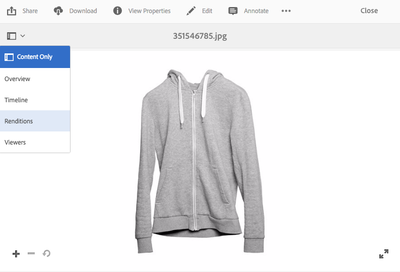
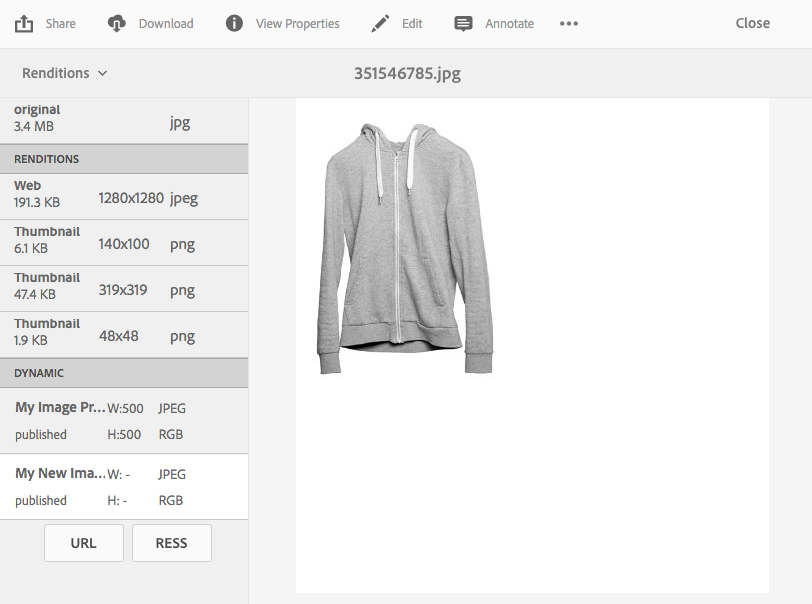
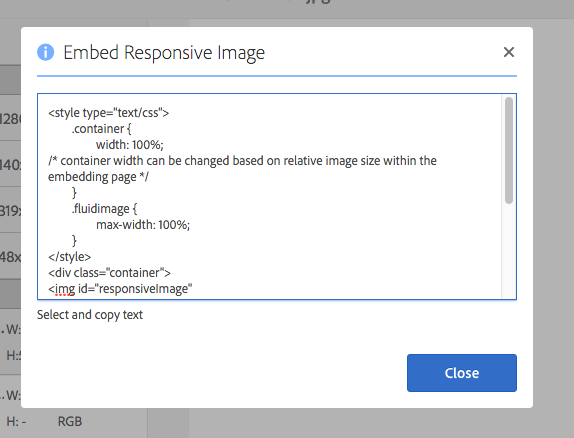

# Distribución de imágenes optimizadas para un sitio adaptable {#delivering-optimized-images-for-a-responsive-site}

Utilice la función de código interactivo cuando desee compartir el código para un servicio interactivo con el desarrollador web. Copia el código interactivo (**[!UICONTROL RESS]**) en el portapapeles para poder compartirlo con el desarrollador web.

Esta función tiene sentido si el sitio web se encuentra en un WCM de terceros. Sin embargo, si el sitio web se encuentra en Adobe Experience Manager, un servidor de imágenes fuera del sitio procesará la imagen y la enviará a la página web.

Consulte también [Incrustar el visor de vídeo en una página web](embed-code.md).

Vea también [Vincular direcciones URL a su aplicación web](linking-urls-to-yourwebapplication.md).

**Para ofrecer imágenes optimizadas para un sitio adaptable:**

1. Vaya a la imagen para la que desee proporcionar código interactivo y, en el menú desplegable, seleccione **[!UICONTROL Representaciones]**.

   

1. Seleccione un ajuste preestablecido de imagen interactivo. Aparecerán los botones **[!UICONTROL URL]** y **[!UICONTROL RESS]**.

   

   >[!NOTE]
   >
   >El recurso seleccionado *y* el ajuste preestablecido de imagen o visualizador seleccionado deben publicarse para que los botones **[!UICONTROL URL]** o **[!UICONTROL RESS]** estén disponibles.
   >
   >Dynamic Media: el modo híbrido requiere que publique ajustes preestablecidos de imagen; Dynamic Media: el modo Scene7 publica automáticamente ajustes preestablecidos de imagen.

1. Seleccione **[!UICONTROL RESS]**.

   

1. En el cuadro de diálogo **[!UICONTROL Incrustar imagen adaptable]**, seleccione, copie el texto del código adaptable y péguelo en su sitio web para acceder al recurso adaptable.
1. Edite los puntos de interrupción predeterminados en el código incrustado para que coincidan con los puntos de interrupción del sitio web adaptable, directamente en el código. Además, pruebe las diferentes resoluciones de imagen que se proporcionan en diferentes puntos de interrupción de página.

## Utilice HTTP/2 para enviar los recursos de Dynamic Media {#using-http-to-delivery-your-dynamic-media-assets}

HTTP/2 es el nuevo protocolo web actualizado que mejora la forma en que los exploradores y servidores se comunican. Proporciona una transferencia de información más rápida y reduce la cantidad de potencia de procesamiento necesaria. La entrega de recursos de Dynamic Media se admite mediante HTTP/2, que proporciona mejores tiempos de respuesta y carga.

Consulte [Entrega HTTP2 de contenido](http2.md) para obtener información detallada sobre cómo empezar a usar HTTP/2 con su cuenta de Dynamic Media.
