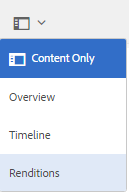

# Representaciones de vídeo {#video-renditions}

Adobe Experience Manager Assets genera representaciones de vídeo para recursos de vídeo de varios formatos, incluidos OGG, FLV, etc.

Experience Manager Assets admite representaciones estáticas y dinámicas (representaciones codificadas en DM) para recursos de medios.

Las representaciones estáticas se generan de forma nativa mediante FFMPEG (instalado y disponible en la ruta del sistema) y se almacenan en el repositorio de contenido.

Las representaciones codificadas en DM se almacenan en el servidor proxy y se proporcionan durante la ejecución.

Experience Manager Assets proporciona compatibilidad de reproducción para estas representaciones en el lado del cliente.

Para ver las representaciones de un recurso de vídeo concreto, abra su página de recursos y seleccione el icono Navegación global. A continuación, elija **[!UICONTROL Representaciones]** en la lista.

La lista de representaciones de vídeo se muestra en el panel **[!UICONTROL Representaciones]**.

Para configurar el servidor proxy para representaciones con codificación DM, [configure los servicios de nube de Dynamic Media](config-dynamic.md).

Para generar representaciones de vídeo con los parámetros deseados, [cree un perfil de vídeo correspondiente](video-profiles.md).

Después de configurar el servidor proxy y crear perfiles de vídeo, puede incluir este ajuste preestablecido de vídeo en un perfil de procesamiento y aplicar el perfil de procesamiento a una carpeta.

>[!NOTE]
>
>La reproducción de audio no funciona para archivos OGG y WAV en Microsoft® Internet Explorer 11. Se muestra un error `Invalid Source` en la página de detalles del recurso para los recursos con la extensión OGG o WAV.
>
>En MS® Edge y iPad, los archivos OGG no se reproducen y generan un error de formato no admitido.
