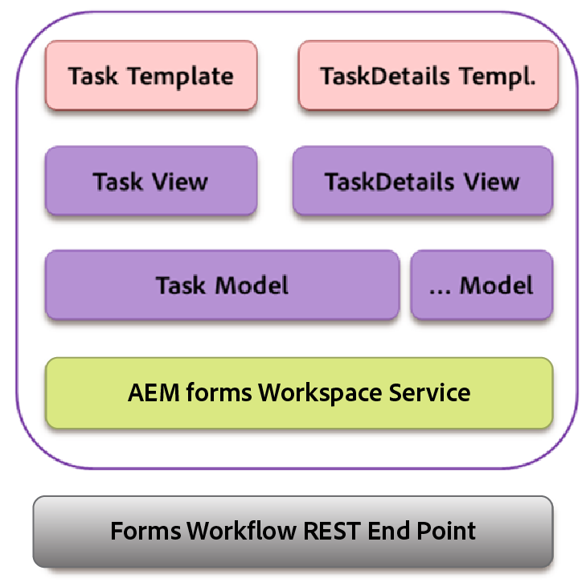

# Interactuar con Backbone{#backbone-interaction}

Backbone es una biblioteca que ayuda a crear y seguir la arquitectura de MVC en aplicaciones web. La idea básica de Backbone es organizar la interfaz en vistas lógicas, respaldadas por modelos, cada una de las cuales se puede actualizar de forma independiente cuando cambia el modelo, sin tener que volver a dibujar la página. Para obtener más información sobre Backbone, consulte [https://backbonejs.org](https://backbonejs.org/).

Algunos conceptos clave son los siguientes:

**Modelo de Backbone** Contiene datos y la mayoría de la lógica relacionada con estos datos.

**Vista de Backbone** Se utiliza para representar el estado del modelo correspondiente. Backbone se comporta realmente como un controlador, escucha eventos de interfaz de usuario como clics de usuarios o modela eventos (como los datos modificados), y modifica la interfaz de usuario según corresponda.

**Plantilla HTML** Una plantilla de envoltorio que tiene marcadores de posición que ha rellenado el modelo.

**Espacio de trabajo de AEM Forms** Contiene varios componentes individuales. Cada componente:

* Representa un solo elemento de interfaz de usuario lógico.
* Puede ser una colección de componentes similares.
* Se compone del modelo de Backbone, la vista de la estructura básica y la plantilla HTML.
* Contiene referencia a un servicio.
* Contiene referencia a las utilidades requeridas.

Cuando se inicializa un componente, se crean los siguientes objetos:

* Se crea una nueva instancia del modelo de Backbone para el componente. El servicio se inserta en el modelo.
* Se crea una nueva instancia de la vista de Backbone.
* La instancia del modelo correspondiente, la plantilla HTML y las utilidades se insertan en la vista.

En la vista de Backbone, hay un mapa de eventos que asigna los distintos eventos que pueden surgir debido a las interacciones de la interfaz de usuario con un controlador correspondiente. Esta asignación se inicia una vez que se inicializa un componente.

Cuando se inicializa una vista, esta llama a su modelo correspondiente para recuperar datos del servidor. Una vez que todos los datos requeridos por una vista estén disponibles, la vista procesará los datos en el formato especificado por la plantilla HTML. Varias vistas pueden compartir el mismo modelo para la comunicación.

Un ejemplo:

1. El usuario hace clic en una plantilla de tarea de la lista de tareas.
1. La vista de tareas escucha el clic y llama a la función de procesamiento en el modelo de tareas.
1. El modelo de tareas llama posteriormente al servicio, que es un punto común para todas las comunicaciones con el servidor de AEM Forms.
1. La clase de servicio llama al extremo REST de AEM Forms para el método de procesamiento mediante Ajax.
1. La llamada de retorno para esta invocación de Ajax se define en el modelo de tareas.
1. El modelo de tareas generará un evento de Backbone cuando se complete la llamada de procesamiento.
1. Otra vista, la vista de detalles de tareas, escucha este evento desde el modelo de tareas.
1. La vista Detalles de la tarea cambia la plantilla de detalles de la tarea para mostrar la tarea procesada (formulario, detalles, archivos adjuntos, notas, etc.) al usuario.
