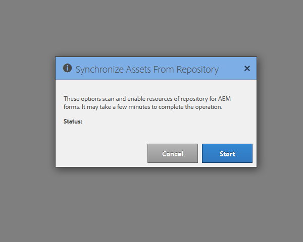

# Configurar el planificador de sincronización {#configuring-the-synchronization-scheduler}

De forma predeterminada, el programador de sincronización se ejecuta cada tres minutos para sincronizar todos los recursos modificados y actualizados en el repositorio mediante LiveCycle Workbench 11. Las aplicaciones que contienen formularios y recursos serán visibles en la interfaz de usuario de AEM Forms una vez finalizado el proceso de sincronización.

## Cambiar el intervalo del programador de sincronización {#change-interval-of-the-synchronization-scheduler}

Realice los siguientes pasos para cambiar el intervalo del programador de sincronización:

1. Inicie sesión en el Administrador de configuración de AEM. La dirección URL del Administrador de configuración es `https://'[server]:[port]'/lc/system/console/configMgr`

1. Busque y abra el paquete **FormsManagerConfiguration**.

1. Especifique un valor nuevo para la opción **Frecuencia del planificador de sincronización**.

   La unidad de la frecuencia es minutos. Por ejemplo, para configurar el planificador para que se ejecute cada 60 minutos, especifique 60.

## Sincronizar recursos {#synchronizing-assets}

Puede usar la opción **Sincronizar recursos del repositorio** para sincronizar manualmente los recursos. Realice los siguientes pasos para sincronizar manualmente los recursos:

1. Inicie sesión en AEM Forms. La URL predeterminada es `https://'[server]:[port]'/lc/aem/forms/`.

   

   **Figura:** *Interfaz de usuario de AEM Forms*

1. Haga clic en el icono  de la barra de herramientas. Si no tiene ningún recurso en la última ruta configurada, seleccione el cuadro de diálogo como se muestra a continuación. Haga clic en **Inicio** para iniciar la sincronización.

   

   **Figura:** *Cuadro de diálogo Sincronización*

## Solucionar problemas de sincronización {#troubleshooting-synchronization-error}

Puede crear aplicaciones nuevas en el diseñador de flujos de trabajo (Área de trabajo de LiveCycle).

Si la aplicación recién creada y alguna carpeta en /content/dam/formsanddocuments tienen un nombre igual, se producirá el error “*Ya existe un recurso con el mismo nombre que esta aplicación en el nivel raíz.*” está registrado.

Para resolver el conflicto, cambie el nombre de la aplicación y sincronice manualmente los recursos.

**Figura:** *Conflictos en el cuadro de diálogo de sincronización de recursos*
