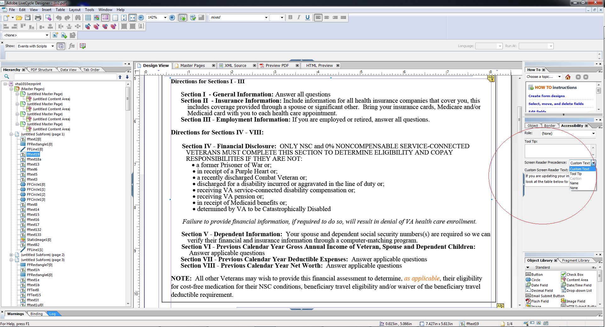

# Diseñar formularios HTML5 accesibles {#designing-accessible-html-forms}

Los formularios HTML5 utilizan el estándar de accesibilidad ARIA HTML5 para generar formularios HTML accesibles. Estos formularios admiten la navegación con pestañas (excepto Mozilla FireFox) y están certificados para ser compatibles con lectores de pantalla comunes. Para generar un formulario HTML5 con buenas características de accesibilidad, diseñe la plantilla de formulario XFA en base a algunas directrices de diseño básicas. Las directrices de diseño incluyen configurar el orden de pestañas correcto y proporcionar el contenido Texto hablado para cada control de formulario. AEM Forms Designer admite la configuración de estos atributos de control de formulario para generar un formulario PDF y HTML5 accesible.

La navegación *Nota:Tabbed no cubre campos protegidos, como los campos de cálculo que muestran la suma de los valores. Para que el lector de pantalla lea el valor de un campo protegido, coloque un campo vacío de solo lectura encima o junto al campo protegido. Asigne el valor del campo protegido al nuevo campo de solo lectura. El lector de pantalla o la navegación con pestañas pueden elegir este campo de solo lectura y expresarlo como el valor del campo protegido.*

AEM Forms Designer incluye varias opciones de Texto hablado que se pueden pasar a los lectores de pantalla. Para cada objeto de un formulario, el usuario puede especificar una de varias opciones de configuración para el texto del lector de pantalla:

* Texto personalizado del lector de pantalla, que se puede configurar con la paleta Accesibilidad. Los autores pueden anotar los nombres de los botones y campos, y su propósito.
* Información del objeto, que se puede establecer en la paleta Accesibilidad.
* Pies de ilustración para los campos del formulario.
* Nombres de objetos, como se especifican en la opción Nombre de la pestaña Enlace.

Cuando hay varias opciones disponibles en un control de formulario, como información del objeto, Lector de texto en pantalla y Pie de ilustración, el Lector de pantalla solo utilizará una de estas propiedades. El orden predeterminado es Lector de texto en pantalla, información del objeto, Pie de ilustración y Nombre. Puede ignorar este orden predeterminado si utiliza la opción **Prioridad** de Lector de pantalla en la paleta Accesibilidad.
