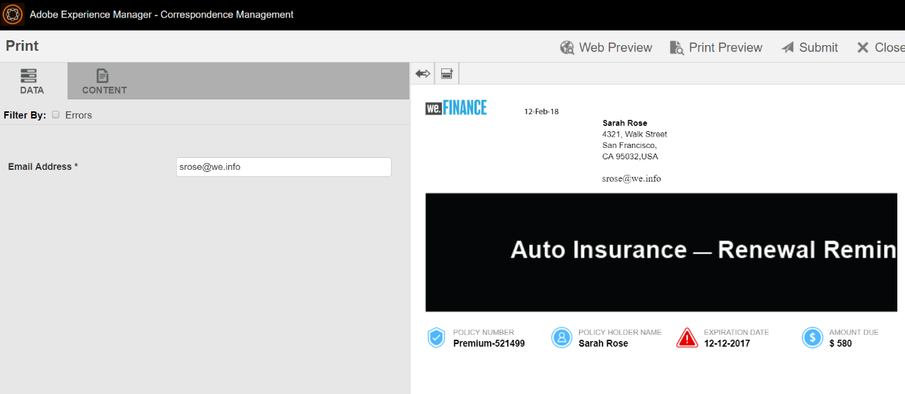

# `We.Finance` tutorial del sitio de referencia de Renovación del seguro del coche{#we-finance-auto-insurance-renewal-reference-site-walkthrough}

## `We.Finance` escenario del sitio de referencia  {#we-finance-reference-site-scenario}

El sitio web `We.Finance` es un sitio de servicios financieros diseñado para ayudarle a conocer las capacidades de Interactive Communications de AEM Forms.

Lea un tutorial detallado de un caso de uso del seguro del coche `We.Finance` que muestra cómo AEM Forms y su integración con Microsoft® Dynamics ayudan a personalizar la experiencia del cliente en una compañía de servicios financieros. El tutorial interactivo está diseñado para facilitar la implementación de transacciones digitales complejas y la comunicación con los clientes en una compañía financiera.

**El recorrido comienza con el caso de uso:**

Sarah Rose es una cliente de `We.Finance` y ha adquirido una póliza de seguro del coche. Es esa época del año para que Sarah renueve su póliza de seguro. Gloria Ríos es su agente de seguros. El sitio web `We.Finance` envía por correo electrónico un recordatorio a Sarah sobre la renovación de su póliza. Sarah sigue las instrucciones del correo electrónico y completa correctamente el proceso.

## Tutorial de la solicitud de un seguro de coche {#auto-insurance-application-walkthrough}

El escenario de la solicitud del seguro del coche `We.Finance` es una narración visual para el usuario y se basa en dos personas:

* Sarah Rose, una cliente de `We.Finance`
* Gloria Ríos, agente de seguros, `We.Finance`

### Gloria envía una comunicación sobre la renovación de la póliza del seguro desde `We.Finance` {#gloria-sends-an-insurance-policy-renewal-communication-from-we-finance}

Gloria inicia sesión en una instancia de AEM, hace clic en **Renovación del seguro del coche** y luego en **Abrir la interfaz de usuario del agente**. El clic rellena previamente el documento del seguro con los datos de la póliza de Sarah Rose. Gloria hace clic en **Enviar** y se muestra un mensaje en la pantalla &quot;Envío iniciado&quot; y luego, en unos segundos, &quot;Enviado correctamente&quot;.

Sarah recibe un correo electrónico con el asunto &quot;Renovación del seguro del coche&quot;.

#### Puede verlo usted mismo {#see-it-yourself}

Vaya a **Adobe Experience Manager** > **Forms** > **Forms &amp; Documents** > **`We.Finance`** > **Seguro para automóviles**. Seleccione la **comunicación interactiva** Renovación del seguro del coche y haga clic en **Abrir la interfaz de usuario del agente**. La comunicación interactiva se abre en la interfaz de usuario del agente. Introduzca una dirección de correo electrónico válida para que puedan recibir el correo electrónico con el documento de la póliza adjunto y haga clic en Enviar.

Puede acceder a la comunicación interactiva Renovación del seguro del coche y revisarla directamente desde `https://[authorHost]: authorPort]/aem/formdetails.html/content/dam/formsanddocuments/we-finance/autoinsurance/auto-insurance-renewal.`

### Sarah recibe una comunicación sobre la renovación de su póliza de seguro de `We.Finance` y decide renovarla {#sarah-receives-an-insurance-policy-renewal-communication-from-we-finance-and-decides-to-renew}

Sarah recibe un correo electrónico con un archivo adjunto de `We.Finance`, en el que se le recuerda que la póliza de su seguro del coche está a punto de caducar. El archivo adjunto es la versión impresa de la póliza de seguro del coche de Sarah.

Sarah hace clic en la opción **Renovar ahora** y es redirigida a la versión web de la póliza de su seguro del coche. Además de esta carta, Sarah encuentra la cantidad de tiempo restante en la póliza antes de que caduque. La página ofrece información general sobre la póliza de seguro. Detalla el número de póliza, el importe adeudado, las ofertas de descuento y las recompensas de fidelidad. Se hace clic en **Renovar ahora** en la parte inferior de la directiva.

#### Funcionamiento {#how-it-works}

La salida web y la salida impresa de la póliza de su seguro del coche se crean utilizando las capacidades multicanal de las comunicaciones interactivas.

El botón Renovar ahora del correo electrónico está vinculado a la solicitud Renovación del seguro del coche, que es una comunicación interactiva en una instancia de publicación.

#### Puede verlo usted mismo {#see-it-yourself-1}

Debería haber recibido un correo electrónico con un PDF adjunto. El PDF es una versión impresa de la póliza de su seguro del coche. Haga clic en **Renovar ahora** para acceder a la versión web de la póliza. Compruebe su información personal y los detalles de la póliza y haga clic en **Renovar ahora**, lo que lo llevará a otra comunicación interactiva.

El botón **Renovar ahora** del correo electrónico dirige a Sarah a la póliza de la web. Puede visitar la siguiente URL:

`https://[authorServer]:[authorPort]/content/document.html?schema=fdm&documentId=/content/forms/af/we-finance/autoinsurance/auto-insurance-renewal/channels/web.html&customerId=1`

Puede consultar el resumen detallado de la renovación de su seguro del coche y hacer clic en **Renovar ahora** en la parte inferior de la página.

### Sarah llega a la página de pago {#sarah-reaches-the-payment-page}

El sitio web `We.Finance` lleva a Sarah a la página de pago. Sarah vuelve a comprobar su número de póliza y la fecha de caducidad de esta con sus registros. En el lado derecho de la página, Sarah comprueba que el resumen del pago de la renovación incluye un descuento del 10 % sobre el importe total.

#### Funcionamiento {#how-it-works-1}

El botón Renovar ahora dirige a Sarah a la página de pago. La página de pago es un formulario adaptable.

#### Puede verlo usted mismo {#see-it-yourself-2}

Haga clic en **Renovar ahora** para acceder a la página de pago. Rellene los datos de la tarjeta de crédito y haga clic en **Realizar pago**.

Puede acceder a la página de pago en la instancia de creación en

`https://[authorServer]:[authorPort]/content/document.html?documentId=/content/forms/af/we-finance/credit-card/ccbillpayment.html&schema=fdm&customerId=1`

### Sarah realiza el pago y completa el proceso {#sarah-makes-the-payment-and-completes-the-process}

Sarah rellena los datos de su tarjeta de crédito y hace clic en **Realizar pago**.

#### Funcionamiento {#how-it-works-2}

Cuando Sarah rellena los datos de su tarjeta de crédito y hace clic en Enviar, se procesa el pago con su tarjeta de crédito y aparece un mensaje de agradecimiento configurado en el formulario adaptable en la pantalla.

#### Puede verlo usted mismo {#see-it-yourself-3}

Puede ver el mensaje de confirmación después de hacer clic en Realizar pago en

`https://[authorServer]:[authorPort]/content/forms/af/we-finance/credit-card/ccbillpayment/jcr:content/guideContainer.guideThankYouPage.html?owner=admin&status=Submitted`
