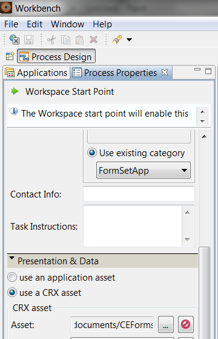
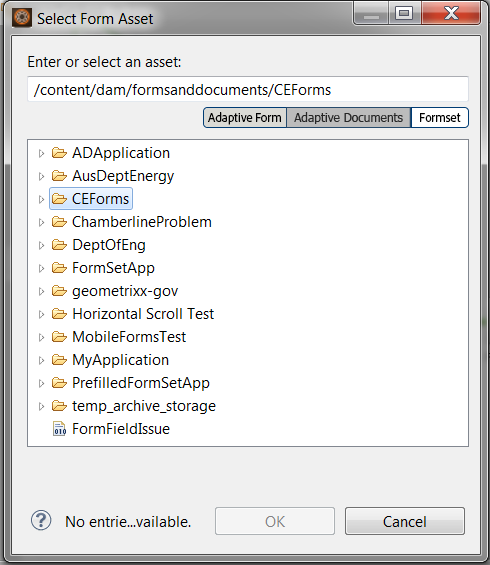

# Usar conjuntos de formularios en AEM Forms Workspace{#working-with-formsets-in-aem-forms-workspace}

Un conjunto de formularios es una colección de formularios HTML5 agrupados y presentados como un único conjunto de formularios para los usuarios finales. Cuando estos empiezan a rellenar un conjunto de formularios, pueden desplazarse de un formulario a otro sin problemas. El conjunto de formularios se puede enviar en un solo clic. Para obtener más información sobre los conjuntos de formularios y cómo configurarlos, consulte [Conjunto de formularios en AEM Forms](../../forms/using/formset-in-aem-forms.md).

AEM Forms Workspace admite conjuntos de formularios. Los conjuntos de formularios permiten agrupar varios formularios relacionados con un servicio o un proceso para automatizar un proceso empresarial y presentarlos a los usuarios finales. En este caso, los usuarios pueden rellenar todo el conjunto como un único formulario, y no es necesario archivar, enviar ni realizar un seguimiento de los formularios o procesos individuales.

## Adjuntar un conjunto de formularios a un punto de inicio en una aplicación de AEM Forms Workspace {#attaching-a-formset-to-startpoint-in-an-aem-forms-workspace-app-br}

1. Cree el flujo de trabajo del proceso empresarial en Workbench. Para obtener más información, consulte [la Ayuda de Workbench](https://www.adobe.com/go/learn_aemforms_workbench_63).
1. En las propiedades de proceso del punto de inicio, seleccione **Usar un recurso CRX** en Presentación y datos.

   

1. Haga clic en  (Examinar) junto a la ruta del recurso CRX. Aparecerá el cuadro de diálogo Seleccionar recurso de formulario.

   

1. Haga clic en la pestaña **Conjunto de formularios**, seleccione el conjunto de formularios correspondiente en la lista y, a continuación, haga clic en **Aceptar**.

1. Implemente la aplicación después de actualizar otras propiedades de proceso relevantes.

## Uso de conjuntos de formularios en AEM Forms Workspace {#using-formset-in-nbsp-aem-forms-workspace}

Una vez que se adjunta un conjunto de formularios a un punto de inicio, este puede invocarse como cualquier otro punto de inicio desde AEM Forms Workspace.

Las operaciones admitidas en los conjuntos de formularios a través de AEM Forms Workspace son:

* Guardar como borrador
* Bloquear
* Abandonar
* Enviar
* Añadir archivos adjuntos
* Agregar notas
* Desplazarse entre los formularios de un conjunto de formularios utilizando los botones Atrás o Siguiente

>[!NOTE]
>
>Para mejorar el rendimiento durante el desplazamiento entre los formularios de un conjunto de formularios, todos los botones del espacio de trabajo (Atrás, Siguiente, Guardar, Enviar y ... [Más]) se desactivan hasta que el formulario correspondiente termina de procesarse.
