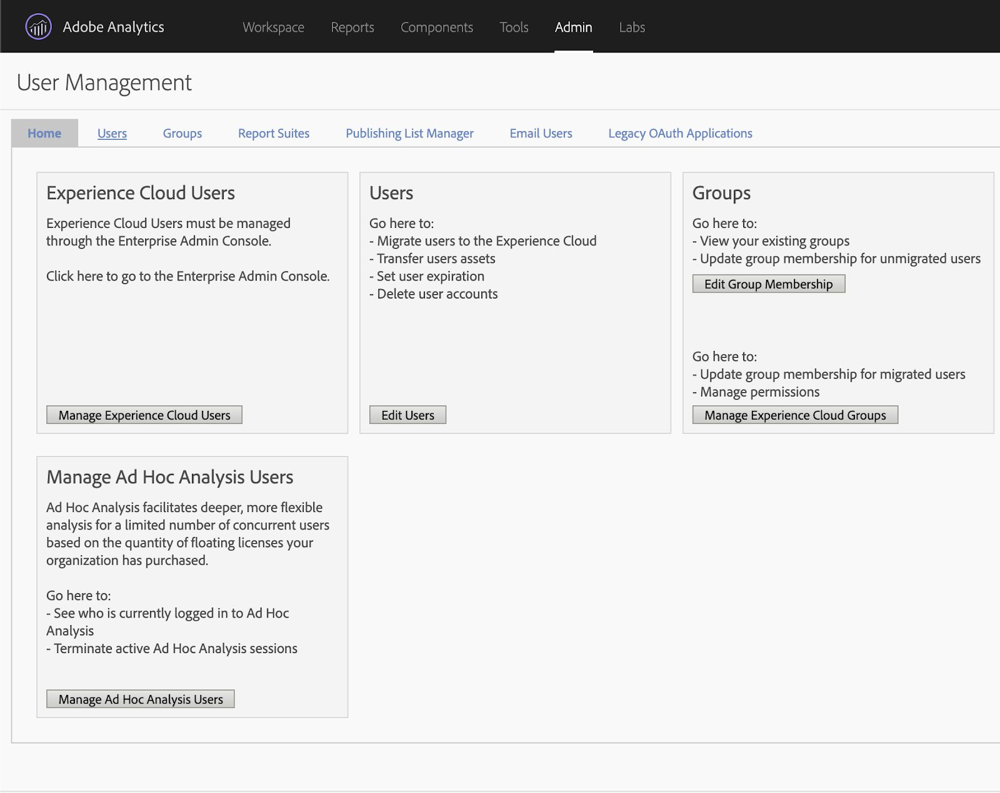

# Configure el sitio de referencia We.Gov y We-Finance {#set-up-and-configure-we-gov-reference-site}

## Detalles del paquete de demostración {#demo-package-details}

### Requisitos previos de instalación {#installation-prerequisites}

Este paquete se creó para el **autor de OSGI de AEM Forms 6.4**, se ha probado y, por lo tanto, es compatible con las siguientes versiones de plataforma:

| VERSIÓN DE AEM | VERSIÓN DEL PAQUETE DE AEM FORMS | ESTADO |
|---|---|---|
| 6.4 | 5.0.86 | **Compatibilidad** |
| 6.5 | 6.0.80 | **Compatibilidad** |
| 6.5.3 | 6.0.122 | **Compatibilidad** |

Este paquete contiene una configuración de nube compatible con las siguientes versiones de plataforma:

| PROVEEDOR DE SERVICIOS EN LA NUBE | VERSIÓN DEL SERVICIO | ESTADO |
|---|---|---|
| API | de Adobe Sign v5 | **Compatibilidad** |
| Microsoft® Dynamics 365 | 1710 (9.1.0.3020) | **Compatibilidad** |
| API de Rest | de Adobe Analytics v1.4 | **Compatibilidad** |

**Consideraciones sobre la instalación de paquetes:**

* Instale el paquete en un servidor limpio, sin otros paquetes de demostración o versiones de paquetes de demostración más antiguas.
* Instale el paquete en un servidor OSGI que se ejecute en el modo Autor.

### ¿Qué incluye este paquete? {#what-does-this-package-include}

El [paquete de demostración de We.Gov de AEM Forms](https://experience.adobe.com/#/downloads/content/software-distribution/en/aem.html?package=/content/software-distribution/en/details.html/content/dam/aem/public/adobe/packages/cq650/featurepack/we-gov-forms.pkg.all-2.0.2.zip) (**we-gov-forms.pkg.all-&lt;version>.zip**) se proporciona como un paquete que incluye varios subpaquetes y servicios. El paquete incluye los siguientes módulos:

* **we-gov-forms.pkg.all-&lt;version>.zip**: *el paquete de demostración completo*.

   * **we-gov-forms.ui.apps-&lt;version>.zip** *- Contiene todos los componentes, bibliotecas de cliente, usuarios de muestra, modelos de flujo de trabajo, etc.*

      * **we-gov-forms.core-&lt;version>.jar** - *Contiene todos los servicios OSGI, implementación de pasos de flujo de trabajo personalizado, etc.*

      * **we-gov-forms.derby&lt;version>.jar** - *Contiene todos los servicios OSGI, esquema de base de datos, etc.*

      * **core.wcm.components.all-2.0.4.zip**: *una recopilación de componentes WCM de muestra*.

      * **grid-aem.ui.apps-1.0-SNAPSHOT.zip**: *el paquete de diseño de AEM Sites Grid para controlar las columnas de las páginas de Sites*.

   * **we-gov-forms.ui.content-&lt;version>.zip** - *Contiene todo el contenido, páginas, imágenes, formularios, recursos de comunicaciones interactivas, etc.*

   * **we-gov-forms.ui.analytics-&lt;version>.zip**: *contiene todos los datos de Forms Analytics de We.Gov que se van a almacenar en el repositorio.*

   * **we-gov-forms.config.public-&lt;version>.zip** - *Contiene todos los nodos de configuración predeterminados, incluidas las configuraciones de nube de los marcadores de posición para evitar problemas relacionados con el modelo de datos de formulario y el enlace de servicio.*

Entre los recursos de este paquete se incluyen:

* Páginas de AEM Sites con plantillas editables
* Formularios adaptables de AEM Forms
* Comunicaciones interactivas de AEM Forms (canal de impresión y web)
* Documento de registro XDP de AEM Forms
* Modelo de datos de AEM Forms MS® Dynamics Forms
* Integración con Adobe Sign
* Modelo de flujo de trabajo de AEM
* Imágenes de muestra de AEM Assets
* Base de datos de Apache Derby de muestra (en memoria)
* Fuente de datos de Apache Derby (para usarla con el modelo de datos de formulario)

## Instalación del paquete de demostración {#demo-package-installation}

Esta sección contiene información sobre la instalación del paquete de demostración.

### De distribución de software {#from-software-distribution}

1. Abra [Distribución de software](https://experience.adobe.com/downloads). Necesitará un Adobe ID para iniciar sesión en la distribución de software.
1. Seleccione **[!UICONTROL Adobe Experience Manager]** disponible en el menú del encabezado.
1. En la sección **[!UICONTROL Filtros]**:
   1. Seleccione **[!UICONTROL Forms]** en la lista desplegable **[!UICONTROL Solución]**.
   2. Seleccione la versión y el tipo del paquete. También puede usar la opción **[!UICONTROL Buscar descargas]** para filtrar los resultados.
1. Seleccione el nombre del paquete **we-gov-forms.pkg.all-&lt;version>.zip**, seleccione **[!UICONTROL Aceptar términos de EULA]** y seleccione **[!UICONTROL Descargar]**.
1. Abra el [Administrador de paquetes](/help/sites-administering/package-manager.md) y haga clic en **[!UICONTROL Cargar paquete]** para cargar el paquete.
1. Seleccione el paquete y haga clic en **[!UICONTROL Instalar]**.

   

1. Permita que finalice el proceso de instalación.
1. Vaya a *https://&lt;aemserver>:&lt;port>/content/we-gov/home.html?wcmmode=disabled* para asegurarse de que la instalación se ha realizado correctamente.

### Desde un archivo ZIP local {#from-a-local-zip-file}

1. Descargue y busque el archivo **we-gov-forms.pkg.all-&lt;version>.zip**.
1. Vaya a *https://&lt;aemserver>:&lt;port>/crx/packmgr/index.jsp*.
1. Seleccione la opción &quot;Cargar paquete&quot;.

   

1. Utilice el explorador de archivos para buscar y seleccionar el archivo ZIP descargado.
1. Haga clic en &quot;Abrir&quot; para cargarlo.
1. Una vez cargado, seleccione la opción &quot;Instalar&quot; para instalar el paquete.

   

1. Permita que finalice el proceso de instalación.
1. Vaya a *https://&lt;aemserver>:&lt;port>/content/we-gov/home.html?wcmmode=disabled* para asegurarse de que la instalación se ha realizado correctamente.

### Instalación de nuevas versiones de paquetes {#installing-new-package-versions}

Para instalar la nueva versión del paquete, siga los pasos definidos en 4.1 y 4.2. Puede instalar una versión más reciente del paquete incluso si ya hay instalada una versión anterior. Sin embargo, Adobe recomienda desinstalar primero la versión del paquete anterior. Para ello, haga lo siguiente:

1. Vaya a *https://&lt;aemserver>:&lt;port>/crx/packmgr/index.jsp*.
1. Busque el archivo antiguo, **we-gov-forms.pkg.all-&lt;version>.zip**.
1. Seleccione la opción **Más**.
1. En el menú desplegable, seleccione la opción **Desinstalar**.

   

1. En la confirmación, vuelve a seleccionar **Desinstalar** y permite que se complete el proceso de desinstalación.

## Configuración del paquete de demostración {#demo-package-configuration}

Esta sección contiene detalles e instrucciones sobre la configuración posterior a la implementación del paquete de demostración antes de la presentación.

### Configuración de usuarios ficticios {#fictional-user-configuration}

1. Vaya a *https://&lt;aemserver>:&lt;port>/libs/granite/security/content/groupadmin.html*.
1. Inicie sesión como administrador para realizar las siguientes tareas.
1. Desplácese hacia abajo hasta el final de la página para cargar todos los grupos de usuarios.
1. Busque **flujo de trabajo**.
1. Seleccione el grupo **workflow-users** y haga clic en **Propiedades**.
1. Vaya a la pestaña Miembros.
1. En el campo **Seleccionar usuario o grupo**, escriba `wegov`.
1. Seleccione **Usuarios de Forms de We.Gov** en la lista desplegable.

   

1. Haga clic en **Guardar y cerrar** en la barra de menús.
1. Repita los pasos 2-7 buscando **analytics**, seleccionando el grupo **Administradores de Analytics** y agregando el grupo **Usuarios de Forms de We.Gov** como miembro.
1. Repita los pasos 2-7 buscando **usuarios de formularios**, seleccionando el grupo **usuarios avanzados de formularios** y agregando el grupo **Usuarios de Forms de We.Gov** como miembro.
1. Repita los pasos 2-7 buscando **forms-users**, seleccionando el grupo **forms-users** y agregando esta vez el grupo **Usuarios de We.Gov** como miembro.

### Configuración del servidor de correo electrónico {#email-server-configuration}

1. Revisión de la documentación de configuración [Configuración de notificaciones por correo electrónico](/help/sites-administering/notification.md)
1. Inicie sesión como administrador para realizar esta tarea.
1. Vaya a *https://&lt;aemserver>:&lt;port>/system/console/configMgr*.
1. Busque y haga clic en el servicio **Day CQ Mail Service** para configurarlo.

   

1. Configure el servicio para conectarse al servidor SMTP de su elección:

   1. **Nombre de host del servidor SMTP**: por ejemplo (smtp.gmail.com)
   1. **Puerto del servidor**: por ejemplo (465) para Gmail usando SSL
   1. **Nombre de usuario de SMTP:** demo@ &lt;companyname> .com.
   1. **Dirección desde**: aemformsdemo@adobe.com

   

1. Haga clic en **Guardar** para guardar la configuración.

### (Opcional) Configuración de SSL de AEM {#aemsslconfig}

Esta sección contiene detalles sobre la configuración de SSL de la instancia de AEM para poder establecer la configuración de Adobe Sign Cloud.

**Referencias:**

1. [SSL predeterminado](/help/sites-administering/ssl-by-default.md)

**Notas:**

1. Vaya a https://&lt;aemserver>:&lt;port>/aem/inbox, donde puede completar el proceso explicado en el vínculo de la documentación de referencia anterior.
1. El paquete `we-gov-forms.pkg.all-[version].zip` incluye una clave SSL de muestra y un certificado al que se puede acceder extrayendo la carpeta `we-gov-forms.pkg.all-[version].zip/ssl`, la cual forma parte del paquete.

1. Certificado SSL y datos de clave:

   1. emitido a &quot;CN=localhost&quot;
   1. 10 años de validez
   1. valor de contraseña de &quot;password&quot;

1. La clave privada es *localhostprivate.der*.
1. El certificado es *localhost.crt*.
1. Haga clic en **Siguiente**.
1. Establezca el nombre de host HTTPS en *localhost*.
1. Configure Puerto en un puerto que el sistema haya expuesto.

### (Opcional) Configuración en la nube de Adobe Sign {#adobe-sign-cloud-configuration}

Esta sección contiene detalles e instrucciones sobre la configuración en la nube de Adobe Sign.

**Referencias:**

1. [Integrar Adobe Sign con AEM Forms](adobe-sign-integration-adaptive-forms.md)

#### Configuración en la nube {#cloud-configuration}

1. Revise los requisitos previos. Consulte [Configuración de SSL de AEM](../../forms/using/forms-install-configure-gov-reference-site.md#aemsslconfig) para realizar la configuración de SSL necesaria.
1. Vaya a:

   *https://&lt;aemserver>:&lt;port>/libs/adobesign/cloudservices/adobesign.html/conf/we-gov*

   >[!NOTE]
   >
   >Para evitar problemas de configuración, asegúrese de que la URL utilizada para acceder al servidor de AEM coincida con la URL configurada en el URI de redireccionamiento de OAuth de Adobe Sign.
   >Por ejemplo, *https://&lt;aemserver>:&lt;port>/mnt/overlay/adobesign/cloudservices/adobesign/properties.html*

1. Seleccione la configuración de **We.gov Adobe Sign**.
1. Haga clic en **Propiedades**.
1. Desplácese hasta la pestaña &quot;Configuración&quot;.
1. Introduzca la URL de oAuth. Por ejemplo, `https://secure.na1.echosign.com/public/oauth` (solo con fines ilustrativos).
1. Proporcione el ID de cliente y el Secreto de cliente establecidos en la instancia de Adobe Sign que ha configurado.
1. Haga clic en **Conectar con Adobe Sign**.
1. Una vez que la conexión se haya realizado correctamente, haga clic en **Guardar y cerrar** para completar la integración.

### (Opcional) Configuración en la nube de MS® Dynamics {#ms-dynamics-cloud-configuration}

Esta sección contiene detalles e instrucciones sobre la configuración en la nube de MS® Dynamics.

**Referencias:**

1. [Microsoft](/help/forms/using/ms-dynamics-odata-configuration.md)
1. [Configuración de Microsoft® Dynamics para AEM Forms](https://experienceleague.adobe.com/es/docs/experience-manager-learn/forms/adaptive-forms/using-ms-dynamics-with-aem-forms#)

#### Servicio en la nube de OData de MS® Dynamics {#ms-dynamics-odata-cloud-service}

1. Vaya a:

   https://&lt;aemserver>:&lt;port>/libs/fd/fdm/gui/components/admin/fdmcloudservice/fdm.html/conf/we-gov

   1. Asegúrese de que accede al servidor utilizando la misma URL de redireccionamiento configurada en el registro de la aplicación MS® Dynamics.

1. Seleccione la configuración &quot;Microsoft® Dynamics OData Cloud Service&quot;.
1. Haga clic en **Propiedades**.

   

1. Vaya a la pestaña &quot;Configuración de autenticación&quot;.
1. Introduzca la siguiente información:

   1. **Raíz de servicio:** por ejemplo, `https://msdynamicsserver.api.crm3.dynamics.com/api/data/v9.1/`
   1. **Tipo de autenticación:** OAuth 2.0.
   1. **Configuración de autenticación** (consulte [Configuración en la nube de MS® Dynamics](../../forms/using/forms-install-configure-gov-reference-site.md#dynamicsconfig) para recopilar esta información):

      1. ID de cliente (también denominado ID de aplicación)
      1. Secreto de cliente
      1. URL de OAuth: por ejemplo, [https://login.microsoftonline.com/common/oauth2/authorize](https://login.microsoftonline.com/common/oauth2/authorize)
      1. Actualizar URL del token: por ejemplo, [https://login.windows.net/common/oauth2/token](https://login.windows.net/common/oauth2/token)
      1. URL de token de acceso: por ejemplo, [https://login.windows.net/common/oauth2/token](https://login.windows.net/common/oauth2/token)
      1. Ámbito de autorización: **openid**.
      1. Encabezado de autenticación: **Portador de autorización**.
      1. Recurso: por ejemplo, `https://msdynamicsserver.api.crm3.dynamics.com`

   1. Haga clic en C **Conectarse a OAuth**.

1. Tras autenticarse correctamente, haga clic en **Guardar y cerrar** para completar la integración.

#### Configuración en la nube de MS® Dynamics {#dynamicsconfig}

Los pasos detallados en esta sección se incluyen para ayudarle a localizar el ID de cliente, el secreto de cliente y los detalles de la instancia en la nube de MS® Dynamics.

1. Vaya a [https://portal.azure.com/](https://portal.azure.com/) e inicie sesión.
1. En el menú de la izquierda, seleccione **Todos los servicios**.
1. Busque o vaya a **Registro de aplicación**.
1. Cree o seleccione un registro de aplicación existente.
1. Copie el **ID de aplicación** para su uso como **ID de cliente** de OAuth en la configuración en la nube de AEM.
1. Haga clic en **Configuración** o **Manifiesto** para configurar las **URL de respuesta.**

   1. Esta URL debe coincidir con la URL utilizada para acceder al servidor de AEM al configurar el servicio de OData.

1. En la vista Configuración, haga clic en **Claves** para ver una clave nueva (utilizada como Secreto de cliente en AEM ).

   1. Asegúrese de conservar una copia de la clave; no puede verla más adelante en Azure o AEM.

1. Para localizar la URL del recurso o la URL raíz del servicio, vaya al panel de instancias de MS® Dynamics.
1. En la barra de navegación superior, haz clic en **Ventas** o en tu propio tipo de instancia y luego en **Seleccionar configuración**.
1. Cerca de la parte inferior derecha, haz clic en **Personalizaciones** y **Recursos para desarrolladores**.
1. Busque la URL raíz del servicio. Por ejemplo,

   `https://msdynamicsserver.api.crm3.dynamics.com/api/data/v9.1/`

1. Encontrará detalles sobre la URL del token de actualización y acceso en los siguientes enlaces:

   [https://learn.microsoft.com/en-us/rest/api/datacatalog/authenticate-a-client-app](https://learn.microsoft.com/en-us/rest/api/datacatalog/authenticate-a-client-app)

#### Prueba del modelo de datos de Forms (Dynamics) {#testing-the-form-data-model}

Una vez completada la configuración en la nube, es posible que desee probar el modelo de datos de formulario.

1. Vaya a

   *https://&lt;aemserver>:&lt;port>/aem/forms.html/content/dam/formsanddocuments-fdm/we-gov*.

1. Seleccione el **We.gov FDM** de Microsoft® Dynamics CRM y seleccione **Propiedades**.

   

1. Vaya a la pestaña **Actualizar fuente**.
1. Asegúrese de que la **configuración según el contexto** está establecida en `/conf/we-gov` y que el origen de datos configurado es `ms-dynamics-odata-cloud-service`.

   

1. Edite el modelo de datos de formulario.

1. Pruebe los servicios para asegurarse de que se conectan correctamente a la fuente de datos configurada.

   >[!NOTE]
   >
   >Después de probar los servicios, haga clic en **Cancelar** para asegurarse de que los cambios involuntarios no se propagan al modelo de datos de formulario.

   >[!NOTE]
   >
   >Se ha informado de que era necesario reiniciar el servidor de AEM para que la fuente de datos se enlace correctamente al FDM

   >[!NOTE]
   >
   >Adobe recomienda usar el comando `Ctrl + C` para reiniciar SDK. Reinicio de AEM SDK mediante métodos alternativos. Por ejemplo, detener los procesos de Java puede provocar incoherencias en el entorno de desarrollo de AEM.

#### Prueba del modelo de datos de Forms (Derby) {#test-fdm-derby}

Una vez completada la configuración en la nube, es posible que desee probar el modelo de datos de Forms.

1. Vaya a *https://&lt;aemserver>:&lt;port>/aem/forms.html/content/dam/formsanddocuments-fdm/we-gov*.

1. Seleccione el **FDM de solicitud de We.gov** y luego seleccione **Propiedades**.

   

1. Vaya a la pestaña **Actualizar fuente**.

1. Asegúrese de que la **Configuración según el contexto** está establecida en `/conf/we-gov` y que la fuente de datos configurada es **We.Gov Derby DS**.

   

1. Haga clic en **Guardar y cerrar**.

1. [Prueba de los servicios](work-with-form-data-model.md#test-data-model-objects-and-services) para asegurarse de que se conectan correctamente a la fuente de datos configurada

   * Para probar la conexión, seleccione **HOMEMORTGAGEACCOUNT** y asígnele un servicio Get-Service. Pruebe que los administradores del sistema y del servicio pueden ver los datos que se recuperan.

### Configuración de Adobe Analytics (opcional) {#adobe-analytics-configuration}

Esta sección contiene detalles e instrucciones sobre la configuración en la nube de Adobe Analytics.

**Referencias:**

* [Integración con Adobe Analytics](../../sites-administering/adobeanalytics.md)

* [Conectarse a Adobe Analytics y crear marcos](../../sites-administering/adobeanalytics-connect.md)

* [Visualización de datos de análisis de la página](../../sites-authoring/pa-using.md)

* [Configuración de análisis e informes](configure-analytics-forms-documents.md)

* [Ver y comprender los informes de análisis de AEM Forms](view-understand-aem-forms-analytics-reports.md)

### Configuración del servicio de Adobe Analytics Cloud {#adobe-analytics-cloud-service-configuration}

Este paquete está preconfigurado para conectarse a Adobe Analytics. Se proporcionan los pasos siguientes para permitir que esta configuración se actualice.

1. Vaya a *https://&lt;aemserver>:&lt;port>/libs/cq/core/content/tools/cloudservices.html*.
1. Busque la sección Adobe Analytics y seleccione el vínculo &quot;Mostrar configuraciones&quot;.
1. Seleccione la configuración &quot;We.Gov Adobe Analytics (Analytics Configuration)&quot;.

   

1. Haga clic en el botón &quot;Editar&quot; para actualizar la configuración de Adobe Analytics (debe proporcionar el Secreto compartido). Haga clic en &quot;Conectarse a Analytics&quot; para conectarse y en &quot;Aceptar&quot; para completar el proceso.

   

1. En la misma página, haga clic en &quot;We.Gov Adobe Analytics Framework (Analytics Framework)&quot; si desea actualizar las configuraciones del marco de trabajo (consulte [Habilitar la creación de AEM](../../forms/using/forms-install-configure-gov-reference-site.md#enableauthoring) para habilitar la creación).

#### Búsqueda de credenciales de usuario en Adobe Analytics {#analytics-locating-user-credentials}

Busque las credenciales de usuario para una cuenta de Adobe Analytics que el administrador de cuentas debe realizar para realizar las siguientes tareas.

1. Vaya al portal de Adobe Experience Cloud.
Inicie sesión con sus credenciales de administrador.
1. Seleccione el icono de Adobe Analytics en el panel de control principal.
   
1. Vaya a la pestaña Administración y seleccione el elemento Administración de usuarios (heredado).
   
1. Seleccione la pestaña **Usuarios**.
   
1. Seleccione el usuario que desee en la lista de usuarios.
1. Desplácese hasta la parte inferior de la página y la información de autenticación de los usuarios aparecerá en la parte inferior de la página.
   
1. La información de nombre de usuario y secreto compartido aparece a la derecha del cuadro de permisos.
1. El nombre de usuario incluye dos puntos en el nombre. Toda la información a la izquierda de los dos puntos es el nombre de usuario, y toda la información a la derecha de los dos puntos es el nombre de la compañía, como en el siguiente ejemplo:

   *nombre de usuario : nombre de empresa*

#### Configuración de la autenticación de usuarios en Adobe Analytics {#setup-user-authentication}

Los administradores pueden proporcionar a los usuarios permisos de análisis de AEM realizando las siguientes acciones.

1. Vaya a Adobe Admin Console.

1. Haga clic en la instancia de Analytics que se expone a Admin Console.

   Se encuentra en la página principal de la página de administración.

1. Seleccione Acceso de administrador completo de Analytics.

1. Agregue un usuario al perfil.

   

1. Haga clic en la pestaña Permisos una vez que el ID de usuario se haya asignado al perfil.

1. Asegúrese de que todos los permisos estén asignados al perfil.

   

1. Una vez asignados los permisos, la capacidad de un usuario para iniciar sesión puede tardar unas horas.

### Informes de Adobe Analytics {#adobe-analytics-reporting}

#### Ver informes de sitios de Adobe Analytics {#view-adobe-analytics-sites-reporting}

>[!NOTE]
>
>Si instala el paquete `we-gov-forms.ui.analytics-<version>.zip`, los datos de AEM Forms Analytics estarán disponibles sin conexión o sin una configuración de Adobe Analytics Cloud. Los datos de AEM Sites requieren una configuración activa en la nube.

1. Vaya a *https://&lt;aemserver>:&lt;port>/sites.html/content*
1. Seleccione el **sitio de We.Gov de AEM Forms** para ver las páginas del sitio.
1. Seleccione una de las páginas del sitio (por ejemplo, Inicio) y elija **Analytics &amp; Recommendations**.

   

1. En esta página, verá información recuperada de Adobe Analytics. La información pertenece a la página de AEM Sites. Por diseño, esta información se actualiza periódicamente desde Adobe Analytics y no se muestra en tiempo real.

   

1. Cuando vuelva a la página de la vista de página (a la que se accede en el paso 3), también podrá ver la información de la vista de página cambiando la configuración de visualización para ver los elementos en **Vista de lista**.
1. Busque el menú desplegable &quot;Vista&quot; y seleccione **Vista de lista**.

   

1. En el mismo menú, seleccione **Configuración de vista** y las columnas que desee mostrar en la sección **Analytics**.

   

1. Haga clic en **Actualizar** para que las columnas nuevas estén disponibles.

   

#### Ver informes de Adobe Analytics {#view-adobe-analytics-forms-reporting}

>[!NOTE]
>
>Los datos de AEM Forms Analytics están disponibles sin conexión o sin una configuración de Adobe Analytics Cloud. Esta capacidad es verdadera si el paquete `we-gov-forms.ui.analytics-<version>.zip` está instalado. Sin embargo, los datos de AEM Sites requieren una configuración activa en la nube.

1. Vaya a

   *https://&lt;aemserver>:&lt;port>/aem/forms.html/content/dam/formsanddocuments/adobe-gov-forms*.

1. Seleccione el formulario adaptable &quot;Solicitud de prestación sanitaria&quot; y luego seleccione la opción &quot;Informe de Analytics&quot;.

   

1. Espere a que se cargue la página y vea los datos del informe de Analytics.

   

### Habilitación de la configuración de formularios automatizados de Adobe {#automated-forms-enablement}

Para instalar y configurar AEM Forms con Adobe Forms, los usuarios de la herramienta de conversión deben tener lo siguiente:

1. Acceso a Adobe Developer.

1. Permiso para crear una integración con el servicio de conversión de Forms de Adobe.

1. El último Service Pack de Adobe AEM 6.5, ejecutado como autor.

Revise lo siguiente antes de leer más instrucciones:

* [Configurar el servicio de conversión automatizada de formularios](https://experienceleague.adobe.com/es/docs/aem-forms-automated-conversion-service/using/configure-service#)

#### Creación de una configuración de IMS: parte 1 {#creating-ims-config}

Configure el servicio para que se comunique correctamente con la herramienta de conversión de formularios. Los usuarios deben configurar el servicio Identity Management System (IMS) para poder registrarse en Adobe I/O.

1. Vaya a https://&lt;aemserver>:&lt;port>. Haga clic en Adobe Experience.
Responsable en la parte superior izquierda > Herramientas > Seguridad > Configuración de Adobe IMS.

1. Haga clic en Crear.

1. Realice las acciones que aparecen en la siguiente imagen.

   

1. Asegúrese de descargar el certificado.

1. No continúe con el resto de la configuración: revise la sección [Creación de la integración en Adobe I/O](#create-integration-adobeio).

>[!NOTE]
>
>El certificado creado en esta sección se utilizará para crear el servicio de integración en Adobe I/O. Cuando los usuarios hayan creado el servicio de integración, podrán utilizar esa información de Adobe I/O para finalizar la configuración.

#### Creación de la integración en Adobe I/O {#create-integration-adobeio}

Asegúrese de que puede crear una integración dentro de su dominio de Adobe si no se pone en contacto con el administrador del sistema para hacerlo.

1. Vaya a [Adobe Developer Console](https://developer.adobe.com/console/).

1. Haga clic en **Crear integración**.

1. Seleccione **Acceder a una API**.

1. Asegúrese de que está en el grupo correcto (lista desplegable superior derecha).

1. En la sección Experience Cloud, seleccione la herramienta de conversión de Forms.

1. Haga clic en **Continuar**.

1. Introduzca el nombre y la descripción de la integración.

1. Si utiliza la clave pública de la sección 2.1, colóquela dentro de la integración de la clave.

1. Seleccione un perfil para la conversión de formularios automatizada.

   

#### Creación de una configuración de IMS, parte 2 {#create-ims-config-part-next}

Ahora que ha creado una integración, permítanos completar la instalación de la configuración de IMS.

1. Haga clic en la integración en Adobe I/O para mostrar los detalles de la conexión.

1. Vaya a la configuración de IMS en AEM (**Herramientas** > **Seguridad** > **IMS**)

1. Haga clic en **Siguiente** en la pantalla de configuración de IMS.

1. Introduzca el servidor de autorización (valor mostrado en la captura de pantalla).

1. Introduzca la clave de la API.

1. Escriba el secreto de cliente (haga clic en **Exponer** en la integración de Adobe I/O para mostrarlo).

1. Haga clic en la pestaña JWT en Adobe I/O para obtener la carga útil de JWT y pegarla en la carga útil de la configuración de IMS.

   

1. Una vez creada, haga clic en la configuración de IMS y seleccione Comprobación de estado. Los usuarios deben ver el siguiente resultado.

   

#### Configuración en la nube (producción de AFC de We.Gov) {#configure-cloud-configuration}

Una vez completada la configuración de IMS, puede proceder a revisar la configuración en la nube en AEM. Si la configuración no existe, siga estos pasos para crear la configuración en la nube en AEM:

1. Abra el explorador y vaya a la URL del sistema https://&lt;domain_name>:&lt;system_port>.

1. Haga clic en Adobe Experience Manager en la esquina superior izquierda de la pantalla > Herramientas > Cloud Services > Configuración de la conversación automatizada de Forms.

1. Seleccione la carpeta de configuración en la que desea colocar la configuración.

1. Haga clic en Crear.

1. Introduzca la información que aparece en la siguiente captura de pantalla.

   

1. Proporcione un Título y un Nombre a la configuración.

1. La dirección URL de servicio del sistema está establecida en `https://aemformsconversion.adobe.io/`.

1. URL de plantilla: */conf/we-gov/settings/wcm/templates/we-gov-flamingo-template*.

1. URL del tema: */content/dam/formsanddocuments-themes/adobe-gov-forms-themes/we-gov-theme*.

1. Haga clic en Siguiente.

1. Para esta configuración, los dos valores de la casilla de verificación quedaron vacíos.

   Para obtener más información sobre estas opciones, consulte [Configurar el servicio en la nube](https://experienceleague.adobe.com/es/docs/aem-forms-automated-conversion-service/using/configure-service#configure-the-cloud-service).

#### Configurar la configuración de nube (producción de AFC de `We.Finance`) {#configure-cloud-configuration-wefinance}

Una vez completada la configuración de IMS, puede continuar con la creación de la configuración en la nube en AEM.

1. Abra el explorador y vaya a la URL del sistema https://&lt;domain_name>:&lt;system_port>.

1. Haga clic en Adobe Experience Manager en la esquina superior izquierda de la pantalla > Herramientas > Cloud Services > Configuración de la conversación automatizada de Forms.

1. Seleccione la carpeta de configuración en la que desea colocar la configuración.

1. Haga clic en **Crear**.

1. Introduzca la información que aparece en la siguiente captura de pantalla.

   

1. Proporcione un Título y un Nombre a la configuración.

1. La URL de servicio del sistema se ha establecido en `https://aemformsconversion.adobe.io/`

1. URL de plantilla: */conf/we-finance/settings/wcm/templates/we-finance-adaptive-form*.

1. Dirección URL del tema: */content/dam/formsanddocuments-themes/adobe-finance-forms-themes/we-finance-theme*.

1. Haga clic en **Siguiente**.

1. Para esta configuración, los dos valores de la casilla de verificación quedaron vacíos.

   * Para obtener más información sobre estas opciones, consulte [Configuración del servicio en la nube](https://experienceleague.adobe.com/es/docs/aem-forms-automated-conversion-service/using/configure-service#configure-the-cloud-service).

#### Prueba de la conversión de formularios (Solicitud de We.Gov) {#test-forms-conversion}

Una vez establecida la configuración, los usuarios pueden probarla cargando un documento de PDF.

1. Vaya al sistema de AEM en https://&lt;domain_name>:&lt;system_port>.

1. Haga clic en **Forms** > **Forms y documentos** > **AEM Forms We.gov Forms** > **AFC**.

1. Seleccione el PDF de la solicitud de We.Gov.

1. Haga clic en **Iniciar conversión automatizada** en la esquina superior derecha.

1. Los usuarios pueden ver la opción como se muestra a continuación.

   

1. Una vez seleccionado el botón, los usuarios aparecen con las siguientes opciones:

   * Asegúrese de que los usuarios seleccionen la configuración *Producción de AFC de We.Gov*

   

   

1. Seleccione Iniciar conversión después de haber configurado todas las opciones que desee utilizar.

1. Cuando comienza el proceso de conversión, los usuarios ven lo siguiente:

   

1. Cuando finalice la conversión, los usuarios verán lo siguiente:

   

   Haga clic en la carpeta **Output** para ver el formulario adaptable generado.

#### Problemas conocidos y notas {#known-issues-notes}

El servicio de conversión de formularios automatizada incluye una serie de [prácticas recomendadas, patrones complejos conocidos](https://experienceleague.adobe.com/es/docs/aem-forms-automated-conversion-service/using/styles-and-pattern-considerations-and-best-practices#) y [problemas conocidos](https://experienceleague.adobe.com/es/docs/aem-forms-automated-conversion-service/using/known-issues#). Revise esta información antes de empezar a utilizar el servicio de conversión automatizada de formularios de AEM Forms.

1. Cree el formulario con la opción Generar formularios adaptables sin enlaces de datos habilitados si desea enlazar el formulario a un FDM después de la conversión.

1. Asegúrese de que la carpeta de plantillas tenga habilitado el permiso `jcr:read` para todos. Si no se establece el permiso, el usuario de servicio no puede leer la plantilla del repositorio y se produce un error en la conversión.

## Personalizaciones del paquete de demostración {#demo-package-customizations}

Esta sección contiene instrucciones sobre cómo personalizar la demostración.

### Personalización de plantillas {#templates-customization}

Encontrará plantillas editables en la siguiente ubicación:

*https://&lt;aemserver>:&lt;port>/libs/wcm/core/content/sites/templates.html/conf/we-gov*.

Estas plantillas incluyen las plantillas de AEM Sites, formularios adaptables y comunicaciones interactivas, creadas y ensambladas con componentes que se pueden encontrar en

*https://&lt;aemserver>:&lt;port>/crx/de/index.jsp#/apps/we-gov/components*.

#### Sistema de estilos {#customizetemplates}

Este sitio también incluye bibliotecas de cliente, una de las cuales importa Bootstrap 4 ([https://getbootstrap.com/](https://getbootstrap.com/)). Esta biblioteca de cliente está disponible en

*https://&lt;aemserver>:&lt;port>/crx/de/index.jsp#/apps/we-gov/clientlibs/clientlib-base/css/bootstrap*.

Las plantillas editables incluidas en este paquete también vienen preconfiguradas con políticas de plantilla/página que utilizan las clases CSS de Bootstrap 4 para la paginación, el estilo, etc. No todas las clases se han agregado a las directivas de plantilla, pero cualquier clase compatible con Bootstrap 4 se puede agregar a las directivas. Para obtener una lista de las clases disponibles, consulte lo siguiente:

[https://getbootstrap.com/docs/4.1/getting-started/introduction/](https://getbootstrap.com/docs/4.1/getting-started/introduction/)

Las plantillas incluidas en este paquete también son compatibles con el sistema de estilos:

[Sistema de estilos](../../sites-authoring/style-system.md)

#### Logotipos de plantilla {#template-logos}

Los recursos DAM del proyecto también incluyen logotipos e imágenes de We.Gov. Estos recursos están disponibles en:

*https://&lt;aemserver>:&lt;port>/assets.html/content/dam/we-gov*

Cuando edite las plantillas de formularios y páginas, puede actualizar los logotipos de marca editando los componentes Navegación y Pie de página. Estos componentes ofrecen una marca y un cuadro de diálogo de logotipo configurables que se pueden utilizar para actualizar los logotipos:

Consulte Edición del contenido de una página para obtener más información:

[Edición del contenido de una página](../../sites-authoring/editing-content.md)

### Personalización de páginas de Sites {#sites-pages-customization}

Todas las páginas del sitio están disponibles en *https://&lt;aemserver>:&lt;port>/sites.html/content/we-gov*.

Estas páginas de Sites también utilizan el paquete AEM Grid para controlar el diseño de algunos componentes.

#### Sistema de estilos {#style-system}

Las páginas incluidas en este paquete también son compatibles con el sistema de estilos:

[Sistema de estilos](../../sites-authoring/style-system.md)

Consulte también [Sistema de estilos de personalización de plantillas](../../forms/using/forms-install-configure-gov-reference-site.md#customizetemplates) para obtener información sobre los estilos admitidos.

### Personalización de formularios adaptables {#adaptive-forms-customization}

Todos los formularios adaptables están disponibles en:

*https://&lt;aemserver>:&lt;port>/aem/forms.html/content/dam/formsanddocuments/adobe-gov-forms*.

Puede personalizar estos formularios para adaptarlos a determinados casos de uso. No edite ciertos campos y la lógica de envío para asegurarse de que el formulario sigue funcionando correctamente, como los siguientes:

**Solicitud de prestación sanitaria:**

* contact_id: un campo oculto utilizado para recibir el ID de contacto de MS® Dynamics durante el envío.
* Enviar: la lógica del botón de envío requiere personalización para admitir devoluciones de llamada. La documentación describe la personalización. Sin embargo, debe escribir un script de gran tamaño para enviar el formulario y realizar las operaciones `POST` y `GET` en MS® Dynamics a través del modelo de datos de Forms.
* Panel raíz: el evento Initialize se utiliza para añadir un botón de MS® Dynamics a la bandeja de entrada de AEM de la forma menos intrusiva posible, ya que ninguno de los componentes de la interfaz de usuario Granite de la bandeja de entrada de AEM se puede modificar.

#### Estilo de los formularios adaptables {#adaptive-form-styling}

Los formularios adaptables también se pueden diseñar con el Editor de estilos o el Editor de temáticas:

* [Aplicar estilos dentro de la línea a los componentes de un formulario adaptable](inline-style-adaptive-forms.md)
* [Crear y usar temáticas](themes.md)

### Personalización del flujo de trabajo {#workflow-customization}

El Forms adaptable de solicitud se envía a un flujo de trabajo OSGI para su procesamiento. Este flujo de trabajo se encuentra en *https://&lt;aemserver>:&lt;port>/conf/we-gov/settings/models/we-gov-process.html*.

Debido a ciertas limitaciones, este flujo de trabajo contiene varios scripts y pasos personalizados del proceso de flujo de trabajo OSGI. Estos pasos del flujo de trabajo se crearon como pasos genéricos y no incluyen cuadros de diálogo de configuración. Actualmente, la configuración de los pasos del flujo de trabajo depende de los argumentos del proceso.

Todo el código Java™ de los pasos del flujo de trabajo se encuentra en el paquete **we-gov-forms.core-&lt;version>.jar**.

## Consideraciones sobre la demostración y problemas conocidos {#demo-considerations-and-known-issues}

Esta sección contiene información sobre las funciones de la demostración y las decisiones de diseño que pueden requerir consideraciones especiales durante el proceso de demostración.

### Consideraciones sobre la demostración {#demo-considerations}

* Según lo establecido en el punto AGRS-159, asegúrese de que el nombre (primer nombre, segundo y apellido) del contacto utilizado en el formulario adaptable de solicitud sea único.
* El formulario adaptable de solicitud envía el correo electrónico de Adobe Sign al correo electrónico especificado en el campo de correo electrónico del formulario. Esa dirección de correo electrónico no puede ser la misma dirección de correo electrónico que el correo electrónico utilizado para configurar Adobe Sign Cloud.

### Problemas conocidos {#known-issues}

* (AGRS-120) Actualmente, el componente Navegación de sitios no admite páginas secundarias anidadas con una profundidad de más de dos niveles.
* (AGRS-159) El FDM actual de MS® Dynamics debe realizar dos operaciones: primero, PUBLICAR los datos del formulario adaptable de solicitud en Dynamics y, a continuación, recuperar el registro de usuario para recuperar el ID de contacto. En su estado actual, se produce un error al recuperar el ID de contacto si hay más de dos usuarios con el mismo nombre en Dynamics, lo que no permite que se envíe el formulario adaptable de solicitud.

## Configuración de pruebas de accesibilidad {#configure-accessibility-testing}

### Habilitación del complemento de pruebas de accesibilidad de Chrome {#enable-chrome-add-on}

Para realizar pruebas de accesibilidad, instale el complemento de Chrome que se encuentra aquí en `https://chrome.google.com/webstore/detail/accessibility-developer-t/fpkknkljclfencbdbgkenhalefipecmb?hl=en`. <!-- This URL is a 404. As such, fix and update this entire topic. We ought not to be writing about third-party software that we have no control over to avoid these 404s. Consider making this topic entirely generic and leaving it up to the user to choose their own Accessibility Testing add-on. -->

Una vez instalado, cargue la página que desee probar en el explorador Chrome. Si tiene varias pestañas abiertas, puede afectar a la puntuación. Como tal, es preferible tener una sola pestaña abierta. Una vez cargada la página, **haga clic con el botón derecho** en ella y seleccione la pestaña **Auditorías**. Aquí, los desarrolladores seleccionan el tipo de auditoría que realiza el complemento Accesibilidad. Una vez seleccionadas las opciones deseadas, el usuario hace clic en **Generar informe** para crear un documento de PDF. El PDF muestra la clasificación de accesibilidad general y qué se puede utilizar para aumentar dicha clasificación.

Una vez ejecutado el informe, los usuarios podrán ver lo siguiente:

El número que se muestra a los usuarios es la clasificación de accesibilidad general que han obtenido. A continuación, aparece también una descripción de cómo ha calculado esta clasificación.

Si desea exportar estos datos, haga clic en los tres botones a la derecha de la pantalla y seleccione una de las opciones disponibles.

### Tema Ultramarino {#ultramarine-theme}

El tema Ultramarino, de acceso público y mantenido por Adobe, está integrado en el archivo ZIP instalable
`we-gov-forms.pkg.all-<version>.zip`. Este paquete se instala con CRX.

Los usuarios del Administrador de paquetes pueden acceder al tema Ultramarino en AEM Forms navegando hasta **Forms** > **Temas** > **Temas de referencia** > **Ultramarino-Accesible**.

## Opciones de configuración {#configuration-options}

Los usuarios pueden configurar varias opciones de servicio de flujo de trabajo, incluidas las siguientes:

1. Entrada de Microsoft® Dynamics
1. Adobe Sign
1. Administración de comunicaciones personalizadas de AEM
1. Adobe Analytics

Para configurarlos para que se activen en el flujo de trabajo, los usuarios deben realizar las siguientes tareas.

1. Vaya a https://&#39;[server]:[port]&#39;/system/console/configMgr.

1. Busque las *Configuraciones de WeGov*.

1. Abra la definición del servicio y habilite los servicios seleccionados para que se invoquen en el flujo de trabajo.

   >[!NOTE]
   >
   >Aunque un usuario habilite el servicio en la página Administrador de configuración, tendrá que establecer una configuración de servicio para comunicarse con los servicios externos solicitados.

   

1. Una vez finalizado, haga clic en Guardar para guardar la configuración.

## Pasos siguientes {#next-steps}

Está configurado para explorar el sitio de referencia de We.Gov. Para obtener más información sobre los pasos y el flujo de trabajo del sitio de referencia de We.Gov, consulte [Tutorial del sitio de referencia de We.Gov](../../forms/using/forms-gov-reference-site-user-demo.md).
