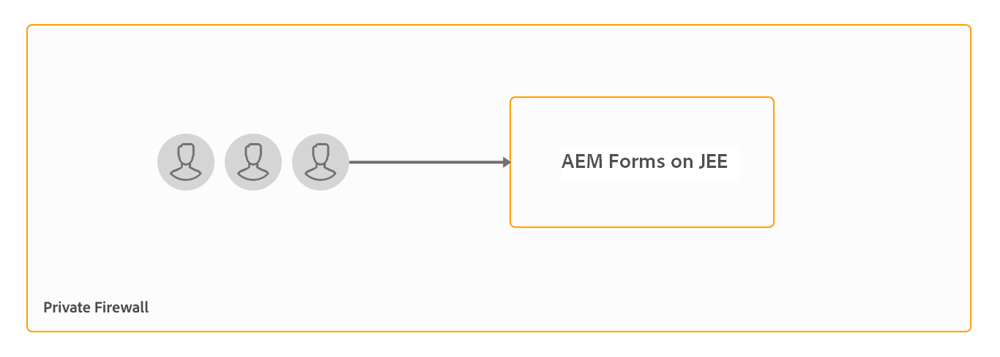
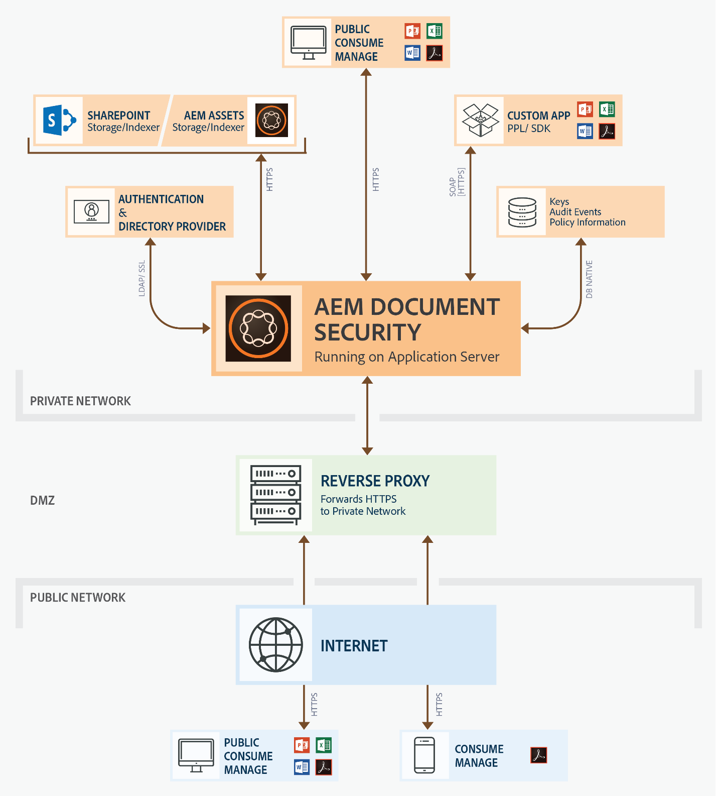

# Instalación y configuración del servidor de Document Security {#installing-and-configuring-the-document-security-server}

Utilice Document Security para distribuir de forma segura cualquier tipo de información guardada en un formato compatible. Solo los usuarios autorizados pueden acceder a los documentos protegidos.

Adobe Experience Manager Forms Document Security garantiza que solo los usuarios autorizados puedan utilizar sus documentos. Con Document Security, puede distribuir de forma segura cualquier tipo de información guardada en un formato compatible. Los formatos de archivo admitidos son Adobe Portable Document Format (PDF) y Microsoft Word, Excel y PowerPoint.

Puede proteger los documentos mediante políticas. La configuración especificada en una política determina cómo puede el destinatario utilizar un documento al que se aplica la política. Por ejemplo, puede especificar si los destinatarios pueden imprimir o copiar texto, editarlo o agregar firmas y comentarios a documentos protegidos.

Las políticas se almacenan en el servidor de Document Security y se aplican a los documentos a través de la aplicación cliente. Cuando aplica una política a un documento, la configuración de confidencialidad especificada en la política protege la información que contiene el documento. Puede distribuir los documentos protegidos por una política a los destinatarios autorizados por esta.

Document Security también permite a los clientes, los visualizadores y los indexadores proteger los documentos y visualizar e indexar los documentos protegidos. Para obtener información detallada sobre Document Security, consulte [Acerca de la seguridad de los documentos](/help/forms/using/admin-help/document-security.md).

## Topología de implementación  {#deployment-topology}

La funcionalidad Document Security solo está disponible en AEM Forms en JEE. Necesita una sola instancia de AEM Forms en JEE. También puede crear un clúster o una granja de servidores de AEM Forms, si es necesario. A continuación, encontrará una topología de carácter orientativo para ejecutar la capacidad Document Security. Para obtener información detallada sobre la topología, consulte [Arquitectura y topologías de implementación para AEM Forms](aem-forms-architecture-deployment.md).

<!--fix above link-->

En el siguiente diagrama se muestra la arquitectura típica de la seguridad de los documentos de AEM Forms:

## Instalación de AEM Forms en JEE {#installing-aem-forms-on-jee}

Siga estos pasos para instalar y configurar AEM Forms en JEE:

1. Descargue el programa de instalación de AEM 6.5 de Forms en JEE desde el [Sitio web de licencias de Adobe (LWS)](https://licensing.adobe.com/). Necesita un contrato de mantenimiento y soporte válido para descargar el programa de instalación.
1. Lea el [documento Plataformas compatibles con AEM Forms en JEE](/help/forms/using/aem-forms-jee-supported-platforms.md) y asegúrese de que dispone del software, el hardware, los sistemas operativos, el servidor de aplicaciones, las bases de datos, los JDK y el resto de la infraestructura preparados para instalar AEM Forms en JEE.
1. (Solo instalaciones que no son llave en mano) Lea los documentos [Preparing to install AEM Forms single server](https://www.adobe.com/go/learn_aemforms_prepareInstallsingle_64_es) o [Preparing to install AEM Forms server cluster](https://www.adobe.com/go/learn_aemforms_prepareInstallcluster_64_es) y prepare su entorno para instalar y configurar AEM Forms en JEE.
1. Según el entorno y el servidor de aplicaciones, elija uno de los siguientes documentos y siga las instrucciones para completar la instalación

   * [Instalación e implementación de AEM Forms en JEE mediante JBoss llave en mano](https://www.adobe.com/go/learn_aemforms_installTurnkey_64_es)
   * [Instalación e implementación de AEM Forms en JEE para JBoss](https://www.adobe.com/go/learn_aemforms_installJBoss_64_es)
   * [Instalación e implementación de AEM Forms en JEE para WebLogic](https://www.adobe.com/go/learn_aemforms_installWebLogic_64_es)
   * [Instalación e implementación de AEM Forms en JEE para WebSphere](https://www.adobe.com/go/learn_aemforms_installWebSphere_64_es)
   * [Configurar AEM Forms en JEE en el clúster de JBoss](https://www.adobe.com/go/learn_aemforms_clusterJBoss_64_es)
   * [Configuración de AEM Forms en JEE en el clúster de WebLogic](https://www.adobe.com/go/learn_aemforms_clusterWebLogic_64_es)
   * [Configurar AEM Forms en JEE en el clúster de WebSphere](https://www.adobe.com/go/learn_aemforms_clusterWebSphere_64_es)

   >[!NOTE]
   >
   >En la pantalla de selección de módulos del Administrador de configuración de AEM Forms en JEE, seleccione la opción Document Security. La opción Document Security no requiere que seleccione ningún otro módulo.

## Pasos siguientes {#next-steps}

* [Configuración de las opciones de cliente y servidor](/help/forms/using/admin-help/configuring-client-server-options.md)
* [Creación y administración de políticas](/help/forms/using/admin-help/creating-policies.md)
* [Creación y administración de conjuntos de políticas](/help/forms/using/admin-help/creating-policy-sets.md)
