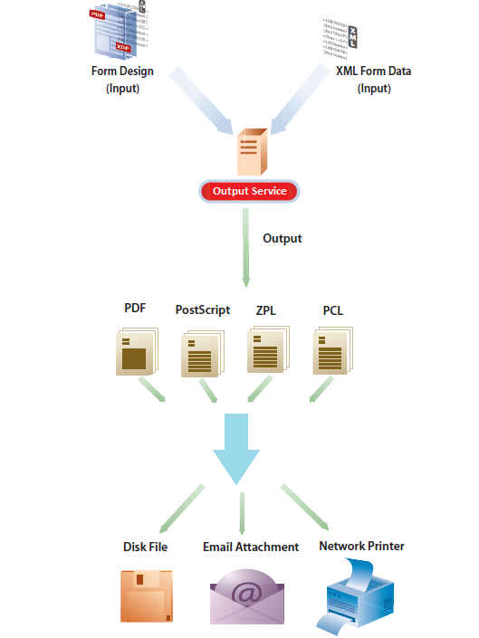

# Servicio de salida{#output-service}

## Información general {#overview}

El servicio Output es un servicio OSGi que forma parte de AEM Document Services. El servicio Output admite varios formatos de salida y funciones de diseño de salida de AEM Forms Designer. El servicio Output puede convertir plantillas XFA y datos XML para generar documentos de impresión en varios formatos.

El servicio Output le permite crear aplicaciones con las que puede hacer lo siguiente:

* Generar formularios finales al rellenar archivos de plantilla con datos XML.
* Generar formularios de salida en varios formatos, incluidos los flujos de impresión no interactivos PDF, PostScript, PCL y ZPL.
* Generar PDF de impresión a partir de PDF de formularios XFA.
* Generar documentos PDF, PostScript, PCL y ZPL por lotes combinando varios conjuntos de datos con plantillas de origen.

>[!NOTE]
>
>El servicio Output es una aplicación de 32 bits. En Microsoft Windows, una aplicación de 32 bits puede utilizar un máximo de 2 GB de memoria. El límite también se aplica al servicio Output.

## Creación de documentos de formulario no interactivos {#creating-non-interactive-form-documents}

Normalmente, las plantillas se crean con AEM Forms Designer. Las API `generatePDFOutput` y `generatePrintedOutput` del servicio Output permiten convertir directamente estas plantillas a varios formatos, incluidos PDF, PostScript, ZPL y PCL.

La operación `generatePDFOutput` genera PDF, mientras que la operación `generatePrintedOutput` genera los formatos PostScript, ZPL y PCL. El primer parámetro de ambas operaciones acepta el nombre del archivo de plantilla (por ejemplo, `ExpenseClaim.xdp`) o un objeto Document que contenga la plantilla. Cuando especifique el nombre del archivo de plantilla, especifique también la raíz de contenido como la ruta a la carpeta que contiene la plantilla. Puede especificar la raíz de contenido mediante los parámetros `PDFOutputOptions` o `PrintedOutputOptions`. Consulte Javadoc para obtener más información sobre otras opciones que puede especificar mediante estos parámetros.

El segundo parámetro acepta un documento XML que se combina con la plantilla al generar el documento de salida.

La operación `generatePDFOutput` también puede aceptar un formulario PDF basado en XFA como entrada y devolver una versión no interactiva del formulario PDF como salida.

## Generación de documentos de formulario no interactivos {#generating-non-interactive-form-documents}

Imagine un escenario en el que tiene una o más plantillas y varios registros de datos XML en cada plantilla.

Utilice las operaciones `generatePDFOutputBatch` y `generatePrintedOutputBatch` del servicio Output para generar un documento de impresión para cada registro.

También puede combinar los registros en un solo documento. Ambas operaciones admiten cuatro parámetros.

El primer parámetro es un mapa que contiene una cadena arbitraria como clave y el nombre del archivo de plantilla como valor.

El segundo parámetro es un mapa diferente cuyo valor es un objeto Document que contiene datos XML. La clave es la misma que la especificada para el primer parámetro.

El tercer parámetro de `generatePDFOutputBatch` o `generatePrintedOutputBatch` es de tipo `PDFOutputOptions` o `PrintedOutputOptions`, respectivamente.

Los tipos de parámetro son los mismos que los tipos de parámetro de las operaciones `generatePDFOutput` y `generatePrintedOutput`, y tienen el mismo efecto.

El cuarto parámetro es de tipo `BatchOptions`, el cual se utiliza para especificar si se puede generar un archivo independiente para cada registro. El valor predeterminado de este parámetro es False.

Tanto `generatePrintedOutputBatch` como `generatePDFOutputBatch` devuelven un valor de tipo `BatchResult`. El valor contiene una lista de los documentos generados. También contiene un documento de metadatos en formato XML que contiene información relacionada con cada uno de los documentos generados.
