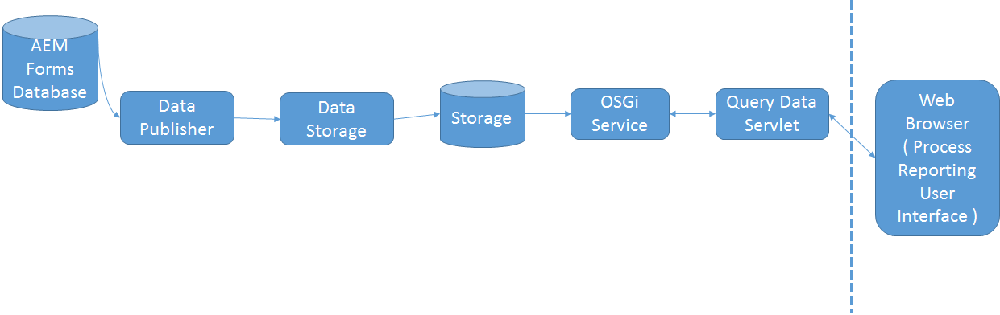

# Funcionamiento de los informes de procesos{#how-process-reporting-works}

Process Reporting es el módulo de informes de AEM Forms en JEE.

Process Reporting permite ejecutar informes sobre procesos y tareas de AEM Forms.

Process Reporting utiliza el repositorio incrustado del módulo para publicar datos de Forms. A continuación, utiliza esos datos para ejecutar informes.

Process Reporting consta de los siguientes módulos:

* [Servicio ProcessDataPublisher](#processdatapublisher-service-br-p)
* [Servicio ProcessDataStorage](#processdatastorageprovider-service-br-p)
* [Servicio OSGi](#osgi-service-br-p)
* [Servlet Query Data](#querydataservlet-service-br-p)
* [Interfaz de usuario de Process Reporting](#process-reporting-user-interface-br-p)

## Arquitectura de Process Reporting {#process-reporting-architecture-br}

## Módulos de Process Reporting {#process-reporting-modules}

### Servicio ProcessDataPublisher {#processdatapublisher-service-br}

El servidor ProcessDataPublisher se ejecuta periódicamente en la base de datos de AEM Forms y extrae los datos que han cambiado desde la última ejecución del servicio. A continuación, publica los datos en el servicio Process Data Storage.

Para obtener más información sobre la configuración del servicio, consulte [Configuración del servicio ProcessDataPublisher](/help/forms/using/process-reporting/install-start-process-reporting.md#p-reportconfiguration-service-p).

### Servicio ProcessDataStorageProvider {#processdatastorageprovider-service-br}

El servicio ProcessDataStorageProvider recibe datos de proceso del servicio ProcessDataPublisher y los guarda en el repositorio de Process Reporting.

Para obtener más información sobre la configuración del servicio, consulte [Configuración del servicio ProcessDataStorageProvider](/help/forms/using/process-reporting/install-start-process-reporting.md#p-to-configure-the-process-reporting-repository-locations-p).

### Servicio OSGi {#osgi-service-br}

QueryDataServlet utiliza este servicio para obtener los datos de informe del repositorio de Process Reporting.

### Servicio QueryDataServlet {#querydataservlet-service-br}

El servicio QueryDataServlet acepta consultas de la interfaz de usuario de Process Reporting.

A continuación, utiliza los servicios OSGi para obtener los datos de informe relevantes, procesa los datos y los devuelve a la interfaz de usuario.

### Interfaz de usuario de Process Reporting {#process-reporting-user-interface-br}

La interfaz de usuario de Process Reporting es una interfaz basada en explorador web. Esta interfaz se utiliza para ver la información de procesos y tareas publicada en la base de datos de AEM Forms.

Para ver una introducción a la interfaz de usuario de Process Reporting, consulte [Interfaz de usuario de Process Reporting](/help/forms/using/process-reporting/introduction-process-reporting.md).

### Servicio QueryDataServlet {#querydataservlet-service-br-1}

El servicio QueryDataServlet acepta consultas de la interfaz de usuario de Process Reporting.

A continuación, utiliza los servicios OSGi para obtener los datos de informe relevantes, procesa los datos y los devuelve a la interfaz de usuario.

### Informes personalizados {#custom-reports-br}

Puede crear sus propios informes personalizados y mostrarlos en la pestaña Informes personalizados de la interfaz de usuario de Process Reporting.

Para ver los pasos para crear un informe personalizado, consulte Creación de un informe personalizado en el artículo [Informes personalizados en Process Reporting](/help/forms/using/process-reporting/process-reporting-custom-reports.md).
