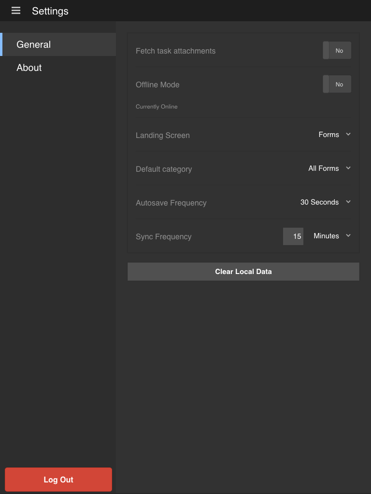

# Actualizar la configuración general{#updating-general-settings}

>[!NOTE]
>
>Las versiones de Android y iOS de la aplicación de AEM Forms se han suspendido. La aplicación de Android se canceló la publicación de Google Play en septiembre de 2026 y la aplicación de iOS se ha eliminado de Apple App Store.
>Estas aplicaciones ya no están disponibles para la instalación. Para obtener ayuda con la aplicación Android, comuníquese con [aemformsapp-android@adobe.com](mailto:aemformsapp-android@adobe.com).

La configuración general de la aplicación de AEM Forms le permite especificar configuraciones, como recuperar archivos adjuntos, modo sin conexión, pantalla de aterrizaje, categoría predeterminada y frecuencia de guardado automático.

## Actualizar la configuración general en su aplicación {#working-with-the-form}

Al sincronizar su aplicación con el servidor de AEM Forms, todos los formularios y las tareas definidas se descargan en el dispositivo móvil.

La solución predeterminada de la aplicación de AEM Forms no descarga los archivos adjuntos asociados a cada formulario cuando la aplicación está sincronizada.

En la pestaña General, cambie la configuración de descarga de archivos adjuntos, modo sin conexión, pantalla de aterrizaje, guardado automático y sincronización. Puede cambiar la [pantalla Inicio](../../forms/using/home-screen.md) de su aplicación.

**Ir a la pestaña General en la pantalla Configuración**

1. Para ir a la pantalla Configuración, selecciona el botón Menú en la esquina superior izquierda de la pantalla Inicio y luego selecciona **Configuración**.
1. En la pantalla Configuración, seleccione la pestaña General.

   

   Pantalla Configuración general

>[!NOTE]
>
>Las opciones pueden mostrarse de forma diferente en distintos dispositivos móviles.

### Configuración general {#general-settings}

Puede realizar los siguientes cambios en la configuración de su aplicación.

* **Recuperar archivos adjuntos de tareas**: Para especificar si desea descargar o no los archivos adjuntos asociados cuando se descarga cada tarea en la aplicación.
* **Modo sin conexión**: Para habilitar o deshabilitar el servicio sin conexión para la aplicación de AEM Forms. Consulte [Trabajar en modo sin conexión](/help/forms/using/work-offline-mode.md) para obtener más información.
* **Pantalla de aterrizaje**: Para establecer la ubicación de inicio ([pantalla Inicio](../../forms/using/home-screen.md)) para la aplicación.
Opciones disponibles:

  * Formularios
  * Tareas
  * Favoritos

* **Categoría predeterminada**: Permite seleccionar la categoría de formularios que se va a mostrar en la pantalla de inicio. Al seleccionar Todos, puede ver todos los formularios en la pantalla de inicio. Las categorías se rellenan en función de los formularios cargados en la aplicación. Los formularios están disponibles en la aplicación en función de la configuración de formulario especificada en el servidor de AEM Forms.

* **Frecuencia de guardado automático**: Para definir la frecuencia con la que su [aplicación móvil guarda datos de formulario](../../forms/using/autosave-data-app.md) de forma local.
* **Frecuencia de sincronización**: Para establecer la frecuencia con la que [su aplicación móvil se sincroniza](../../forms/using/sync-app.md) con el servidor de AEM Forms en modo en línea.
  **Borrar datos locales**: Borrar la base de datos, incluida la configuración y los datos locales de todos los usuarios y el almacenamiento de archivos del dispositivo.

>[!NOTE]
>
>Al borrar la caché, se cerrará la sesión inmediatamente de la aplicación.
>
>Sin embargo, se le pedirá que confirme la operación de borrado de caché.
