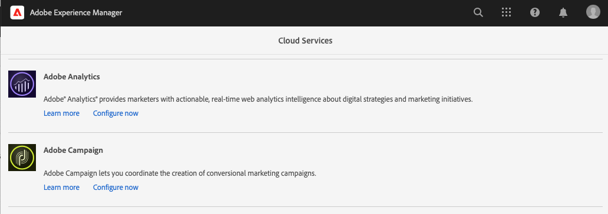

# Integración de AEM 6.5 con Adobe Campaign Classic {#integrating-campaign-classic}

Al integrar AEM con Adobe Campaign Classic (ACC), puede administrar la entrega de correo electrónico, el contenido y los formularios directamente en AEM. Los pasos de configuración tanto en Adobe Campaign Classic como en AEM son necesarios para habilitar la comunicación bidireccional entre las soluciones.

Esta integración permite utilizar AEM y Adobe Campaign Classic de forma independiente. Los especialistas en marketing pueden crear campañas y utilizar la segmentación en Adobe Campaign, mientras que los creadores de contenido en paralelo pueden trabajar en el diseño de contenido en AEM. Gracias a esta integración, el contenido y el diseño de la campaña creada en AEM pueden segmentarse y enviarse desde Adobe Campaign.

>[!INFO]
>
>Este documento detalla cómo integrar Adobe Campaign Classic con AEM 6.5. Para otras integraciones de Campaign, consulte el documento [Integración de AEM 6.5 con Adobe Campaign.](campaign.md)

## Pasos de integración {#integration-steps}

La integración entre AEM y Campaign requiere varios pasos en ambas soluciones.

1. [Instale el paquete de integración de AEM en Campaign.](#install-package)
1. [Creación de un operador para AEM en Campaign](#create-operator)
1. [Configuración de la integración de Campaign en AEM](#campaign-integration)
1. [Configuración del externalizador de AEM](#externalizer)
1. [Configuración del usuario remoto de la campaña en AEM](#configure-user)
1. [Configuración de la cuenta externa de AEM en Campaign](#acc-setup)

Este documento le guía en detalle por cada uno de estos pasos.

## Requisitos previos {#prerequisites}

* Acceso de administrador a Adobe Campaign Classic
   * Para realizar la integración, necesita una instancia de Adobe Campaign Classic en funcionamiento, incluida una base de datos configurada.
   * Si necesita más detalles sobre cómo configurar Adobe Campaign Classic, consulte la [documentación de Adobe Campaign Classic](https://experienceleague.adobe.com/docs/campaign-classic/using/campaign-classic-home.html?lang=es), en particular la guía Instalación y configuración.
* Acceso de administrador a AEM

## Instalación del paquete de integración de AEM en Campaign {#install-package}

El paquete **AEM Integration** de Adobe Campaign incluye varias configuraciones estándar necesarias para conectarse a AEM.

1. Inicie sesión como administrador en la instancia de Adobe Campaign mediante la consola del cliente.

1. Seleccione **Herramientas** > **Avanzadas** > **Importar paquete...**.

   

1. Haga clic en **Instalar un paquete estándar** y luego haga clic en **Siguiente**.

1. Compruebe el paquete **AEM Integration**.

   

1. Haga clic en **Siguiente** y, a continuación, en **Iniciar** para iniciar la instalación.

   

1. Haga clic en **Cerrar** cuando finalice la instalación.

El paquete de integración ya está instalado.

## Creación del operador para AEM en Campaign {#create-operator}

El paquete de integración crea automáticamente el operador `aemserver` que AEM utiliza para conectarse a Adobe Campaign. Defina una zona de seguridad para este operador y establezca su contraseña.

1. Inicie sesión en Adobe Campaign como administrador mediante la consola del cliente.

1. Seleccione **Herramientas** > **Explorador** en la barra de menús.

1. En el explorador, vaya al nodo **Administración** > **Administración de acceso** > **Operadores**.

1. Seleccione el operador `aemserver`.

1. En la ficha **Editar** del operador, seleccione la subpestaña **Derechos de acceso** y, a continuación, haga clic en el vínculo **Editar los parámetros de acceso...**.

   

1. Seleccione la zona de seguridad adecuada y defina la máscara IP de confianza según sea necesario.

   >[!CAUTION]
   >
   >La zona de seguridad que se va a configurar es **Red privada de la compañía (VPN+LAN)**.

1. Haga clic en **Guardar**.

1. Cierre la sesión del cliente de Adobe Campaign.

1. En el sistema de archivos del servidor de Adobe Campaign, vaya a la ubicación de instalación de Campaign y edite el archivo `serverConf.xml` como administrador. Este archivo suele encontrarse en:
   * `C:\Program Files\Adobe\Adobe Campaign Classic v7\conf` en Windows.
   * `/usr/local/neolane/nl6/conf/eng` en Linux.

1. Busque `securityZone` y asegúrese de que los siguientes parámetros están establecidos para la zona de seguridad del operador AEM.

   * `allowHTTP="true"`
   * `sessionTokenOnly="true"`
   * `allowUserPassword="true"`.

1. Guarde el archivo.

1. Asegúrese de que la zona de seguridad no se sobrescriba con la configuración correspondiente del archivo `config-<server name>.xml`.

   * Si el archivo de configuración contiene una configuración de zona de seguridad independiente, cambie el atributo `allowUserPassword` a `true`.

1. Si desea cambiar el puerto del servidor de Adobe Campaign Classic, reemplace `8080` por el puerto deseado.

   >[!CAUTION]
   >
   >De forma predeterminada, no hay ninguna zona de seguridad configurada para el operador. Para que AEM se conecte a Adobe Campaign, debe seleccionar una zona como se detalla en los pasos anteriores.
   >
   >Adobe recomienda encarecidamente crear una zona de seguridad específica de AEM para evitar problemas de seguridad. Para obtener más información sobre este tema, consulte la [documentación de Adobe Campaign Classic.](https://experienceleague.adobe.com/docs/campaign-classic/using/installing-campaign-classic/additional-configurations/security-zones.html?lang=es)

1. En el cliente de Campaign, vuelva al operador `aemserver` y seleccione la pestaña **General**.

1. Haga clic en el vínculo **Restablecer contraseña...**.

1. Especifique una contraseña y guárdela en una ubicación segura para su uso futuro.

1. Haga clic en **Aceptar** para guardar la contraseña del operador `aemserver`.

## Configuración de la integración de Campaign en AEM {#campaign-integration}

AEM usa [el operador que ya configuró en Campaign](#create-operator) para comunicarse con Campaign

1. Inicie sesión en la instancia de creación de AEM como administrador.

1. En el carril lateral de navegación global, seleccione **Herramientas** > **Cloud Services** > **Cloud Services heredados** > **Adobe Campaign**, y después haga clic en **Configurar ahora**.

   

1. En el cuadro de diálogo, cree una configuración de servicio de Campaign escribiendo un **Título** y haciendo clic en **Crear**.

   

1. Se abre una nueva ventana y un cuadro de diálogo para editar la configuración. Proporcione la información necesaria.

   * **Nombre de usuario**: este es [el operador del paquete de integración de Adobe Campaign AEM creado en el paso anterior.](#create-operator) De manera predeterminada es `aemserver`.
   * **Contraseña**: Esta es la contraseña de [el operador del paquete Adobe Campaign AEM Integration creado en el paso anterior.](#create-operator)
   * **Punto final de API**: Esta es la URL de la instancia de Adobe Campaign.

   

1. Seleccione **Conectarse a Adobe Campaign** para comprobar la conexión y, a continuación, haga clic en **Aceptar**.

AEM ahora puede comunicarse con Adobe Campaign.

>[!NOTE]
>
>Asegúrese de que el servidor de Adobe Campaign esté accesible a través de Internet. AEM no puede acceder a redes privadas.

## Configuración de la replicación en la instancia de publicación de AEM {#replication}

El contenido de Campaign lo crean los autores de contenido en la instancia de creación de AEM. Esta instancia solo suele estar disponible internamente en su organización. Para que el contenido, como las imágenes y los recursos, sea accesible a los destinatarios de la campaña, debe publicarlo.

El agente de replicación es responsable de publicar el contenido de la instancia de autor de AEM en la instancia de publicación y debe configurarse para que la integración funcione correctamente. Este paso también es necesario para replicar determinadas configuraciones de instancia de creación en la instancia de publicación.

Para configurar la replicación desde la instancia de autor de AEM a la instancia de publicación:

1. Inicie sesión en la instancia de creación de AEM como administrador.

1. En el carril lateral de navegación global, seleccione **Herramientas** > **Implementación** > **Replicación** > **Agentes en el autor** y, a continuación, haga clic en **Agente predeterminado (publicar)**.

   

1. Haz clic en **Editar** y luego selecciona la pestaña **Transporte**.

1. Configure el campo **URI** reemplazando el valor predeterminado `localhost` con la dirección IP de la instancia de publicación de AEM.

   

1. Haga clic en **Aceptar** para guardar los cambios en la configuración del agente.

Ha configurado la replicación en la instancia de publicación de AEM para que los destinatarios de la campaña puedan acceder al contenido.

>[!NOTE]
>
>Si no desea utilizar la URL de replicación, sino utilizar la URL pública, puede establecer la URL pública en la siguiente configuración mediante OSGi
>
>En el carril lateral de navegación global, seleccione **Herramientas** > **Operaciones** > **Consola web** > **Configuración de OSGi** y busque **Integración de AEM Campaign - Configuración**. Edite la configuración y cambie el campo **URL pública** (`com.day.cq.mcm.campaign.impl.IntegrationConfigImpl#aem.mcm.campaign.publicUrl`).

## Configuración del externalizador de AEM {#externalizer}

[El externalizador](/help/sites-developing/externalizer.md) es un servicio OSGi en AEM que transforma una ruta de recursos en una dirección URL externa y absoluta, que es necesaria para que AEM ofrezca contenido que Campaign puede utilizar. Configúrela para que la integración de Campaign funcione.

1. Inicie sesión en la instancia de creación de AEM como administrador.
1. En el carril lateral de navegación global, seleccione **Herramientas** > **Operaciones** > **Consola web** > **Configuración de OSGi** y busque **Externalizador de vínculos CQ por día**.
1. De manera predeterminada, la última entrada del campo **Dominios** está destinada a la instancia de publicación. Cambie la URL del valor predeterminado `http://localhost:4503` a la instancia de publicación disponible públicamente.

   

1. Haga clic en **Guardar**.

Ha configurado el externalizador y Adobe Campaign puede acceder a su contenido.

>[!NOTE]
>
>Se debe poder acceder a la instancia de publicación desde el servidor de Adobe Campaign. Si apunta a `localhost:4503` u otro servidor al que Adobe Campaign no pueda acceder, las imágenes de AEM no aparecerán en la consola de Adobe Campaign.

## Configuración del usuario remoto de Campaign en AEM {#configure-user}

Para que Campaign pueda comunicarse con AEM, debe establecer una contraseña para el usuario `campaign-remote` en AEM.

1. Inicie sesión en AEM como administrador.
1. En la consola de navegación principal y haga clic en **Herramientas** en el carril izquierdo.
1. A continuación, haga clic en **Seguridad** > **Usuarios** para abrir la consola de administración de usuarios.
1. Busque el usuario `campaign-remote`.
1. Seleccione el usuario `campaign-remote` y haga clic en **Propiedades** para editar el usuario.
1. En la ventana **Editar configuración de usuario**, haga clic en **Cambiar contraseña**.
1. Proporcione una nueva contraseña para el usuario y anote la contraseña en una ubicación segura para uso futuro.
1. Haga clic en **Guardar** para guardar el cambio de contraseña.
1. Haga clic en **Guardar y cerrar** para guardar los cambios del usuario `campaign-remote`.

## Configuración de la cuenta externa de AEM en Campaign {#acc-setup}

Al [instalar el paquete **AEM Integration** en Campaign](#install-package), se crea una cuenta externa para AEM. Al configurar esta cuenta externa, Adobe Campaign puede conectarse a AEM, lo que permite la comunicación bidireccional entre las soluciones.

1. Inicie sesión en Adobe Campaign como administrador mediante la consola del cliente.

1. Seleccione **Herramientas** > **Explorador** en la barra de menús.

1. En el explorador, vaya al nodo **Administración** > **Plataforma** > **Cuentas externas**.

   

1. Busque la cuenta externa de AEM. De forma predeterminada, tiene los siguientes valores:

   * **Tipo** - `AEM`
   * **Etiqueta** - `AEM Instance`
   * **Nombre interno** - `aemInstance`

1. En la ficha **General** de esta cuenta, escriba la información de usuario que definió en el paso [Establecer contraseña de usuario remota de Campaign](#set-campaign-remote-password).

   * **Servidor**: la dirección del servidor de creación de AEM
      * Se debe poder acceder al servidor de creación de AEM desde la instancia del servidor de Adobe Campaign Classic.
      * Asegúrese de que la dirección del servidor **no** termina en una barra diagonal.
   * **Cuenta** - De manera predeterminada, este es el usuario `campaign-remote` que configuró en AEM en el paso [Establecer contraseña de usuario remota de campaña](#set-campaign-remote-password).
   * **Contraseña** - Esta contraseña es la misma que el usuario `campaign-remote` que configuró en AEM en el paso [Establecer contraseña de usuario remota de campaña](#set-campaign-remote-password).

1. Seleccione la casilla **Habilitado**.

1. Haga clic en **Guardar**.

Adobe Campaign ahora puede comunicarse con AEM.

## Siguientes pasos {#next-steps}

Con Adobe Campaign Classic y AEM configurados, la integración ya está completa.

Ahora puede aprender a crear una newsletter en Adobe Experience Manager si continúa con [este documento.](/help/sites-authoring/campaign.md)
