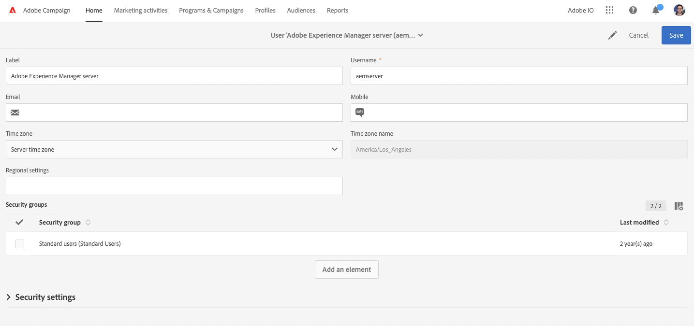

# Integración de AEM 6.5 con Adobe Campaign Standard {#integrating-with-adobe-campaign-standard}

Al integrar AEM 6.5 con Adobe Campaign Standard (ACS), puede administrar la entrega de correo electrónico, el contenido y los formularios directamente en AEM. Los pasos de configuración tanto en Adobe Campaign Standard como en AEM son necesarios para habilitar la comunicación bidireccional entre las soluciones.

Esta integración permite utilizar AEM y Adobe Campaign Standard de forma independiente. Los especialistas en marketing pueden crear campañas y utilizar la segmentación en Adobe Campaign, mientras que los creadores de contenido en paralelo pueden trabajar en el diseño de contenido en AEM. Gracias a esta integración, el contenido y el diseño de la campaña creada en AEM pueden segmentarse y enviarse desde Adobe Campaign.

>[!INFO]
>
>Este documento detalla cómo integrar Adobe Campaign Standard con AEM 6.5. Para otras integraciones de Campaign, consulte el documento [Integración de AEM 6.5 con Adobe Campaign.](campaign.md)

## Pasos de integración {#integration-steps}

La configuración de la integración entre AEM y Adobe Campaign Standard requiere varios pasos en ambas soluciones.

1. [Configure las variables ](#aemserver-user)
1. [Compruebe el ](#resource-type-filter)
1. [Creación de una plantilla de envíos de correo electrónico específica de AEM en Campaign](#aem-email-delivery-template)
1. [Configuración de la integración de Campaign en AEM](#campaign-integration)
1. [Configuración de la replicación en la instancia de publicación de AEM](#replication)
1. [Configuración del externalizador de AEM](#externalizer)
1. [Configure las variables ](#campaign-remote-user)
1. [Configuración de la cuenta externa de AEM en Campaign](#acc-external-user)

Este documento le guía en detalle por cada uno de estos pasos.

## Requisitos previos {#prerequisites}

* Acceso de administrador a Adobe Campaign Standard
   * Si necesita más detalles sobre cómo configurar Adobe Campaign Standard, consulte la [documentación de Adobe Campaign Standard.](https://experienceleague.adobe.com/docs/campaign-standard/using/campaign-standard-home.html)
* Acceso de administrador a AEM

## Configuración del usuario de aemserver en Campaign {#aemserver-user}

Adobe Campaign Standard viene de manera predeterminada con un usuario `aemserver` que AEM utiliza para conectarse a Adobe Campaign. Asigne un grupo de seguridad apropiado para este usuario y establezca su contraseña.

1. Inicie sesión en Adobe Campaign como administrador.

1. Haga clic en el logotipo de Adobe Campaign en la parte superior izquierda de la barra de menús para abrir la navegación global y, a continuación, seleccione **Administración** > **Usuarios y seguridad** > **Usuarios** en el menú de navegación.

1. Haga clic en el usuario `aemserver` en la consola de usuarios.

1. Asegúrese de que el usuario `aemserver` esté asignado como mínimo a un grupo de seguridad que tenga el rol `deliveryPrepare` asignado. De manera predeterminada, el grupo `Standard Users` tiene esta función.

   

1. Haga clic en **Guardar** para guardar los cambios.

El usuario de `aemserver` tiene ahora los derechos necesarios para que AEM pueda utilizarlo para comunicarse con Adobe Campaign.

Sin embargo, para que AEM pueda usar el usuario `aemserver`, se debe establecer su contraseña. Esto no se puede hacer a través de Adobe Campaign. Debe hacerlo un ingeniero de asistencia de Adobe. [Envíe un ticket al Servicio de atención al cliente de Adobe](https://experienceleague.adobe.com/?support-tab=home#support) para solicitar el restablecimiento de la contraseña de `aemserver`. Una vez que tenga la contraseña del Servicio de atención al cliente de Adobe, manténgala en una ubicación segura.

## Verificación de AEMResourceTypeFilter en Campaign {#resource-type-filter}

`AEMResourceTypeFilter` es una opción de Adobe Campaign que se usa para filtrar los recursos de AEM que se pueden usar en Adobe Campaign. Dado que AEM contiene mucho contenido, esta opción actúa como un filtro que permite a Adobe Campaign recuperar únicamente el contenido de AEM de los tipos específicamente diseñados para su uso en Adobe Campaign.

Esta opción está preconfigurada. Sin embargo, es posible que tenga que actualizarla si ha personalizado los componentes de Campaign de AEM. Para comprobar que la opción `AEMResourceTypeFilter` está configurada, siga estos pasos.

1. Inicie sesión en Adobe Campaign como administrador.

1. Haga clic en el logotipo de Adobe Campaign en la parte superior izquierda de la barra de menús para abrir la navegación global y, a continuación, seleccione **Administración** > **Configuración de la aplicación** > **Opciones** en el menú de navegación.

1. Haga clic en `AEMResourceTypeFilter` en la consola de opciones.

1. Confirme la configuración de `AEMResourceTypeFilter`. Las rutas están delimitadas por comas y contienen, de forma predeterminada:

   * `mcm/campaign/components/newsletter`
   * `mcm/campaign/components/campaign_newsletterpage`
   * `mcm/neolane/components/newsletter`

   

1. Haga clic en **Guardar** para guardar los cambios.

Su `AEMResourceTypeFilter` se ha configurado para recuperar el contenido correcto de AEM.

## Creación de una plantilla de envíos de correo electrónico específica de AEM en Campaign {#aem-email-delivery-template}

De forma predeterminada, AEM no está habilitado en las plantillas de correo electrónico de Adobe Campaign. Configure una nueva plantilla de envíos de correo electrónico que se pueda utilizar para crear correos electrónicos con contenido de AEM. Para crear una plantilla de envíos de correo electrónico específica de AEM, siga estos pasos.

1. Inicie sesión en Adobe Campaign como administrador.

1. Haga clic en el logotipo de Adobe Campaign en la parte superior izquierda de la barra de menús para abrir la navegación global y, a continuación, seleccione **Recursos** > **Plantillas** > **Plantillas de envío** en el menú de navegación.

1. En la consola de plantillas de envío, busque la plantilla de correo electrónico predeterminada **Enviar por correo electrónico (correo electrónico)** y pase el ratón sobre la tarjeta (o línea) que lo representa para mostrar las opciones. Haga clic en **Duplicar elemento**.

   

1. En el cuadro de diálogo **Confirmación**, haga clic en **Confirmar** para duplicar la plantilla.

   

1. El editor de plantillas se abre con su copia de la plantilla **Enviar por correo electrónico (correo)**. Haga clic en el icono **Editar propiedades** en la parte superior derecha de la ventana.

   

1. En la ventana de propiedades, cambie el campo **Label** para que describa la nueva plantilla de AEM.

1. Haga clic en el encabezado **Contenido** para expandirlo y seleccione **Adobe Experience Manager** en la lista desplegable **Origen del contenido**.

1. Esto muestra el campo **cuenta de Adobe Experience Manager**. Utilice la lista desplegable para seleccionar **Adobe Experience Manager instance (aemInstance)** usuario. Es el usuario externo predeterminado para la integración de AEM.

1. Haga clic en **Confirmar** para guardar los cambios en las propiedades.

1. En el editor de plantillas, haga clic en **Guardar** para guardar la copia modificada de la plantilla de correo electrónico y usarla con AEM.

Ahora tiene una plantilla de correo electrónico que puede utilizar contenido de AEM.

## Configuración de la integración de Campaign en AEM {#campaign-integration}

AEM se comunica con Adobe Campaign mediante una integración integrada y con el usuario `aemserver` que configuró en Adobe Campaign. Siga estos pasos para configurar esta integración.

1. Inicie sesión en la instancia de creación de AEM como administrador.

1. En el carril lateral de navegación global, seleccione **Herramientas** > **Cloud Services** > **Cloud Services heredados** > **Adobe Campaign**, y después haga clic en **Configurar ahora**.

   

1. En el cuadro de diálogo, cree una configuración de servicio de Campaign escribiendo un **Título** y haciendo clic en **Crear**.

   

1. Se abre una nueva ventana y un cuadro de diálogo para editar la configuración. Proporcione la información necesaria.

   * **Nombre de usuario** - Este es [el usuario `aemserver` en Adobe Campaign que configuró en un paso anterior.](#aemserver-user) De manera predeterminada es `aemserver`.
   * **Contraseña**: Esta es la contraseña de [el usuario `aemserver` de Adobe Campaign que solicitó al Servicio de atención al cliente de Adobe en un paso anterior.](#aemserver-user)
   * **Punto final de API**: Esta es la URL de la instancia de Adobe Campaign.

   

1. Seleccione **Conectarse a Adobe Campaign** para comprobar la conexión y, a continuación, haga clic en **Aceptar**.

AEM ahora puede comunicarse con Adobe Campaign.

>[!NOTE]
>
>Asegúrese de que el servidor de Adobe Campaign esté accesible a través de Internet. AEM no puede acceder a redes privadas.

## Configuración de la replicación en la instancia de publicación de AEM {#replication}

El contenido de Campaign lo crean los autores de contenido en la instancia de creación de AEM. Esta instancia solo suele estar disponible internamente en su organización. Para que el contenido, como las imágenes y los recursos, sea accesible a los destinatarios de la campaña, debe publicarlo.

El agente de replicación es responsable de publicar el contenido de la instancia de autor de AEM en la instancia de publicación y debe configurarse para que la integración funcione correctamente. Este paso también es necesario para replicar determinadas configuraciones de instancia de creación en la instancia de publicación.

Para configurar la replicación desde la instancia de autor de AEM a la instancia de publicación:

1. Inicie sesión en la instancia de creación de AEM como administrador.

1. En el carril lateral de navegación global, seleccione **Herramientas** > **Implementación** > **Replicación** > **Agentes en el autor** y, a continuación, haga clic en **Agente predeterminado (publicar)**.

   

1. Haz clic en **Editar** y luego selecciona la pestaña **Transporte**.

1. Configure el campo **URI** reemplazando el valor predeterminado `localhost` con la dirección IP de la instancia de publicación de AEM.

   

1. Haga clic en **Aceptar** para guardar los cambios en la configuración del agente.

Ha configurado la replicación en la instancia de publicación de AEM para que los destinatarios de la campaña puedan acceder al contenido.

>[!NOTE]
>
>Si no desea utilizar la URL de replicación, sino utilizar la URL pública, puede establecer la URL pública en la siguiente configuración mediante OSGi
>
>En el carril lateral de navegación global, seleccione **Herramientas** > **Operaciones** > **Consola web** > **Configuración de OSGi** y busque **Integración de AEM Campaign - Configuración**. Edite la configuración y cambie el campo **URL pública** (`com.day.cq.mcm.campaign.impl.IntegrationConfigImpl#aem.mcm.campaign.publicUrl`).

## Configuración del externalizador de AEM {#externalizer}

[El externalizador](/help/sites-developing/externalizer.md) es un servicio OSGi en AEM que transforma una ruta de recursos en una dirección URL externa y absoluta, que es necesaria para que AEM ofrezca contenido que Campaign puede utilizar. Configúrela para que la integración de Campaign funcione.

1. Inicie sesión en la instancia de creación de AEM como administrador.
1. En el carril lateral de navegación global, seleccione **Herramientas** > **Operaciones** > **Consola web** > **Configuración de OSGi** y busque **Externalizador de vínculos CQ por día**.
1. De manera predeterminada, la última entrada del campo **Dominios** está destinada a la instancia de publicación. Cambie la URL del valor predeterminado `http://localhost:4503` a la instancia de publicación disponible públicamente.

   

1. Haga clic en **Guardar**.

Ha configurado el externalizador y Adobe Campaign puede acceder a su contenido.

>[!NOTE]
>
>Se debe poder acceder a la instancia de publicación desde el servidor de Adobe Campaign. Si apunta a `localhost:4503` u otro servidor al que Adobe Campaign no pueda acceder, las imágenes de AEM no aparecerán en la consola de Adobe Campaign.

## Configuración del usuario remoto de Campaign en AEM {#campaign-remote-user}

Del mismo modo que necesita un usuario en Adobe Campaign que AEM pueda utilizar para comunicarse con Adobe Campaign, Adobe Campaign también necesita un usuario en AEM para comunicarse con AEM. De forma predeterminada, la integración de Campaign crea el usuario `campaign-remote` en AEM. Siga estos pasos para configurar este usuario.

1. Inicie sesión en AEM como administrador.
1. En la consola de navegación principal, haga clic en **Herramientas** en el carril izquierdo.
1. A continuación, haga clic en **Seguridad** > **Usuarios** para abrir la consola de administración de usuarios.
1. Busque el usuario `campaign-remote`.
1. Seleccione el usuario `campaign-remote` y haga clic en **Propiedades** para editar el usuario.
1. En la ventana **Editar configuración de usuario**, haga clic en **Cambiar contraseña**.
1. Proporcione una nueva contraseña para el usuario y anote la contraseña en una ubicación segura para uso futuro.
1. Haga clic en **Guardar** para guardar el cambio de contraseña.
1. Haga clic en **Guardar y cerrar** para guardar los cambios del usuario `campaign-remote`.

## Configuración de la cuenta externa de AEM en Campaign {#acc-external-user}

Cuando [creó una plantilla de envíos de correo electrónico específica de AEM,](#aem-email-delivery-template) especificó que la plantilla debería usar la cuenta externa `aemInstance` para comunicarse con AEM. Para habilitar la comunicación bidireccional entre ambas soluciones, debe configurar esta cuenta en Adobe Campaign.

1. Inicie sesión en Adobe Campaign como administrador.

1. Haga clic en el logotipo de Adobe Campaign en la parte superior izquierda de la barra de menús para abrir la navegación global y, a continuación, seleccione **Administración** > **Configuración de la aplicación** > **Cuentas externas** en el menú de navegación.

1. Haga clic en el usuario **Adobe Experience Manager instance (aemInstance)** de la consola de usuarios.

1. Asegúrese de que el usuario tiene **Adobe Experience Manager** como **Tipo**.

1. En la sección **Conexión**, defina los siguientes campos:

   1. Servidor: es la dirección URL del servidor de creación de AEM. Esto no debe terminar en una barra oblicua.
   1. Cuenta: Este es el usuario `campaign-remote` que [configuró anteriormente en AEM.](#campaign-remote-user)
   1. Contraseña: Esta es la contraseña del `campaign-remote`usuario que [configuró anteriormente en AEM.](#campaign-remote-user)

   

1. Asegúrese de que la casilla de verificación **Habilitado** esté seleccionada y luego haga clic en **Guardar** para guardar los cambios.

¡Enhorabuena! ¡Ha completado la integración entre AEM y Adobe Campaign Standard!

## Siguientes pasos {#next-steps}

Con Adobe Campaign Classic y AEM configurados, la integración ya está completa.

Ahora puede aprender a crear una newsletter en Adobe Experience Manager si continúa con [este documento.](/help/sites-authoring/campaign.md)
