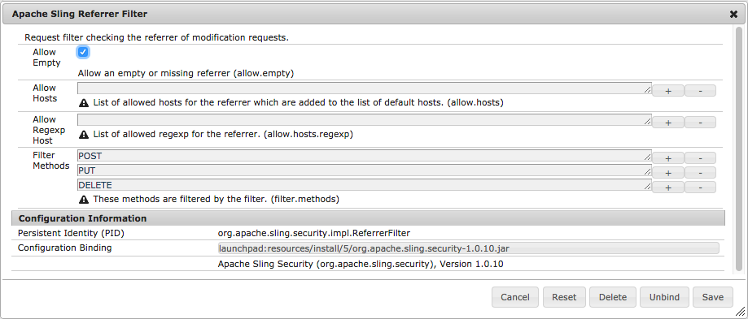

# Configuración de para aplicaciones de AEM{#configuring-for-aem-apps}

Adobe Experience Manager Apps permite actualizar el contenido de la OTA de la aplicación (por el aire). El contenido actualizado se almacena en la instancia de publicación. Para permitir que la aplicación de su dispositivo se conecte a la instancia de publicación y compruebe las actualizaciones, la instancia de publicación debe configurarse para permitir un encabezado de referente vacío.

## Configuración de un encabezado de referente vacío {#configuring-empty-referrer-header}

Para configurar el servicio del filtro de referente:

* Abra la consola Apache Felix (**Configuraciones**) en:
* https://&lt;server>:&lt;port_number>/system/console/configMgr
* Inicie sesión como administrador.
* En el menú **Configuraciones**, seleccione: *Filtro de referente de Apache Sling*
* Marque el campo Permitir vacío para poder permitir encabezados de referente vacíos o que falten.
* Haga clic en **Guardar** para guardar los cambios.

Consulte las [Opciones de configuración de OSGI](/help/sites-deploying/osgi-configuration-settings.md) y la [Lista de comprobación de seguridad - Problemas con la falsificación de solicitudes entre sitios](/help/sites-administering/security-checklist.md#protect-against-cross-site-request-forgery) para obtener más información.
