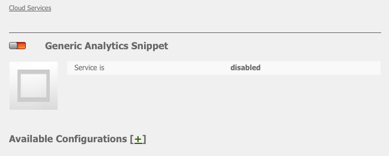
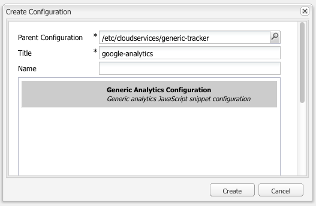
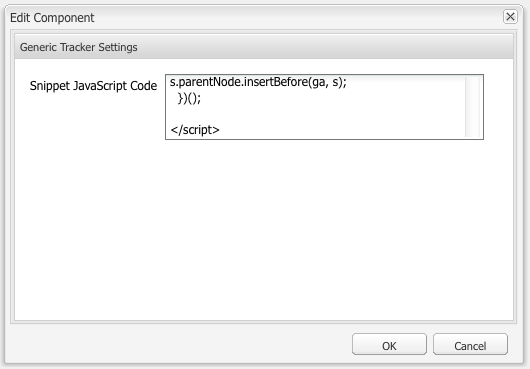
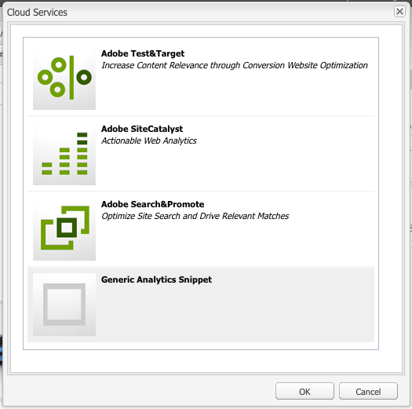
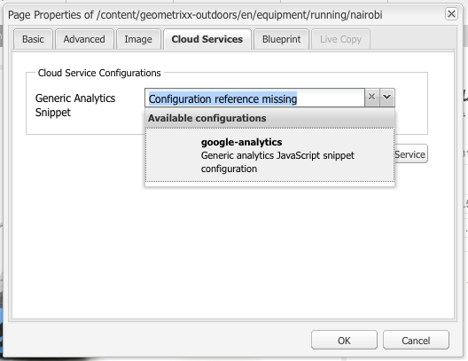

# Analytics con proveedores externos {#analytics-with-external-providers}

Analytics puede proporcionarle información importante e interesante sobre el uso que se le da a su sitio web.

Hay varias configuraciones disponibles para la integración con el servicio adecuado, por ejemplo:

* [API de Rest](/help/sites-administering/adobeanalytics.md)
* [Adobe Target](/help/sites-administering/target.md)

También puede configurar su propia instancia de **Fragmentos genéricos de Analytics** para definir una nueva configuración de servicio.

A continuación, la información se recopila mediante pequeños fragmentos de código que se agregan a las páginas web. Por ejemplo:

>[!CAUTION]
>
>No incluya scripts en etiquetas `script`.

```
var _gaq = _gaq || [];
_gaq.push(['_setAccount', 'UA-XXXXX-X']);
_gaq.push(['_trackPageview']);

(function() {
    var ga = document.createElement('script'); ga.type = 'text/javascript'; ga.async = true;
    ga.src = ('https:' == document.location.protocol ? 'https://ssl' : 'https://www') + '.google-analytics.com/ga.js';
    var s = document.getElementsByTagName('script')[0]; s.parentNode.insertBefore(ga, s);
})();
```

Estos fragmentos permiten recopilar datos y generar informes. Los datos reales recopilados dependen del proveedor y del fragmento de código real utilizado. Las estadísticas de ejemplo incluyen:

* cuántos visitantes con el tiempo
* cuántas páginas visitadas
* términos de búsqueda utilizados
* páginas de aterrizaje

>[!CAUTION]
>
>El sitio de demostración de Geometrixx-Outdoors está configurado de modo que los atributos proporcionados en las Propiedades de página se anexen al código fuente html (justo encima de la etiqueta final `</html>`) en el script `js` correspondiente.
>
>Si su propio `/apps` no hereda del componente de página predeterminado ( `/libs/foundation/components/page`), usted (o sus desarrolladores) deben asegurarse de que los scripts correspondientes de `js` se incluyan, por ejemplo, incluyendo `cq/cloudserviceconfigs/components/servicescomponents` o utilizando un mecanismo similar.
>
>Sin esto, ninguno de los servicios (genérico, de Analytics, de Target, etc.) funcionará.

## Creación de un servicio con un fragmento de código genérico {#creating-a-new-service-with-a-generic-snippet}

Para la configuración básica:

1. Abra la consola **Herramientas**.
1. En el panel izquierdo, expanda **Configuraciones de Cloud Services**.
1. Haga doble clic en **Fragmento genérico de Analytics** para abrir la página:

   

1. Haga clic en + para agregar una nueva configuración mediante el cuadro de diálogo. Como mínimo, asigne un nombre, por ejemplo, Google Analytics:

   

1. Haga clic en **Crear**, el cuadro de diálogo del fragmento se abrirá inmediatamente. Pegue el fragmento de código de JavaScript correspondiente en el campo:

   

1. Haga clic en **Aceptar** para guardar.

## Uso del nuevo servicio en páginas {#using-your-new-service-on-pages}

Una vez creada la configuración del servicio, debe configurar las páginas necesarias para utilizarlo:

1. Navegue hasta la página.
1. Abra **Propiedades de página** desde la barra de tareas y luego la ficha **Servicios de nube**.
1. Haga clic en **Agregar servicio** y, a continuación, seleccione el servicio requerido. Por ejemplo, el **fragmento genérico de Analytics**:

   

1. Haga clic en **Aceptar** para guardar.
1. Ha vuelto a la ficha **Cloud Services**. El **fragmento genérico de Analytics** aparece ahora con el mensaje `Configuration reference missing`. Utilice la lista desplegable para seleccionar la instancia de servicio específica. Por ejemplo, google-analytics:

   

1. Haga clic en **Aceptar** para guardar.

   Ahora, el fragmento se puede ver si se ve el Source de página de la página.

   Una vez transcurrido un tiempo, puede ver las estadísticas recopiladas.

   >[!NOTE]
   >
   >Si la configuración se adjunta a una página que tiene páginas secundarias, estas también heredan el servicio.
