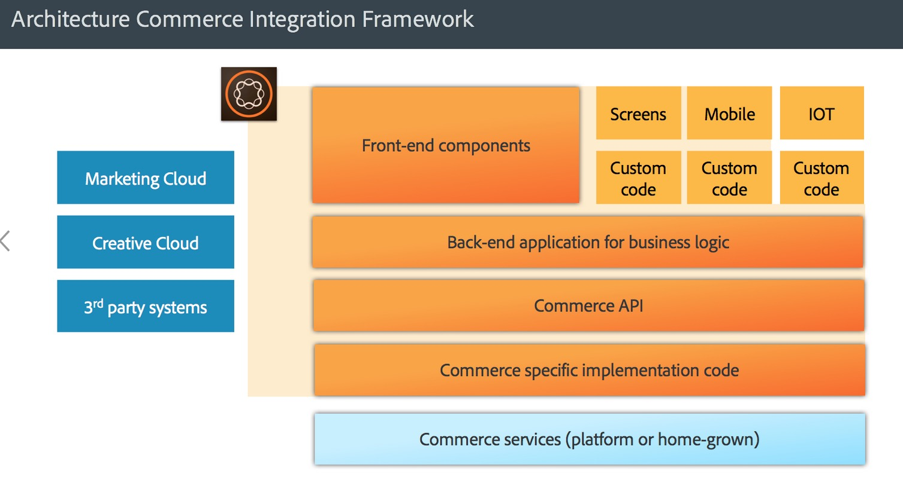

# AEM Commerce - Preparación para el RGPD{#aem-commerce-gdpr-readiness}

>[!IMPORTANT]
>
>El RGPD se utiliza como ejemplo en las secciones siguientes, pero los detalles cubiertos son aplicables a todas las regulaciones de protección de datos y privacidad; como el RGPD y la CCPA.

El Reglamento General de Protección de Datos de la Unión Europea sobre los derechos de privacidad de datos entra en vigor en mayo de 2018. Consulte la página de [RGPD en el Centro de privacidad de Adobe](https://business.adobe.com/es/privacy/general-data-protection-regulation.html).

>[!NOTE]
>
>Consulte [Preparación para el RGPD de AEM](/help/managing/data-protection-and-privacy.md) para obtener más información.

Con las integraciones integradas de Adobe Commerce, AEM es el nivel de experiencia, que consume servicios y devuelve datos a la plataforma de comercio del cliente que se ejecuta en modo sin encabezado.

En algunas plataformas de comercio, Adobe almacena información de perfil (`/home/users`) y tokens de comercio (para iniciar sesión en la plataforma de comercio) en AEM. Para estos casos de uso, lea [Gestión de solicitudes de RGPD para la plataforma AEM](/help/sites-administering/handling-gdpr-requests-for-aem-platform.md).

## Gestión de solicitudes de RGPD para AEM Commerce {#handling-gdpr-requests-for-aem-commerce}

Para la integración de Salesforce Commerce Cloud, AEM Commerce no almacena información relevante sobre el RGPD. Reenviar la solicitud a [Salesforce Cloud](https://documentation.b2c.commercecloud.salesforce.com/DOC1/index.jsp).

Para las integraciones de Commerce hybris y HCL WebSphere®, hay algunos datos en AEM. Use las [instrucciones de RGPD de AEM Platform](/help/sites-administering/handling-gdpr-requests-for-aem-platform.md) y tenga en cuenta las siguientes preguntas:

1. **¿Dónde se almacenan o utilizan mis datos?**: información de perfil de usuario en caché, como nombre, identificador de usuario de comercio, token, contraseña y datos de dirección, tal como se muestra en AEM.
1. **¿Con quién comparto los datos del RGPD cubiertos?** Cualquier actualización de los datos relevantes en el marco del RGPD en AEM Commerce no se almacena (excepto la información de perfil relevante, como se ha mencionado anteriormente), sino que se procesa como proxy de vuelta a la plataforma de comercio.
1. **Cómo eliminar mis datos de usuario**? Elimine el perfil de usuario en AEM e invoque la eliminación del usuario en la plataforma de comercio.

>[!NOTE]
>
>Eche un vistazo a la [wiki de hybris](https://wiki.hybris.com/) o a la [documentación de HCL WebSphere® Commerce](https://help.hcltechsw.com/commerce/index.html), si es necesario.
