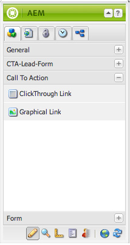

# Integración de páginas de destino con Adobe Analytics{#integrating-landing-pages-with-adobe-analytics}

AEM ha integrado la solución de páginas de aterrizaje con [Adobe Analytics](https://www.omniture.com/en/products/analytics/sitecatalyst) mediante los siguientes componentes de call-to-action (CTA):

1. Componente Clic
1. Componente Vínculo gráfico

Estos componentes exponen ciertos atributos que se pueden asignar a través de variables de Adobe Analytics (tráfico, variables de conversión) y eventos de éxito para enviar información a Adobe Analytics.

## Requisitos previos {#prerequisites}

Adobe recomienda que revise la [integración existente de AEM y Adobe Analytics](/help/sites-administering/adobeanalytics.md) para comprender cómo funciona esta integración.

## Componentes disponibles para asignación {#components-available-for-mapping}

En AEM, los componentes de **Call to action** - **ClickThroughLink** y **GraphicalLink** - que se muestran aquí en la barra de tareas, se pueden asignar a variables de Adobe Analytics.

### Asignación de componentes de página de aterrizaje a Adobe Analytics {#mapping-landing-page-components-to-adobe-analytics}

Para asignar componentes de página de aterrizaje a Adobe Analytics:

1. Después de crear la configuración de Adobe Analytics y de crear un marco de trabajo, seleccione el grupo de informes adecuado en el menú desplegable. Esto hace que se recuperen las variables de Adobe Analytics y se muestren en el buscador de contenido.
1. Arrastre y suelte los componentes de Call to action (CTA) de la barra de tareas en el área de asignación situada en medio de la página, según corresponda.

<table>
 <tbody>
  <tr>
   <td><strong>Nombre del componente</strong></td>
   <td><strong>Atributos expuestos</strong></td>
   <td><strong>Significado del atributo</strong></td>
  </tr>
  <tr>
   <td><strong>Vínculo de pulsación de CTA</strong></td>
   <td><i>eventdata.clickthroughLinkLabel</i>   </td>
   <td>La etiqueta del vínculo o el texto del vínculo </td>
  </tr>
  <tr>
   <td>  </td>
   <td><i>eventdata.clickthroughLinkTarget</i>   </td>
   <td>El destino al que se le redirige al hacer clic en el vínculo </td>
  </tr>
  <tr>
   <td>  </td>
   <td><i>eventdata.events.clickthroughLinkClick</i>   </td>
   <td>El evento de clic </td>
  </tr>
  <tr>
   <td><strong>Vínculo gráfico de CTA</strong></td>
   <td><i>eventdata.clicktroughImageLabel</i>   </td>
   <td>Título de la imagen de CTA </td>
  </tr>
  <tr>
   <td>  </td>
   <td><i>eventdata.clicktroughImageTarget</i>   </td>
   <td>El destino al que se le lleva al hacer clic en la imagen que contiene un vínculo</td>
  </tr>
  <tr>
   <td>  </td>
   <td><i>eventdata.clicktroughImageAsset</i>   </td>
   <td>La ruta al recurso de imagen en el repositorio </td>
  </tr>
  <tr>
   <td>  </td>
   <td><i>eventdata.events.clicktroughImageClick</i>   </td>
   <td>El evento de clic</td>
  </tr>
 </tbody>
</table>

1. Asigne estos atributos expuestos con cualquier variable de Adobe Analytics desde el buscador de contenido. El marco de trabajo ya está listo para usarse.
1. Ahora puede crear una página de aterrizaje o abrir una existente con componentes de CTA existentes y hacer clic en la pestaña **Cloud Services** en **Propiedades de página** desde la barra de tareas (en la interfaz de usuario táctil optimizada, seleccione **Abrir propiedades** y haga clic en **Cloud Services**), y configurar el marco de trabajo para utilizarlo con la página de aterrizaje. Seleccione el marco de trabajo de la lista desplegable.

   

1. Después de configurar el marco de trabajo con la página de aterrizaje, ahora puede utilizar los componentes instrumentados y cualquier clic en CTA se registra en Adobe Analytics.
