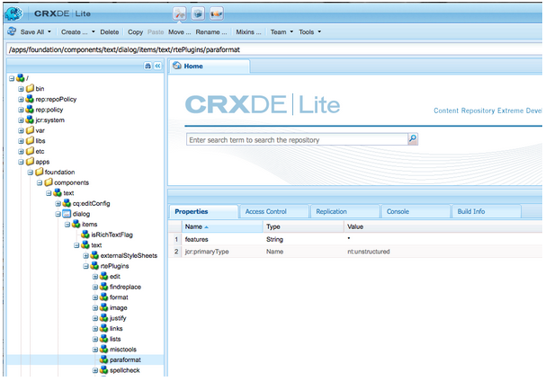

# Configuración de RTE para crear páginas web y sitios accesibles {#configure-rte-for-accessibility}

Adobe Experience Manager admite muchas funciones de accesibilidad estándar de acuerdo con varios estándares de accesibilidad. Además, los desarrolladores pueden personalizar o ampliar para proporcionar funciones que ayuden a crear contenido accesible mediante componentes de Experience Manager que utilizan el Editor de texto enriquecido (RTE).

Al diseñar páginas web y agregar contenido a las páginas, los desarrolladores y autores de contenido pueden utilizar las funciones de RTE para proporcionar información relacionada con la accesibilidad. Por ejemplo, agregue información estructural mediante encabezados y elementos de párrafo.

Para configurar y personalizar estas características, [configure los complementos RTE](#configure-the-plugin-features) para el componente. Por ejemplo, el complemento `paraformat` le permite agregar elementos semánticos de nivel de bloque adicionales, incluido el aumento del número de niveles de encabezado admitidos más allá de los niveles básicos `H1`, `H2` y `H3` proporcionados de forma predeterminada.

El RTE está disponible en una variedad de componentes para la interfaz de usuario táctil y la interfaz de usuario clásica. Sin embargo, el componente principal para usar el RTE es el componente **Text**, que está disponible para ambas interfaces. Las siguientes imágenes muestran el RTE con un rango de complementos habilitados, incluidos `paraformat`:


*Figura: el componente Texto en la interfaz de usuario táctil.*


*Figura: componente Texto de la interfaz de usuario clásica.*

Para ver las diferencias entre las características de RTE disponibles en las distintas interfaces, consulte [Complementos y sus características](/help/sites-administering/rich-text-editor.md#aboutplugins).

## Configuración de las funciones del complemento {#configure-the-plugin-features}

Para obtener las instrucciones completas para configurar el RTE, consulte [configurar la página Editor de texto enriquecido](/help/sites-administering/rich-text-editor.md). Esto cubre todos los problemas, incluidos los pasos clave:

* [Complementos y características](/help/sites-administering/rich-text-editor.md#aboutplugins).
* [Ubicaciones de configuración](/help/sites-administering/rich-text-editor.md#understand-the-configuration-paths-and-locations).
* [Activar un complemento y configurar la propiedad de características](/help/sites-administering/rich-text-editor.md#enable-rte-functionalities-by-activating-plug-ins).
* [Configurar otras funcionalidades de RTE](/help/sites-administering/rich-text-editor.md#enable-rte-functionalities-by-activating-plug-ins).

Al configurar un complemento dentro de la subrama `rtePlugins` adecuada en CRXDE Lite, puede activar todas las funciones o las específicas para ese complemento.



### Ejemplo: especificar formatos de párrafo disponibles en el campo de selección RTE {#example-specifying-paragraph-formats-available-in-rte-selection-field}

Los nuevos formatos de bloque semántico pueden estar disponibles para su selección mediante:

1. Según el RTE, determine y vaya a la [ubicación de configuración](/help/sites-administering/rich-text-editor.md#understand-the-configuration-paths-and-locations).
1. [Habilitar el campo de selección de párrafos](/help/sites-administering/rich-text-editor.md); al [activar el complemento](/help/sites-administering/rich-text-editor.md#enable-rte-functionalities-by-activating-plug-ins).
1. [Especifique los formatos que desea tener disponibles en el campo de selección Párrafos](/help/sites-administering/rich-text-editor.md).
1. Los formatos de párrafo están disponibles para el autor de contenido desde los campos de selección en RTE. Se puede acceder a ellas:

   * Uso del icono de fila de párrafo en la IU táctil.
   * Usando el campo **Formato** (selector emergente) en la IU clásica.

Con los elementos estructurales disponibles en RTE a través de las opciones de formato de párrafo, AEM proporciona una buena base para el desarrollo de contenido accesible. Los autores de contenido no pueden utilizar RTE para dar formato al tamaño de fuente, los colores u otros atributos relacionados, lo que impide la creación de formato en línea. En su lugar, deben seleccionar los elementos estructurales adecuados, como encabezados y utilizar estilos globales elegidos desde la opción Estilos. Esto garantiza un marcado limpio, mejores opciones para los usuarios que exploran con sus propias hojas de estilo y contenido correctamente estructurado.

## Uso de la función de edición de origen {#use-of-the-source-edit-feature}

En algunos casos, los autores de contenido deberán examinar y ajustar el código fuente de HTML creado con RTE. Por ejemplo, un fragmento de contenido creado dentro de RTE puede requerir un marcado adicional para garantizar el cumplimiento de WCAG 2.0. Esto se puede hacer con la opción [source edit](/help/sites-administering/rich-text-editor.md#aboutplugins) de RTE. Puede especificar la característica [`sourceedit` en el complemento `misctools`](/help/sites-administering/rich-text-editor.md#aboutplugins).

>[!CAUTION]
>
>Utilice la característica `sourceedit` con cuidado. Escribir errores y/o funciones no admitidas puede presentar más problemas.

## Añadir compatibilidad con más elementos y atributos de HTML {#add-support-for-more-html-elements-and-attributes}

Para ampliar aún más las características de accesibilidad de AEM, es posible ampliar los componentes existentes basados en RTE (como los componentes **Text** y **Table**) con elementos y atributos adicionales.

El siguiente procedimiento ilustra cómo extender el componente **Table** con un elemento **Caption** que proporciona información sobre una tabla de datos a los usuarios de tecnología de asistencia:

### Ejemplo: añadir el pie de ilustración al cuadro de diálogo Propiedades de la tabla {#example-adding-the-caption-to-the-table-properties-dialog}

En el constructor de `TablePropertiesDialog`, agregue un campo de entrada de texto adicional que se utilice para editar el título. Tenga en cuenta que `itemId` debe establecerse en `caption` (es decir, el nombre del atributo DOM) para controlar automáticamente su contenido.

En **Tabla**, establezca o quite explícitamente el atributo del elemento DOM. El valor lo pasa el cuadro de diálogo en el objeto `config`. Tenga en cuenta que los atributos DOM deben establecerse o eliminarse utilizando los métodos `CQ.form.rte.Common` correspondientes ( `com` es un acceso directo para `CQ.form.rte.Common`) para evitar escollos comunes con las implementaciones del explorador.

>[!NOTE]
>
>Este procedimiento solo es adecuado para la interfaz de usuario clásica.

### Ejemplo: crear una HTML accesible al utilizar énfasis en el texto {#create-accessible-html-for-text}

RTE puede usar etiquetas `strong` y `em` en lugar de `b` y `i`. Agregue el siguiente nodo como secundario a los nodos `uiSettings` y `rtePlugins` del cuadro de diálogo.

```HTML
<htmlRules jcr:primaryType="nt:unstructured">
    <docType jcr:primaryType="nt:unstructured">
        <typeConfig jcr:primaryType="nt:unstructured"
                useSemanticMarkup="{Boolean}true">
            <semanticMarkupMap
                    b="strong"
                    i="em"/>
        </typeConfig>
    </docType>
</htmlRules>
```

### Instrucciones paso a paso {#step-by-step-instructions}

1. Inicie CRXDE Lite. Por ejemplo: [http://localhost:4502/crx/de/](http://localhost:4502/crx/de/)
1. Copiar:

   `/libs/cq/ui/widgets/source/widgets/form/rte/commands/Table.js`

   hasta:

   `/apps/cq/ui/widgets/source/widgets/form/rte/commands/Table.js`

   >[!NOTE]
   >
   >Es posible que tenga que crear carpetas intermedias si aún no existen.

1. Copiar:

   `/libs/cq/ui/widgets/source/widgets/form/rte/plugins/TablePropertiesDialog.js`

   hasta:

   `/apps/cq/ui/widgets/source/widgets/form/rte/plugins/TablePropertiesDialog.js`.

1. Abra el siguiente archivo para editarlo (ábralo haciendo doble clic):

   `/apps/cq/ui/widgets/source/widgets/form/rte/plugins/TablePropertiesDialog.js`

1. En el método `constructor`, antes de la lectura de línea:

   ```
   var dialogRef = this;
   ```

   Añada el siguiente código:

   ```
   editItems.push({
       "itemId": "caption",
       "name": "caption",
       "xtype": "textfield",
       "fieldLabel": CQ.I18n.getMessage("Caption"),
       "value": (this.table && this.table.caption ? this.table.caption.textContent : "")
   });
   ```

1. Abra el siguiente archivo:

   `/apps/cq/ui/widgets/source/widgets/form/rte/commands/Table.js`.

1. Agregue el código siguiente al final del método `transferConfigToTable`:

   ```
   /**
    * Adds Caption Element
   */
   var captionElement;
   if (dom.firstChild && dom.firstChild.tagName.toLowerCase() == "caption")
   {
      captionElement = dom.firstChild;
   }
   if (config.caption)
   {
       var captionTextNode = document.createTextNode(config.caption)
       if (captionElement)
       {
          dom.replaceNode(captionElement.firstChild,captionTextNode);
       } else
       {
           captionElement = document.createElement("caption");
           captionElement.appendChild(captionTextNode);
           if (dom.childNodes.length>0)
           {
              dom.insertBefore(captionElement, dom.firstChild);
           } else
           {
              dom.appendChild(captionElement);
           }
       }
   } else if (captionElement)
   {
     dom.removeChild(captionElement);
   }
   ```

1. Guardar los cambios mediante **Guardar todo...**

>[!NOTE]
>
>Un campo de texto sin formato no es el único tipo de entrada permitido para el valor del elemento caption. Puede utilizar cualquier widget de ExtJS que proporcione el valor del título mediante su método `getValue()`.
>
>Para añadir funciones de edición para elementos y atributos adicionales, asegúrese de que ambos:
>
>* La propiedad `itemId` de cada campo correspondiente está establecida en el nombre del atributo DOM apropiado (`TablePropertiesDialog`).
>* El atributo se establece o se quita explícitamente en el elemento DOM (`Table`).

>[!MORELIKETHIS]
>
>* [Guía rápida de WCAG 2.0](/help/managing/qg-wcag.md)
>* [Crear contenido accesible (conformidad con WCAG 2.0)](/help/sites-authoring/creating-accessible-content.md)
