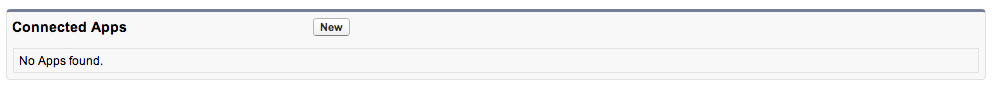
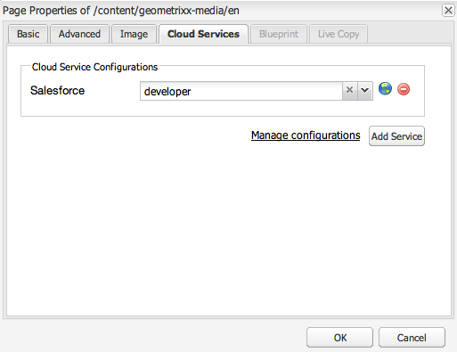
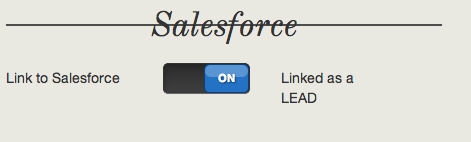

# Integración con Salesforce {#integrating-with-salesforce}

Al integrar Salesforce con Adobe Experience Manager (AEM), se proporcionan funciones de administración de posibles clientes y se utilizan las funciones existentes proporcionadas de forma predeterminada por Salesforce. Puede configurar AEM para que publique posibles clientes en Salesforce y cree componentes que accedan a los datos directamente desde Salesforce.

La integración bidireccional y ampliable entre AEM y Salesforce permite:

* Que las organizaciones utilicen y modifiquen completamente los datos para mejorar la experiencia del cliente.
* Participación desde el marketing hasta las actividades de ventas.
* Organizaciones que transmiten y reciben datos automáticamente desde un almacén de datos de Salesforce.

Este documento describe lo siguiente:

* Cómo configurar Salesforce Cloud Services (configurar AEM para integrarlo con Salesforce).
* Aprenda a utilizar la información de contactos y posibles clientes de Salesforce en Client Context y para Personalization.
* Aprenda a utilizar el modelo de flujo de trabajo de Salesforce para publicar usuarios de AEM como posibles clientes en Salesforce.
* Obtenga información sobre cómo crear un componente que muestre datos de Salesforce.

## Configuración de AEM para integrarlo con Salesforce {#configuring-aem-to-integrate-with-salesforce}

Para configurar AEM para que se integre con Salesforce, primero debe configurar una aplicación de acceso remoto en Salesforce. A continuación, configure el servicio en la nube de Salesforce para que se vincule a esta aplicación de acceso remoto.

>[!NOTE]
>
>Puede crear una cuenta de desarrollador gratuita en Salesforce.

Para configurar AEM para que se integre con Salesforce:

>[!CAUTION]
>
>Instale el paquete de integración [Salesforce Force API](https://experience.adobe.com/#/downloads/content/software-distribution/en/aem.html?fulltext=salesforce*&amp;orderby=%40jcr%3Acontent%2Fjcr%3AlastModified&amp;orderby.sort=desc&amp;layout=list&amp;p.offset=0&amp;p.limit=2&amp;package=%2Fcontent%2Fsoftware-distribution%2Fen%2Fdetails.html%2Fcontent%2Fdam%2Faem%2Fpublic%2Fadobe%2Fpackages%2Fcq650%2Ffeaturepack%2Fcom.adobe.cq.mcm.salesforce.content-1.0.4.zip) antes de continuar con el procedimiento. Para obtener más información sobre cómo trabajar con paquetes, consulte la página [Cómo trabajar con paquetes](/help/sites-administering/package-manager.md#package-share).

1. En AEM, vaya a **Cloud Services**. En Servicios de terceros, haga clic en **Configurar ahora** en **Salesforce**.

   

1. Cree una configuración, por ejemplo, **developer**.

   >[!NOTE]
   >
   >La nueva configuración redirige a una nueva página: **http://localhost:4502/etc/cloudservices/salesforce/developer.html**. Este es exactamente el mismo valor que debe especificar en la URL de devolución de llamada al crear la aplicación de acceso remoto en Salesforce. Estos valores deben coincidir.

1. Inicie sesión en su cuenta de Salesforce (o si no la tiene, créela en [https://developer.salesforce.com](https://developer.salesforce.com)).
1. En Salesforce, vaya a **Crear** > **Aplicaciones** para llegar a **Aplicaciones conectadas** (en versiones anteriores de Salesforce, el flujo de trabajo era **Implementar** > **Acceso remoto**).
1. Haga clic en **Nuevo** para poder conectar AEM con Salesforce.

   

1. Escriba el **nombre de la aplicación conectada**, **nombre de la API** y **correo electrónico de contacto**. Seleccione la casilla de verificación **Habilitar la configuración de OAuth**, escriba la **URL de devolución de llamada** y agregue un ámbito de OAuth (por ejemplo, acceso completo). La URL de devolución de llamada tiene un aspecto similar al siguiente: `http://localhost:4502/etc/cloudservices/salesforce/developer.html`

   Cambie el nombre del servidor/número de puerto y el nombre de página para que coincidan con la configuración.

   

1. Haga clic en **Guardar** para guardar la configuración de Salesforce. Salesforce crea una **clave de consumidor** y un **secreto de consumidor**, que necesita para la configuración de AEM.

   

   >[!NOTE]
   >
   >Espere varios minutos (hasta 15 minutos) para que se active la aplicación de acceso remoto en Salesforce.

1. En AEM, vaya a **Cloud Services** y luego a la configuración de Salesforce que creó anteriormente (por ejemplo, **desarrollador**). Haga clic en **Editar** e introduzca la clave de cliente y el secreto de cliente en salesforce.com.

   

   | URL de inicio de sesión | Este es el extremo de autorización de Salesforce. Su valor está rellenado previamente y sirve para la mayoría de los casos. |
   |---|---|
   | Clave de cliente | Escriba el valor obtenido de la página Registro de aplicación de acceso remoto en salesforce.com |
   | Secreto del cliente | Escriba el valor obtenido de la página Registro de aplicación de acceso remoto en salesforce.com |

1. Haga clic en **Conectarse a Salesforce** para conectarse. Salesforce solicita que permita que la configuración se conecte a Salesforce.

   

   En AEM, se abre un cuadro de diálogo de confirmación que le informa de que se ha conectado correctamente.

1. Vaya a la página raíz del sitio web y haga clic en **Propiedades de página**. A continuación, seleccione **Cloud Services**, añada **Salesforce** y seleccione la configuración correcta (por ejemplo, **desarrollador**).

   

   Ahora puede utilizar el modelo de flujo de trabajo para publicar posibles clientes en Salesforce y crear componentes que accedan a los datos desde Salesforce.

## Exportación de usuarios de AEM como posibles clientes de Salesforce {#exporting-aem-users-as-salesforce-leads}

Si desea exportar un usuario de AEM como posible cliente de Salesforce, configure el flujo de trabajo para publicar posibles clientes en Salesforce.

Para exportar usuarios de AEM como posibles clientes de Salesforce:

1. Vaya al flujo de trabajo de Salesforce en `http://localhost:4502/workflow` haciendo clic con el botón derecho en el flujo de trabajo **Salesforce.com Export** y haciendo clic en **Start**.

   

1. Seleccione el usuario de AEM que desee crear como posible cliente como **Carga** para este flujo de trabajo (inicio > usuarios). Asegúrese de seleccionar el nodo de perfil del usuario, ya que contiene información como **givenName** y **familyName**, que están asignados a los campos **FirstName** y **LastName** del posible cliente de Salesforce.

   

   >[!NOTE]
   >
   >Antes de iniciar este flujo de trabajo, hay ciertos campos obligatorios que un nodo de posible cliente de AEM debe tener antes de publicarse en Salesforce. Estos son **givenName**, **familyName**, **company** y **email**. Para ver una lista completa de asignaciones entre el usuario de AEM y el posible cliente de Salesforce, consulte [Configuración de asignación entre el usuario de AEM y el posible cliente de Salesforce.](#mapping-configuration-between-aem-user-and-salesforce-lead)

1. Haga clic en **Aceptar**. La información de usuario se exporta a salesforce.com. Puede verificarlo en salesforce.com.

   >[!NOTE]
   >
   >Los registros de errores muestran si se importa un posible cliente. Consulte el registro de errores para obtener más información.

### Configuración del flujo de trabajo de exportación de Salesforce.com {#configuring-the-salesforce-com-export-workflow}

Si es necesario, configure el flujo de trabajo de exportación de Salesforce.com para que coincida con la configuración correcta de Salesforce.com o para realizar otros cambios.

Para configurar el flujo de trabajo de exportación de Salesforce.com:

1. Navegue hasta `http://localhost:4502/cf#/etc/workflow/models/salesforce-com-export.html.`

   

1. Abra el paso Exportación de Salesforce.com, seleccione la ficha **Argumentos**, seleccione la configuración correcta y haga clic en **Aceptar**. Además, si desea que el flujo de trabajo vuelva a crear un posible cliente eliminado en Salesforce, active la casilla de verificación.

   

1. Haga clic en **Guardar** para guardar los cambios.

   

### Asignación de la configuración entre el usuario de AEM y el posible cliente de Salesforce {#mapping-configuration-between-aem-user-and-salesforce-lead}

Para ver o editar la configuración de asignación actual entre un usuario de AEM y un posible cliente de Salesforce, abra el Administrador de configuración: `https://<hostname>:<port>/system/console/configMgr` y busque **Configuración de asignación de posibles clientes de Salesforce**.

1. Abra el Administrador de configuración haciendo clic en **Consola web** o directamente en `https://<hostname>:<port>/system/console/configMgr.`
1. Busque **Configuración de asignación de posibles clientes de Salesforce**.

   

1. Cambie las asignaciones según sea necesario. La asignación predeterminada sigue el patrón **aemUserAttribute=sfLeadAttribute**. Haga clic en **Guardar** para guardar los cambios.

## Configuración del almacén de Client Context de Salesforce {#configuring-salesforce-client-context-store}

El almacén de contexto del cliente de Salesforce muestra información adicional sobre el usuario que ha iniciado sesión actualmente que lo que ya está disponible en AEM. Extrae esta información adicional de Salesforce según la conexión del usuario con Salesforce.

Para ello, configure lo siguiente:

1. Vincule un usuario de AEM con un Salesforce ID mediante el componente Salesforce Connect.
1. Agregue los datos de perfil de Salesforce a la página de contexto del cliente para poder configurar las propiedades que desea ver.
1. (Opcional) Cree un segmento que utilice los datos del almacén de Client Context de Salesforce.

### Vinculación de un usuario de AEM con un Salesforce ID {#linking-an-aem-user-with-a-salesforce-id}

Asigne un usuario de AEM con un Salesforce ID para que pueda cargarlo en el contexto del cliente. En una situación real, se establecería una vinculación basada en datos de usuario conocidos con validación. Para fines de demostración, en este procedimiento se utiliza el componente **Salesforce Connect**.

1. Vaya a un sitio web en AEM, inicie sesión, y arrastre y suelte el componente **Salesforce Connect** desde la barra de tareas.

   >[!NOTE]
   >
   >Si el componente **Salesforce Connect** no está disponible, ve a la vista **Diseño** y selecciónalo para que esté disponible en la vista **Editar**.

   

   Cuando arrastra el componente a la página, muestra **Vínculo a Salesforce=Desactivado**.

   

   >[!NOTE]
   >
   >Este componente solo tiene fines de demostración. En situaciones reales, habría otro proceso para vincular o hacer coincidir a los usuarios con posibles clientes.

1. Después de arrastrar el componente en la página, ábralo para configurarlo. Seleccione la configuración, el tipo de contacto y el posible cliente o contacto de Salesforce, y haga clic en **Aceptar**.

   

   AEM vincula al usuario con el contacto o el posible cliente de Salesforce.

   

### Añadir datos de Salesforce a Client Context {#adding-salesforce-data-to-client-context}

Puede cargar datos de usuario de Salesforce en Client Context para utilizarlos en la personalización:

1. Abra el contexto de cliente que desea ampliar navegando allí, por ejemplo, `http://localhost:4502/etc/clientcontext/default/content.html.`

   

1. Arrastre el componente **Datos de perfil de Salesforce** al contexto de cliente.

   

1. Abra el componente haciendo doble clic en él. Seleccione **Agregar elemento** y seleccione una propiedad de la lista desplegable. Agregue tantas propiedades como desee y seleccione **Aceptar**.

   

1. Ahora, verá las propiedades específicas de Salesforce de Salesforce en el contexto de cliente.

   

### Creación de un segmento con datos del almacén de Client Context de Salesforce {#building-a-segment-using-data-from-salesforce-client-context-store}

Puede generar un segmento que utilice datos del almacén de Client Context de Salesforce. Para ello, haga lo siguiente:

1. Vaya a la segmentación en AEM yendo a **Herramientas** > **Segmentación** o a [http://localhost:4502/miscadmin#/etc/segmentation](http://localhost:4502/miscadmin#/etc/segmentation).
1. Cree o actualice un segmento para incluir datos de Salesforce. Para obtener más información, consulte [Segmentación](/help/sites-administering/campaign-segmentation.md).

## Buscando posibles clientes {#searching-leads}

AEM se envía con un componente de búsqueda de muestra que busca posibles clientes en Salesforce según los criterios determinados. Este componente muestra cómo utilizar la API de REST de Salesforce para buscar objetos de Salesforce. Para almacenar en déclencheur una llamada a salesforce.com, vincule una página con una configuración de Salesforce.

>[!NOTE]
>
>Este es un componente de ejemplo que muestra cómo utilizar la API de REST de Salesforce para consultar objetos de Salesforce. Utilícelo como ejemplo para crear componentes más complejos según sus necesidades.

Para utilizar este componente:

1. Desplácese hasta la página en la que desee utilizar esta configuración. Abra las propiedades de la página y seleccione **Cloud Services.** Haz clic en **Agregar servicios** y selecciona **Salesforce**, la configuración adecuada, y haz clic en **Aceptar**.

   

1. Arrastre el componente de búsqueda de Salesforce a la página (siempre que se haya habilitado). Para habilitarlo, vaya al modo Diseño y agréguelo al área correspondiente).

   

1. Abra el componente Buscar, especifique los parámetros de búsqueda y haga clic en **Aceptar.**

   

1. AEM muestra los posibles clientes especificados en el componente de búsqueda que coinciden con los criterios especificados.

   
