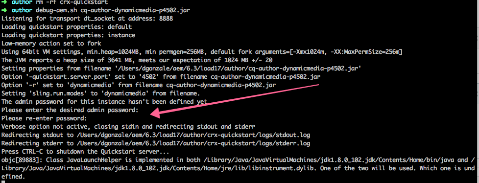

# Configuración de la contraseña de administración durante la instalación{#configure-the-admin-password-on-installation}

## Información general {#overview}

Desde la versión 6.3, Adobe Experience Manager (AEM) permite establecer la contraseña de administrador mediante la línea de comandos al instalar una nueva instancia.

Con versiones anteriores de AEM, la contraseña de la cuenta de administrador, junto con la contraseña de otras consolas, tuvieron que cambiarse después de la instalación.

Esta función añade la posibilidad de configurar una nueva contraseña de administrador para el repositorio y el motor servlet durante la instalación de una instancia de AEM, lo que elimina la necesidad de hacerlo manualmente más tarde.

>[!CAUTION]
>
>La función no cubre la consola Felix, para la cual la contraseña debe cambiarse manualmente. Para obtener más información, consulte la [sección de lista de comprobación de seguridad](/help/sites-administering/security-checklist.md#change-default-passwords-for-the-aem-and-osgi-console-admin-accounts) correspondiente.

## ¿Cómo lo uso? {#how-do-i-use-it}

Esta función se activa de forma automática si elige instalar AEM mediante la línea de comandos, en lugar de hacer doble clic en el JAR desde un explorador del sistema de archivos.

La sintaxis general para ejecutar una instancia de AEM desde la línea de comandos es la siguiente:

```shell
java -jar aem6.3.jar
```

Después de ejecutar la instancia desde la línea de comandos, se le presenta la opción de cambiar la contraseña de administrador durante el proceso de instalación:



>[!NOTE]
>
>La solicitud para cambiar la contraseña de administrador solo aparece durante la instalación de una nueva instancia de AEM.

## Uso del indicador -nointeractive {#using-the-nointeractive-flag}

También puede especificar la contraseña en un archivo de propiedades. Para ello, utilice el indicador `-nointeractive` combinado con la propiedad del sistema `-Dadmin.password.file`.

A continuación se muestra un ejemplo:

```shell
java -Dadmin.password.file =/path/to/passwordfile.properties -jar aem6.3.jar -nointeractive
```

La contraseña que se encuentra dentro del archivo `passwordfile.properties` debe tener el siguiente formato:

```xml
admin.password = 12345678
```

>[!NOTE]
>
>Si simplemente usa el parámetro `-nointeractive` sin la propiedad del sistema `-Dadmin.password.file`, AEM usa la contraseña de administrador predeterminada sin pedirle que la cambie, básicamente replicando el comportamiento de versiones anteriores. Este modo no interactivo se puede emplear para instalaciones automatizadas mediante la línea de comandos en un script de instalación.
