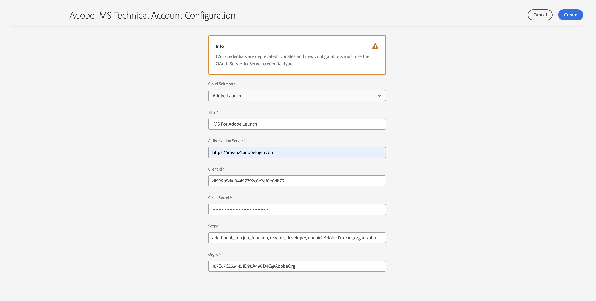

# Configuración de integraciones de IMS para AEM {#setting-up-ims-integrations-for-aem}

>[!NOTE]
>
>Los clientes de Adobe usan [Adobe Developer Console](https://developer.adobe.com/console) para generar credenciales que habiliten el acceso a varias API. Los clientes seleccionan entre varios tipos de credenciales, que van de servidor a servidor OAuth a aplicaciones de una sola página. El tipo de credencial Cuenta de servicio (JWT) ya no se utiliza en lugar de las credenciales de servidor a servidor de OAuth.

Adobe Experience Manager (AEM) se puede integrar con muchas otras soluciones de Adobe. Por ejemplo, Adobe Target y Adobe Analytics, entre otras.

Las integraciones utilizan una integración de IMS configurada con S2S OAuth.

* Después de crear:

  * [las credenciales en Developer Console](#credentials-in-the-developer-console)

* Puede avanzar con lo siguiente:

  * Crear una (nueva) [Configuración de OAuth](#creating-oauth-configuration)

  * [Migrar una configuración JWT existente a una configuración de OAuth.](#migrating-existing-JWT-configuration-to-oauth)

>[!CAUTION]
>
>Anteriormente, las configuraciones se hacían con las [credenciales JWT que ahora están en desuso en Adobe Developer Console](/help/sites-administering/jwt-credentials-deprecation-in-adobe-developer-console.md).
>
>Estas configuraciones ya no se pueden crear ni actualizar, pero sí migrar a las configuraciones de OAuth.

## Credenciales en Developer Console {#credentials-in-the-developer-console}

Como primer paso, debe configurar las credenciales de OAuth en Adobe Developer Console.

Para obtener más información sobre cómo realizar esta configuración, consulte la documentación de Developer Console, según sus necesidades:

* Información general:

  * [Autenticación de servidor a servidor](https://developer.adobe.com/developer-console/docs/guides/authentication/ServerToServerAuthentication/)

* Creación de una nueva credencial de OAuth:

  * [Guía de implementación de credenciales de servidor a servidor de OAuth](https://developer.adobe.com/developer-console/docs/guides/authentication/ServerToServerAuthentication/implementation)

* Migración de una credencial JWT existente a una credencial de OAuth:

  * [Migración de la credencial de cuenta de servicio (JWT) a la credencial de servidor a servidor OAuth](https://developer.adobe.com/developer-console/docs/guides/authentication/ServerToServerAuthentication/migration)

Por ejemplo:

## Creación de una configuración de OAuth {#creating-oauth-configuration}

Para crear una nueva integración de Adobe IMS con OAuth, haga lo siguiente:

1. En AEM, navegue hasta **Herramientas**, **Seguridad**, **Integración de IMS de Adobe**.

1. Seleccione **Crear**.

1. Complete la configuración en función de los detalles de [Developer Console](https://developer.adobe.com/developer-console/docs/guides/authentication/ServerToServerAuthentication/implementation). Por ejemplo:

   

1. **Guarde** los cambios.

## Migración de una configuración JWT existente a una configuración de OAuth {#migrating-existing-JWT-configuration-to-oauth}

Para migrar una integración de IMS de Adobe existente basada en las credenciales de JWT, haga lo siguiente:

>[!NOTE]
>
>Este ejemplo muestra una configuración de IMS de Launch.

1. En AEM, navegue hasta **Herramientas**, **Seguridad**, **Integración de IMS de Adobe**.

1. Seleccione la configuración JWT que debe migrarse. Las configuraciones JWT se marcan con la advertencia **Credenciales de JWT (en desuso)**.

1. Seleccione **Propiedades**.

   

1. La configuración se abre como de solo lectura:

   

1. Seleccione **OAuth** en la lista desplegable **Tipo de autenticación**:

   

1. Se actualizan las propiedades disponibles. Utilice los detalles de Developer Console para completarlos:

   

1. Use **Guardar y cerrar** para conservar las actualizaciones.
Cuando vuelva a la consola, la advertencia **Credenciales JWT (obsoletas)** desaparecerá.
