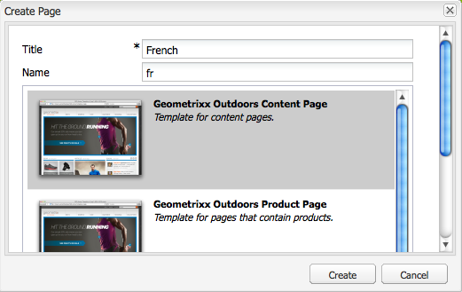
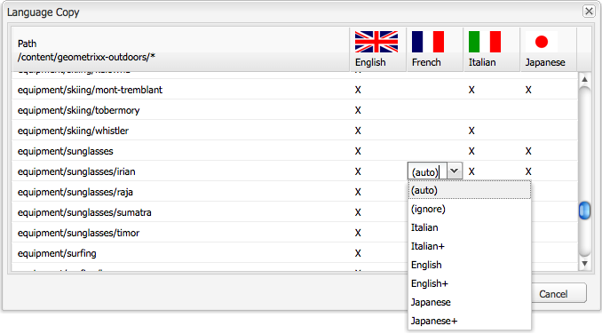

# Creación de una raíz de idioma mediante la IU clásica{#creating-a-language-root-using-the-classic-ui}

El siguiente procedimiento utiliza la IU clásica para crear una raíz de idioma de un sitio. Para obtener más información, vea [Crear una raíz de idioma](/help/sites-administering/tc-prep.md#creating-a-language-root).

1. En la consola Sitios web, en el árbol Sitios web, seleccione la página raíz del sitio. ([http://localhost:4502/siteadmin#](http://localhost:4502/siteadmin#))
1. Añada una nueva página secundaria que represente la versión de idioma del sitio:

   1. Haga clic en Nueva > Nueva página.
   1. En el cuadro de diálogo, especifique el Título y el Nombre. El nombre debe tener el formato de `<language-code>` o `<language-code>_<country-code>`, por ejemplo, en, en_US, en_us, en_GB, en_gb.

      * El código de idioma admitido es un código de dos letras en minúsculas tal como se define en la norma ISO-639-1
      * El código de país admitido es un código de dos letras en minúsculas o mayúsculas, tal como se define en la norma ISO 3166

   1. Seleccione la plantilla y haga clic en Crear.

   

1. En la consola Sitios web, en el árbol Sitios web, seleccione la página raíz del sitio.
1. En el menú Herramientas, seleccione Copia de idioma.

   

   El cuadro de diálogo Copia de idioma muestra una matriz de versiones de idiomas y páginas web disponibles. Una x en una columna de idioma significa que la página está disponible en ese idioma.

   

1. Para copiar una página o árbol de páginas existente en una versión de idioma, seleccione la celda de esa página en la columna idioma. Haga clic en la flecha y seleccione el tipo de copia que desea crear.

   En el siguiente ejemplo, la página equipamiento/gafas de sol/irian se está copiando a la versión en francés.

   

   | Tipo de copia de idioma | Descripción |
   |---|---|
   | auto | Utiliza el comportamiento de las páginas principales |
   | pasar por alto | No crea una copia de esta página y sus elementos secundarios |
   | `<language>+` (por ejemplo, francés+) | Copia la página y todos sus elementos secundarios de ese idioma |
   | `<language>` (por ejemplo, francés) | Copia sólo la página de ese idioma |

1. Haga clic en Aceptar para cerrar el cuadro de diálogo.
1. En el siguiente cuadro de diálogo, haga clic en Sí para confirmar la copia.
