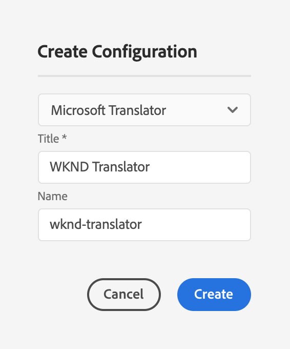
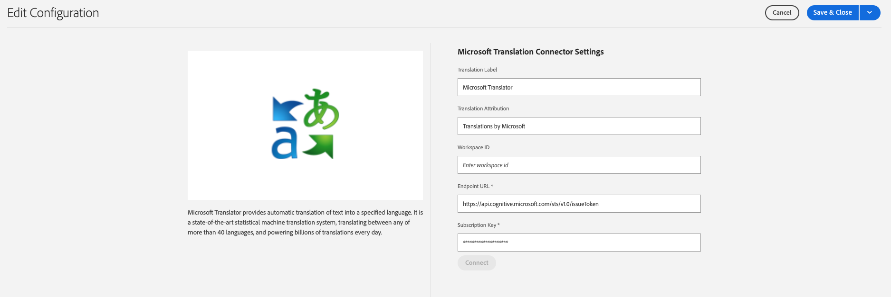

# Volver a conectar con Microsoft Translator {#connecting-to-microsoft-translator}

AEM proporciona un conector integrado para [Microsoft Translator](https://www.microsoft.com/es-es/translator/business/) para traducir contenido o recursos de la página. Después de obtener una licencia de Microsoft para utilizar Microsoft Translator, configure el conector siguiendo las instrucciones de esta página.

| Propiedad | Descripción |
|---|---|
| Etiqueta de traducción | El nombre para mostrar del servicio de traducción |
| Atribución de traducción | (Opcional) Para el contenido generado por el usuario, la atribución que aparece junto al texto traducido, por ejemplo, `Translations by Microsoft` |
| ID del espacio de trabajo | (Opcional) El ID del motor personalizado de Microsoft Translator que debe utilizar |
| Clave de suscripción | La clave de suscripción de Microsoft para Microsoft Translator |

El siguiente procedimiento crea una configuración de Microsoft Translator.

1. En el panel de navegación [haga clic](/help/sites-authoring/basic-handling.md#first-steps) en **Herramientas** > **Cloud Services** > **Cloud Services de traducción**.
1. Vaya a donde desea crear la configuración. Normalmente, se encuentra en la raíz del sitio o puede ser una configuración global predeterminada.
1. Haga clic en el botón **Crear**.
1. Defina la configuración.
   1. Seleccione **Microsoft Translator** en la lista desplegable.
   1. Escriba un título para la configuración. El título identifica la configuración en la consola Cloud Services y en las listas desplegables de propiedades de página.
   1. De forma opcional, escriba un nombre para usar para el nodo del repositorio que almacena la configuración.

   

1. Haga clic en **Crear**.
1. En la ventana **Editar configuración**, proporcione los valores para el servicio de traducción descrito en la tabla anterior.

   

1. Haga clic en **Conectar** para verificar la conexión.
1. Haga clic en **Guardar y cerrar**.

## Publicación de las configuraciones del servicio de traducción {#publishing-the-translator-service-configurations}

Como último paso, publique las configuraciones de Microsoft Translator para que admitan el contenido traducido publicado, mediante la acción [publicar un árbol](/help/sites-authoring/publishing-pages.md#publishing-and-unpublishing-a-tree).
