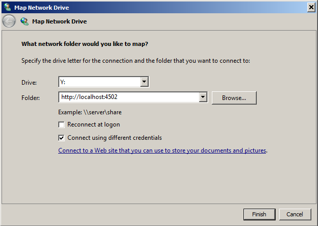

# Acceso a WebDAV{#webdav-access}

Para conectarse a AEM mediante WebDAV con KDE:

AEM ofrece compatibilidad con WebDAV que le permite mostrar y editar el contenido del repositorio. La conexión mediante WebDAV le permite acceder directamente al repositorio de contenido a través de su escritorio. Los archivos de texto y PDF que se agregan al repositorio a través de la conexión WebDAV se indexan automáticamente con texto completo y se pueden buscar con las interfaces de búsqueda estándar y a través de las API estándar de Java™.

## General {#general}

[En este documento se incluyen instrucciones detalladas por sistema operativo](/help/sites-administering/webdav-access.md#connecting-via-webdav), pero básicamente para conectarse al repositorio mediante el protocolo WebDAV, debe apuntar su cliente WebDAV a la siguiente ubicación:

```xml
http://localhost:4502
```


Esta dirección URL, cuando se conecta desde el nivel del sistema operativo, proporciona acceso WebDAV al área de trabajo predeterminada ( `crx.default`). A pesar de ser más sencillo para el usuario, no le proporciona la flexibilidad adicional de especificar nombres de área de trabajo, lo que se puede realizar utilizando [URL de WebDAV](/help/sites-administering/webdav-access.md#webdav-urls) adicionales.

AEM muestra el contenido del repositorio de la siguiente manera:

* Un nodo del tipo `nt:folder` se muestra como una carpeta. Los nodos situados debajo del nodo `nt:folder` se muestran como el contenido de la carpeta.

* Se muestra un nodo del tipo `nt:file` como archivo. Los nodos situados debajo del nodo `nt:file` no se muestran, sino que forman el contenido del archivo.

Cuando se usa WebDAV para crear y editar carpetas y archivos, AEM crea y edita los nodos necesarios de `nt:folder` y `nt:file`. Si planea usar WebDAV para importar y exportar contenido, intente trabajar con `nt:file` y `nt:folder` tipos de nodos tanto como sea posible.

>[!NOTE]
>
>Antes de configurar WebDAV, compruebe los [requisitos técnicos](/help/sites-deploying/technical-requirements.md#webdav-clients).

## URL de WebDAV {#webdav-urls}

La dirección URL del servidor WebDAV tiene la siguiente estructura:

<table>
 <colgroup>
  <col width="100" />
  <col width="100" />
  <col width="100" />
  <col width="100" />
  <col width="100" />
 </colgroup>
 <tbody>
  <tr>
   <td>
    <code>
     <strong>URL Component</strong>
    </code></td>
   <td><code>https://&lt;host&gt;:&lt;port&gt;</code></td>
   <td><code>/&lt;crx-webapp-path&gt;</code></td>
   <td><code>/repository</code></td>
   <td><code>/&lt;workspace&gt;</code></td>
  </tr>
  <tr>
   <td>
    <code>
     <strong>Example</strong>
    </code></td>
   <td><code>http://localhost:4502</code></td>
   <td><code>/crx</code></td>
   <td><code>/repository</code></td>
   <td><code>/crx.default</code></td>
  </tr>
  <tr>
   <td><strong>Descripción</strong></td>
   <td>Host y puerto en el que se ejecuta AEM</td>
   <td>Ruta para la aplicación web del repositorio de AEM</td>
   <td>Ruta a la que se asigna el servlet WebDAV</td>
   <td>Nombre del espacio de trabajo</td>
  </tr>
 </tbody>
</table>

Al cambiar el elemento de área de trabajo en la ruta de acceso, puede asignar áreas de trabajo que no sean las predeterminadas ( `crx.default`). Por ejemplo, para asignar un área de trabajo denominada `staging`, utilice la siguiente dirección URL:

```xml
http://localhost:4502/crx/repository/staging
```

## Conexión mediante WebDAV {#connecting-via-webdav}

[Como se mencionó anteriormente](/help/sites-administering/webdav-access.md#general), para conectarse al repositorio mediante el protocolo WebDAV, debe apuntar el cliente WebDAV a la ubicación del repositorio. Sin embargo, según el sistema operativo, los pasos necesarios para conectar al cliente difieren y es posible que se requiera una configuración del sistema operativo.

Se proporcionan instrucciones sobre cómo conectar los siguientes sistemas operativos:

* [Windows](/help/sites-administering/webdav-access.md#windows)
* [macOS](/help/sites-administering/webdav-access.md#macos)
* [Linux](/help/sites-administering/webdav-access.md#linux)

### Windows {#windows}

Para conectar correctamente un sistema Microsoft® Windows 7 (y posterior) a una instancia de AEM que no esté protegida con SSL, la opción para establecer la autenticación básica en una red no segura debe estar habilitada explícitamente en Windows. Esta capacidad requiere un cambio en el Registro de Windows de WebClient.

Una vez actualizado el Registro, la instancia de AEM se puede asignar como una unidad.

#### Configuración de Windows 7 y posterior {#windows-and-greater-configuration}

Para actualizar el Registro para permitir la autenticación básica en una red no segura:

1. Busque la siguiente subclave del Registro:

   ```xml
   HKEY_LOCAL_MACHINE\SYSTEM\CurrentControlSet\Services\WebClient\Parameters
   ```

1. Establezca la subclave de entrada del Registro `BasicAuthLevel` en un valor de `2` o superior.

   Si no está presente, agregue la subclave.

1. Reinicie el sistema para que el cambio del Registro surta efecto.

>[!NOTE]
>
>Adobe recomienda crear un usuario de Windows con las mismas credenciales que el usuario del repositorio; de lo contrario, podrían producirse conflictos de permisos.

#### Configuración de Windows 8 {#windows-configuration}

Para Windows 8, cambie la entrada del Registro [tal como se describe para Windows 7 y versiones posteriores](/help/sites-administering/webdav-access.md#windows-and-greater-configuration). Sin embargo, antes de realizar esta tarea, la Experiencia de escritorio debe estar habilitada para ver la entrada del Registro.

Para habilitar la experiencia de escritorio, abre **Administrador de servidores**, **Características**, **Agregar características** y **Experiencia de escritorio**.

Después del reinicio, está disponible la entrada del Registro descrita para Windows 7 y posterior. Modifique la configuración tal como se describe para Windows 7 y versiones posteriores.

#### Conexión en Windows {#connecting-in-windows}

Para conectarse a AEM a través de WebDAV en un entorno Windows:

1. Abra **Windows Explorer** o **File Explorer** y haga clic en **Equipo** o **Este equipo**.

   

1. Para iniciar el asistente, haga clic en **Asignar unidad de red**.
1. Introduzca los detalles de asignación:

   * **Unidad**: elija cualquier carta disponible
   * **Carpeta**: `http://localhost:4502`
   * Comprobar **conexión con credenciales diferentes**

   Haga clic en Finalizar

   

   >[!NOTE]
   >
   >Si AEM está en otro puerto, utilice ese número de puerto en lugar de 4502. Además, si no está ejecutando el repositorio de contenido en su equipo local, reemplace `localhost` por el nombre del servidor o la dirección IP correspondientes.

1. Escriba el nombre de usuario `admin` y la contraseña `admin`. Adobe recomienda usar la cuenta de administrador preconfigurada para realizar pruebas.

   

1. El asistente se cierra y la unidad recién asignada se abre en una ventana del Explorador de Windows o del Explorador de archivos.

   

Windows ahora ha asignado AEM como unidad a través de WebDAV y puede utilizarlo como cualquier otra unidad.

### macOS {#macos}

No se requieren pasos de configuración para conectarse mediante WebDAV en macOS. Puede conectarse al servidor WebDAV.

1. Vaya a cualquier ventana de **Finder** y haga clic en **Ir** y **Conectarse al servidor**, o bien presione **Comando+k**.
1. En la ventana **Conectarse al servidor**, escriba la ubicación de AEM:

   * `http://localhost:4502`

   >[!NOTE]
   >
   >Si AEM está en otro puerto, utilice ese número de puerto en lugar de 4502. Además, si no está ejecutando el repositorio de contenido en su equipo local, reemplace `localhost` por el nombre del servidor o la dirección IP correspondientes.

1. Cuando se le pida autenticación, escriba el nombre de usuario `admin` y la contraseña `admin`. Adobe recomienda usar la cuenta de administrador preconfigurada para realizar pruebas.

macOS ahora se ha conectado a AEM a través de WebDAV y puede utilizarlo como cualquier otra carpeta de su Mac.

### Linux® {#linux}

La conexión a través de WebDAV en Linux® no requiere ninguna configuración, pero implica algunos pasos para realizar la conexión que varían según el entorno de escritorio.

#### GNOMO {#gnome}

Para conectarse a AEM a través de WebDAV con GNOME:

1. En Nautilus (explorador de archivos), seleccione **Places** y seleccione **Conectar con servidor**.
1. En la ventana **Conectarse al servidor**, seleccione WebDAV (HTTP) en Tipo de servicio.

1. En **Servidor**, escriba `http://localhost:4502/crx/repository/crx.default`

   >[!NOTE]
   >
   >Si AEM está en otro puerto, utilice ese número de puerto en lugar de 4502. Además, si no está ejecutando el repositorio de contenido en su equipo local, reemplace `localhost` por el nombre del servidor o la dirección IP correspondientes.

1. En **carpeta**, escriba `/dav`
1. Escriba el nombre de usuario `admin`. Adobe recomienda usar la cuenta de administrador preconfigurada para realizar pruebas.
1. Deje el puerto en blanco e introduzca cualquier nombre para la conexión.
1. Haga clic en **Conectar**. AEM le pedirá su contraseña.
1. Escriba la contraseña `admin` y haga clic en **Conectar**.

GNOME ahora ha montado AEM como un volumen y puede usarlo como cualquier otro volumen.

#### KDE {#kde}

1. Abra el asistente Carpeta de red.
1. Seleccione **WebFolder**(webdav) y haga clic en Siguiente.
1. En **Nombre**, escriba un nombre de conexión.
1. En **Usuario**, escriba `admin.` Adobe recomienda que use la cuenta de administrador preconfigurada.
1. En **Servidor**, escriba `http://localhost:4502/crx/repository/crx.default`

   >[!NOTE]
   >
   >Si AEM está en otro puerto, utilice ese número de puerto en lugar de 4502. Además, si no está ejecutando el repositorio de contenido en su equipo local, reemplace `localhost` por el nombre del servidor o la dirección IP correspondientes

1. En **carpeta**, escriba `dav`

1. Haz clic en **Guardar y conectar**.
1. Cuando se le pida su contraseña, ingrese la contraseña `admin` y haga clic en **Conectar**.

KDE ha montado AEM como volumen y puede usarlo como cualquier otro volumen.
