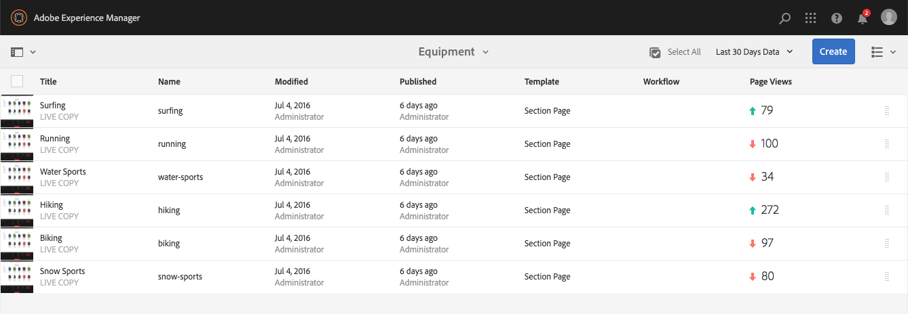
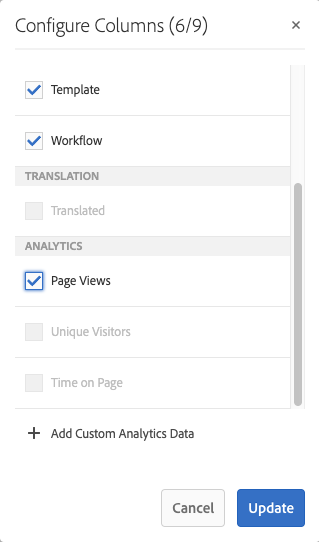
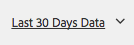
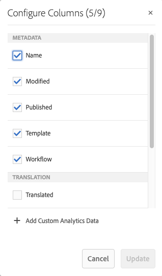
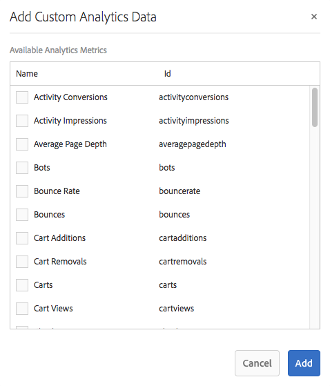
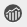

# Visualización de datos de análisis de la página{#seeing-page-analytics-data}

Utilice datos de análisis de página para medir la eficacia del contenido de la página.

## Analytics visible desde la consola {#analytics-visible-from-the-console}

Los datos de análisis de página se muestran en [Vista de lista](/help/sites-authoring/basic-handling.md#list-view) de la consola Sitios. Cuando las páginas se muestran en formato de lista, las siguientes columnas están disponibles de forma predeterminada:

* Vistas de la página
* Visitantes únicos
* Tiempo empleado en la página

Cada columna muestra un valor para el período de informe actual e indica si el valor ha aumentado o disminuido desde el período de informe anterior. Los datos que ve se actualizan cada 12 horas.

>[!NOTE]
>
>Para cambiar el período de actualización, [configure el intervalo de importación](/help/sites-administering/adobeanalytics-connect.md#configuring-the-import-interval).

1. Abra la consola **Sitios**; por ejemplo, [https://localhost:4502/sites.html/content](https://localhost:4502/sites.html/content)
1. En el extremo derecho de la barra de herramientas (esquina superior derecha), haga clic en el icono para seleccionar **Vista de lista** (el icono mostrado dependerá de la [vista actual](/help/sites-authoring/basic-handling.md#viewing-and-selecting-resources)).

1. De nuevo, en el extremo derecho de la barra de herramientas (esquina superior derecha), haga clic en el icono y seleccione **Ver configuración**. Se abre el cuadro de diálogo **Configurar columnas**. Realice los cambios necesarios y confirme con **Actualizar**.

   

### Selección del período de informe {#selecting-the-reporting-period}

Seleccione el período de informe para el que aparecen los datos de Analytics en la consola Sitios:

* Datos de los últimos 30 días
* Datos de los últimos 90 días
* Datos de este año

El periodo de informe actual aparece en la barra de herramientas de la consola Sitios (a la derecha de la barra de herramientas superior). Utilice la lista desplegable para seleccionar el periodo de informe requerido.

### Configuración de columnas de datos disponibles {#configuring-available-data-columns}

Los miembros del grupo de usuarios administradores de Analytics pueden configurar la consola Sitios para permitir que los autores vean columnas de Analytics adicionales.

>[!NOTE]
>
>Cuando un árbol de páginas contiene elementos secundarios asociados con diferentes configuraciones de nube de Adobe Analytics, no se pueden configurar las columnas de datos disponibles para las páginas.

1. En la vista de lista, use los selectores de vista (a la derecha de la barra de herramientas), seleccione **Ver configuración** y, a continuación, **Agregar datos personalizados de Analytics**.

   

1. Seleccione las métricas que desee exponer a los autores en la consola Sitios y, a continuación, haga clic en **Agregar**.

   Las columnas que aparecen se recuperan de Adobe Analytics.

   

### Apertura de perspectivas de contenido desde sitios {#opening-content-insights-from-sites}

Abra [Insight de contenido](/help/sites-authoring/content-insights.md) desde la consola Sitios para investigar más a fondo la efectividad de la página.

1. En la consola Sitios, seleccione la página para la que desea ver las perspectivas de contenido.
1. En la barra de herramientas, haga clic en el icono Analytics and Recommendations.

   

## Análisis visible desde el Editor de páginas (Activity Map) {#analytics-visible-from-the-page-editor-activity-map}

>[!CAUTION]
>
>Debido a los cambios de seguridad de la API de Adobe Analytics, ya no es posible utilizar la versión de Activity Map incluida en AEM.
>
>Ahora se debe usar el complemento [ActivityMap proporcionado por Adobe Analytics](https://experienceleague.adobe.com/docs/analytics/analyze/activity-map/getting-started/get-started-users/activitymap-install.html?lang=es).
