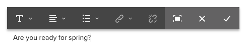

# Uso del editor de texto enriquecido para crear contenido {#use-rich-text-editor-to-author-content}

El editor de texto enriquecido (RTE) es un bloque de creación básico para insertar contenido de texto en AEM. Constituye la base de diversos componentes, entre ellos, los siguientes:

* [Texto](https://experienceleague.adobe.com/es/docs/experience-manager-core-components/using/wcm-components/text)
* [Tabla](https://experienceleague.adobe.com/es/docs/experience-manager-core-components/using/wcm-components/text#table)

## Edición in situ {#in-place-editing}

Si se selecciona un componente basado en texto con un solo clic, se mostrará [la barra de herramientas de componentes](/help/sites-authoring/editing-content.md#edit-configure-copy-cut-delete-paste), como con cualquier otro componente.

Si vuelve a pulsar o hacer clic en el componente, o si inicialmente lo selecciona con un doble clic lento, se abre la edición in-situ, que tiene su propia barra de herramientas. Aquí puede editar el contenido y realizar cambios básicos de formato.

Esta barra de herramientas ofrece las opciones siguientes:

* **Formato**: Esto le permite establecer negrita, cursiva y subrayado.
* **Listas**: con esta opción puede crear listas con viñetas o números, o establecer la sangría.
* **Hipervínculo**
* **Desvincular**
* **Pantalla completa**
* **Cerrar**
* **Guardar**

## Edición en pantalla completa {#full-screen-editing}

Para los componentes basados en texto, al pulsar el modo de pantalla completa en la barra de herramientas  se abre el editor de texto enriquecido y se oculta el resto del contenido de la página.

El modo de pantalla completa muestra todas las opciones configuradas que puede utilizar para la creación. La disponibilidad es opciones [depende de la configuración](/help/sites-administering/rich-text-editor.md).

Entre las opciones adicionales del editor de texto enriquecido están:

* **Anclaje**: crea en el texto un anclaje al que posteriormente puede hacer referencia o emplear como vínculo.
* **Alinear texto a la izquierda**
* **Centrar texto**
* **Alinear texto a la derecha**

Cierre el modo de pantalla completa haciendo clic en el icono de minimizar.

>[!NOTE]
>
>Copiar listas anidadas de Microsoft Word en el editor de texto enriquecido puede dar resultados incoherentes y necesitar un ajuste manual después de pegar el texto en el editor de texto enriquecido.
