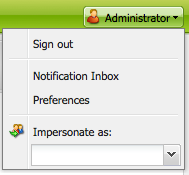
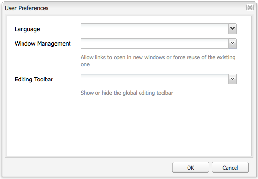

# Configuración del entorno de cuenta{#configuring-your-account-environment}

Adobe Experience Manager (AEM) permite configurar la cuenta y ciertos elementos del entorno de creación.

Si usa la [configuración de cuenta](#account-settings) y las [preferencias de usuario](#user-preferences), se pueden definir las siguientes opciones y preferencias:

* **Barra de herramientas de edición**
Seleccione si desea tener la barra de herramientas de edición global. Esta barra de herramientas, que se muestra en la parte superior de la ventana del explorador, le proporciona los botones **Copiar**, **Cortar**, **Pegar**, **Eliminar** para usarlos con los componentes de párrafo de esa página:

  * Mostrar si es necesario (predeterminado)
  * Mostrar siempre
  * Mantener oculto

* **Suplantar como**
La funcionalidad de [Suplantar como](/help/sites-administering/security.md#impersonating-another-user) permite que un usuario trabaje en nombre de otro usuario.

* **Idioma**
El idioma que se utilizará para la interfaz de usuario del entorno de creación. Seleccione el idioma requerido de la lista disponible.

* **Administración de ventanas**
Seleccione una de estas opciones:

  * Varias ventanas (predeterminado)
    Las páginas se abren en una nueva ventana.
  * Ventana única
    Las páginas se abren en la ventana actual.

## Configuración de la cuenta {#account-settings}

El icono de usuario le permite acceder a las siguientes opciones:

* Cerrar sesión
* [Suplantar como](/help/sites-administering/security.md#impersonating-another-user)
* [Preferencias de usuario](#user-preferences)
* [Bandeja de entrada de notificaciones](/help/sites-classic-ui-authoring/author-env-inbox.md)

### Preferencias de usuario {#user-preferences}

Cada usuario puede establecer determinadas propiedades por sí mismo. Esto está disponible en el cuadro de diálogo **Preferencias** en la esquina superior derecha de las consolas.

El cuadro de diálogo ofrece las siguientes opciones:

