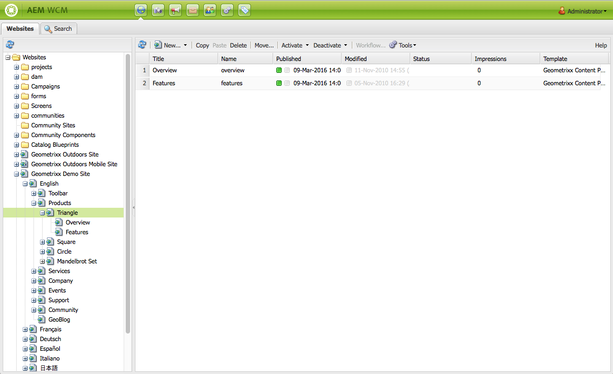
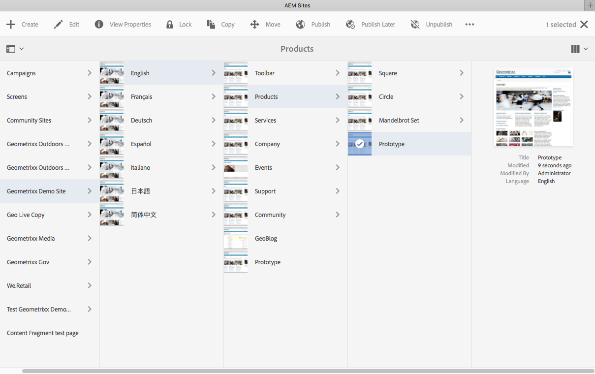
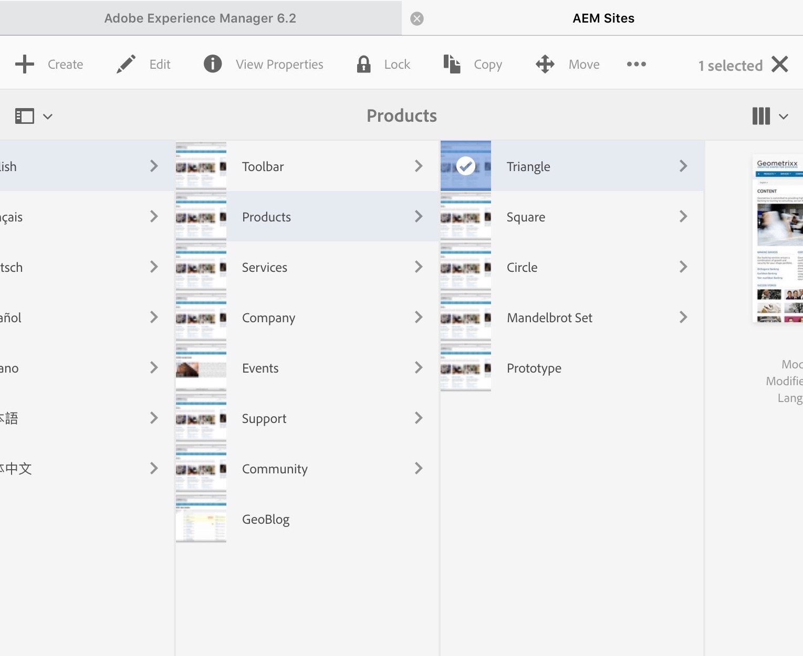

# Uso del entorno de creación{#working-with-the-author-environment}

>[!NOTE]
>
>La siguiente documentación se centra en la IU clásica. Para obtener información sobre la creación en la IU moderna y táctil, consulte la [documentación de creación estándar](/help/assets/assets.md).

El entorno de creación permite realizar tareas relacionadas con lo siguiente:

* [Creación](/help/sites-authoring/author.md) (incluyendo [creación de páginas](/help/sites-authoring/qg-page-authoring.md) y [administración de recursos](/help/assets/assets.md))

* [Administrar](/help/sites-administering/administer-best-practices.md) tareas que necesita al generar y mantener el contenido del sitio web

Se proporcionan dos interfaces gráficas de usuario para conseguirlo, a las que se puede acceder mediante cualquier navegador moderno:

1. IU clásica

   * Esta interfaz de usuario siempre ha estado disponible en AEM durante muchos años.
   * Es predominantemente verde.
   * Fue diseñado para su uso en dispositivos de escritorio.
   * Ya no se mantiene.
   * La siguiente documentación se centra en esta IU clásica. Para obtener información sobre la creación en la IU moderna y táctil, consulte la [documentación de creación estándar](/help/sites-authoring/author.md).

   

1. IU táctil.

   * Esta es la interfaz de usuario moderna y estándar de AEM.
   * Es predominantemente gris, con una interfaz limpia y plana.
   * Está diseñado para su uso tanto en dispositivos táctiles como de escritorio (optimizado para el tacto). El aspecto es el mismo en todos los dispositivos, aunque [ver y seleccionar tus recursos](/help/sites-authoring/basic-handling.md) difiere un poco (se puede tocar o hacer clic).
   * Consulte la [documentación de creación estándar](/help/sites-authoring/author.md) para obtener más información sobre cómo crear contenido mediante la interfaz de usuario táctil. La siguiente documentación se centra en la IU clásica.

   * Escritorio:

   

   * Dispositivos Tablet (o equipos de escritorio de menos de 1024 píxeles de ancho):

   
