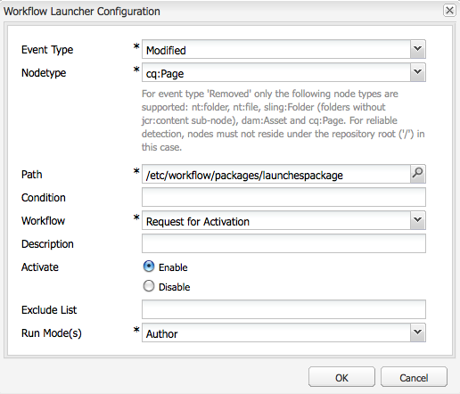

# Promoción de lanzamientos{#promoting-launches}

Debe promocionar las páginas de lanzamiento para devolver el contenido al origen (producción) antes de publicarlo. Cuando se promociona una página de lanzamiento, la página correspondiente de las páginas de origen se reemplaza con el contenido de la página promocionada. Las siguientes opciones están disponibles al promocionar una página de lanzamiento:

* Promocionar solo la página actual o todo el lanzamiento.
* Promocionar las páginas secundarias de la página actual.
* Promocionar el lanzamiento completo o solo las páginas que han cambiado.

## Promoción de páginas de lanzamiento {#promoting-launch-pages}

Para promocionar páginas, realice los siguientes pasos mientras edita la página de lanzamiento que desea promocionar:

1. En la ficha **Página** de Sidekick, haga clic en **Promocionar lanzamiento**.
1. Especifique las páginas que promocionar:

   * (Predeterminado) Para promocionar solo la página actual, seleccione **Promocionar cambios de página a la versión de producción**.
   * Para promocionar también las páginas secundarias de la página actual, seleccione **Incluir páginas secundarias**.
   * Para promocionar todas las páginas del lanzamiento, seleccione **Promocionar lanzamiento completo a la versión de producción**.

1. Para agregar las páginas de producción a un paquete de flujo de trabajo, seleccione **Agregar a paquete de flujo de trabajo** y luego seleccione el paquete de flujo de trabajo.
1. Haga clic en **Promocionar**.

## Procesamiento de páginas promocionadas mediante el flujo de trabajo de AEM {#processing-promoted-pages-using-aem-workflow}

Utilice modelos de flujo de trabajo para realizar procesamientos masivos de páginas de lanzamiento promocionadas:

1. Cree un paquete de flujo de trabajo.
1. Cuando los autores promocionan páginas de lanzamiento, las guardan en el paquete de flujo de trabajo.
1. Inicie un modelo de flujo de trabajo con el paquete como carga útil.

Para iniciar un flujo de trabajo automáticamente cuando se promocionen páginas, [configure un iniciador de flujo de trabajo](/help/sites-administering/workflows-starting.md#workflows-launchers) para el nodo de paquete.

Por ejemplo, puede generar automáticamente solicitudes de activación de página cuando los autores promocionen páginas de lanzamiento. Configure un lanzador de flujo de trabajo para iniciar el flujo de trabajo de activación de solicitud cuando se modifique el nodo del paquete.

