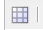

# Ofertas de Target{#target-offers}

## Creación de una experiencia de oferta de Test&amp;Target {#creating-a-test-target-offer-experience}

1. Seleccione la nueva campaña en el panel izquierdo o haga doble clic en ella en el panel derecho.
1. Seleccione la vista de lista con el icono:

   

1. Haga clic en **Nuevo...**
1. Puede especificar **Title**, **Name** y el tipo de experiencia que se creará; en este caso, oferta de Test&amp;Target.

   

1. Haga clic en **Crear**.

   >[!NOTE]
   >
   >Las experiencias de Test&amp;Target no aparecen actualmente en el MCM. Se puede acceder a ellos desde la consola **Sitios web**, en Campañas.

## Integración con Adobe Target {#integrating-with-adobe-target}

Consulte [Integrar con Adobe](/help/sites-administering/target.md) [Target](/help/sites-administering/target.md) para obtener información detallada.
