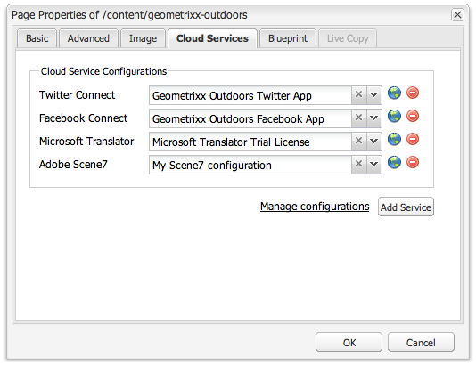
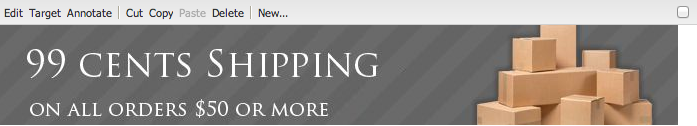
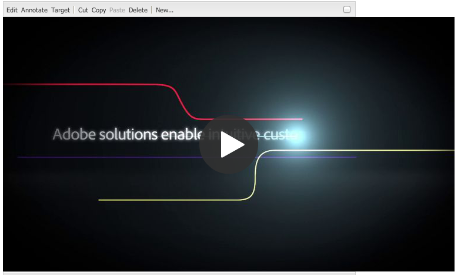

# Añadir funciones de Dynamic Media Classic (Scene7) a la página{#adding-scene-features-to-your-page}

[Adobe Dynamic Media Classic (Scene7)](https://experienceleague.adobe.com/docs/dynamic-media-classic/using/home.html?lang=es) es una solución hospedada para administrar, mejorar, publicar y entregar recursos de medios enriquecidos en pantallas e impresiones web, móviles, de correo electrónico y conectadas a Internet.

Puede ver los recursos de Experience Manager publicados en Dynamic Media Classic (Scene7) en varios visores:

* Zoom
* Flotante
* Vídeo
* Plantilla de imagen
* Imagen

Puede publicar recursos digitales directamente desde Experience Manager en Dynamic Media Classic (Scene7) y publicar recursos digitales desde Dynamic Media Classic (Scene7) en Experience Manager.

En este documento se describe cómo publicar recursos digitales de Experience Manager en Dynamic Media Classic (Scene7) y a la inversa. Los espectadores también se describen en detalle. Para obtener información sobre la configuración de Experience Manager para Dynamic Media Classic (Scene7), consulte [Integración de Dynamic Media Classic (Scene7) con Experience Manager](/help/sites-administering/scene7.md).

Consulte también [Agregar mapas de imagen](/help/assets/image-maps.md).

Para obtener más información sobre el uso de componentes de vídeo con Experience Manager, consulte lo siguiente:

* [Vídeo](/help/sites-classic-ui-authoring/manage-assets-classic-s7-video.md)

>[!NOTE]
>
>Si los recursos de Dynamic Media Classic (Scene7) no se muestran correctamente, asegúrese de que Dynamic Media esté [deshabilitado](/help/assets/config-dynamic.md#disabling-dynamic-media) y, a continuación, actualice la página.

## Publicación manual en Dynamic Media Classic (Scene7) desde Assets {#manually-publishing-to-scene-from-assets}

Puede publicar recursos digitales en Dynamic Media Classic (Scene7) desde la consola de Assets en la IU clásica o directamente desde el recurso.

>[!NOTE]
>
>Experience Manager publica en Dynamic Media Classic (Scene7) de forma asincrónica. Después de seleccionar **[!UICONTROL Publicar]**, su recurso puede tardar varios segundos en publicarse en Dynamic Media Classic (Scene7).
>

### Publicación desde la consola de Assets {#publishing-from-the-assets-console}

Puede publicar en Dynamic Media Classic (Scene7) desde la consola de Assets si los recursos están en una carpeta de destino de Dynamic Media Classic (Scene7).

1. En la IU de Experience Manager Classic, seleccione **[!UICONTROL Assets digital]** para acceder al administrador de recursos digitales.

1. Seleccione el recurso (o los recursos) o la carpeta que desee publicar en Dynamic Media Classic (Scene7), haga clic con el botón derecho y seleccione **[!UICONTROL Publicar en Dynamic Media Classic (Scene7)]**. También puede seleccionar **[!UICONTROL Publicar en Dynamic Media Classic (Scene7)]** en el menú **[!UICONTROL Herramientas]**.

   

1. Vaya a Dynamic Media Classic (Scene7) y confirme que los recursos están disponibles.

   >[!NOTE]
   >
   >Si los recursos no están sincronizados en una carpeta de Dynamic Media Classic (Scene7), **[!UICONTROL Publicar en Dynamic Media Classic (Scene7)]** en ambos menús está visible pero deshabilitado.

### Publicar desde un recurso {#publishing-from-an-asset}

Puede publicar manualmente un recurso siempre que esté ubicado dentro de la carpeta sincronizada de Dynamic Media Classic (Scene7).

>[!NOTE]
>
>Si el recurso no está en la carpeta sincronizada de Dynamic Media Classic (Scene7), no aparecerá el vínculo a **[!UICONTROL Publicar en Dynamic Media Classic (Scene7)]**.

Para publicar en Dynamic Media Classic (Scene7) directamente desde un recurso digital:

1. En Experience Manager, seleccione **[!UICONTROL Assets digital]** para acceder al administrador de recursos digitales.

1. Haga doble clic para abrir un recurso.

1. En el panel de detalles del recurso, seleccione **[!UICONTROL Publicar en Dynamic Media Classic (Scene7)]**.

   

1. El vínculo cambia a **[!UICONTROL Publicando...]** y luego a **[!UICONTROL Publicado]**. Vaya a Dynamic Media Classic (Scene7) y confirme que el recurso está disponible.

   >[!NOTE]
   >
   >Si el recurso no se publica correctamente en Dynamic Media Classic (Scene7), el vínculo cambia a **[!UICONTROL Error de publicación]**. Si el recurso ya se ha publicado en Dynamic Media Classic (Scene7), el vínculo indica **[!UICONTROL Volver a publicar en Dynamic Media Classic (Scene7)]**. La republicación permite cambiar recursos en Experience Manager y volver a publicarlos.

### Publicar recursos desde fuera de la carpeta de destino de CQ {#publishing-assets-from-outside-the-cq-target-folder}

Adobe recomienda publicar recursos en Dynamic Media Classic (Scene7) únicamente desde recursos de la carpeta de destino de Dynamic Media Classic (Scene7). Sin embargo, si debe cargar recursos desde una carpeta que no pertenezca a la carpeta de destino, puede hacerlo cargándolos en una carpeta bajo demanda en Dynamic Media Classic (Scene7). En primer lugar, configure Cloud para la página en la que desea que aparezca el recurso. A continuación, agregue un componente de Dynamic Media Classic (Scene7) a la página y arrastre y suelte un recurso en el componente. Una vez establecidas las propiedades de página para esa página, aparece un vínculo **[!UICONTROL Publicar en Dynamic Media Classic (Scene7)]** que aparece al cargar los déclencheur seleccionados en Dynamic Media Classic (Scene7).

>[!NOTE]
>
>Los Assets que se encuentran en la carpeta bajo demanda no aparecen en el explorador de contenido de Dynamic Media Classic (Scene7).

**Para publicar recursos desde fuera de la carpeta de destino de CQ:**

1. En Experience Manager, en la IU clásica, seleccione **[!UICONTROL Sitios web]** y vaya a la página web a la que desee agregar un recurso digital que aún no se haya publicado en Dynamic Media Classic (Scene7). (Se aplican reglas normales de herencia de página).

1. En la barra de tareas, seleccione el icono **[!UICONTROL Página]** y seleccione **[!UICONTROL Propiedades de página]**.

1. Seleccione **[!UICONTROL Cloud Services]**.
1. Seleccione **[!UICONTROL Agregar servicios]**.
1. Seleccione **[!UICONTROL Dynamic Media Classic (Scene7)]**.
1. En la lista desplegable **[!UICONTROL Adobe Dynamic Media Classic (Scene7)]**, seleccione la configuración que desee y seleccione **[!UICONTROL Aceptar]**.

   

1. En la página web, añada un componente Dynamic Media Classic (Scene7) a la ubicación deseada en la página.
1. Desde el buscador de contenido, arrastre un recurso digital al componente. Verá un vínculo a **[!UICONTROL Comprobar el estado de publicación de Dynamic Media Classic (Scene7)]**.

   >[!NOTE]
   >
   >Si el recurso digital está en la carpeta de destino CQ, no aparecerá ningún vínculo a **[!UICONTROL Comprobar el estado de publicación de Dynamic Media Classic (Scene7)]**. Los recursos se colocan en el componente.

   

1. Seleccione **[!UICONTROL Comprobar el estado de publicación de Dynamic Media Classic (Scene7)]**. Si los recursos no se publican, Experience Manager publica el recurso en Dynamic Media Classic (Scene7). Una vez cargado, el recurso se encuentra en la carpeta bajo demanda. De manera predeterminada, la carpeta bajo demanda se encuentra en **[!UICONTROL nombre_de_la_compañía/CQ5_adhoc]**. Puede [configurar la carpeta bajo demanda, si es necesario](#configuringtheadhocfolder).

   >[!NOTE]
   >
   >Si el recurso no está en una carpeta sincronizada de Dynamic Media Classic (Scene7) y no hay ninguna configuración de nube de Dynamic Media Classic (Scene7) asociada a la página actual, se produce un error en la carga.

## Componentes de Dynamic Media Classic (Scene7) {#scene-components}

Los siguientes componentes de Dynamic Media Classic (Scene7) están disponibles en Experience Manager:

* Zoom
* Flotante (Zoom)
* Plantilla de imagen
* Imagen
* Vídeo

>[!NOTE]
>
>Estos componentes no están disponibles de forma predeterminada y deben seleccionarse en el modo Diseño antes de utilizar.

Una vez que estén disponibles en el modo Diseño, puede agregar los componentes a la página como cualquier otro componente de Experience Manager. Las Assets que aún no se han publicado en Dynamic Media Classic (Scene7) se publican en Dynamic Media Classic (Scene7) si se encuentran en una carpeta sincronizada o en una página, o con una configuración de nube de Dynamic Media Classic (Scene7).

>[!NOTE]
>
>Si está creando y desarrollando visores S7 personalizados y está utilizando el buscador de contenido, debe agregar explícitamente el parámetro `allowfullscreen`.

### Aviso de fin de vida útil para el visor Flash {#flash-viewers-end-of-life-notice}

A partir del 31 de enero de 2017, Adobe Dynamic Media Classic (Scene7) dejará de ofrecer asistencia oficial para la plataforma de visor Flash.

### Adición de un componente de Dynamic Media Classic (Scene7) a una página {#adding-a-scene-component-to-a-page}

Añadir un componente de Dynamic Media Classic (Scene7) a una página es lo mismo que añadir un componente a cualquier página. Los componentes de Dynamic Media Classic (Scene7) se describen en detalle en las secciones siguientes.

Para añadir un componente o visor de Dynamic Media Classic (Scene7) a una página en la IU clásica:

1. En Experience Manager, abra la página donde desee agregar el componente Dynamic Media Classic (Scene7).

1. Si no hay componentes de Dynamic Media Classic (Scene7) disponibles, selecciona la regla de la barra de tareas para entrar en el modo **Diseño**, selecciona **[!UICONTROL Editar]** parsys y selecciona todos los componentes de **[!UICONTROL Dynamic Media Classic (Scene7)]** para que estén disponibles.

1. Vuelva al modo **Editar** seleccionando el lápiz en la barra de tareas.

1. Arrastre un componente del grupo **[!UICONTROL Dynamic Media Classic (Scene7)]** de la barra de tareas a la página en la ubicación deseada.

1. Seleccione ***[!UICONTROL Editar]** para poder abrir el componente.

1. Edite el componente según sea necesario y seleccione **[!UICONTROL Aceptar]** para guardar los cambios.

### Añadir experiencias de visualización interactivas a un sitio web interactivo {#adding-interactive-viewing-experiences-to-a-responsive-website}

El diseño interactivo para sus recursos significa que los recursos se adaptarán según dónde se muestren. Con un diseño interactivo, los mismos recursos se pueden visualizar de forma eficaz en varios dispositivos.

Para agregar una experiencia de visualización interactiva a un sitio adaptable en la IU clásica:

1. Inicie sesión en Experience Manager y compruebe que ha [configurado los servicios en la nube de Adobe Dynamic Media Classic (Scene7)](/help/sites-administering/scene7.md#configuring-scene-integration) y que los componentes de Dynamic Media Classic (Scene7) están disponibles.

   >[!NOTE]
   >
   >Si los componentes WCM de Dynamic Media Classic (Scene7) no están disponibles, asegúrese de activarlos en el modo Diseño.

1. En un sitio web con los componentes de Dynamic Media Classic (Scene7) habilitados, arrastra un visor de **[!UICONTROL Imagen]** a la página.
1. Edite el componente y ajuste los puntos de interrupción en la ficha **[!UICONTROL Configuración de Dynamic Media Classic (Scene7)]**.

   

1. Confirme que los visores cambian de tamaño de forma interactiva y que todas las interacciones están optimizadas para equipos de escritorio, tabletas y móviles.

### Configuración común a todos los componentes de Dynamic Media Classic (Scene7) {#settings-common-to-all-scene-components}

Aunque las opciones de configuración varían, los siguientes elementos son comunes a todos los componentes de Dynamic Media Classic (Scene7):

* **Referencia de archivo**: busque un archivo al que desee hacer referencia. La referencia de archivo muestra la URL del recurso y no necesariamente la URL completa de Dynamic Media Classic (Scene7), incluidos los comandos y parámetros de URL. No se pueden añadir comandos y parámetros de URL de Dynamic Media Classic (Scene7) en este campo. En su lugar, se deben agregar a través de la funcionalidad correspondiente en el componente.
* **Anchura** - Le permite establecer la anchura.
* **Altura**: le permite establecer la altura.

Estas opciones de configuración se establecen abriendo (haciendo doble clic) en un componente de Dynamic Media Classic (Scene7); por ejemplo, al abrir un componente **Zoom**:

### Zoom {#zoom}

El componente Zoom HTML5 muestra una imagen más grande al pulsar el botón +.

El recurso tiene herramientas de zoom en la parte inferior. Seleccione **[!UICONTROL +]** para ampliar. Seleccione **[!UICONTROL -]** para reducir. Si se selecciona **[!UICONTROL x]** o la flecha de zoom de restablecimiento, la imagen recuperará el tamaño original con el que se importó. Seleccione las flechas diagonales para que pueda hacerlo a pantalla completa. Seleccione **[!UICONTROL Editar]** para poder configurar el componente. Con este componente, puede configurar [opciones comunes a todos los componentes de Dynamic Media Classic (Scene7)](#settings-common-to-all-scene-components).

### Flotante {#flyout}

En el componente flotante de HTML5, el recurso se muestra como una pantalla dividida; dejó el recurso en el tamaño especificado; a la derecha, se muestra la parte de zoom. Seleccione **[!UICONTROL Editar]** para poder configurar el componente. Con este componente, puede configurar [opciones comunes a todos los componentes de Dynamic Media Classic (Scene7)](/help/sites-administering/scene7.md#settingscommontoallscene7components).

>[!NOTE]
>
>Si el componente flotante utiliza un tamaño personalizado, se utilizará ese tamaño personalizado y la configuración adaptable del componente estará desactivada.
>
>Si el componente flotante utiliza el tamaño predeterminado, tal como se establece en la vista Diseño, se utilizará el tamaño predeterminado. El componente se amplía para dar cabida al tamaño del diseño de página con la configuración adaptable del componente habilitada. Sin embargo, tenga en cuenta que existe una limitación en la configuración interactiva del componente. Cuando utilice el componente flotante con configuración adaptable, no debe utilizarlo con ampliación de página completa. De lo contrario, el menú flotante puede extenderse más allá del borde derecho de la página.

### Imagen {#image}

El componente Imagen de Dynamic Media Classic (Scene7) permite añadir la funcionalidad de Dynamic Media Classic (Scene7) a las imágenes, como los modificadores de Dynamic Media Classic (Scene7), los ajustes preestablecidos de imagen o visualizador y el enfoque. El componente de imagen Dynamic Media Classic (Scene7) es similar a otros componentes de imagen de Experience Manager con funcionalidad especial de Dynamic Media Classic (Scene7). En este ejemplo, la imagen tiene aplicado el modificador de URL Dynamic Media Classic (Scene7) `&op_invert=1`.

**Título, texto alternativo**: en la ficha Avanzadas, agregue un título a la imagen y texto alternativo para los usuarios que tienen los gráficos desactivados.

**URL, Abrir en**: puede configurar un recurso desde para abrir un vínculo. Configure la dirección URL y, en Abrir en, indique si desea que se abra en la misma ventana o en una nueva.

**Ajuste preestablecido de visor**: seleccione un ajuste preestablecido de visor existente en el menú desplegable. Si el ajuste preestablecido de visualizador que busca no está visible, debe hacerlo visible. Consulte Administración de ajustes preestablecidos de visor. No puede seleccionar un ajuste preestablecido de visualizador si utiliza un ajuste preestablecido de imagen y a la inversa.

**Configuración de Dynamic Media Classic (Scene7)**: seleccione la configuración de Dynamic Media Classic (Scene7) que desee usar para recuperar los ajustes preestablecidos de imagen activos de SPS.

**Ajuste preestablecido de imagen**: seleccione un ajuste preestablecido de imagen existente en el menú desplegable. Si el ajuste preestablecido de imagen que está buscando no está visible, debe hacerlo visible. Consulte Administración de ajustes preestablecidos de imagen. No puede seleccionar un ajuste preestablecido de visualizador si utiliza un ajuste preestablecido de imagen y a la inversa.

**Formato de salida** - Seleccione el formato de salida de la imagen, por ejemplo, jpeg. Según el formato de salida seleccionado, puede tener opciones de configuración adicionales. Consulte Prácticas recomendadas de ajustes preestablecidos de imagen.

**Enfoque** - Seleccione cómo desea enfocar la imagen. El enfoque se explica en detalle en Prácticas recomendadas de ajustes preestablecidos de imagen y Prácticas recomendadas de enfoque.

**Modificadores de URL**: puede cambiar los efectos de imagen suministrando comandos de imagen S7 adicionales. Estos comandos se describen en Ajustes preestablecidos de imagen y en la Referencia del comando.

**Puntos de interrupción**: si el sitio web responde, desea ajustar los puntos de interrupción. Los puntos de interrupción deben estar separados por comas (,).

### Plantilla de imagen {#image-template}

Las plantillas de imagen de Dynamic Media Classic (Scene7) son contenidos de Photoshop con capas que se importaron en Dynamic Media Classic (Scene7), donde el contenido y las propiedades se parametrizaron para tener en cuenta la variabilidad. El componente **[!UICONTROL Image template]** permite importar imágenes y cambiar el texto dinámicamente en Experience Manager. Además, puede configurar el componente **[!UICONTROL Plantilla de imagen]** para que utilice valores del contexto del cliente, de modo que cada usuario experimente la imagen de forma personalizada.

Seleccione **[!UICONTROL Editar]** - para configurar el componente. Puede configurar [opciones comunes a todos los componentes de Dynamic Media Classic (Scene7)](/help/sites-administering/scene7.md#settingscommontoallscene7components) y otras opciones que se describen en esta sección.

**Referencia de archivo, anchura y altura** - Ver [configuración común a todos los componentes de Dynamic Media Classic (Scene7)](/help/sites-administering/scene7.md#settingscommontoallscene7components).

>[!NOTE]
>
>Los comandos y parámetros de URL de Dynamic Media Classic (Scene7) no se pueden añadir directamente a la URL de referencia de archivos. Solo se pueden definir en la interfaz de usuario del componente en el panel **[!UICONTROL Parámetro]**.

**Título, texto alternativo**: en la ficha Plantilla de imagen de Dynamic Media Classic (Scene7), agregue un título a la imagen y texto alternativo para los usuarios que tengan los gráficos desactivados.

**URL, Abrir en**: puede configurar un recurso desde para abrir un vínculo. Configure la dirección URL y, en Abrir en, indique si desea que se abra en la misma ventana o en una nueva.

**Panel de parámetros**: al importar una imagen, los parámetros se rellenan previamente con información de la imagen. Si no hay contenido que se pueda cambiar dinámicamente, esta ventana está vacía.

#### Cambiar texto dinámicamente {#changing-text-dynamically}

Para cambiar el texto dinámicamente, escribe nuevo texto en los campos y selecciona **[!UICONTROL Aceptar]**. En este ejemplo, el **Precio** cuesta ahora 50 dólares y el envío 99 centavos.

El texto de la imagen cambia. Para restablecer el texto al valor original, selecciona **[!UICONTROL Restablecer]** junto al campo.

#### Cambiar texto para reflejar el valor de un valor de contexto de cliente {#changing-text-to-reflect-the-value-of-a-client-context-value}

Para vincular un campo a un valor de contexto de cliente, seleccione **[!UICONTROL Seleccionar]** para abrir el menú cliente-contexto, seleccione el contexto de cliente y seleccione **[!UICONTROL Aceptar]**. En este ejemplo, el nombre cambia en función de la vinculación del nombre con el nombre con formato del perfil.

El texto refleja el nombre del usuario que ha iniciado sesión actualmente. Para restablecer el texto al valor original, selecciona **[!UICONTROL Restablecer]** junto al campo.

#### Hacer de la plantilla de imagen de Dynamic Media Classic (Scene7) un vínculo {#making-the-scene-image-template-a-link}

Puede hacer que el componente de plantilla de imagen de Dynamic Media Classic (Scene7) sea un vínculo en el que se puede hacer clic.

1. En la página con el componente de plantilla de imagen Dynamic Media Classic (Scene7), seleccione **[!UICONTROL Editar]**.
1. En el campo **[!UICONTROL URL]**, escriba la URL a la que se dirigirán los usuarios cuando se haga clic en la imagen. En el campo **[!UICONTROL Abrir en]**, seleccione si desea que se abra el destino (una nueva ventana o la misma ventana).

   

1. Seleccione **[!UICONTROL Aceptar]**.

### Componente de vídeo {#video-component}

El componente **[!UICONTROL Vídeo]** de Dynamic Media Classic (Scene7) (disponible en la sección Dynamic Media Classic (Scene7) de la barra de tareas) utiliza la detección del dispositivo y el ancho de banda para proporcionar el vídeo adecuado a cada pantalla. Este componente es un reproductor de vídeo HTML5; es un visualizador único que se puede utilizar en canales múltiples.

Se puede utilizar para conjuntos de vídeos adaptables, un solo vídeo MP4 o un solo vídeo F4V.

Consulte [Vídeo](/help/sites-classic-ui-authoring/manage-assets-classic-s7-video.md) para obtener más información sobre cómo funcionan los vídeos con la integración de Dynamic Media Classic (Scene7). Además, vea cómo se compara [el componente de vídeo **Dynamic Media Classic (Scene7)** con el componente **video** de base](/help/sites-classic-ui-authoring/manage-assets-classic-s7-video.md).

### Limitaciones conocidas del componente de vídeo {#known-limitations-for-the-video-component}

Adobe DAM y WCM muestran si se ha cargado un vídeo de origen principal. No muestran estos recursos proxy:

* Representaciones codificadas en Dynamic Media Classic (Scene7)
* Conjuntos de vídeos adaptables de Dynamic Media Classic (Scene7)

Cuando se utiliza un conjunto de vídeos adaptable con el componente de vídeo de Dynamic Media Classic (Scene7), se debe cambiar el tamaño del componente para adaptarlo a las dimensiones del vídeo.

## Explorador de contenido de Dynamic Media Classic (Scene7) {#scene-content-browser}

El explorador de contenido Dynamic Media Classic (Scene7) permite ver contenido de Dynamic Media Classic (Scene7) directamente en Experience Manager. Para acceder al navegador de contenido, en el Buscador de contenido, selecciona **Dynamic Media Classic (Scene7)** en la interfaz de usuario táctil o el icono **S7** en la interfaz de usuario clásica. La funcionalidad es idéntica entre ambas interfaces de usuario.

Si tiene varias configuraciones, Experience Manager muestra de forma predeterminada la [configuración predeterminada](/help/sites-administering/scene7.md#configuring-a-default-configuration). Puede seleccionar diferentes configuraciones directamente en el explorador de contenido de Dynamic Media Classic (Scene7) en el menú desplegable.

>[!NOTE]
>
>* Assets en la carpeta bajo demanda no aparece en el explorador de contenido de Dynamic Media Classic (Scene7).
>* Cuando [Vista previa segura está habilitada](/help/sites-administering/scene7.md#configuring-the-state-published-unpublished-of-assets-pushed-to-scene), los recursos publicados y no publicados en Dynamic Media Classic (Scene7) no aparecen en el explorador de contenido de Dynamic Media Classic (Scene7).
>* Si no ve **[!UICONTROL Dynamic Media Classic (Scene7)]** o el icono **[!UICONTROL S7]** como opción en el explorador de contenido, debe [configurar Dynamic Media Classic (Scene7) para que funcione con Experience Manager](/help/sites-administering/scene7.md).
>* Para vídeo, el explorador de contenido de Dynamic Media Classic (Scene7) admite:
>   * Conjuntos de vídeos adaptables: contenedor de todas las representaciones de vídeo necesarias para una reproducción perfecta en varias pantallas
>   * Vídeo MP4 único
>   * Vídeo F4V único

### Examinar contenido {#browsing-content-in-the-classic-ui}

Examine el contenido en Dynamic Media Classic (Scene7) seleccionando la pestaña **[!UICONTROL S7]**.

Puede cambiar la configuración a la que accede seleccionando la configuración. Las carpetas cambian según la configuración seleccionada.

Al igual que con el buscador de contenido para Assets, puede buscar recursos y filtrar resultados. Sin embargo, a diferencia del buscador de Assets, al escribir una palabra clave en la ficha **S7**, el nombre de archivo **comienza con** la cadena que ha escrito, en lugar de **que contiene** la palabra clave en el nombre de archivo.

De forma predeterminada, los recursos se muestran por nombre de archivo. Sin embargo, también puede filtrar los resultados por tipo de recurso.

>[!NOTE]
>
>Para vídeo, el explorador de contenido Dynamic Media Classic (Scene7) de WCM admite:
>
>* Conjuntos de vídeos adaptables: contenedor de todas las representaciones de vídeo necesarias para una reproducción perfecta en varias pantallas
>* Vídeo MP4 único
>* Vídeo F4V único
>

### Búsqueda de recursos de Dynamic Media Classic (Scene7) con el explorador de contenido {#searching-for-scene-assets-with-the-content-browser}

La búsqueda de recursos de Dynamic Media Classic (Scene7) es similar a la búsqueda de recursos de Experience Manager. La excepción es que, al realizar una búsqueda, realmente está viendo una vista remota de los recursos en el sistema de Dynamic Media Classic (Scene7), en lugar de importarlos directamente a Experience Manager.

Puede utilizar la IU clásica o la UI táctil optimizada para ver y buscar recursos. Según la interfaz, la forma de buscar es ligeramente diferente.

Al buscar en cualquiera de las interfaces de usuario, puede filtrar por los siguientes criterios (que se muestran aquí en la interfaz de usuario táctil optimizada):

**Escribir palabras clave**: puede buscar recursos por nombre. Al buscar las palabras clave, escriba el nombre del archivo por el que comienza. Por ejemplo, si escribe la palabra &quot;nadar&quot;, buscará cualquier nombre de archivo de recursos que comience con esas letras en ese orden. Asegúrese de seleccionar `Enter` después de escribir el término para buscar el recurso.

**Carpeta/ruta**: el nombre de la carpeta se basa en la configuración seleccionada. Puede explorar en profundidad los niveles inferiores seleccionando el icono de carpeta y una subcarpeta, y después la marca de verificación para seleccionarla.

Si introduce una palabra clave y selecciona una carpeta, Experience Manager busca en esa carpeta y en las subcarpetas. Sin embargo, si no introduce ninguna palabra clave al buscar, al seleccionar la carpeta solo se muestran los recursos de esa carpeta y no se incluye ninguna subcarpeta.

De forma predeterminada, Experience Manager busca en la carpeta seleccionada y en todas las subcarpetas.

**Tipo de recurso**: seleccione Dynamic Media Classic (Scene7) para examinar el contenido de Dynamic Media Classic (Scene7). Esta opción solo está disponible si se ha configurado Dynamic Media Classic (Scene7).

**Configuración**: si tiene más de una configuración de Dynamic Media Classic (Scene7) definida en Cloud Services, puede seleccionarla aquí. Como resultado, la carpeta cambia según la configuración elegida.

**Tipo de recurso**: en el explorador Dynamic Media Classic (Scene7), puede filtrar los resultados para incluir cualquiera de los siguientes: imágenes, plantillas, vídeos y conjuntos de vídeos adaptables. Si no selecciona ningún tipo de recurso, Experience Manager busca de forma predeterminada en todos los tipos de recursos.

>[!NOTE]
>
>* En la IU clásica, también puedes buscar **Flash** y **FXG**. No se admite el filtrado para estos dos términos en la IU táctil optimizada.
>
>* Al buscar vídeo, busca en una sola representación. Los resultados devuelven la representación original (solo &#42;.mp4) y la representación codificada.
* Al buscar en un conjunto de vídeos adaptable, está buscando en la carpeta y en todas las subcarpetas, pero solo si ha añadido una palabra clave a la búsqueda. Si no ha agregado una palabra clave, Experience Manager no busca en las subcarpetas.
>

**Estado de publicación**: puede filtrar recursos en función del estado de publicación: No publicado o Publicado. Si no selecciona ningún estado de publicación, Experience Manager busca de forma predeterminada en todos los estados de publicación.

