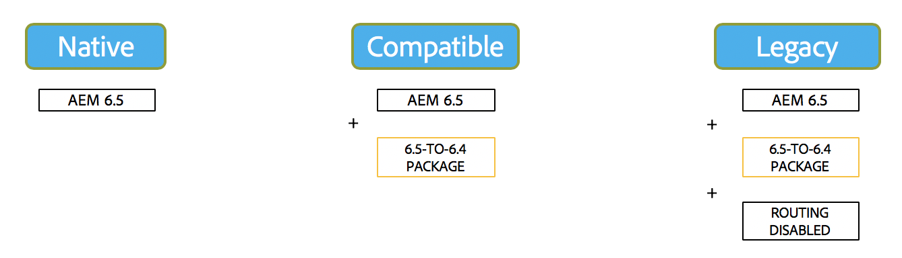

# Compatibilidad con versiones anteriores en AEM 6.5{#backward-compatibility-in-aem}

## Información general {#overview}

En Adobe Experience Manager (AEM) 6.5, todas las funciones se han desarrollado teniendo en cuenta la compatibilidad con versiones anteriores.

Normalmente, los clientes que ejecutan AEM 6.3 no deben tener que cambiar el código o las personalizaciones al realizar la actualización. Para los clientes de AEM 6.1 y 6.2, no hay cambios importantes adicionales a los que se enfrentaría durante una actualización a 6.3.

En el caso de las excepciones en las que las funciones no se podían mantener compatibles con versiones anteriores, se pueden mitigar los problemas de incompatibilidad con versiones anteriores para paquetes y contenido. Para ello, instale un paquete de compatibilidad para 6.4 (consulte cómo configurarlo a continuación para obtener más información sobre dónde descargarlo). Este paquete de compatibilidad ayuda a restaurar la compatibilidad normalmente para aplicaciones compatibles con AEM 6.4.

El paquete de compatibilidad permite ejecutar AEM en modo de compatibilidad y retrasar el desarrollo personalizado respecto a las nuevas funciones de AEM:

>[!NOTE]
>
>El paquete de compatibilidad es solo una solución temporal para retrasar el desarrollo necesario para ser compatible con AEM 6.5. Adobe solo lo recomienda como última opción si no puede solucionar los problemas de compatibilidad mediante el desarrollo inmediatamente después de la actualización. Además, Adobe recomienda cambiar al modo nativo y desinstalar el paquete de compatibilidad una vez que decida continuar con el desarrollo personalizado basado en 6.5 y disponer de la funcionalidad completa de 6.5.

El paquete de compatibilidad tiene dos modos: **Enrutamiento habilitado** y **Enrutamiento deshabilitado**.

Esto permite que AEM 6.5 se ejecute en tres modos:

**Modo nativo:**

El modo nativo es para los clientes que desean utilizar todas las nuevas funciones de AEM 6.5 y están listos para realizar algún desarrollo para que sus personalizaciones funcionen con todas las funciones nuevas.

Esto significa que debe ajustar la aplicación inmediatamente después de la actualización.

**Modo de compatibilidad: paquete de compatibilidad instalado con enrutamiento habilitado**

El modo de compatibilidad es para clientes que tienen personalizaciones de interfaces que no son compatibles con versiones anteriores. Esto permite que AEM se ejecute en modo de compatibilidad y aplace el desarrollo personalizado necesario para nuevas funciones de AEM que no son compatibles con algunos de sus códigos personalizados.

**Modo heredado: paquete de compatibilidad instalado con enrutamiento deshabilitado**

El modo heredado es para clientes con interfaces personalizadas basadas en código heredado o obsoleto de AEM que se ha eliminado del paquete de compatibilidad.

## Configuración {#how-to-set-up}

El **Paquete de compatibilidad de AEM 6.4 para 6.5** se puede instalar como paquete usando el Administrador de paquetes. Puede descargar el [Paquete de compatibilidad de AEM 6.4 para 6.5 desde el sitio Distribución de software](https://experience.adobe.com/#/downloads/content/software-distribution/en/aem.html?fulltext=compat*&amp;orderby=%40jcr%3Acontent%2Fjcr%3AlastModified&amp;orderby.sort=desc&amp;layout=list&amp;p.offset=0&amp;p.limit=20&amp;package=%2Fcontent%2Fsoftware-distribution%2Fen%2Fdetails.html%2Fcontent%2Fdam%2Faem%2Fpublic%2Fadobe%2Fpackages%2Fcq650%2Fcompatpack%2Faem-compat-cq65-to-cq64).

Una vez instalado el paquete de compatibilidad, el enrutamiento se puede habilitar o deshabilitar mediante un conmutador en la configuración OSGI, como se muestra a continuación:

Una vez instalado y configurado el paquete de compatibilidad, las funciones se utilizan en función del modo de compatibilidad que se haya elegido.
