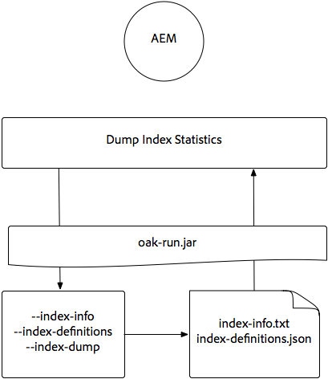
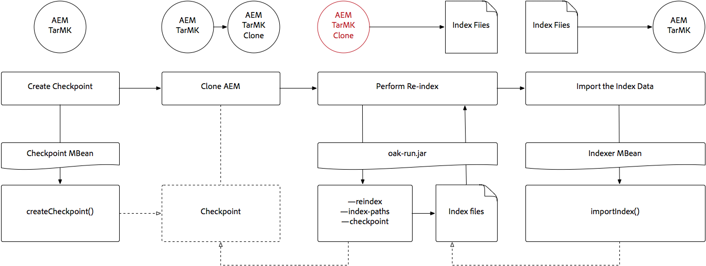

# Indexación mediante el Jar ejecutado por Oak {#indexing-via-the-oak-run-jar}

Oak-run admite todos los casos de uso de indexación en la línea de comandos sin tener que operar desde el nivel JMX. Las ventajas del enfoque oak-run son:

1. Es un nuevo conjunto de herramientas de indexación para AEM 6.4
1. Reduce el tiempo de reindexación, lo que afecta positivamente a los tiempos de reindexación en repositorios más grandes
1. Reduce el consumo de recursos durante la reindexación en AEM, lo que resulta en un mejor rendimiento del sistema para otras actividades de AEM
1. La ejecución de Oak proporciona compatibilidad fuera de banda: Si las condiciones de producción no permiten ejecutar reindexaciones en instancias de producción, se puede utilizar un entorno clonado para la reindexación a fin de evitar un impacto crítico en el rendimiento.

A continuación se muestra una lista de casos de uso que se pueden utilizar al realizar operaciones de indexación mediante la herramienta `oak-run`.

## Comprobaciones de coherencia de índice {#indexconsistencychecks}

>[!NOTE]
>
>Para obtener información más detallada sobre este escenario, consulte [Caso de uso 1 - Comprobación de coherencia del índice](/help/sites-deploying/oak-run-indexing-usecases.md#usercase1indexconsistencycheck).

* `oak-run.jar` determina rápidamente si los índices de Lucene Oak están dañados.
* Es seguro ejecutarse en una instancia de AEM en uso para los niveles de comprobación de coherencia 1 y 2.

## Estadísticas de índice {#indexstatistics}

>[!NOTE]
>
>Para obtener información más detallada sobre este escenario, consulte [Caso de uso 2 - Estadísticas de índice](/help/sites-deploying/oak-run-indexing-usecases.md#usecase2indexstatistics)

* `oak-run.jar` elimina todas las definiciones de índice, las estadísticas de índice importantes y el contenido de índice para el análisis sin conexión.
* Es seguro ejecutarlo en una instancia de AEM en uso.

## Árbol de decisión de método de reindexación {#reindexingapproachdecisiontree}

Este diagrama es un árbol de decisión para saber cuándo utilizar los distintos métodos de reindexación.

## Reindexación de MongoMK/RDMBMK {#reindexingmongomk}

>[!NOTE]
>
>Para obtener información más detallada sobre este escenario, consulte [Caso de uso 3 - Reindexación](/help/sites-deploying/oak-run-indexing-usecases.md#usecase3reindexing).

### Extracción previa de texto para SegmentNodeStore y DocumentNodeStore {#textpre-extraction}

[La extracción previa de texto](/help/sites-deploying/best-practices-for-queries-and-indexing.md#how-to-perform-text-pre-extraction) (una característica que existe con AEM 6.3) se puede usar para reducir el tiempo de reindexación. La preextracción de texto se puede utilizar con todos los enfoques de reindexación.

Dependiendo del método de indexación `oak-run.jar`, hay varios pasos a cada lado del paso Realizar reindexación en el diagrama siguiente.

>[!NOTE]
>
>Naranja indica las actividades en las que AEM debe estar en una ventana de mantenimiento.

### Reindexación en línea para MongoMK o RDBMK con oak-run.jar {#onlinere-indexingformongomk}

>[!NOTE]
>
>Para obtener información más detallada sobre este escenario, vea [Reindex: DocumentNodeStore](/help/sites-deploying/oak-run-indexing-usecases.md#reindexdocumentnodestore).

Este es el método recomendado para reindexar instalaciones de AEM MongoMK (y RDBMK). No se debe utilizar ningún otro método.

Ejecute este proceso solo con una instancia de AEM del clúster.

## Reindexación de TarMK {#re-indexingtarmk}

>[!NOTE]
>
>Para obtener información más detallada sobre este escenario, consulte [Reindexar: SegmentNodeStore](/help/sites-deploying/oak-run-indexing-usecases.md#reindexsegmentnodestore).

* **Consideraciones de espera en frío (TarMK)**

   * No hay consideraciones especiales para el modo de espera en frío; las instancias de espera en frío se sincronizan como de costumbre.

* **Granjas de publicación de AEM (las granjas de publicación de AEM siempre deben ser TarMK)**

   * Para la granja de servidores de publicación, debe realizarse para todos los pasos O ejecutar en una sola publicación. A continuación, clone la configuración para otros (tomando todas las precauciones habituales al clonar instancias de AEM; sling.id: debe vincularse a algo aquí).

### Reindexación en línea para TarMK {#onlinere-indexingfortarmk}

>[!NOTE]
>
>Para obtener información más detallada sobre este escenario, consulte [Reindexación en línea: SegmentNodeStore](/help/sites-deploying/oak-run-indexing-usecases.md#onlinereindexsegmentnodestore).

Este es el método utilizado antes de la introducción de las nuevas capacidades de indexación de oak-run.jar. Se realiza estableciendo la propiedad `reindex=true` en el índice Oak.

Este método se puede utilizar si el cliente acepta los efectos de tiempo y rendimiento que se van a indexar. Este suele ser el caso de las instalaciones de AEM pequeñas y medianas.

### Reindexación en línea de TarMK con oak-run.jar {#onlinere-indexingtarmkusingoak-run-jar}

>[!NOTE]
>
>Para obtener información más detallada sobre este escenario, consulte [Reindexación en línea - SegmentNodeStore - La instancia de AEM se está ejecutando](/help/sites-deploying/oak-run-indexing-usecases.md#onlinereindexsegmentnodestoretheaeminstanceisrunning).

La reindexación en línea de TarMK usando oak-run.jar es más rápida que la [reindexación en línea para TarMK](#onlinere-indexingfortarmk) descrita anteriormente. Sin embargo, también requiere ejecución durante una ventana de mantenimiento; con la mención de que la ventana es más corta y se requieren más pasos para realizar la reindexación.

>[!NOTE]
>
>Naranja indica las operaciones en las que AEM debe realizarse en un período de mantenimiento.

### Volver a indexar TarMK sin conexión mediante oak-run.jar {#offlinere-indexingtarmkusingoak-run-jar}

>[!NOTE]
>
>Para obtener información más detallada sobre este escenario, consulte [Reindexación en línea - SegmentNodeStore - La instancia de AEM está cerrada](/help/sites-deploying/oak-run-indexing-usecases.md#onlinereindexsegmentnodestoreaeminstanceisdown).

La reindexación sin conexión de TarMK es el método de reindexación basado en `oak-run.jar` más sencillo para TarMK, ya que requiere un solo comentario `oak-run.jar`. Sin embargo, requiere que se cierre la instancia de AEM.

>[!NOTE]
>
>Rojo indica las operaciones en las que AEM debe cerrarse.

### TarMK de reindexación fuera de banda con oak-run.jar  {#out-of-bandre-indexingtarmkusingoak-run-jar}

>[!NOTE]
>
>Para obtener información más detallada sobre este escenario, consulte [Reindexación fuera de banda - SegmentNodeStore](/help/sites-deploying/oak-run-indexing-usecases.md#outofbandreindexsegmentnodestore).

La reindexación fuera de banda minimiza el impacto de la reindexación en las instancias de AEM en uso.

>[!NOTE]
>
>Rojo indica operaciones en las que AEM puede estar cerrado.

## Actualización de definiciones de indexación {#updatingindexingdefinitions}

>[!NOTE]
>
>Para obtener información más detallada sobre este escenario, consulte [Caso de uso 4 - Actualización de definiciones de índice](/help/sites-deploying/oak-run-indexing-usecases.md#usecase4updatingindexdefinitions).

### Crear y actualizar definiciones de índice en TarMK usando ACS {#creatingandupdatingindexdefinitionsontarmkusingacsensureindex}

>[!NOTE]
>
>ACS Asegúrese de que el índice sea un proyecto compatible con la comunidad y no sea compatible con el soporte de Adobe.

Esto permite la definición del índice de envío a través del paquete de contenido, lo que posteriormente resulta en una reindexación a través de la configuración del indicador de reindexación en `true`. Esto funciona en configuraciones más pequeñas en las que la reindexación no tarda mucho tiempo.

Para obtener más información, consulte la [Documentación sobre el índice seguro de ACS](https://adobe-consulting-services.github.io/acs-aem-commons/features/ensure-oak-index/index.html) para obtener más detalles.

### Creación y actualización de definiciones de índice en TarMK mediante oak-run.jar {#creatingandupdatingindexdefinitionsontarmkusingoak-run-jar}

Si el tiempo o el impacto en el rendimiento de la reindexación mediante métodos que no son `oak-run.jar` es demasiado alto, se puede utilizar el siguiente enfoque basado en `oak-run.jar` para importar y reindexar definiciones de índice de Lucene en una instalación de AEM basada en TarMK.

### Creación y actualización de definiciones de índice en MonogMK con oak-run.jar {#creatingandupdatingindexdefinitionsonmonogmkusingoak-run-jar}

Si el tiempo o el impacto en el rendimiento de la reindexación mediante métodos que no son `oak-run.jar` es demasiado alto, se puede utilizar el siguiente enfoque basado en `oak-run.jar` para importar y reindexar definiciones de índice Lucene en instalaciones de AEM basadas en MongoMK.

