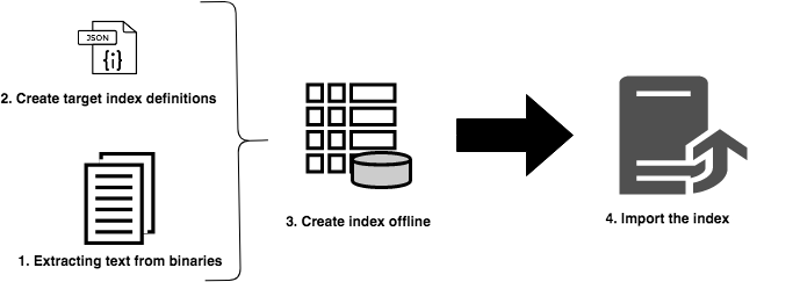

# Reindexación sin conexión para AEM {#offline-reindexing-for-aem}

## Introducción {#introduction}

En el caso de los proyectos para AEM Assets, que suelen tener grandes almacenes de datos y un alto nivel de cargas de recursos, la reindexación de los índices de Oak puede llevar una cantidad de tiempo considerable.

En esta sección se describe cómo utilizar la herramienta de ejecución de Oak para realizar una reindexación sin conexión. Los pasos presentados se pueden aplicar a [índices Lucene](https://jackrabbit.apache.org/oak/docs/query/lucene.html) para las versiones AEM 6.4 y superiores.

## Información general {#overview}

Los repositorios de AEM suelen requerir la reindexación debido a varios motivos, como cambios en la definición del índice, optimización del rendimiento o después de cambios significativos en el contenido. La reindexación es costosa para las implementaciones de recursos, ya que el texto de los recursos (por ejemplo, el texto de los archivos PDF) se extrae y se indexa. Con los repositorios MongoMK, los datos se mantienen en la red, lo que aumenta aún más la cantidad de tiempo que tarda la reindexación. La solución consiste en realizar la reindexación **sin conexión** con la herramienta de ejecución de Oak y, a continuación, importar los índices creados previamente en la instancia de AEM en ejecución. Este método minimiza el tiempo de reindexación y permite una mejor administración de los recursos.

## Enfoque {#approach}



La idea es crear los índices sin conexión utilizando la herramienta [Oak-run](/help/sites-deploying/indexing-via-the-oak-run-jar.md), luego importarlos a la instancia de AEM en ejecución. El diagrama anterior muestra el método de reindexación sin conexión.

Además, este es el orden de los pasos que se describen en el enfoque:

1. El texto de los binarios se extrae primero
2. Las definiciones de índice se crean o actualizan
3. Se crean índices sin conexión
4. A continuación, los índices se importan en la instancia de AEM en ejecución

### Extracción de texto {#text-extraction}

Para habilitar la indexación completa en AEM, el texto de los binarios como PDF se extrae y se añade al índice. Esto suele ser un paso costoso en el proceso de indexación. La extracción de texto es un paso de optimización recomendado especialmente para reindexar repositorios de recursos, ya que almacenan una gran cantidad de binarios.


El texto de los binarios almacenados en el sistema se puede extraer usando la herramienta oak-run con la biblioteca tika. Se puede tomar un clon del sistema de producción y utilizarlo para este proceso de extracción de texto. A continuación, este proceso crea el almacén de texto siguiendo los pasos siguientes:

**1. Recorra el repositorio y recopile los detalles de los binarios**

Este paso genera un archivo CSV que contiene una tupla de binarios, una ruta y un ID de blob.

Ejecute el siguiente comando desde el directorio desde el que desea crear el índice. El ejemplo siguiente supone el directorio principal del repositorio.

```
java java -jar oak-run.jar tika <nodestore path> --fds-path <datastore path> --data-file text-extraction/oak-binary-stats.csv --generate
```

Donde `nodestore path` es `mongo_uri` o `crx-quickstart/repository/segmentstore/`

Utilice el parámetro `--fake-ds-path=temp` en lugar de `–fds-path` para acelerar el proceso.

**2. Reutilizar el almacén de texto binario disponible en el índice existente**

Volcar los datos de índice del sistema existente y extraer el almacén de texto.

Puede volcar los datos de índice existentes mediante el siguiente comando:

```
java -jar oak-run.jar index <nodestore path> --fds-path=<datastore path> --index-dump
```

Donde `nodestore path` es `mongo_uri` o `crx-quickstart/repository/segmentstore/`

A continuación, utilice el volcado de índice anterior para rellenar el almacén:

```
java -jar oak-run.jar tika --data-file text-extraction/oak-binary-stats.csv --store-path text-extraction/store --index-dir ./indexing-result/index-dumps/<oak-index-name>/data populate
```

Donde `oak-index-name` es el nombre del índice de texto completo, por ejemplo, &quot;lucene&quot;.

**3. Ejecute el proceso de extracción de texto utilizando la biblioteca tika para los binarios que se omitieron en el paso anterior**

```
java -cp oak-run.jar:tika-app-*.jar org.apache.jackrabbit.oak.run.Main tika --data-file text-extraction/oak-binary-stats.csv --store-path text-extraction/store --fds-path <datastore path> extract
```

>[!NOTE]
>
>Utilice la misma versión de Tika que se utiliza en AEM.

Donde `datastore path` es la ruta de acceso al almacén de datos binarios.

El almacén de texto creado se puede actualizar y reutilizar para escenarios de reindexación futuros.

Para obtener más información sobre el proceso de extracción de texto, consulte la [documentación de Oak](https://jackrabbit.apache.org/oak/docs/query/pre-extract-text.html).

### Reindexación sin conexión {#offline-reindexing}


Cree el índice Lucene sin conexión. Si utiliza MongoMK, se recomienda ejecutarlo directamente en uno de los nodos de MongoMK, ya que esto evita la sobrecarga de red.

Para crear el índice sin conexión, siga los pasos a continuación:

**1. Generar definiciones de índice de Oak Lucene**

Volcar las definiciones de índice existentes. Las definiciones de índice se pueden generar mediante el paquete del repositorio de Adobe Granite y oak-run.

Para volcar la definición de índice desde la instancia de AEM, ejecute este comando:

>[!NOTE]
>
>Para obtener más información sobre las definiciones de índices de volcado, consulte la [documentación de Oak](https://jackrabbit.apache.org/oak/docs/query/oak-run-indexing.html#async-index-data).

```
java -jar oak-run.jar index --fds-path <datastore path> <nodestore path> --index-definitions
```

Donde `datastore path` y `nodestore path` son de la instancia de AEM.

A continuación, genere definiciones de índice utilizando el paquete de repositorio de Granite adecuado.

```
java -cp oak-run.jar:bundle-com.adobe.granite.repository.jar org.apache.jackrabbit.oak.index.IndexDefinitionUpdater --in indexing-definitions_source.json --out merge-index-definitions_target.json --initializer com.adobe.granite.repository.impl.GraniteContent
```

>[!NOTE]
>
>El proceso de creación de la definición de índice anterior solo es compatible a partir de la versión `oak-run-1.12.0`. La segmentación se realiza mediante el paquete del repositorio Granite `com.adobe.granite.repository-x.x.xx.jar`.

Los pasos anteriores crean un archivo JSON denominado `merge-index-definitions_target.json` que contiene la definición del índice.

**2. Crear un punto de comprobación en el repositorio**

Cree un punto de comprobación en la instancia de producción de AEM con una larga duración. Esto debe hacerse antes de clonar el repositorio.

Mediante la consola JMX ubicada en `http://serveraddress:serverport/system/console/jmx`, vaya a `CheckpointMBean` y cree un punto de comprobación con una duración suficiente (por ejemplo, 200 días). Para esto, invoque `CheckpointMBean#createCheckpoint` con `17280000000` como argumento para la duración en milisegundos.

Una vez hecho esto, copie el ID del punto de comprobación recién creado y valide la duración mediante JMX `CheckpointMBean#listCheckpoints`.

>[!NOTE]
>
>Este punto de comprobación se eliminará cuando el índice se importe posteriormente.

Para obtener más información, consulte [creación de puntos de comprobación](https://jackrabbit.apache.org/oak/docs/query/oak-run-indexing.html#out-of-band-create-checkpoint) en la documentación de Oak.

**Realizar indexación sin conexión para las definiciones de índice generadas**

La reindexación de Lucene se puede realizar sin conexión mediante oak-run. Este proceso crea datos de índice en el disco en `indexing-result/indexes`. **no** escribe en el repositorio y, por lo tanto, no requiere detener la instancia de AEM en ejecución. El almacén de texto creado se inserta en este proceso:

```
java -Doak.indexer.memLimitInMB=500 -jar oak-run.jar index <nodestore path> --reindex --doc-traversal-mode --checkpoint <checkpoint> --fds-path <datastore path> --index-definitions-file merge-index-definitions_target.json --pre-extracted-text-dir text-extraction/store

Sample <checkpoint> looks like r16c85700008-0-8
—fds-path: path to data store.
--pre-extracted-text-dir: Directory of pre-extracted text.
merge-index-definitions_target: JSON file having merged definitions for the target AEM instance. indexes in this file will be re-indexed.
```

El uso del parámetro `--doc-traversal-mode` es práctico con las instalaciones de MongoMK, ya que mejora significativamente el tiempo de reindexación al poner en cola el contenido del repositorio en un archivo plano local. Sin embargo, requiere un espacio en disco adicional del doble del tamaño del repositorio.

Si hay MongoMK, este proceso se puede acelerar si este paso se ejecuta en una instancia más cercana a la instancia de MongoDB. Si se ejecuta en el mismo equipo, se puede evitar la sobrecarga de red.

Encontrará más detalles técnicos en la [documentación de oak-run para la indexación](https://jackrabbit.apache.org/oak/docs/query/oak-run-indexing.html).

### Importación de índices {#importing-indexes}

Con AEM 6.4 y versiones más recientes, AEM tiene la capacidad integrada de importar índices desde el disco durante la secuencia de inicio. La carpeta `<repository>/indexing-result/indexes` está vigilada para detectar la presencia de datos de índice durante el inicio. Puede copiar el índice creado previamente en la ubicación anterior antes de iniciar la instancia de AEM. AEM lo importa al repositorio y elimina el punto de comprobación correspondiente del sistema. Por lo tanto, se evita completamente un reíndice.

## Sugerencias y solución de problemas adicionales {#troubleshooting}

A continuación encontrará algunas sugerencias útiles e instrucciones para la resolución de problemas.

### Reduzca el impacto en el sistema de producción en directo {#reduce-the-impact-on-the-live-production-system}

Se recomienda clonar el sistema de producción y crear el índice sin conexión utilizando el clon. Esto elimina cualquier posible impacto en el sistema de producción. Sin embargo, el punto de comprobación necesario para importar el índice debe estar presente en el sistema de producción. Por lo tanto, es fundamental crear un punto de comprobación antes de tomar el clon.

### Preparar un Runbook y una ejecución de prueba {#prepare-a-runbook-and-trial-run}

Se recomienda preparar un Runbook y realizar algunas pruebas antes de ejecutar el proceso de reindexación en producción.

### Modo de recorrido de documentos con indexación sin conexión {#doc-traversal-mode-with-offline-indexing}

La indexación sin conexión requiere varias travesías de todo el repositorio. Con las instalaciones de MongoMK, se accede al repositorio a través de la red, lo que afecta al rendimiento del proceso de indexación. Una opción es ejecutar el proceso de indexación sin conexión en la propia réplica de MongoDB, lo que eliminará la sobrecarga de red. Otra opción es el uso del modo de recorrido doc.

El modo de recorrido de documentos se puede aplicar agregando el parámetro de línea de comandos `—doc-traversal` al comando oak-run para la indexación sin conexión. Este modo pone en cola una copia de todo el repositorio en el disco local como archivo plano y la utiliza para ejecutar la indexación.
