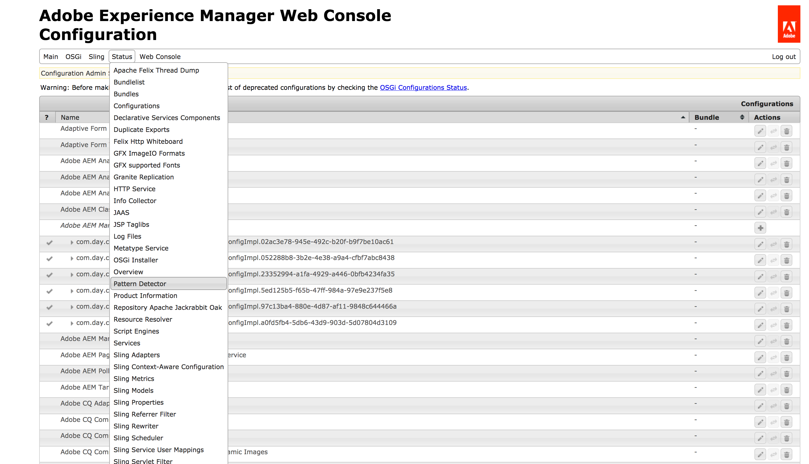

# Evaluación de la complejidad de la actualización con Pattern Detector

## Información general {#overview}

Esta función le permite comprobar las instancias de AEM existentes para ver si se pueden actualizar detectando patrones en uso que:

1. Infringen ciertas reglas y se realizan en áreas que se verán afectadas o sobrescritas por la actualización
1. Utilice una función de AEM 6.x o una API que no sea compatible con versiones anteriores en AEM 6.5 y que pueda romperse después de la actualización.

Esto podría servir para evaluar las actividades de desarrollo que se realizan para actualizar a AEM 6.5.

## Configuración {#how-to-set-up}

Pattern Detector se presenta por separado como [un paquete](https://experience.adobe.com/#/downloads/content/software-distribution/en/aem.html?package=/content/software-distribution/en/details.html/content/dam/aem/public/adobe/packages/cq650/compatpack/pd-all-aem65) que funciona en cualquier versión de AEM de origen desde la versión 6.1 a la 6.5 con la actualización a AEM 6.5 como objetivo. Se puede instalar usando el [Administrador de paquetes](/help/sites-administering/package-manager.md).

## Usos {#how-to-use}

>[!NOTE]
>
>Pattern Detector se puede ejecutar en cualquier entorno, incluidas las instancias de desarrollo locales. Sin embargo, para:
>
>* aumentar la tasa de detección
>* evitar cualquier ralentización en las instancias esenciales para el negocio
>
>ambos al mismo tiempo, se recomienda ejecutarlo **en entornos de ensayo** lo más cerca posible de los de producción en las áreas de aplicaciones de usuario, contenido y configuraciones.

Puede utilizar varios métodos para comprobar el resultado de Pattern Detector:

* **A través de la consola Felix Inventory:**

1. Vaya a la consola web de AEM al navegar a *https://serveraddress:serverport/system/console/configMgr*
1. Seleccione **Estado - Detector de patrones** como se muestra en la siguiente imagen:

   

* **A través de una interfaz JSON normal o basada en texto reactivo**
* **A través de una interfaz de líneas JSON reactiva, **que genera un documento JSON independiente en cada línea.

Ambos métodos se detallan a continuación:

## Interfaz reactiva {#reactive-interface}

La interfaz reactiva permite procesar el informe de infracción en cuanto se detecta una sospecha.

El resultado está disponible actualmente en 2 direcciones URL:

1. Interfaz de texto sin formato
1. Interfaz JSON

## Gestión de la interfaz de texto sin formato {#handling-the-plain-text-interface}

La información de la salida tiene el formato de una serie de entradas de evento. Existen dos canales: uno para publicar infracciones y otro para publicar el progreso actual.

Se pueden obtener utilizando los siguientes comandos:

```shell
curl -Nsu 'admin:admin' https://localhost:4502/system/console/status-pattern-detector.txt | tee patterns-report.log | grep SUSPICION
```

El resultado será similar al siguiente:

```
2018-02-13T14:18:32.071+01:00 [SUSPICION] The pattern=ECU/extraneous.content.usage was found by detector=ContentAccessDetector with id=a07fd94318f12312c165e06d890cbd3c2c8b8dad0c030663db8b4c800dd7c33f message="Cross-boundary overlay of internal marked path /libs/granite/operations/components/commons/commons.jsp/jcr:content referenced at /apps/granite/operations/components/commons/commons.jsp/jcr:content with properties redefined: jcr:lastModifiedBy, jcr:mimeType, jcr:data, jcr:lastModified, jcr:uuid". More info at=https://www.adobe.com/go/aem6_EC
```

El progreso se puede filtrar usando el comando `grep`:

```shell
curl -Nsu 'admin:admin' https://localhost:4502/system/console/status-pattern-detector.txt | tee patterns-report.log | grep PROGRESS
```

Lo que da como resultado el siguiente resultado:

```
2018-02-13T14:19:26.909+01:00 [PROGRESS] emitted=127731/52 MB patterns (from=6.5), analysed=45780/16 MB items, found=0 suspicions so far in period=PT5.005S (throughput=34667 items/sec)
2018-02-13T14:19:31.904+01:00 [PROGRESS] emitted=127731/52 MB patterns (from=6.5), analysed=106050/39 MB items, found=0 suspicions so far in period=PT10S (throughput=23378 items/sec)
2018-02-13T14:19:35.685+01:00 [PROGRESS] Finished in period=PT13.782
```

## Gestión de la interfaz JSON {#handling-the-json-interface}

Del mismo modo, JSON se puede procesar mediante la [herramienta jq](https://stedolan.github.io/jq/) en cuanto se publique.

```shell
curl -Nsu 'admin:admin' https://localhost:4502/system/console/status-pattern-detector.json | tee patterns-report.json | jq --unbuffered -C 'select(.suspicion == true)'
```

Con la salida:

```
{
  "timestamp": "2018-02-13T14:20:18.894+01:00",
  "suspicion": true,
  "pattern": {
    "code": "ECU",
    "type": "extraneous.content.usage",
    "detective": "ContentAccessDetector",
    "moreInfo": "https://www.adobe.com/go/aem6_ECU"
  },
  "item": {
    "id": "a07fd94318f12312c165e06d890cbd3c2c8b8dad0c030663db8b4c800dd7c33f",
    "message": "Cross-boundary overlay of internal marked path /libs/granite/operations/components/commons/commons.jsp/jcr:content referenced at /apps/granite/operations/components/commons/commons.jsp/jcr:content with properties redefined: jcr:lastModifiedBy, jcr:mimeType, jcr:data, jcr:lastModified, jcr:uuid"
  }
}
```

El progreso se registra cada 5 segundos y se puede recuperar excluyendo otros mensajes que no sean los marcados como sospechas:

```shell
curl -Nsu 'admin:admin' https://localhost:4502/system/console/status-pattern-detector.json | tee patterns-report.json | jq --unbuffered -C 'select(.suspicion == false)'
```

Con la salida:

```
{
  "suspicion": false,
  "timestamp": "2018-02-13T14:21:17.279+01:00",
  "type": "PROGRESS",
  "database": {
    "patternsEmitted": 127731,
    "patternsEmittedSize": "52 MB",
    "databasesEmitted": [
      "6.5"
    ]
  },
  "state": {
    "itemsAnalysed": 57209,
    "itemsAnalysedSize": "26 MB",
    "suspicionsFound": 0
  },
  "progress": {
    "elapsedTime": "PT5.003S",
    "elapsedTimeMilliseconds": 5003,
    "itemsPerSecond": 36965
  }
}
{
  "suspicion": false,
  "timestamp": "2018-02-13T14:21:22.276+01:00",
  "type": "PROGRESS",
  "database": {
    "patternsEmitted": 127731,
    "patternsEmittedSize": "52 MB",
    "databasesEmitted": [
      "6.5"
    ]
  },
  "state": {
    "itemsAnalysed": 113194,
    "itemsAnalysedSize": "46 MB",
    "suspicionsFound": 0
  },
  "progress": {
    "elapsedTime": "PT10S",
    "elapsedTimeMilliseconds": 10000,
    "itemsPerSecond": 24092
  }
}
{
  "suspicion": false,
  "timestamp": "2018-02-13T14:21:25.762+01:00",
  "type": "FINISHED",
  "database": {
    "patternsEmitted": 127731,
    "patternsEmittedSize": "52 MB",
    "databasesEmitted": [
      "6.5"
    ]
  },
  "state": {
    "itemsAnalysed": 140744,
    "itemsAnalysedSize": "63 MB",
    "suspicionsFound": 1
  },
  "progress": {
    "elapsedTime": "PT13.486S",
    "elapsedTimeMilliseconds": 13486,
    "itemsPerSecond": 19907
  }
}
{
  "suspicion": false,
  "type": "SUMMARY",
  "suspicionsFound": 1,
  "totalTime": "PT13.487S"
}
```

>[!NOTE]
>
>El método recomendado es guardar todo el resultado de curl en el archivo y, a continuación, procesarlo mediante `jq` o `grep` para filtrar el tipo de información.

## Ámbito de detección {#scope}

Actualmente, Pattern Detector permite comprobar lo siguiente:

* Las exportaciones e importaciones de paquetes OSGi no coinciden
* Sobreutilización de tipos de recursos y supertipos de Sling (con superposiciones de contenido de ruta de búsqueda)
* definiciones de índices Oak (compatibilidad)
* Paquetes VLT (uso excesivo)
* rep: Compatibilidad de nodos de usuario (en el contexto de la configuración de OAuth)

>[!NOTE]
>
>Pattern Detector intenta predecir con precisión las advertencias para la actualización. Sin embargo, en algunos casos puede generar falsos positivos.
