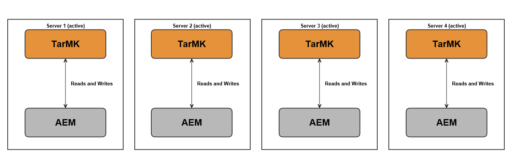

# Implementaciones recomendadas{#recommended-deployments}

>[!NOTE]
>
>Esta página hace referencia a topologías recomendadas para AEM. Para obtener más información sobre las capacidades de agrupación en clúster y cómo configurarlas, consulte la [documentación de la API de detección de Apache Sling](https://sling.apache.org/documentation/bundles/discovery-api-and-impl.html).

Los microkernels actúan como administradores de persistencia a partir de AEM 6.2. La elección de una que se ajuste a sus necesidades depende del propósito de su instancia y del tipo de implementación que esté considerando.

Los siguientes ejemplos están pensados para indicar cuáles son sus usos recomendados en las configuraciones de AEM más comunes.

## Escenarios de implementación {#deployment-scenarios}

### Instancia de TarMK única {#single-tarmk-instance}

En esta situación, se ejecuta una sola instancia de TarMK en un solo servidor.

**Esta es la implementación predeterminada para las instancias de autor.**

Las ventajas:

* Sencillo
* Fácil mantenimiento
* Buen rendimiento

Los inconvenientes:

* No escalable más allá de los límites de la capacidad del servidor
* Sin capacidad de failover

### TarMK en espera fría {#tarmk-cold-standby}

Una instancia de TarMK actúa como instancia principal. El repositorio del principal se replica en un sistema de failover en espera.

El mecanismo de espera en frío también se puede utilizar como copia de seguridad porque el repositorio completo se replica constantemente en el servidor de conmutación por error. El servidor de conmutación por error se está ejecutando en modo de espera en frío, lo que significa que sólo se está ejecutando el HttpReceiver de la instancia.

Las ventajas:

* Simplicidad
* Mantenimiento
* Rendimiento
* Failover

Los inconvenientes:

* No escalable más allá de los límites de la capacidad del servidor
* Un servidor está inactivo la mayor parte del tiempo
* La conmutación por error no es automática. Debe detectarse externamente antes de que el sistema de conmutación por error pueda iniciar el servicio de solicitudes.

>[!NOTE]
>
>Para obtener más información sobre cómo configurar AEM con el modo de espera pasiva TarMK, consulte [este](/help/sites-deploying/tarmk-cold-standby.md) artículo.

>[!NOTE]
>
>La implementación en modo de espera en frío en este ejemplo de TarMK requiere que las instancias primaria y en espera tengan licencia por separado, ya que hay una replicación constante en el servidor de conmutación por error. Para obtener más información acerca de las licencias, consulte los [Términos generales de licencia de Adobe](https://www.adobe.com/legal/terms/enterprise-licensing.html).

### Granja TarMK {#tarmk-farm}

Varias instancias de Oak se ejecutan cada una con una instancia de TarMK. Los repositorios TarMK son independientes y deben estar sincronizados.

Mantener los repositorios sincronizados se proporciona con el hecho de que el servidor de creación publica el mismo contenido en cada miembro de la granja. Para obtener más información, consulte [Replicación](/help/sites-deploying/replication.md).

**Esta es la implementación predeterminada para los entornos de publicación.**

Las ventajas:

* Rendimiento
* Escalabilidad para acceso de lectura
* Failover

### Clúster Oak con failover MongoMK para alta disponibilidad en un solo centro de datos {#oak-cluster-with-mongomk-failover-for-high-availability-in-a-single-datacenter}

>[!NOTE]
>
>La versión mínima admitida de Mongo es Mongo 6.

Este método implica que varias instancias de Oak acceden a un conjunto de réplicas de MongoDB dentro de un solo centro de datos y, de hecho, crean un clúster activo-activo para el entorno de creación de AEM. Los conjuntos de réplicas de MongoDB se utilizan para proporcionar alta disponibilidad y redundancia en caso de un error de hardware o de red.

Las ventajas:

* Capacidad de escala horizontal con nuevas instancias de autor de AEM
* Alta disponibilidad, redundancia y failover automatizado de la capa de datos

Los inconvenientes:

* El rendimiento puede ser menor que con TarMK en algunos casos

### Clúster de Oak con conmutación por error MongoMK en varios centros de datos {#oak-cluster-with-mongomk-failover-across-multiple-datacenters}

Este método implica varias instancias de Oak que acceden a un conjunto de réplicas de MongoDB en varios centros de datos y que, de hecho, crean un clúster activo-activo para el entorno de creación de AEM. Con varios centros de datos, la replicación MongoDB proporciona la misma alta disponibilidad y redundancia, pero ahora incluye la capacidad de gestionar una interrupción del centro de datos.

Las ventajas:

* Capacidad de escala horizontal con nuevas instancias de autor de AEM
* Alta disponibilidad, redundancia y failover automatizado de la capa de datos (incluidas las interrupciones del centro de datos)

>[!NOTE]
>
>En el diagrama anterior, AEM Server 3 y AEM Server 4 se muestran con un estado inactivo suponiendo una latencia de red entre los servidores AEM del centro de datos 2 y el nodo principal MongoDB del centro de datos 1 que es superior a los requisitos documentados en [Adobe Experience Manager con MongoDB: listas de comprobación](/help/sites-deploying/aem-with-mongodb.md#checklists). Si la latencia máxima es compatible con los requisitos, por ejemplo, mediante el uso de zonas de disponibilidad, los servidores de AEM en Data Center 2 también pueden estar activos, lo que crea un clúster de AEM activo-activo en varios centros de datos.

>[!NOTE]
>
>Para obtener información adicional sobre los conceptos de arquitectura de MongoDB descritos en esta sección, consulte [Replicación de MongoDB](https://docs.mongodb.org/manual/replication/).

## Microkernels: cuál utilizar {#microkernels-which-one-to-use}

La regla básica que debe tenerse en cuenta al elegir entre los dos micro núcleos disponibles es que TarMK está diseñado para el rendimiento, mientras que MongoMK se utiliza para la escalabilidad.

Puede utilizar estas matrices de decisión para establecer cuál es el mejor tipo de implementación que se adapta a sus necesidades.

Adobe recomienda encarecidamente que TarMK sea la tecnología de persistencia predeterminada utilizada por los clientes en todos los escenarios de implementación, tanto para las instancias de autor de AEM como para las de publicación, excepto en los casos de uso descritos a continuación.

### Excepciones para elegir AEM MongoMK sobre TarMK en instancias de autor {#exceptions-for-choosing-aem-mongomk-over-tarmk-on-author-instances}

La razón principal para elegir el backend de persistencia MongoMK sobre TarMK es escalar las instancias horizontalmente. Esto significa tener dos o más instancias de autor activas ejecutándose en todo momento y usar MongoDB como sistema de almacenamiento de persistencia. La necesidad de ejecutar más de una instancia de autor se debe generalmente al hecho de que la capacidad de CPU y de memoria de un solo servidor, que admite todas las actividades de creación simultáneas, ya no es sostenible.

Es casi imposible predecir cuál será el modelo de concurrencia exacto después de que se publique un nuevo sitio. Por lo tanto, Adobe recomienda tener en cuenta los siguientes criterios al evaluar si se debe utilizar MongoMK y dos o más nodos activos de Author:

1. Número de usuarios con nombre conectados en un día: en miles o más.
1. Número de usuarios simultáneos: en cientos o más.
1. Volumen de ingestas de recursos por día: en cientos de miles o más.
1. Volumen de ediciones de página al día: en cientos de miles o más (incluidas actualizaciones automatizadas a través del Administrador de varios sitios o ingestas de fuentes de noticias, por ejemplo).
1. Volumen de búsquedas por día: en decenas de miles o más.

>[!NOTE]
>
>[Día difícil](/help/sites-developing/tough-day.md) se puede usar para evaluar el rendimiento de la aplicación del cliente en el contexto de la configuración de hardware implementada.

Una implementación mínima con MongoDB suele incluir la siguiente topología:

* Un conjunto de réplicas de MongoDB que consta de un nodo principal, dos nodos secundarios con cada una de las instancias de MongoDB que se ejecutan en una zona de disponibilidad con una latencia inferior a 15 milisegundos en cada nodo;
* Clúster de instancias de autor con un nodo maestro, un nodo no maestro y ambos activos en todo momento, con cada una de las instancias de autor en ejecución en cada uno de los centros de datos, donde se ejecutan las instancias principales y secundarias de MongoDB.

Además, es muy recomendable configurar el almacén de datos en un sistema de archivos compartido o Amazon S3, de modo que los recursos o binarios no se almacenen en MongoDB. Esto garantizará un rendimiento óptimo dentro de la implementación.

Una de las ventajas adicionales de implementar un conjunto de réplicas MongoDB con un clúster de dos o más instancias de autor es tener un escenario de recuperación automatizada con un tiempo de inactividad mínimo si hay instancias de autor, una réplica MongoDB o un error completo del centro de datos. Sin embargo, la elección de MongoMK sobre TarMK no debe ser impulsada únicamente por el requisito de recuperación, ya que TarMK también puede proporcionar una solución de tiempo de inactividad mínima con un mecanismo de failover controlado.

Si no se espera que los criterios anteriores se cumplan durante los primeros 18 meses de implementación, se recomienda implementar primero AEM mediante TarMK, luego volver a evaluar la configuración en una fecha posterior cuando se apliquen los criterios anteriores y, finalmente, determinar si debe permanecer en TarMK o migrar a MongoMK.

### Excepciones para elegir AEM MongoMK sobre TarMK en instancias de publicación {#exceptions-for-choosing-aem-mongomk-over-tarmk-on-publish-instances}

No se recomienda implementar MongoMK para instancias de publicación. El nivel de publicación de la implementación casi siempre se implementa como una granja de instancias de publicación completamente independientes que ejecutan TarMK, que se mantienen sincronizadas replicando contenido de las instancias de autor. Esta arquitectura de &quot;no se ha compartido nada&quot;, propia de las instancias de publicación, permite la implementación del nivel de publicación para escalar horizontalmente de forma lineal. La topología de conjunto de servidores también ofrece la ventaja de aplicar cualquier actualización o actualización a las instancias de publicación de forma gradual, de modo que cualquier cambio en el nivel de publicación no requerirá ningún tiempo de inactividad.

### Requisitos previos y recomendaciones al implementar AEM con MongoMK {#prerequisites-and-recommendations-when-deploying-aem-with-mongomk}

Hay disponible un conjunto de requisitos previos y recomendaciones si está considerando una implementación de MongoMK para AEM:

**Requisitos previos obligatorios para implementaciones de MongoDB:**

1. La arquitectura y el tamaño de la implementación de MongoDB deben formar parte de la implementación del proyecto con la ayuda de arquitectos de Adobe Consulting o MongoDB familiarizados con AEM;
1. La experiencia de MongoDB debe estar presente dentro del equipo del socio o cliente para tener confianza en poder mantener y mantener un entorno de MongoDB existente o nuevo;
1. Puede elegir implementar la versión comercial o de código abierto de MongoDB (AEM admite ambas), pero debe adquirir un contrato de mantenimiento y soporte de MongoDB directamente de MongoDB Inc;
1. Las arquitecturas e infraestructuras generales de AEM y MongoDB deben estar bien definidas y validadas por un arquitecto de Adobe AEM;
1. Revise el modelo de asistencia para implementaciones de AEM que incluyen MongoDB.

**Recomendaciones sólidas para implementaciones de MongoDB:**

* Consulte la [Revisión de implementación de MongoDB para Adobe Experience Manager](https://www.mongodb.com/lp/contact/mongodb-adobe-experience-manager);
* Revisar la [lista de comprobación de operaciones de MongoDB](https://docs.mongodb.org/manual/administration/production-checklist/);
* Asista a una [clase de certificación en MongoDB - disponible en línea](https://university.mongodb.com/).

>[!NOTE]
>
>Si tiene más preguntas sobre estas directrices, requisitos previos y recomendaciones, comuníquese con el [Servicio de atención al cliente de Adobe](https://helpx.adobe.com/es/marketing-cloud/contact-support.html).
