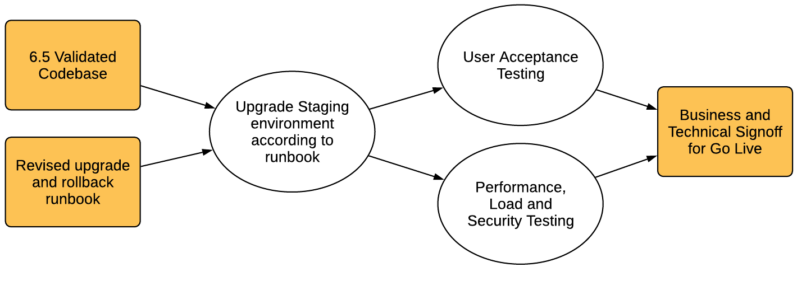

# Planificación de la actualización {#planning-your-upgrade}

## Información general sobre la actualización a AEM {#aem-upgrade-overview}

AEM se utiliza a menudo en implementaciones de alto impacto que podrían llegar a millones de usuarios. Normalmente, hay aplicaciones personalizadas que se implementan en las instancias, lo que aumenta la complejidad. Cualquier esfuerzo por actualizar una implementación de este tipo debe gestionarse metódicamente.

Esta guía le ayudará a establecer objetivos, fases y entregables claros al planificar la actualización. Se centra en la ejecución general de la actualización y en las directrices. Aunque proporciona una descripción general de los pasos de actualización reales, hace referencia a los recursos técnicos disponibles cuando corresponde. Debe utilizarse con los recursos técnicos disponibles a los que se hace referencia en el documento.

El proceso de actualización de AEM necesita fases de planificación, análisis y ejecución cuidadosamente gestionadas, con entregables clave definidos para cada fase.

>[!NOTE]
>
>La actualización a AEM 6.5 LTS es compatible con los últimos 6 Service Packs

Es importante asegurarse de que está ejecutando un sistema operativo compatible, un tiempo de ejecución de Java™, un httpd y una versión de Dispatcher. Para obtener más información, consulte el TBD: vínculo a los requisitos técnicos de AEM 6.5 LTS. La actualización de estos componentes debe tenerse en cuenta en el plan de actualización y debe realizarse antes de actualizar AEM.

<!-- Alexandru: drafting for now

## Upgrade Scope and Requirements {#upgrade-scope-requirements}

Below you will find a list of areas that are impacted in a typical AEM Upgrade project:

<table>
 <tbody>
  <tr>
   <td><strong>Component</strong></td>
   <td><strong>Impact</strong></td>
   <td><strong>Description</strong></td>
  </tr>
  <tr>
   <td>Operating System</td>
   <td>Uncertain, but subtle effects</td>
   <td>At the time of the AEM upgrade, it may be time to upgrade the operating system as well and this might have some impact.</td>
  </tr>
  <tr>
   <td>Java&trade; Runtime</td>
   <td>Moderate Impact</td>
   <td>AEM 6.3 requires JRE 1.7.x (64 bit) or later. JRE 1.8 is the only version currently supported by Oracle.</td>
  </tr>
  <tr>
   <td>Hardware</td>
   <td>Moderate Impact</td>
   <td>Online Revision Cleanup requires free  disk space equal to 25% of the repository's size and 15% free heap space  to complete successfully. You may need to upgrade your hardware to  ensure sufficient resources for Online Revision Cleanup to fully  run. Also, if upgrading from a version prior to AEM 6, there  may be additional storage requirements.</td>
  </tr>
  <tr>
   <td>Content Repository (CRX or Oak)</td>
   <td>High Impact</td>
   <td>Starting from version 6.1, AEM does not support CRX2, so a migration to  Oak (CRX3) is required if upgrading from an older version. AEM 6.3 has  implemented a new Segment Node Store that also requires a migration. The  crx2oak tool is used for this purpose.</td>
  </tr>
  <tr>
   <td>AEM Components/Content</td>
   <td>Moderate Impact</td>
   <td><code>/libs</code> and <code>/apps</code> are easily handled through the upgrade, but <code>/etc</code> usually requires some manual reapplication of customizations.</td>
  </tr>
  <tr>
   <td>AEM Services</td>
   <td>Low Impact</td>
   <td>Most AEM core services are tested for upgrade. This is an area of low impact.</td>
  </tr>
  <tr>
   <td>Custom Application Services</td>
   <td>Low to High Impact</td>
   <td>Depending on the application and customization, there may be  dependencies on JVM, operating system versions, and some indexing related  changes, as indexes are not generated automatically in Oak.</td>
  </tr>
  <tr>
   <td>Custom Application Content</td>
   <td>Low to High Impact</td>
   <td>Content that will not be handled through the upgrade can be backed up  before the upgrade takes place and then moved back into the repository.  Most content can be handled through the migration tool.</td>
  </tr>
 </tbody>
</table>

It is important to ensure that you are running a supported operating system, Java&trade; runtime, httpd, and Dispatcher version. For more information, see the [AEM 6.5 Technical Requirements page](/help/sites-deploying/technical-requirements.md). Upgrading these components must be accounted for in your project plan and should take place before upgrading AEM. -->

## Fases de actualización {#upgrade-phases}

Se está trabajando mucho en la planificación y ejecución de una actualización de AEM. Para aclarar los diferentes esfuerzos que se realizan en este proceso, Adobe ha desglosado los ejercicios de planificación y ejecución en fases independientes. En las secciones siguientes, cada fase genera un resultado que a menudo se utiliza en una fase futura de la actualización.

<!-- Alexandru:drafting for now

### Planning for Author Training {#planning-for-author-training}

With any new release, there are potential changes to the UI and user workflows that may be introduced. Also, new releases introduce new features that may be beneficial for the business to use. Adobe recommends reviewing the functional changes that have been introduced and organizing a plan to train your users on using them effectively.

New features in AEM 6.5 can be found in [the AEM section of adobe.com](/help/release-notes/release-notes.md). Make sure to note any changes to UIs or product features that are commonly used in your organization. As you look through the new features, also take note of any that can be of value to your organization. After looking through what has changed in AEM 6.5, develop a training plan for your authors. This could involve using freely available resources like the help feature videos or formal training offered through [Adobe Digital Learning Services](https://learning.adobe.com/). -->

### Creación de un Plan de Pruebas {#creating-a-test-plan}

La implementación de AEM por parte de cada cliente es única y se ha personalizado para satisfacer los requisitos empresariales. Como resultado, es importante determinar todas las personalizaciones que se han realizado en el sistema para que se puedan incluir en un plan de prueba. Este plan de prueba potencia el proceso de control de calidad que Adobe realiza en la instancia actualizada.

Es necesario duplicar el entorno de producción exacto y se deben realizar pruebas en él después de la actualización para asegurarse de que todas las aplicaciones y el código personalizado siguen ejecutándose como se desea. Regrese todas las personalizaciones y ejecute pruebas de rendimiento, carga y seguridad. Al organizar el plan de prueba, asegúrese de cubrir todas las personalizaciones que se han realizado en el sistema, además de las IU y los flujos de trabajo predeterminados que se utilizan en sus operaciones diarias. Pueden incluir servicios y servlets OSGI personalizados, integraciones en Adobe Experience Cloud, integraciones con terceros a través de conectores AEM, integraciones de terceros personalizadas, componentes y plantillas personalizados, superposiciones de IU personalizadas en AEM y flujos de trabajo personalizados. Además, las consultas personalizadas deben probarse para garantizar que sus índices siguen funcionando de forma eficaz después de la actualización.

### Evaluación de la complejidad de actualización {#assessing-upgrade-complexity}

Debido a la amplia variedad en la cantidad y naturaleza de las personalizaciones que los clientes de Adobe aplican a sus entornos de AEM, es importante pasar algún tiempo por adelantado para determinar el nivel general de esfuerzo que se debe esperar en la actualización. Analyzer para AEM puede ayudarle a evaluar la complejidad de la actualización.

AEM Analyer para AEM 6.5 LTS debería proporcionarle una estimación bastante precisa de lo que puede esperar durante una actualización en la mayoría de los casos. Sin embargo, para personalizaciones e implementaciones más complejas en las que tenga cambios incompatibles, puede actualizar una instancia de desarrollo a AEM 6.5 LTS según las instrucciones de [Realización de una actualización in situ](/help/sites-deploying/in-place-upgrade.md). Una vez finalizado, realice algunas pruebas de humo de alto nivel en este entorno. El objetivo de este ejercicio no es completar exhaustivamente el inventario de casos de prueba y producir un inventario formal de defectos, sino darnos una estimación aproximada de la cantidad de trabajo que se requerirá para actualizar el código para la compatibilidad con 6.5 LTS. Cuando se combina con el analizador de AEM y los cambios de arquitectura determinados en la sección anterior, se puede proporcionar una estimación aproximada al equipo de administración del proyecto para que planifique la actualización.

### Generación de la actualización y reversión de Runbook {#building-the-upgrade-and-rollback-runbook}

Aunque Adobe ha documentado el proceso de actualización de una instancia de AEM, el diseño de red, la arquitectura de implementación y las personalizaciones de cada cliente requieren un ajuste y una adaptación precisos de este enfoque. Por este motivo, Adobe le recomienda revisar toda la documentación proporcionada y utilizarla para informar a un runbook específico de la actualización que describa los procedimientos específicos de actualización y reversión que seguirá en su entorno.

<!--Alexandru:drafting for now

 -->

Adobe ha proporcionado procedimientos de actualización y reversión en [Procedimiento de actualización](/help/sites-deploying/upgrade-procedure.md) e instrucciones paso a paso para aplicar la actualización al realizar una [actualización in situ](/help/sites-deploying/in-place-upgrade.md). Estas instrucciones deben revisarse y tenerse en cuenta junto con la arquitectura del sistema, las personalizaciones y la tolerancia ante tiempos de inactividad para determinar los procedimientos de cambio y reversión adecuados que se van a ejecutar durante la actualización. Cualquier cambio en la arquitectura o el tamaño del servidor debe incluirse al redactar el runbook personalizado.

### Desarrollo de un plan de actualización {#developing-an-upgrade-plan}

Los resultados de los ejercicios anteriores se pueden utilizar para crear un plan de actualización que abarque los plazos previstos para los esfuerzos de prueba o desarrollo, la formación y la ejecución real de la actualización.

<!--Alexandru: drafting for now

 -->

Un plan de proyecto integral debe incluir:

* Finalización de los planes de desarrollo y ensayo
* Actualización de entornos de desarrollo y control de calidad
* Actualización del código personalizado base para AEM 6.5 LTS
* Un ciclo de pruebas y correcciones de control de calidad
* Actualización del entorno de ensayo
* Integración, rendimiento y pruebas de carga
* Certificación del entorno
* Lanzamiento

### Desarrollo y control de calidad {#performing-development-and-qa}

Adobe ha proporcionado procedimientos para [actualizar código y personalizaciones](/help/sites-deploying/upgrading-code-and-customizations.md) para que sean compatibles con AEM 6.5 LTS. A medida que se ejecuta este proceso iterativo, se deben realizar cambios en el Runbook según sea necesario.

<!--Alexandru: drafting for now

 -->

El proceso de desarrollo y prueba suele ser iterativo. A medida que se detecten problemas que requieran ajustes en el proceso de actualización, asegúrese de añadirlos a su runbook de actualización personalizado. Después de varias iteraciones de pruebas y correcciones, la base de código debe validarse completamente y estar lista para su implementación en el entorno de ensayo.

### Prueba final {#final-testing}

Adobe recomienda una ronda final de pruebas después de que el equipo de control de calidad de su organización haya certificado la base de código. Esta ronda de pruebas incluirá la validación del runbook en un entorno de ensayo, seguido de rondas de aceptación del usuario, rendimiento y pruebas de seguridad.

<!--Alexandru: drafting for now

 -->

Este paso es vital, ya que es la única vez que puede validar los pasos del Runbook con un entorno de producción. Una vez actualizado el entorno, es importante dar a los usuarios finales un poco de tiempo para iniciar sesión y realizar las actividades que realizan al utilizar el sistema en sus actividades diarias. Encontrar y corregir problemas en estas áreas antes del lanzamiento puede ayudar a evitar costosos cortes en la producción.

### Realización de la actualización {#performing-the-upgrade}

Una vez recibida la firma final de todas las partes interesadas, es hora de ejecutar los procedimientos definidos del Runbook. Adobe ha proporcionado pasos para la actualización y la reversión en [Procedimiento de actualización](/help/sites-deploying/upgrade-procedure.md) y pasos de instalación en Realización de una [actualización in situ](/help/sites-deploying/in-place-upgrade.md) como punto de referencia.

Adobe proporciona algunos pasos en las instrucciones de actualización para la validación del entorno. Estas incluyen comprobaciones básicas como el análisis de los registros de actualización y la verificación de que todos los paquetes OSGi se han iniciado correctamente, pero Adobe recomienda también validar con sus propios casos de prueba en función de los procesos empresariales. Adobe también recomienda consultar la programación de Limpieza de revisiones en línea de AEM y las rutinas relacionadas para asegurarse de que se produzcan durante un tiempo tranquilo para su empresa. Estas rutinas son esenciales para el rendimiento a largo plazo de AEM.