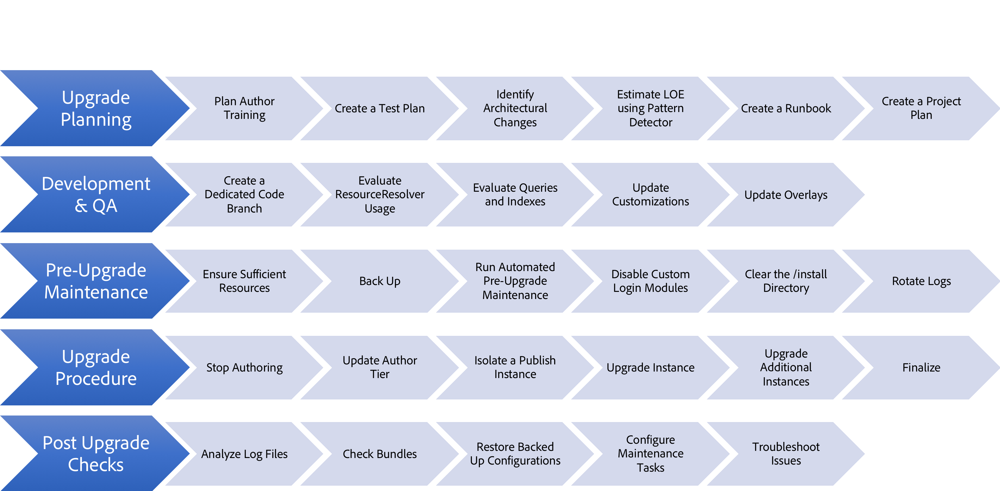

# Actualización a Adobe Experience Manager (AEM) 6.5 {#upgrading-to-aem}

Esta sección cubre la actualización de una instalación de AEM a AEM 6.5:

* [Planificación de la actualización](/help/sites-deploying/upgrade-planning.md)
* [Evaluación de la complejidad de la actualización con Pattern Detector](/help/sites-deploying/pattern-detector.md)
* [Compatibilidad con versiones anteriores en AEM 6.5](/help/sites-deploying/backward-compatibility.md)
  <!--* [Using Offline Reindexing To Reduce Downtime During an Upgrade](/help/sites-deploying/upgrade-offline-reindexing.md)-->
* [Procedimiento de actualización](/help/sites-deploying/upgrade-procedure.md)
* [Actualizar código y personalizaciones](/help/sites-deploying/upgrading-code-and-customizations.md)
* [Tareas de mantenimiento previas a la actualización](/help/sites-deploying/pre-upgrade-maintenance-tasks.md)
* [Realización de una actualización in situ](/help/sites-deploying/in-place-upgrade.md)
* [Comprobaciones posteriores a la actualización y solución de problemas](/help/sites-deploying/post-upgrade-checks-and-troubleshooting.md)
* [Actualizaciones sostenibles](/help/sites-deploying/sustainable-upgrades.md)
* [Migración de contenido diferido](/help/sites-deploying/lazy-content-migration.md)

Para facilitar la referencia a las instancias de AEM involucradas en estos procedimientos, se utilizan los siguientes términos en estos artículos:

* La instancia *source* es la instancia de AEM desde la que está actualizando.
* La instancia *target* es a la que está actualizando.

## ¿Qué ha cambiado? {#what-has-changed}

A continuación se indican algunos cambios importantes que se han producido en las últimas versiones de AEM:

AEM 6.0 ha introducido el nuevo repositorio de Jackrabbit Oak. Los administradores de persistencia fueron reemplazados por [Micro Kernels](/help/sites-deploying/platform.md#contentbody_title_4). A partir de la versión 6.1, CRX2 ya no es compatible. Se debe ejecutar una herramienta de migración llamada crx2oak para migrar repositorios de CRX2 desde instancias 5.6.1. Para obtener más información, consulte [Uso de la herramienta de migración de CRX2OAK](/help/sites-deploying/using-crx2oak.md).

Si está utilizando Assets Insights y actualiza desde una versión anterior a AEM 6.2, los recursos deben migrarse y tener ID generados a través de un bean JMX. Para las pruebas internas de Adobe, se migraron 125.000 recursos en un entorno TarMK en una hora, pero los resultados pueden variar.

6.3 introdujo un nuevo formato para `SegmentNodeStore`, que es la base de la implementación de TarMK. Si está actualizando desde una versión anterior a AEM 6.3, esto requiere una migración del repositorio como parte de la actualización, lo que implica un tiempo de inactividad del sistema.

Adobe Engineering estima que esto es alrededor de 20 minutos. No es necesaria la reindexación. Además, se ha lanzado una nueva versión de la herramienta crx2oak para que funcione con el nuevo formato de repositorio.

**Esta migración no es necesaria si se actualiza de AEM 6.3 a AEM 6.5.**

Las tareas de mantenimiento previas a la actualización se han optimizado para admitir la automatización.

Las opciones de uso de la línea de comandos de la herramienta crx2oak se han cambiado para que sean fáciles de automatizar y admitan más rutas de actualización.

Las comprobaciones posteriores a la actualización también se han hecho fáciles de automatizar.

La recolección periódica de basura de revisiones y la recolección de basura del almacén de datos ahora son tareas de mantenimiento rutinarias que deben realizarse periódicamente. Con la introducción de AEM 6.3, Adobe admite y recomienda Limpieza de revisiones en línea. Consulte [Limpieza de revisión](/help/sites-deploying/revision-cleanup.md) para obtener información sobre cómo configurar estas tareas.

AEM acaba de presentar [Pattern Detector](/help/sites-deploying/pattern-detector.md) para evaluar la complejidad de la actualización a medida que planifica la misma. 6.5 también tiene un fuerte enfoque en la [compatibilidad con versiones anteriores](/help/sites-deploying/backward-compatibility.md) de las características. Por último, también se agregan prácticas recomendadas para [actualizaciones sostenibles](/help/sites-deploying/sustainable-upgrades.md).

Para obtener más información sobre qué más ha cambiado en las últimas versiones de AEM, consulte las notas de la versión completas:

* [Últimas notas de la versión de Adobe Experience Manager 6.5 Service Pack](/help/release-notes/release-notes.md)

## Información general de actualización {#upgrade-overview}

La actualización de AEM es un proceso de varios pasos, a veces de varios meses. La siguiente descripción se proporciona como descripción general de lo que se incluye en un proyecto de actualización y del contenido que se ha incluido en esta documentación:

## Flujo de actualización {#upgrade-overview-1}

El diagrama siguiente muestra el flujo recomendado general y resalta el enfoque de actualización. Tenga en cuenta la referencia a las nuevas funciones que Adobe ha introducido. La actualización debe comenzar con Pattern Detector (consulte [Evaluación de la complejidad de la actualización con Pattern Detector](/help/sites-deploying/pattern-detector.md)), lo que le permitirá decidir la ruta que desea tomar para la compatibilidad con AEM 6.4 en función de los patrones del informe generado.

En 6.5 se ha hecho un hincapié importante en mantener todas las nuevas funciones compatibles con versiones anteriores, pero en los casos en que siga viendo algunos problemas de compatibilidad con versiones anteriores, el modo de compatibilidad le permite retrasar temporalmente el desarrollo para mantener su código personalizado compatible con 6.5. Este método le ayuda a evitar los esfuerzos de desarrollo inmediatamente después de la actualización (consulte [Compatibilidad con versiones anteriores en AEM 6.5](/help/sites-deploying/backward-compatibility.md)).

Por último, en el ciclo de desarrollo 6.5, las funciones introducidas en Actualizaciones sostenibles (consulte [Actualizaciones sostenibles](/help/sites-deploying/sustainable-upgrades.md)) le ayudan a seguir las prácticas recomendadas para que las futuras actualizaciones sean aún más eficientes y sin problemas.

