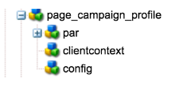

# Crear una plantilla de página de AEM personalizada con componentes de formulario de Adobe Campaign{#creating-custom-aem-page-template-with-adobe-campaign-form-components}

En esta página se explica cómo crear una plantilla de página personalizada que use los componentes de [Adobe Campaign Form](/help/sites-authoring/adobe-campaign-components.md) al examinar cómo se implementa la plantilla de Geometrixx-outdoors (`/apps/geometrixx-outdoors/components/page_campaign_profile`), y se proporciona información importante que puede necesitar al crear su propia plantilla personalizada.

>[!NOTE]
>
>[Los ejemplos de correo electrónico y formularios solo están disponibles en Geometrixx](/help/sites-developing/we-retail.md). Descargue contenido de Geometrixx de muestra desde Package Share.

>[!CAUTION]
>
>Los componentes de correo electrónico de AEM se han quedado obsoletos. Debido a la naturaleza del correo electrónico, que combina contenido y estilo, los componentes de correo electrónico proporcionados de forma predeterminada por AEM se vuelven de reutilización limitada para los clientes debido a la necesidad de implementar estilos personalizados en los componentes que sean necesarios para los proyectos.
>
>Los componentes de correo electrónico se pueden implementar en el nivel de proyecto y los componentes de correo electrónico de AEM obsoletos ilustran cómo se puede lograr. Sin embargo, no utilice estos componentes obsoletos en proyectos.


Para crear una plantilla de página de AEM personalizada con componentes de formulario Adobe Campaign, asegúrese de que dispone de lo siguiente:

1. **ResourceSuperType correcto**

   Asegúrese de que el componente de página herede de `mcm/campaign/components/profile`.

   Esto es necesario para que los servlets obtengan y guarden información

   * `com.day.cq.mcm.campaign.servlets.TemplateListServlet`
   * `com.day.cq.mcm.campaign.servlets.SaveProfileServlet`

   

1. **Configuración de ClientContext**

   Cuando vea la configuración de clientcontext (`/etc/designs/geometrixx-outdoors/jcr:content/page_campaign_profile`), verá la siguiente configuración:

   * ClientContext apunta a `/etc/clientcontext/campaign`
   * También hay un nodo *config* adicional.

   

1. **head.jsp (/apps/geometrixx-outdoors/components/page_campaign_profile/head.jsp)**

   En **head.jsp**, verá las siguientes líneas que utilizan **clientcontext-config** y **cloudservice-hook**:

   ```
   <cq:include path="config" resourceType="cq/personalization/components/clientcontext_optimized/config"/>
   <sling:include path="contexthub" resourceType="granite/contexthub/components/contexthub"/>
   <cq:include script="/libs/cq/cloudserviceconfigs/components/servicelibs/servicelibs.jsp"/>
   ```

1. **body.jsp (/apps/geometrixx-outdoors/components/page_campaign_profile/body.jsp)**

   En **body.jsp**, los servicios en la nube se cargan en la parte inferior de la página:

   ```
   <cq:include path="cloudservices" resourceType="cq/cloudserviceconfigs/components/servicecomponents"/>
   ```

1. **Propiedades de la página de campaña**

   Para poder seleccionar una plantilla de Adobe Campaign, las propiedades de página se amplían con la pestaña **Campaign**:

   `/apps/geometrixx-outdoors/components/page_campaign_profile/dialog/items/tabs/items/campaign`

   

1. **Configuración de plantilla**.

   En la plantilla ( `/apps/geometrixx-outdoors/templates/campaign_profile/jcr:content`) verá los siguientes valores predeterminados:

   | **acMapping** | mapRecipient (para Adobe Campaign 6.1), profile (para Adobe Campaign Standard) |
   |---|---|
   | **acTemplateId** | correo |

   
