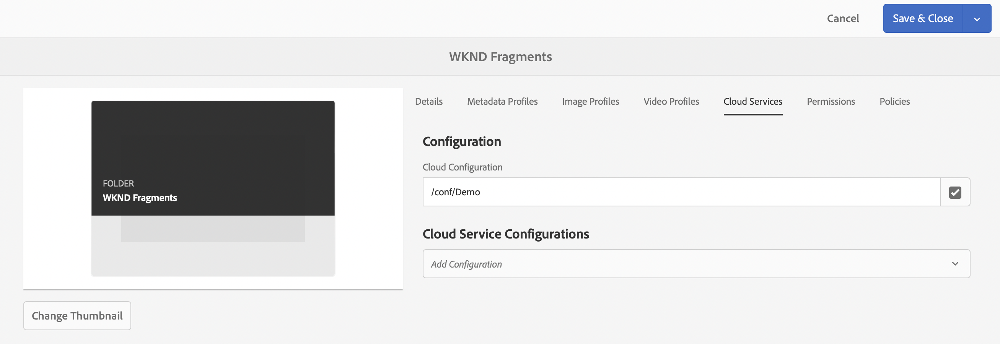

# Guía de inicio rápido Creación de una carpeta de Assets sin encabezado {#creating-an-assets-folder}

Utilice modelos de fragmentos de contenido de AEM para definir la estructura de los fragmentos de contenido, la base del contenido sin encabezado. A continuación, los fragmentos de contenido se almacenan en carpetas de recursos.

## ¿Qué es una carpeta de recursos? {#what-is-an-assets-folder}

[Ahora que ha creado modelos de fragmentos de contenido](create-content-model.md) que definen la estructura que desea para los futuros fragmentos de contenido, probablemente tenga ganas de crear algunos fragmentos.

Sin embargo, primero debe crear una carpeta de recursos en la que almacenarlos.

Las carpetas de Assets se usan para [organizar recursos de contenido tradicionales](/help/assets/manage-assets.md), como imágenes y fragmentos de contenido y vídeo.

## Cómo crear una carpeta de recursos {#how-to-create-an-assets-folder}

Un administrador solo tendría que crear carpetas ocasionalmente para organizar el contenido a medida que se crea. Para los fines de esta guía de introducción, solo necesitamos crear una carpeta.

1. Inicie sesión en AEM y, en el menú principal, seleccione **Navegación > Assets > Archivos**.
1. Haga clic en **Crear > Carpeta**.
1. Proporcione un **Título** y **Nombre** para su carpeta.
   * El **Título** debe ser descriptivo.
   * El **Nombre** se convertirá en el nombre de nodo en el repositorio.
     * Se generará automáticamente en función del título y se ajustará según las [convenciones de nomenclatura de AEM.](/help/sites-developing/naming-conventions.md)
     * Se puede modificar si es necesario.

   
1. Seleccione la carpeta que ha creado y, a continuación, seleccione **Propiedades** en la barra de herramientas (o utilice el método abreviado de teclado `p` [teclado.](/help/sites-authoring/keyboard-shortcuts.md))
1. En la ventana **Propiedades**, seleccione la pestaña **Servicios de nube**.
1. Para la **configuración de nube**, seleccione la [configuración que creó anteriormente.](create-configuration.md)
   
1. Haga clic en **Guardar y cerrar**.
1. Haga clic en **Aceptar** en la ventana de confirmación.

   

Puede crear subcarpetas adicionales dentro de la carpeta que ha creado. Las subcarpetas heredarán la **Configuración de nube** de la carpeta principal. Sin embargo, esto se puede sobrescribir si desea utilizar modelos de otra configuración.

Si está usando una estructura de sitio localizada, puede [crear una raíz de idioma](/help/assets/multilingual-assets.md) debajo de la nueva carpeta.

## Siguientes pasos {#next-steps}

Ahora que ha creado una carpeta para los fragmentos de contenido, puede pasar a la cuarta parte de la guía de introducción y [crear fragmentos de contenido.](create-content-fragment.md)

>[!TIP]
>
>Para obtener información detallada acerca de la administración de fragmentos de contenido, consulte la [Documentación de fragmentos de contenido](/help/assets/content-fragments/content-fragments.md)
