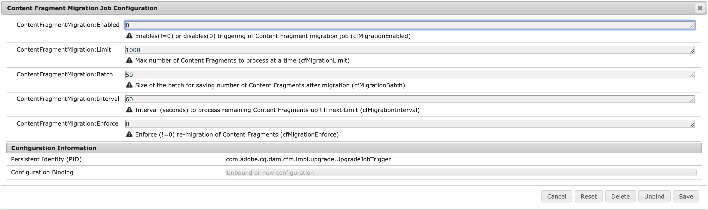

# Actualización de los fragmentos de contenido para el filtrado optimizado de GraphQL {#updating-content-fragments-for-optimized-graphql-filtering}

Para optimizar el rendimiento de los filtros de GraphQL, ejecute un procedimiento para actualizar los fragmentos de contenido.

>[!NOTE]
>
>Después de actualizar los fragmentos de contenido, puede seguir las recomendaciones de [Optimización de las consultas de GraphQL](/help/sites-developing/headless/graphql-api/graphql-optimization.md).

## Requisitos previos {#prerequisites}

Asegúrese de que cuenta con un mínimo de 6.5.17.0 versiones de AEM.

## Actualización de los fragmentos de contenido {#updating-content-fragments}

Para ejecutar el procedimiento, siga estos pasos:

1. [Configure las opciones de OSGi](/help/sites-deploying/configuring-osgi.md) para la **Configuración del trabajo de migración de fragmentos de contenido**:

   

1. En el cuadro de diálogo, establezca estos dos parámetros de la siguiente manera:

   * **ContentFragmentMigration:Enabled**: `1`
   * **ContentFragmentMigration:Enforce**: `1`

1. **Guardar** las especificaciones: se inicia el procedimiento de actualización.

1. Espere hasta que se complete el procedimiento. El procedimiento se completa cuando la propiedad `cfGlobalVersion` aparece en `/content/dam` y se establece en `1`.

1. Vuelva a la configuración de OSGi para desactivar el procedimiento.

   En el cuadro de diálogo de la **Configuración del trabajo de migración de fragmentos de contenido** establezca estos dos parámetros de la siguiente manera:

   * **ContentFragmentMigration:Enabled**: `0`
   * **ContentFragmentMigration:Enforce**: `0`

## Limitaciones {#limitations}

Tenga en cuenta las siguientes limitaciones:

* Optimizar el rendimiento de los filtros de GraphQL solo será posible después de una actualización completa de todos los fragmentos de contenido (indicada por la presencia de la propiedad `cfGlobalVersion` para el nodo JCR `/content/dam`).

* Si los fragmentos de contenido se importan desde un paquete de contenido (mediante `crx/de`) después de ejecutar el procedimiento de actualización, esos fragmentos de contenido no se tendrán en cuenta en los resultados de la consulta de GraphQL hasta que se vuelva a ejecutar el procedimiento de actualización.
