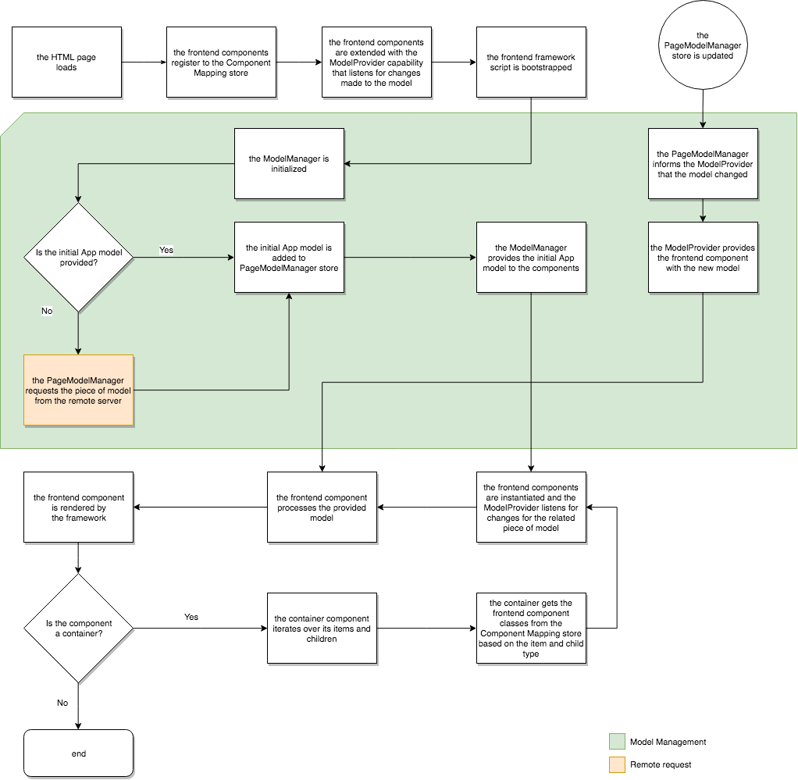

# Asignación de modelos dinámicos a componentes para SPA{#dynamic-model-to-component-mapping-for-spas}

En este documento se describe cómo se produce la asignación de modelos dinámicos a componentes en JavaScript SPA SDK for Adobe Experience Manager (AEM).

{{ue-over-spa}}

## Módulo de asignación de componentes {#componentmapping-module}

El módulo `ComponentMapping` se proporciona como paquete NPM al proyecto front-end. Almacena componentes front-end y proporciona una forma para que la aplicación de una sola página asigne componentes front-end a tipos de recursos de AEM. Esto permite una resolución dinámica de componentes al analizar el modelo JSON de la aplicación.

Cada elemento presente en el modelo contiene un campo `:type` que expone un tipo de recurso de AEM. Cuando se monta, el componente front-end puede representarse a sí mismo utilizando el fragmento de modelo que ha recibido de las bibliotecas subyacentes.

Consulte [Modelo SPA](/help/sites-developing/spa-blueprint.md) para obtener más información sobre el análisis del modelo y el acceso del componente front-end al modelo.

Consulte también el paquete npm: [https://www.npmjs.com/package/@adobe/aem-spa-component-mapping](https://www.npmjs.com/package/@adobe/aem-spa-component-mapping)

## Aplicación de una sola página impulsada por modelo {#model-driven-single-page-application}

Las aplicaciones de una sola página que utilizan JavaScript SPA SDK para AEM están basadas en modelos:

1. Los componentes front-end se registran a sí mismos en el [Almacén de asignaciones de componentes](/help/sites-developing/spa-dynamic-model-to-component-mapping.md#componentmapping-module).
1. A continuación, el [contenedor](/help/sites-developing/spa-blueprint.md#container), una vez proporcionado con un modelo por el [proveedor de modelos](/help/sites-developing/spa-blueprint.md#the-model-provider), se repite sobre el contenido de su modelo (`:items`).

1. Si hay una página, sus elementos secundarios (`:children`) obtienen primero una clase de componente de la [asignación de componentes](/help/sites-developing/spa-blueprint.md#componentmapping) y, a continuación, crean una instancia de ella.

## Inicialización de aplicaciones {#app-initialization}

Cada componente se amplía con las capacidades de [`ModelProvider`](/help/sites-developing/spa-blueprint.md#the-model-provider). Por lo tanto, la inicialización adopta la siguiente forma general:

1. Cada proveedor de modelos se inicializa a sí mismo y escucha los cambios realizados en el fragmento de modelo que corresponde a su componente interno.
1. [`PageModelManager`](/help/sites-developing/spa-blueprint.md#pagemodelmanager) debe inicializarse tal como lo representa el [flujo de inicialización](/help/sites-developing/spa-blueprint.md).

1. Una vez almacenado, el administrador de modelos de página devuelve el modelo completo de la aplicación.
1. A continuación, se pasa este modelo al componente [Contenedor](/help/sites-developing/spa-blueprint.md#container) raíz del front-end de la aplicación.
1. Las partes del modelo finalmente se propagan a cada componente secundario individual.

