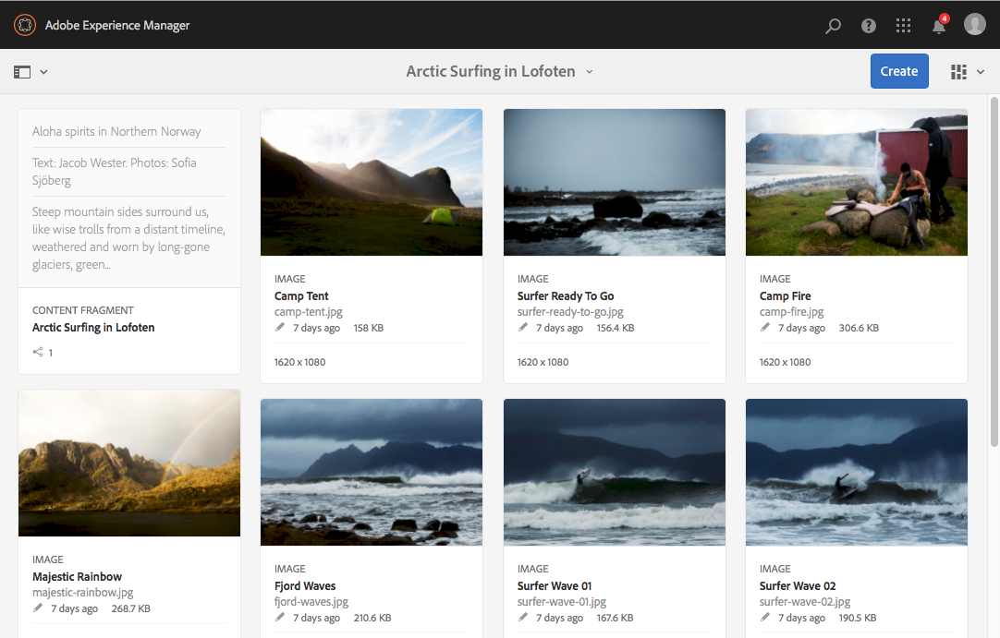

# Prueba de fragmentos de contenido en We.Retail{#trying-out-content-fragments-in-we-retail}

Los fragmentos de contenido permiten crear contenido neutro con respecto al canal, así como variaciones (posiblemente específicas del canal). **We.Retail** (disponible en una instancia predeterminada de Adobe Experience Manager) proporciona el fragmento **Arctic Surfing en Lofoten** como una muestra básica. Esto ilustra lo siguiente:

* Los fragmentos de contenido de Adobe Experience Manager (AEM) se [crean y administran como recursos independientes de la página](/help/assets/content-fragments/content-fragments.md). Permiten crear contenido neutro con respecto al canal, así como variaciones (posiblemente específicas del canal).

  * Ver [Dónde encontrar los recursos de fragmentos de contenido en We.Retail](#where-to-find-content-fragments-in-we-retail)

* A continuación, [puede usar estos fragmentos y sus variaciones al crear](/help/sites-authoring/content-fragments.md) sus páginas de contenido.

  * Consulte [Uso de fragmentos de contenido en We.Retail](#where-content-fragments-are-used-in-we-retail)

Para obtener la documentación completa sobre la creación, administración, uso y desarrollo de fragmentos de contenido:

* Ver [información adicional](#further-information)

>[!NOTE]
>
>Los **fragmentos de contenido** y los **[fragmentos de experiencias](/help/sites-authoring/experience-fragments.md)** son funciones distintas de AEM:
>
>* **Los fragmentos de contenido** son contenido editorial, principalmente texto e imágenes relacionadas. Son contenidos puros, sin diseño ni diseño.
>* Los **fragmentos de experiencias** son contenidos plenamente diseñados; un fragmento de una página web.
>
>Los fragmentos de experiencias pueden incluir contenido en forma de fragmentos, pero no lo contrario.

## Dónde encontrar fragmentos de contenido en We.Retail {#where-to-find-content-fragments-in-we-retail}

Hay varios fragmentos de contenido de muestra en We.Retail; navegue a través de **Assets**, **archivos**, **We.Retail**, **inglés**, **experiencias**.

Entre ellas se encuentra **Arctic Surfing in Lofoten**, un fragmento junto con recursos visuales relacionados:

* Vaya por **Assets**, **Archivos**, **We.Retail**, **English**, **Experiencias**, **Surf ártico en Lofoten**:

  * [http://localhost:4502/assets.html/content/dam/we-retail/en/experiences/arctic-surfing-in-lofoten](http://localhost:4502/assets.html/content/dam/we-retail/en/experiences/arctic-surfing-in-lofoten)

Puede seleccionar y editar el fragmento **Arctic Surfing in Lofoten**:

* [http://localhost:4502/editor.html/content/dam/we-retail/en/experiences/arctic-surfing-in-lofoten/arctic-surfing-in-lofoten](http://localhost:4502/editor.html/content/dam/we-retail/en/experiences/arctic-surfing-in-lofoten/arctic-surfing-in-lofoten)

Aquí puede [editar y administrar](/help/assets/content-fragments/content-fragments.md) su fragmento mediante las pestañas (panel izquierdo):

<!--  ASSET does not exist-->

* **[Variaciones](/help/assets/content-fragments/content-fragments-variations.md)** incluyendo [Markdown](/help/assets/content-fragments/content-fragments-markdown.md)
* **[Contenido asociado](/help/assets/content-fragments/content-fragments-assoc-content.md)**
* **[Metadatos](/help/assets/content-fragments/content-fragments-metadata.md)**

## Uso de fragmentos de contenido en We.Retail {#where-content-fragments-are-used-in-we-retail}

Para ilustrar la creación de [páginas con un fragmento de contenido](/help/sites-authoring/content-fragments.md), se proporcionan varias páginas de ejemplo en, por ejemplo:

* [http://localhost:4502/sites.html/content/we-retail/language-masters/en/experience](http://localhost:4502/sites.html/content/we-retail/language-masters/en/experience)

Por ejemplo, se hace referencia al fragmento de contenido **Arctic Surfing in Lofoten** en la página de Sites:

* Vaya por **Sites**, **We.Retail**, **Language Masters**, **English**, **Experience**. A continuación, abra **Arctic Surfing en Lofoten** para editarlo:

  * [http://localhost:4502/editor.html/content/we-retail/language-masters/en/experience/arctic-surfing-in-lofoten.html](http://localhost:4502/editor.html/content/we-retail/language-masters/en/experience/arctic-surfing-in-lofoten.html)

## Información adicional {#further-information}

Para obtener más información, consulte:

* [Trabajar con fragmentos de contenido](/help/assets/content-fragments/content-fragments.md)

  * Obtenga información sobre cómo crear, editar y administrar los recursos de fragmentos de contenido.

* [Creación de páginas con fragmentos de contenido](/help/sites-authoring/content-fragments.md)

  * Utilice el fragmento de contenido al crear una página.

* [Desarrollo de AEM: componentes para fragmentos de contenido](/help/sites-developing/components-content-fragments.md)

  * Información general sobre los componentes de los fragmentos de contenido.

* [Desarrollo y ampliación de fragmentos de contenido](/help/sites-developing/customizing-content-fragments.md)

  * Información para ayudarle a desarrollar y ampliar fragmentos de contenido.
